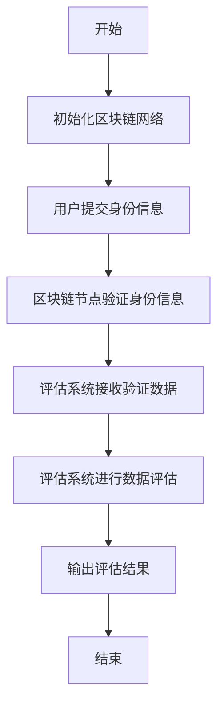
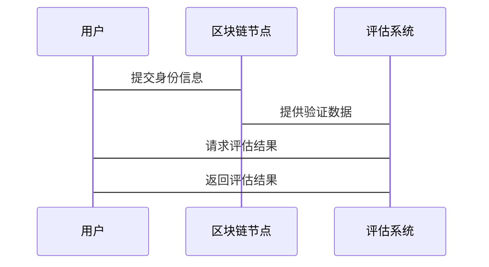

                 


# 《企业估值中的区块链数字身份管理系统评估》

## 关键词：
- 区块链技术
- 数字身份管理系统
- 企业估值
- 数字身份验证
- 去中心化身份识别

## 摘要：
本文详细探讨了区块链技术在企业估值中的应用，特别是数字身份管理系统的评估。通过分析区块链的去中心化特性、数字身份管理系统的功能，以及两者如何结合来改善企业估值过程。文章从背景介绍、核心概念、算法原理、系统设计、项目实战到最佳实践，全面阐述了区块链数字身份管理系统在企业估值中的重要性及其实际应用。通过详细的案例分析和数学模型，本文为读者提供了深入的理解和实践指导。

---

# 目录大纲

## 第1章: 区块链与数字身份管理概述

### 1.1 区块链技术的核心概念
- 1.1.1 区块链的基本定义与特点
- 1.1.2 区块链的去中心化特性
- 1.1.3 区块链在企业估值中的应用潜力

### 1.2 数字身份管理的定义与特点
- 1.2.1 数字身份管理的定义
- 1.2.2 数字身份管理的核心功能
- 1.2.3 数字身份管理在企业估值中的重要性

### 1.3 区块链数字身份管理系统的基本框架
- 1.3.1 系统的基本组成
- 1.3.2 系统的运行机制
- 1.3.3 系统的优缺点分析

## 第2章: 区块链数字身份管理系统在企业估值中的问题背景

### 2.1 传统企业估值方法的局限性
- 2.1.1 传统估值方法的概述
- 2.1.2 传统估值方法的不足
- 2.1.3 传统估值方法对企业估值的影响

### 2.2 区块链技术如何解决企业估值中的问题
- 2.2.1 区块链在数据可信性中的作用
- 2.2.2 区块链在数据隐私保护中的作用
- 2.2.3 区块链在数据共享中的作用

### 2.3 数字身份管理系统在企业估值中的具体应用
- 2.3.1 数字身份管理在企业数据收集中的作用
- 2.3.2 数字身份管理在企业数据验证中的作用
- 2.3.3 数字身份管理在企业数据评估中的作用

## 第3章: 区块链数字身份管理系统的核心概念与联系

### 3.1 核心概念原理
- 3.1.1 区块链的去中心化特性
- 3.1.2 数字身份管理的隐私保护特性
- 3.1.3 区块链与数字身份管理的结合原理

### 3.2 核心概念属性特征对比
- 3.2.1 区块链技术的属性特征
- 3.2.2 数字身份管理系统的属性特征
- 3.2.3 两者属性特征对比分析

### 3.3 ER实体关系图架构
```mermaid
erDiagram
    actor 用户 {
        +string 用户ID
        +string 名称
        +string 身份标识
    }
    actor 区块链节点 {
        +string 节点ID
        +string 区块链地址
        +string 交易记录
    }
    actor 评估系统 {
        +string 评估ID
        +string 评估数据
        +string 评估结果
    }
    用户 --> 区块链节点 : 提交身份信息
    区块链节点 --> 评估系统 : 提供验证数据
    用户 --> 评估系统 : 请求评估结果
```

## 第4章: 算法原理讲解

### 4.1 区块链数字身份评估算法概述
- 4.1.1 算法的基本思想
- 4.1.2 算法的主要步骤
- 4.1.3 算法的数学模型和公式

### 4.2 算法流程图


### 4.3 算法实现代码
```python
def blockchain_identity_assessment(user_id, identity_info):
    # 初始化区块链网络
    blockchain = initialize_blockchain()
    
    # 用户提交身份信息
    transaction = create_transaction(user_id, identity_info)
    
    # 区块链节点验证身份信息
    validated_transaction = validate_transaction(blockchain, transaction)
    
    # 评估系统接收验证数据
    assessment_data = extract_assessment_data(validated_transaction)
    
    # 评估系统进行数据评估
    assessment_result = perform_assessment(assessment_data)
    
    return assessment_result
```

### 4.4 算法的数学模型和公式
- 计算身份信息的可信度：
  $$ \text{可信度} = \frac{\text{验证通过的次数}}{\text{总验证次数}} $$
  
- 计算评估结果的准确性：
  $$ \text{准确性} = \frac{\text{正确评估的次数}}{\text{总评估次数}} $$

## 第5章: 系统分析与架构设计方案

### 5.1 问题场景介绍
- 5.1.1 企业估值中的数据管理问题
- 5.1.2 区块链技术在企业估值中的应用场景

### 5.2 项目介绍
- 5.2.1 项目目标
- 5.2.2 项目范围
- 5.2.3 项目关键成功因素

### 5.3 系统功能设计
- 5.3.1 领域模型设计
  ```mermaid
  classDiagram
      class 用户 {
          用户ID
          名称
          身份标识
      }
      class 区块链节点 {
          节点ID
          区块链地址
          交易记录
      }
      class 评估系统 {
          评估ID
          评估数据
          评估结果
      }
      用户 --> 区块链节点 : 提交身份信息
      区块链节点 --> 评估系统 : 提供验证数据
      用户 --> 评估系统 : 请求评估结果
  ```

### 5.4 系统架构设计
- 5.4.1 系统架构图
  ```mermaid
  architectureDiagram
      区块链网络 --> 用户 : 提交身份信息
      区块链网络 --> 区块链节点 : 验证身份信息
      区块链网络 --> 评估系统 : 提供验证数据
      评估系统 --> 用户 : 返回评估结果
  ```

### 5.5 系统接口设计
- 5.5.1 接口设计概述
- 5.5.2 接口详细说明
  - 用户提交身份信息接口
  - 区块链节点验证接口
  - 评估系统评估接口

### 5.6 系统交互流程图


## 第6章: 项目实战

### 6.1 环境安装
- 6.1.1 安装区块链框架（如以太坊、fabric等）
- 6.1.2 安装Python开发环境
- 6.1.3 安装相关依赖库

### 6.2 核心代码实现
- 6.2.1 区块链网络初始化代码
- 6.2.2 用户提交身份信息代码
- 6.2.3 区块链节点验证代码
- 6.2.4 评估系统评估代码

### 6.3 代码应用解读与分析
- 6.3.1 代码功能解读
- 6.3.2 代码实现细节分析
- 6.3.3 代码优化建议

### 6.4 案例分析与详细讲解
- 6.4.1 案例背景介绍
- 6.4.2 案例实现步骤
- 6.4.3 案例结果分析

### 6.5 项目小结
- 6.5.1 项目成果总结
- 6.5.2 项目经验总结
- 6.5.3 项目改进建议

## 第7章: 最佳实践与总结

### 7.1 小结
- 7.1.1 核心内容回顾
- 7.1.2 关键知识点总结

### 7.2 注意事项
- 7.2.1 实际应用中的注意事项
- 7.2.2 系统维护中的注意事项
- 7.2.3 安全性保障建议

### 7.3 拓展阅读
- 7.3.1 相关技术领域推荐书籍
- 7.3.2 相关技术领域推荐文章
- 7.3.3 相关技术领域推荐视频

---

## 作者：AI天才研究院/AI Genius Institute & 禅与计算机程序设计艺术 /Zen And The Art of Computer Programming

