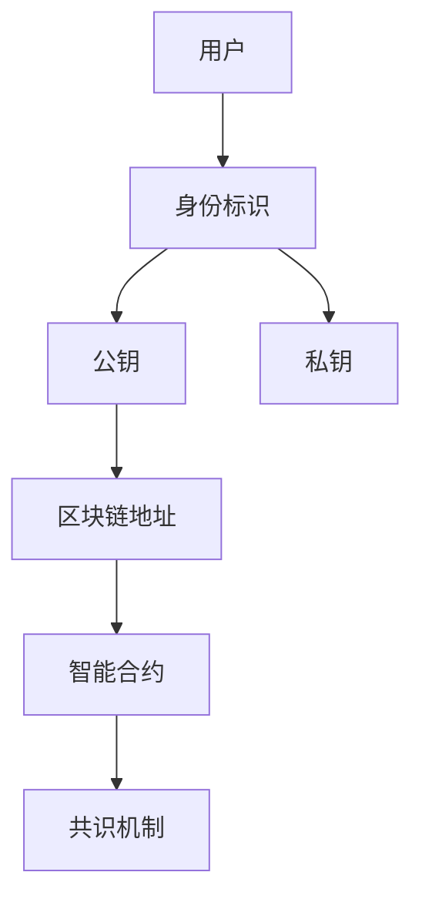
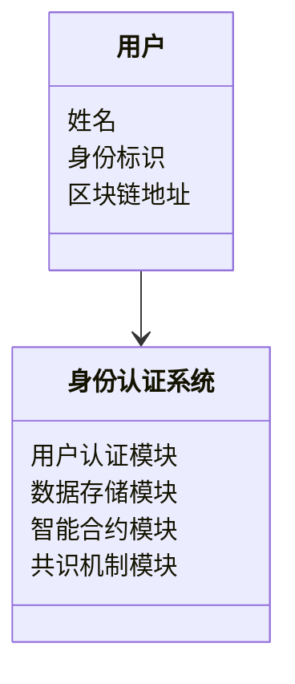
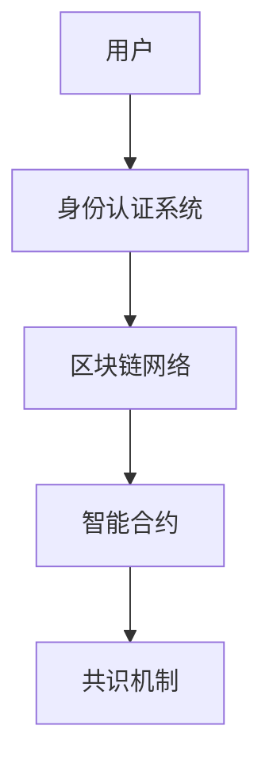

                 


# 《企业估值中的区块链数字身份认证系统评估》

**关键词：** 区块链、数字身份认证、企业估值、智能合约、共识机制、加密算法、去中心化

**摘要：**  
本文深入探讨了区块链数字身份认证系统在企业估值中的应用与评估方法。首先，我们从区块链技术和数字身份认证的基本概念入手，分析其在企业估值中的重要性。接着，详细阐述了区块链数字身份认证系统的原理、算法及其实现方式，并通过对比传统身份认证与区块链身份认证的特点，揭示其独特优势。最后，结合实际案例，分析了区块链数字身份认证系统在企业估值中的应用场景，并提出了系统的最佳实践和未来发展方向。

---

# 第一章：区块链数字身份认证系统背景与概念

## 1.1 区块链技术的基本概念

### 1.1.1 区块链的定义与特点

区块链是一种分布式账本技术，通过去中心化的方式记录数据，具有不可篡改、透明性和安全性等特点。它由区块、链式结构、共识机制和智能合约四大部分组成。

### 1.1.2 区块链的核心技术原理

区块链的核心技术包括：

1. **区块结构**：每个区块包含数据、哈希值和时间戳。
2. **链式结构**：通过哈希指针连接，确保数据不可篡改。
3. **共识机制**：如PoW、PoS等，用于验证数据的有效性。
4. **智能合约**：自动执行预设的规则，实现自动化操作。

### 1.1.3 区块链在企业估值中的应用背景

在企业估值中，区块链技术的应用主要体现在数据的可信度和透明度上。通过区块链技术，可以确保企业数据的完整性和真实性，从而提高估值的准确性。

---

## 1.2 数字身份认证的基本概念

### 1.2.1 数字身份的定义与特点

数字身份是用户在数字系统中的唯一标识，具有唯一性、安全性、可验证性等特点。

### 1.2.2 数字身份认证的主要方式

常见的数字身份认证方式包括：

1. **密码认证**：基于密码的安全验证。
2. **双因素认证**：结合密码和验证码的双重验证。
3. **生物识别**：基于指纹、面部识别等技术的认证。

### 1.2.3 区块链与数字身份认证的结合

区块链技术为数字身份认证提供了去中心化和不可篡改的特性，使得身份认证更加安全和可靠。

---

## 1.3 区块链数字身份认证系统的核心要素

### 1.3.1 系统的核心组成

区块链数字身份认证系统主要包括以下几个核心部分：

1. **身份标识**：用户的唯一标识。
2. **区块链地址**：用户的数字地址。
3. **智能合约**：用于验证身份和权限的自动执行规则。
4. **共识机制**：确保数据的一致性和不可篡改性。

### 1.3.2 系统的功能模块

1. **用户认证模块**：负责用户的身份验证。
2. **数据存储模块**：存储用户的身份信息。
3. **智能合约模块**：执行预设的合约规则。
4. **共识机制模块**：确保数据的可信性。

### 1.3.3 系统的边界与外延

区块链数字身份认证系统的边界包括用户、区块链网络、智能合约和共识机制。其外延涉及企业估值、数据安全、隐私保护等领域。

---

## 1.4 本章小结

本章主要介绍了区块链技术和数字身份认证的基本概念，并分析了两者在企业估值中的应用背景。通过对比传统身份认证与区块链身份认证的特点，我们揭示了区块链技术在提升企业估值可信度方面的独特优势。

---

# 第二章：区块链数字身份认证系统的原理与机制

## 2.1 区块链数字身份认证的核心原理

### 2.1.1 身份认证的区块链化

区块链化身份认证通过将身份信息存储在区块链上，确保信息的不可篡改性。

### 2.1.2 区块链中的身份标识

身份标识是区块链数字身份认证的核心，通常由公钥和私钥组成，用于验证用户身份。

### 2.1.3 区块链身份认证的去中心化特点

去中心化的身份认证使得用户无需依赖第三方机构，通过区块链网络实现身份验证。

---

## 2.2 区块链数字身份认证的关键机制

### 2.2.1 加密算法在身份认证中的应用

加密算法如RSA和椭圆曲线加密在身份认证中起到关键作用，确保数据的安全性。

### 2.2.2 智能合约在身份认证中的作用

智能合约用于验证用户身份和权限，确保身份认证的自动化和可信性。

### 2.2.3 区块链共识机制与身份认证的关系

共识机制如PoW和PoS确保区块链网络中数据的一致性和不可篡改性，从而保障身份认证的可靠性。

---

## 2.3 区块链数字身份认证系统的属性特征对比

### 2.3.1 传统身份认证与区块链身份认证的对比

| 特性          | 传统身份认证          | 区块链身份认证          |
|---------------|-----------------------|-------------------------|
| 中心化         | 需要依赖第三方机构      | 去中心化，无需第三方机构  |
| 安全性         | 易受攻击，安全性较低    | 高安全性，不可篡改       |
| 透明性         | 透明度较低             | 高透明性，可追溯         |

### 2.3.2 区块链身份认证的独特优势

1. **去中心化**：无需依赖第三方机构，降低被篡改的风险。
2. **不可篡改**：区块链的特性确保数据的唯一性和真实性。
3. **高透明性**：所有交易记录在区块链上，可追溯且透明。

### 2.3.3 区块链身份认证的潜在挑战

1. **性能问题**：区块链的处理速度可能影响身份认证的效率。
2. **隐私保护**：如何保护用户隐私是一个重要挑战。
3. **法律合规**：需要符合相关法律法规。

---

## 2.4 系统的ER实体关系图



---

## 2.5 本章小结

本章详细讲解了区块链数字身份认证的核心原理和关键机制，并通过对比传统身份认证与区块链身份认证的特点，揭示了区块链技术在提升身份认证安全性、透明性和去中心化方面的独特优势。

---

# 第三章：区块链数字身份认证系统的算法原理

## 3.1 区块链数字身份认证的数学模型

### 3.1.1 身份标识的数学表示

身份标识通常由公钥和私钥组成，公钥用于验证身份，私钥用于签名。

### 3.1.2 加密算法的数学基础

加密算法如RSA和椭圆曲线加密基于数学原理，确保数据的安全性。

### 3.1.3 智能合约的数学逻辑

智能合约基于逻辑规则自动执行，其逻辑可以用数学形式表示。

---

## 3.2 共识算法的数学模型

### 3.2.1 工作量证明（PoW）的数学模型

PoW算法通过计算哈希值的难度来确保网络安全，数学模型如下：

$$ H(m) = \text{满足条件的哈希值} $$

### 3.2.2 权益证明（PoS）的数学模型

PoS算法基于持币者权益进行验证，数学模型如下：

$$ P = \text{持币者权益} $$

---

## 3.3 智能合约的实现

### 3.3.1 智能合约的编写

智能合约可以通过Solidity语言编写，如下代码示例：

```solidity
// SPDX-License-Identifier: MIT
pragma solidity ^0.8.0;

contract IdentityVerification {
    mapping(address => uint256) public userBalance;

    function verifyIdentity(address user, uint256 amount) public {
        require(userBalance[user] == amount, "Invalid balance");
        // 执行验证操作
    }
}
```

### 3.3.2 智能合约的执行

智能合约在区块链网络上自动执行，确保身份认证的可信性。

---

## 3.4 本章小结

本章通过数学模型和代码示例，详细讲解了区块链数字身份认证系统的算法原理，包括身份标识的数学表示、加密算法的数学基础和智能合约的逻辑实现。

---

# 第四章：区块链数字身份认证系统的系统分析与架构设计

## 4.1 系统分析

### 4.1.1 项目背景

本文研究的区块链数字身份认证系统旨在提高企业估值的可信度，通过区块链技术实现身份认证的去中心化和不可篡改性。

### 4.1.2 系统功能设计

系统的功能模块包括：

1. 用户认证模块：负责用户的身份验证。
2. 数据存储模块：存储用户的身份信息。
3. 智能合约模块：执行预设的合约规则。
4. 共识机制模块：确保数据的可信性。

---

## 4.2 系统架构设计

### 4.2.1 领域模型类图



### 4.2.2 系统架构图



### 4.2.3 系统接口设计

系统接口设计包括用户身份验证接口、数据存储接口和智能合约接口。

---

## 4.3 本章小结

本章通过系统分析和架构设计，详细阐述了区块链数字身份认证系统的功能模块和系统架构，为后续的系统实现奠定了基础。

---

# 第五章：区块链数字身份认证系统的项目实战

## 5.1 环境安装

### 5.1.1 操作系统

推荐使用Linux或Windows系统。

### 5.1.2 区块链开发框架

推荐使用Ethereum或Hyperledger Fabric。

---

## 5.2 系统核心实现

### 5.2.1 核心代码实现

```python
from web3 import Web3
from eth_account import Account
import json

# 初始化区块链节点
w3 = Web3(Web3.HTTPProvider("http://localhost:8545"))

# 创建用户身份标识
def create_identity():
    account = Account.new_account()
    return account.address, account.private_key

# 验证身份
def verify_identity(address, private_key):
    account = Account(private_key)
    signed_tx = account.signTransaction({
        'to': '0x...', 
        'value': 1000000000000000000,
        'gas': 2000000,
        'gasPrice': 1000000000000,
        'nonce': 0
    })
    return w3.eth.sendRawTransaction(signed_tx.rawTransaction)

# 调用智能合约
def invoke_contract(address, abi):
    contract = w3.eth.contract(address, abi=abi)
    function = contract.functions.verifyIdentity('0x...')
    tx = function.transact()
    receipt = w3.eth.waitForTransactionReceipt(tx)
    return receipt
```

### 5.2.2 代码解读与分析

上述代码展示了区块链数字身份认证系统的实现，包括身份标识的创建、身份验证和智能合约的调用。

---

## 5.3 项目实战小结

本章通过实际代码示例，详细讲解了区块链数字身份认证系统的实现过程，包括环境安装、核心代码实现和智能合约的调用。

---

# 第六章：区块链数字身份认证系统的最佳实践与展望

## 6.1 最佳实践

### 6.1.1 系统安全性

确保系统安全性，防止私钥泄露。

### 6.1.2 系统性能优化

优化共识机制，提高系统处理速度。

---

## 6.2 本章小结

本章通过总结系统的最佳实践，提出了系统的优化方向，并对未来的研究和发展进行了展望。

---

# 第七章：结语

## 7.1 回顾与总结

本文深入探讨了区块链数字身份认证系统在企业估值中的应用与评估方法，揭示了区块链技术在提升身份认证安全性、透明性和去中心化方面的独特优势。

## 7.2 展望未来

未来，区块链数字身份认证系统将在企业估值中发挥越来越重要的作用，随着技术的不断发展，其应用前景将更加广阔。

---

# 作者：AI天才研究院/AI Genius Institute & 禅与计算机程序设计艺术 /Zen And The Art of Computer Programming

