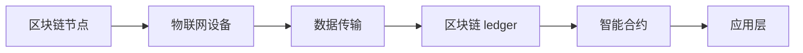
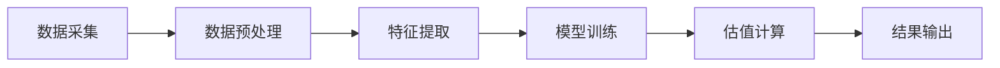
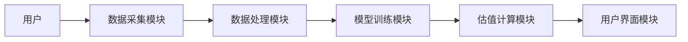
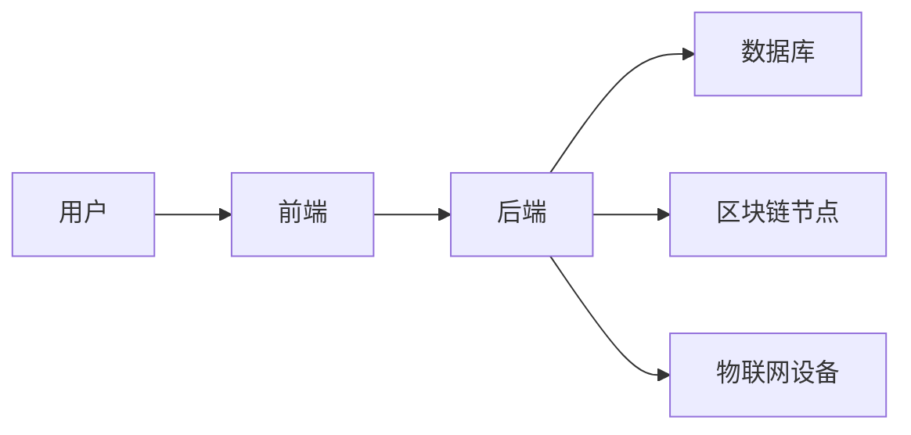
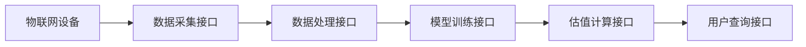
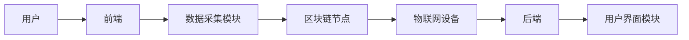

                 


# 《企业估值中的区块链物联网安全平台评估》

> **关键词**：区块链，物联网，企业估值，安全平台，数据可信性，实时性，系统架构

> **摘要**：  
本文详细探讨了区块链与物联网技术在企业估值中的应用，重点分析了区块链物联网安全平台的构建及其评估方法。文章从区块链和物联网的基本概念出发，深入研究了两者在企业估值中的协同作用，并结合实际案例，详细讲解了区块链物联网安全平台的评估算法、系统架构设计以及项目实战。通过本文，读者可以全面理解区块链物联网安全平台如何提升企业估值的透明度和准确性。

---

# 第一部分: 企业估值中的区块链物联网安全平台评估基础

---

# 第1章: 区块链、物联网与企业估值概述

## 1.1 企业估值的基本概念

### 1.1.1 企业估值的定义与意义

企业估值是通过对企业的财务数据、市场表现、资产状况等多方面因素进行综合评估，确定企业市场价值的过程。传统的估值方法包括DCF（Discounted Cash Flow）模型、市盈率法（P/E ratio）和市净率法（P/B ratio）等。然而，这些方法往往依赖于财务数据的准确性和完整性，且难以应对数据造假、信息不对称等问题。

### 1.1.2 传统企业估值方法的局限性

传统的企业估值方法存在以下问题：

- **数据不透明**：企业财务数据可能被篡改或隐藏，导致估值结果偏差。
- **实时性不足**：传统估值方法通常基于历史数据，难以反映企业实时动态。
- **缺乏技术支撑**：传统方法难以处理大规模数据和复杂场景，尤其是在跨国企业和跨国并购中。

### 1.1.3 区块链与物联网技术对企业估值的影响

区块链和物联网技术的引入，为企业估值带来了新的可能性：

- **数据可信性**：区块链的去中心化和不可篡改性确保了数据的真实性。
- **实时监控**：物联网技术能够实时采集企业资产和运营数据，提升估值的实时性。
- **数据完整性**：区块链与物联网的结合，能够形成完整的数据链条，为估值提供更全面的支持。

---

## 1.2 区块链技术在企业估值中的应用

### 1.2.1 区块链的定义与核心特点

区块链是一种去中心化的分布式账本技术，具有以下核心特点：

- **去中心化**：数据存储在多个节点上，避免单点故障。
- **不可篡改**：数据一旦写入区块链，难以被修改或删除。
- **透明性**：区块链上的数据对所有参与者透明，且可追溯。
- **智能合约**：通过智能合约自动执行预设的业务逻辑。

### 1.2.2 区块链在企业数据可信性中的作用

区块链通过以下方式提升企业数据的可信性：

- **数据存储**：企业数据以区块链为载体，确保数据的安全性和不可篡改性。
- **数据共享**：区块链支持多方数据共享，提升信息透明度。
- **数据验证**：区块链通过共识机制确保数据的真实性和一致性。

### 1.2.3 区块链如何提升企业估值的透明度

区块链技术的应用，能够显著提升企业估值的透明度：

- **数据公开**：企业数据通过区块链公开透明，便于投资者和评估机构获取真实信息。
- **实时更新**：区块链支持实时数据更新，确保估值结果的及时性。
- **多方参与**：区块链的去中心化特性，使得企业估值过程可以多方参与，减少信息不对称。

---

## 1.3 物联网技术在企业估值中的应用

### 1.3.1 物联网的定义与核心特点

物联网（Internet of Things, IoT）是指通过各种信息传感设备，如传感器、射频识别（RFID）技术、全球定位系统、红外感应器等，按约定的协议，把任何物品与互联网相连接，进行信息交换和通信，以实现智能化识别、定位、跟踪、监控和管理。

物联网的核心特点包括：

- **实时感知**：物联网设备能够实时采集物理世界的数据。
- **数据传输**：通过网络将数据传输到云端或其他处理节点。
- **智能处理**：通过数据分析和处理，提供智能化的决策支持。

### 1.3.2 物联网在企业资产监控中的作用

物联网技术在企业资产监控中的作用主要体现在：

- **资产追踪**：通过物联网设备实时追踪企业资产的位置和状态。
- **设备监控**：监控设备的运行状态，预测设备故障，减少停机时间。
- **数据采集**：采集企业的生产、销售、库存等数据，为估值提供实时支持。

### 1.3.3 物联网如何提升企业估值的实时性

物联网技术的应用，显著提升了企业估值的实时性：

- **实时数据采集**：物联网设备能够实时采集企业的运营数据，如生产效率、销售数据、库存变化等。
- **动态估值**：基于实时数据，企业估值可以动态调整，反映企业的最新状态。
- **精准评估**：物联网提供的实时数据，使得估值结果更加精准，避免传统估值方法的滞后性。

---

## 1.4 区块链与物联网的结合对企业估值的意义

### 1.4.1 区块链+物联网的技术协同效应

区块链与物联网的结合，形成了技术协同效应：

- **数据可信性**：区块链确保物联网数据的真实性和不可篡改性。
- **数据完整性**：物联网提供丰富的实时数据，区块链确保数据的完整性和一致性。
- **智能合约**：通过智能合约，可以自动执行物联网设备的控制和数据处理。

### 1.4.2 区块链+物联网在企业估值中的创新应用

区块链与物联网的结合，为企业估值提供了新的应用场景：

- **动态资产估值**：通过物联网实时采集企业资产数据，结合区块链技术，实现动态资产估值。
- **实时监控与预警**：通过物联网实时监控企业的运营状态，及时发现潜在问题，避免估值偏差。
- **多方协同估值**：区块链支持多方参与企业估值过程，提升估值的透明度和准确性。

### 1.4.3 区块链+物联网对企业估值效率的提升

区块链与物联网的结合，显著提升了企业估值的效率：

- **自动化数据采集**：物联网设备自动采集企业数据，减少人工干预。
- **自动化估值计算**：通过区块链智能合约，自动计算企业估值，提高效率。
- **自动化报告生成**：基于区块链和物联网提供的数据，自动生成估值报告，节省时间和成本。

---

## 1.5 本章小结

本章从企业估值的基本概念出发，详细介绍了区块链和物联网技术的特点及其在企业估值中的应用。区块链的去中心化和不可篡改性，确保了企业数据的可信性；物联网的实时感知和数据传输能力，提升了企业估值的实时性。区块链与物联网的结合，为企业估值提供了新的技术手段，显著提升了估值的透明度和效率。

---

# 第2章: 区块链物联网安全平台的核心概念与联系

## 2.1 区块链物联网安全平台的定义与组成

### 2.1.1 平台的定义

区块链物联网安全平台是一种结合区块链和物联网技术，用于保障企业数据安全和提升企业估值的综合性平台。该平台通过区块链技术确保数据的可信性，通过物联网技术实现数据的实时采集和传输，为企业的资产监控和估值提供技术支持。

### 2.1.2 平台的核心组成部分

区块链物联网安全平台主要包括以下组成部分：

- **物联网设备层**：负责数据的采集和传输，如传感器、RFID标签等。
- **区块链底层**：负责数据的存储和管理，确保数据的安全性和不可篡改性。
- **智能合约层**：负责数据的处理和业务逻辑的执行。
- **应用层**：提供用户界面和功能，如资产监控、估值计算等。

### 2.1.3 平台的运行机制

区块链物联网安全平台的运行机制如下：

1. 物联网设备采集企业数据，如资产位置、设备状态等。
2. 数据通过网络传输到区块链节点。
3. 区块链节点对数据进行验证和存储，确保数据的可信性。
4. 智能合约根据数据触发相应的业务逻辑，如资产估值调整、设备控制等。
5. 应用层向用户展示数据和估值结果，提供决策支持。

---

## 2.2 区块链与物联网的实体关系分析

### 2.2.1 实体关系图

以下是一个简单的实体关系图，展示了区块链与物联网之间的关系：



### 2.2.2 实体关系分析

1. **区块链节点与物联网设备**：区块链节点负责接收和验证物联网设备传输的数据。
2. **数据传输**：物联网设备通过网络将数据传输到区块链节点。
3. **区块链 ledger**：区块链 ledger 负责存储数据，确保数据的不可篡改性。
4. **智能合约**：智能合约根据数据执行相应的业务逻辑，如资产估值调整。
5. **应用层**：应用层向用户提供数据和估值结果，支持决策。

---

## 2.3 区块链与物联网技术对比分析

### 2.3.1 技术特点对比

以下是一个对比分析表格，展示了区块链与物联网技术的特点对比：

| **技术特点** | **区块链** | **物联网** |
|--------------|------------|------------|
| **核心目标** | 数据可信性 | 实时数据采集 |
| **数据存储** | 去中心化存储 | 中心化存储 |
| **数据传输** | 数据加密传输 | 数据明文传输 |
| **安全性** | 高 | 中 |

### 2.3.2 优缺点对比

以下是一个优缺点对比表格，展示了区块链与物联网技术的优缺点对比：

| **技术** | **优点** | **缺点** |
|----------|----------|----------|
| **区块链** | 数据不可篡改，去中心化，透明性高 | 技术复杂，资源消耗高 |
| **物联网** | 实时性强，数据采集全面 | 安全性较低，设备易受攻击 |

### 2.3.3 应用场景对比

以下是一个应用场景对比表格，展示了区块链与物联网技术的应用场景对比：

| **应用场景** | **区块链** | **物联网** |
|--------------|------------|------------|
| **数据存储** | 高 | 低 |
| **实时监控** | 低 | 高 |
| **资产追踪** | 高 | 中 |

---

## 2.4 区块链物联网安全平台的属性特征

### 2.4.1 数据可信性

区块链物联网安全平台通过区块链技术，确保数据的可信性。数据一旦写入区块链，难以被篡改或删除，确保数据的真实性和一致性。

### 2.4.2 实时性

物联网技术能够实时采集企业数据，如资产位置、设备状态等，确保企业估值的实时性。

### 2.4.3 可扩展性

区块链物联网安全平台支持多种设备和数据类型，能够满足不同企业的需求，具有良好的可扩展性。

---

## 2.5 本章小结

本章详细介绍了区块链物联网安全平台的定义与组成，分析了区块链与物联网技术的核心概念及其关系。通过对比分析，明确了区块链与物联网技术的特点和应用场景，为后续的平台评估和系统设计奠定了基础。

---

# 第3章: 区块链物联网安全平台评估算法原理

## 3.1 评估算法概述

### 3.1.1 算法的定义与目标

评估算法的目标是基于区块链和物联网提供的数据，计算企业的市场价值，并提供估值结果。算法需要考虑企业资产、运营数据、市场环境等多方面因素，确保估值的准确性和实时性。

### 3.1.2 算法的输入与输出

**输入**：企业资产数据、运营数据、市场数据等。

**输出**：企业估值结果、估值报告、风险提示等。

### 3.1.3 算法的适用场景

评估算法适用于以下场景：

- **企业资产监控**：实时监控企业资产状态，动态调整估值。
- **企业并购评估**：基于实时数据，评估目标企业的市场价值。
- **风险管理**：通过实时数据，识别潜在风险，避免估值偏差。

---

## 3.2 评估算法详细讲解

### 3.2.1 算法流程图

以下是一个评估算法的流程图：



### 3.2.2 算法步骤说明

1. **数据采集**：通过物联网设备采集企业数据，如资产位置、设备状态等。
2. **数据预处理**：对采集的数据进行清洗和归一化处理，确保数据的准确性和一致性。
3. **特征提取**：从预处理后的数据中提取关键特征，如资产价值、运营效率等。
4. **模型训练**：基于特征数据，训练机器学习模型，如线性回归、随机森林等。
5. **估值计算**：利用训练好的模型，计算企业的市场价值，并生成估值报告。
6. **结果输出**：将估值结果输出，供企业决策者参考。

---

## 3.3 数学模型与公式

### 3.3.1 数据预处理公式

**数据归一化公式**：
$$ x' = \frac{x - x_{\text{min}}}{x_{\text{max}} - x_{\text{min}}} $$

其中，\( x \) 是原始数据，\( x_{\text{min}} \) 和 \( x_{\text{max}} \) 分别是数据的最小值和最大值。

### 3.3.2 特征提取公式

**主成分分析（PCA）**：
$$ y = W^T x $$

其中，\( W \) 是特征提取矩阵，\( x \) 是原始数据，\( y \) 是提取的特征。

### 3.3.3 模型训练公式

**线性回归模型**：
$$ y = \beta_0 + \beta_1 x_1 + \beta_2 x_2 + \dots + \beta_n x_n $$

其中，\( \beta_0 \) 是截距，\( \beta_1, \beta_2, \dots, \beta_n \) 是回归系数，\( x_1, x_2, \dots, x_n \) 是特征变量。

---

## 3.4 评估算法的代码实现

以下是一个简单的评估算法的Python代码示例：

```python
import pandas as pd
import numpy as np
from sklearn.linear_model import LinearRegression
from sklearn.metrics import mean_squared_error

# 数据预处理
data = pd.read_csv('enterprise_data.csv')
data = data.dropna()
data = (data - data.min()) / (data.max() - data.min())

# 特征提取
features = data.drop('target', axis=1)
target = data['target']

# 模型训练
model = LinearRegression()
model.fit(features, target)

# 估值计算
predicted = model.predict(features)
mse = mean_squared_error(target, predicted)
print(f'均方误差：{mse}')
print(f'回归系数：{model.coef_}')
print(f'截距：{model.intercept_}')
```

---

## 3.5 本章小结

本章详细讲解了区块链物联网安全平台评估算法的原理和实现方法，包括数据采集、预处理、特征提取、模型训练和估值计算等步骤。通过代码示例和数学公式，读者可以理解评估算法的核心思想和实现细节。

---

# 第4章: 区块链物联网安全平台系统架构设计

## 4.1 系统功能设计

### 4.1.1 功能模块划分

区块链物联网安全平台系统主要包括以下功能模块：

- **数据采集模块**：负责采集企业数据，如资产位置、设备状态等。
- **数据处理模块**：对采集的数据进行清洗和归一化处理。
- **模型训练模块**：基于特征数据，训练机器学习模型。
- **估值计算模块**：利用模型计算企业的市场价值，并生成估值报告。
- **用户界面模块**：向用户展示数据和估值结果。

### 4.1.2 功能模块交互流程

以下是一个功能模块交互流程图：



---

## 4.2 系统架构设计

### 4.2.1 系统架构图

以下是一个系统的架构图：



### 4.2.2 核心组件说明

1. **前端**：用户界面，展示数据和估值结果。
2. **后端**：负责数据处理、模型训练和估值计算。
3. **数据库**：存储企业数据和估值结果。
4. **区块链节点**：负责数据的验证和存储。
5. **物联网设备**：采集企业数据，如资产位置、设备状态等。

---

## 4.3 系统接口设计

### 4.3.1 接口描述

1. **数据采集接口**：物联网设备通过API向后端传输数据。
2. **数据处理接口**：后端对数据进行清洗和归一化处理。
3. **模型训练接口**：后端基于特征数据，训练机器学习模型。
4. **估值计算接口**：后端计算企业的市场价值，并生成估值报告。
5. **用户查询接口**：用户通过前端查询估值结果。

### 4.3.2 接口交互流程

以下是一个接口交互流程图：



---

## 4.4 系统交互图

### 4.4.1 交互流程

以下是一个系统的交互流程图：



---

## 4.5 本章小结

本章详细设计了区块链物联网安全平台的系统架构，包括功能模块划分、系统架构图、接口设计和交互流程。通过系统的架构设计，读者可以理解平台的整体结构和各部分的协作关系。

---

# 第5章: 区块链物联网安全平台项目实战

## 5.1 环境安装与配置

### 5.1.1 系统要求

- **操作系统**：Windows/Mac/Linux
- **Python版本**：3.6+
- **依赖库**：Pandas、NumPy、Scikit-learn、Mermaid CLI

### 5.1.2 环境配置

1. 安装Python和必要的依赖库：
   ```bash
   pip install pandas numpy scikit-learn
   ```

2. 安装Mermaid CLI：
   ```bash
   npm install -g mermaid-cli
   ```

---

## 5.2 系统核心实现

### 5.2.1 数据采集模块实现

```python
import pandas as pd
import requests

def collect_data(api_url):
    response = requests.get(api_url)
    data = response.json()
    return pd.DataFrame(data)
```

### 5.2.2 数据处理模块实现

```python
def preprocess_data(data):
    data = data.dropna()
    data = (data - data.min()) / (data.max() - data.min())
    return data
```

### 5.2.3 模型训练模块实现

```python
from sklearn.linear_model import LinearRegression

def train_model(features, target):
    model = LinearRegression()
    model.fit(features, target)
    return model
```

### 5.2.4 估值计算模块实现

```python
def calculate_valuation(model, features):
    predicted = model.predict(features)
    return predicted
```

---

## 5.3 代码应用解读与分析

### 5.3.1 数据采集模块解读

数据采集模块通过API接口获取企业数据，并将其存储为DataFrame格式，方便后续处理。

### 5.3.2 数据处理模块解读

数据处理模块对采集的数据进行清洗和归一化处理，确保数据的准确性和一致性。

### 5.3.3 模型训练模块解读

模型训练模块基于特征数据，训练线性回归模型，用于后续的估值计算。

### 5.3.4 估值计算模块解读

估值计算模块利用训练好的模型，计算企业的市场价值，并生成估值报告。

---

## 5.4 实际案例分析

### 5.4.1 案例背景

假设我们有一个制造企业，需要对其市场价值进行评估。我们通过物联网设备采集企业的资产数据，如设备状态、生产效率等，并通过区块链技术确保数据的可信性。

### 5.4.2 数据采集与处理

1. 通过物联网设备采集企业数据：
   ```bash
   $ python collect_data.py --api-url http://iot-server:8080/api/data
   ```

2. 对数据进行清洗和归一化处理：
   ```bash
   $ python preprocess_data.py --input data.csv --output processed.csv
   ```

### 5.4.3 模型训练与估值计算

1. 训练线性回归模型：
   ```bash
   $ python train_model.py --features processed.csv --target target.csv --output model.pkl
   ```

2. 计算企业估值：
   ```bash
   $ python calculate_valuation.py --model model.pkl --features processed.csv --output valuation.csv
   ```

### 5.4.4 估值结果展示

通过平台的用户界面，用户可以看到企业的估值结果，如市场价值、资产状态等。

---

## 5.5 本章小结

本章通过实际案例，详细讲解了区块链物联网安全平台的项目实战过程，包括环境配置、系统实现、代码解读和案例分析。通过实际操作，读者可以掌握平台的搭建和运行方法。

---

# 第6章: 区块链物联网安全平台的最佳实践

## 6.1 小结

区块链物联网安全平台的引入，为企业估值提供了新的技术手段。通过区块链的去中心化和不可篡改性，确保了数据的可信性；通过物联网的实时感知和数据传输能力，提升了估值的实时性。平台的构建和应用，显著提升了企业估值的透明度和效率。

---

## 6.2 注意事项

1. **数据安全**：确保企业数据的安全性和隐私性。
2. **技术选型**：根据企业需求选择合适的技术方案。
3. **系统维护**：定期更新系统和模型，确保平台的稳定性和准确性。

---

## 6.3 拓展阅读

1. **区块链技术**：深入学习区块链的核心原理和应用。
2. **物联网技术**：研究物联网的最新技术和应用场景。
3. **机器学习**：掌握机器学习在企业估值中的应用。

---

# 附录

## 附录A: 工具安装与配置指南

### 1. Python环境配置

- **安装Python**：从官方网站下载并安装Python。
- **安装依赖库**：
  ```bash
  pip install pandas numpy scikit-learn
  ```

### 2. Mermaid CLI安装

- **安装Mermaid CLI**：
  ```bash
  npm install -g mermaid-cli
  ```

---

## 附录B: 术语表

- **区块链**：一种去中心化的分布式账本技术。
- **物联网**：通过各种信息传感设备，按约定的协议，把任何物品与互联网相连接，进行信息交换和通信。
- **智能合约**：区块链上的自动执行的代码，用于自动执行预设的业务逻辑。
- **数据可信性**：数据的真实性和一致性，确保数据不可篡改。
- **实时性**：数据采集和处理的实时性，确保估值的及时性。

---

# 作者

**作者：AI天才研究院/AI Genius Institute & 禅与计算机程序设计艺术 /Zen And The Art of Computer Programming**

---

以上是《企业估值中的区块链物联网安全平台评估》的完整目录和文章内容。如果需要进一步扩展或调整，请随时告知！

