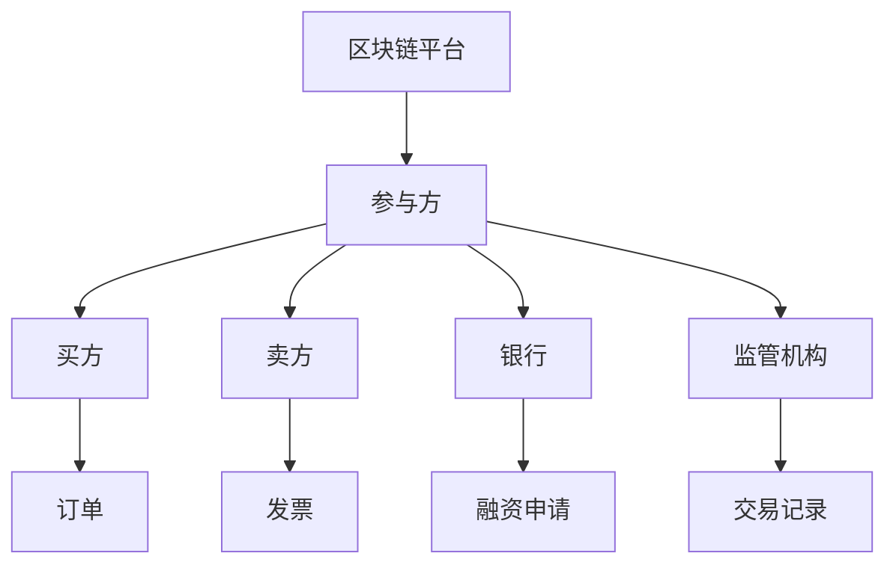
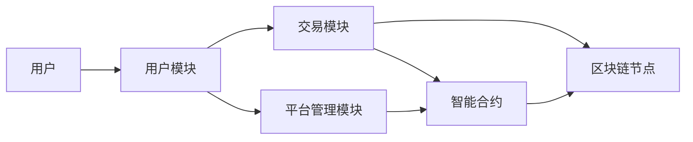
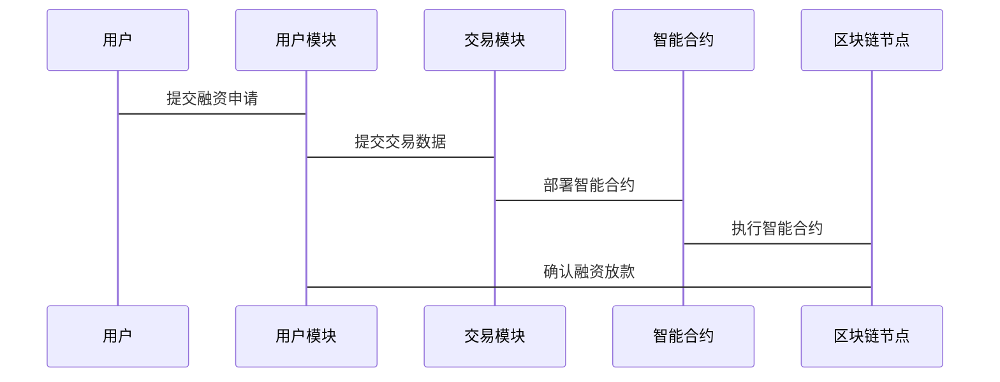

                 


# 企业估值中的区块链跨境贸易融资平台评估

> 关键词：区块链，跨境贸易，融资平台，企业估值，智能合约，分布式账本

> 摘要：本文详细探讨了区块链技术在跨境贸易融资中的应用，重点分析了区块链跨境贸易融资平台的评估方法及其对企业估值的影响。文章从区块链技术的基本原理出发，结合跨境贸易融资的实际需求，阐述了平台的核心功能、技术实现和业务流程。通过构建数学模型和算法分析，本文深入探讨了区块链如何提高融资效率、降低风险，并为企业估值提供新的视角。最后，本文通过实际案例分析，总结了区块链技术在跨境贸易融资中的优势和未来发展方向。

---

# 第一部分: 区块链与跨境贸易融资平台概述

## 第1章: 区块链与跨境贸易融资平台的背景与概念

### 1.1 区块链技术的背景与发展

区块链技术自2008年比特币白皮书发布以来，经历了从数字货币到通用分布式账本技术的演变。其核心特性包括去中心化、不可篡改、透明性和可追溯性，使其在金融、供应链管理等领域具有广泛的应用潜力。

#### 1.1.1 区块链技术的起源与演变

区块链技术的起源可以追溯到比特币的出现。比特币的白皮书由中本聪（Satoshi Nakamoto）提出，首次实现了去中心化的电子现金系统。随后，区块链技术逐渐脱离比特币，成为一种通用的分布式账本技术，应用于供应链金融、智能合约等多个领域。

#### 1.1.2 区块链的核心特性与优势

区块链的核心特性包括：
- **去中心化**：数据不依赖于单一中心节点，而是分布在多个节点上，避免了单点故障。
- **不可篡改**：通过加密算法和共识机制，确保数据一旦写入区块链，无法被修改。
- **透明性**：区块链上的交易对所有参与者公开，提高了信任度。
- **可追溯性**：每笔交易都可以被追踪，便于审计和风险管理。

#### 1.1.3 区块链在金融领域的应用前景

区块链技术在金融领域的应用前景广阔，特别是在支付清算、供应链金融和跨境融资方面。通过区块链技术，金融机构可以提高交易效率、降低运营成本并增强风险管理能力。

### 1.2 跨境貿易融資的問題與挑戰

#### 1.2.1 跨境貿易融資的基本概念

跨境贸易融资是指跨国企业为支持国际贸易活动而进行的融资行为。常见的融资方式包括信用证、保理、福费托等。然而，跨境融资往往面临信息不对称、流程复杂、成本高等问题。

#### 1.2.2 現有融資模式的局限性

传统的跨境贸易融资模式存在以下问题：
- **信息不对称**：由于不同国家的法律、信用评估标准不同，银行难以准确评估企业的信用风险。
- **流程复杂**：跨境融资涉及多个参与方，包括买方、卖方、银行和监管机构，流程繁琐且效率低下。
- **成本高昂**：由于信息不透明和信任缺失，银行往往要求较高的担保或利息，增加了企业的融资成本。

#### 1.2.3 区块链技术如何解决跨境融资问题

区块链技术可以通过以下方式解决跨境融资问题：
- **提高透明度**：通过区块链记录交易数据，确保所有参与方都能访问真实、一致的信息。
- **降低信息不对称**：区块链上的数据可以实时更新，帮助银行快速评估企业的信用状况。
- **简化流程**：通过智能合约自动执行融资合同，减少人工干预，提高融资效率。

### 1.3 区块链跨境贸易融资平台的定义与特点

#### 1.3.1 平台的核心功能与服务

区块链跨境贸易融资平台的核心功能包括：
- **数据共享**：通过区块链技术实现跨境交易数据的共享，确保数据的真实性和一致性。
- **智能合约**：通过智能合约自动执行融资合同，减少人为干预。
- **风险管理**：利用区块链的可追溯性，实时监控交易风险，及时发现和处理异常情况。

#### 1.3.2 平台的参与方与角色划分

区块链跨境贸易融资平台的参与方包括：
- **企业**：包括买方和卖方，企业通过平台进行跨境交易和融资。
- **银行**：提供融资服务，通过平台进行信用评估和放款。
- **监管机构**：负责监管平台的运行，确保数据安全和合规性。

#### 1.3.3 平台的业务流程与价值主张

区块链跨境贸易融资平台的业务流程可以分为以下几个步骤：
1. **企业申请融资**：企业向平台提交融资申请，包括交易合同、发票等资料。
2. **数据上链**：平台将企业的交易数据记录在区块链上，确保数据的真实性和不可篡改性。
3. **智能合约执行**：银行通过智能合约自动审核融资申请，并根据合同条款自动放款。
4. **监控与结算**：平台实时监控交易的执行情况，确保资金按时结算。

通过以上流程，区块链跨境贸易融资平台能够显著提高融资效率、降低融资成本，并增强各方的信任度。

### 1.4 本章小结

本章主要介绍了区块链技术的背景与发展，分析了跨境贸易融资的现状及问题，并探讨了区块链技术如何解决这些问题。通过区块链技术的应用，跨境贸易融资平台能够实现数据共享、智能合约执行和风险管理，从而提高融资效率和透明度。

---

## 第2章: 区块链跨境贸易融资平台的核心概念

### 2.1 区块链技术的核心原理

#### 2.1.1 区块链的数据结构与共识机制

区块链的数据结构包括区块和链。每个区块包含交易数据和区块头信息（如哈希值、时间戳等）。区块通过哈希值链式连接，形成一条不可篡改的区块链。共识机制是区块链的核心，常见的共识机制包括工作量证明（PoW）、权益证明（PoS）等。

#### 2.1.2 加密算法与数字签名

区块链中的数据通过加密算法进行保护，常见的加密算法包括哈希函数（如SHA-256）和椭圆曲线加密算法。数字签名用于验证数据的完整性和真实性，通常使用公钥和私钥进行签名和验证。

#### 2.1.3 智能合约的执行原理

智能合约是区块链上的可编程脚本，用于自动执行合同条款。智能合约运行在区块链虚拟机（如以太坊的EVM）上，通过预设的条件触发执行。智能合约的执行结果会被记录在区块链上，确保不可篡改。

#### 2.1.4 区块链的可扩展性与性能优化

区块链的可扩展性是其应用的关键问题之一。常见的性能优化方法包括分片技术、Layer 2解决方案（如侧链、状态通道）等。

### 2.2 跨境貿易融资平台的业务模型

#### 2.2.1 贸易融资的典型场景分析

跨境贸易融资的典型场景包括：
- **订单融资**：企业基于订单向银行申请融资。
- **应收账款融资**：企业基于未到期的应收账款向银行申请融资。
- **存货融资**：企业基于库存商品向银行申请融资。

#### 2.2.2 平台的业务流程与关键环节

区块链跨境贸易融资平台的业务流程包括：
1. **企业提交融资申请**：企业将订单、合同、发票等信息提交至平台。
2. **数据上链**：平台将企业的交易数据记录在区块链上。
3. **智能合约审核**：银行通过智能合约自动审核融资申请。
4. **融资放款**：审核通过后，银行通过智能合约自动放款。
5. **交易结算**：交易完成后，平台自动结算资金。

#### 2.2.3 平台的参与者及其关系

平台的参与者包括：
- **企业**：包括买方和卖方，企业通过平台进行交易和融资。
- **银行**：提供融资服务，通过平台进行信用评估和放款。
- **监管机构**：负责监管平台的运行，确保数据安全和合规性。

### 2.3 区块链与跨境贸易融资的结合点

#### 2.3.1 区块链在贸易融资中的应用场景

区块链在贸易融资中的应用场景包括：
- **订单融资**：基于区块链的订单数据，银行可以快速评估企业的信用状况。
- **应收账款融资**：通过区块链记录应收账款信息，提高数据的可信度。
- **存货融资**：基于区块链的库存数据，银行可以实时监控企业的库存情况。

#### 2.3.2 区块链如何提升融资效率与透明度

通过区块链技术，跨境贸易融资平台可以实现数据共享、智能合约执行和实时监控，从而显著提升融资效率和透明度。

#### 2.3.3 区块链在风险控制中的作用

区块链技术可以通过实时监控交易数据，及时发现和处理异常情况，从而降低融资风险。

### 2.4 核心概念属性对比表

| 概念       | 属性                   | 描述                               |
|------------|------------------------|------------------------------------|
| 区块链     | 去中心化               | 通过分布式账本实现信任与透明       |
| 跨境貿易融资 | 跨境性                  | 跨越国界进行的贸易融资活动         |
| 智能合约   | 自动化执行              | 通过代码自动执行合同条款           |

### 2.5 ER实体关系图



### 2.6 本章小结

本章主要介绍了区块链技术的核心原理、跨境贸易融资的业务模型以及区块链在贸易融资中的应用场景。通过对比分析，我们明确了区块链技术如何提升融资效率和透明度，并为后续的算法分析奠定了基础。

---

## 第3章: 区块链跨境贸易融资平台的算法原理与数学模型

### 3.1 区块链共识机制的算法原理

#### 3.1.1 共识机制的定义与分类

共识机制是区块链的核心机制，用于确保所有节点达成一致。常见的共识机制包括：
- **工作量证明（PoW）**：比特币采用的共识机制，通过解决哈希难题来获得记账权。
- **权益证明（PoS）**：以太坊2.0采用的共识机制，通过质押代币来获得记账权。
- **实用拜占庭容错（PBFT）**：适用于联盟链的共识机制，能够容忍部分节点失效。

#### 3.1.2 工作量证明（PoW）算法

工作量证明算法的步骤如下：
1. **区块头信息**：包括前一个区块的哈希值、时间戳、交易数据哈希值等。
2. **挖矿过程**：矿工通过不断尝试不同的随机数，找到一个满足难度条件的哈希值。
3. **区块验证**：其他节点验证区块的哈希值是否满足难度条件，若满足则接受该区块。

#### 3.1.3 智能合约的执行流程

智能合约的执行流程如下：
1. **合约部署**：将智能合约部署到区块链上。
2. **合约触发**：当满足预设的条件时，智能合约自动触发执行。
3. **合约执行**：智能合约通过区块链虚拟机执行代码，完成合同条款的自动履行。

### 3.2 跨境貿易融资平台的数学模型

#### 3.2.1 融资需求的数学模型

假设企业的融资需求为 $D$，银行的风险评估参数为 $R$，则融资额度 $C$ 可以表示为：
$$ C = \min(D, R \times D) $$

其中，$R$ 是银行的风险系数，取值范围为 $0 < R \leq 1$。

#### 3.2.2 融资成本的数学模型

融资成本 $C$ 包括利息和交易费用。假设年利率为 $r$，融资期限为 $t$ 年，则融资成本为：
$$ C = P \times r \times t $$
其中，$P$ 是融资本金。

#### 3.2.3 融资效率的数学模型

融资效率 $E$ 可以表示为：
$$ E = \frac{P}{T} $$
其中，$P$ 是融资金额，$T$ 是融资时间。

### 3.3 区块链跨境贸易融资平台的算法实现

#### 3.3.1 区块链数据结构的设计

区块链的数据结构包括区块和链。每个区块包含以下字段：
- **区块头**：包括前一个区块的哈希值、时间戳、交易数据哈希值等。
- **交易数据**：包括交易金额、交易双方地址等。

#### 3.3.2 智能合约的代码实现

以下是以太坊智能合约的示例代码：
```solidity
pragma solidity ^0.8.0;

contract TradeFinance {
    struct Trade {
        address buyer;
        address seller;
        uint amount;
        uint timestamp;
    }

    event TradeCreated(Trade trade);

    function createTrade(address buyer, address seller, uint amount) public {
        Trade memory trade = Trade(buyer, seller, amount, block.timestamp);
        emit TradeCreated(trade);
    }
}
```

#### 3.3.3 融资风险的评估算法

融资风险 $R$ 可以通过以下步骤进行评估：
1. **数据采集**：采集企业的财务数据、交易数据等。
2. **数据处理**：对数据进行清洗和预处理。
3. **风险评估**：基于机器学习算法（如随机森林、支持向量机）进行风险评估。

### 3.4 本章小结

本章主要介绍了区块链共识机制的算法原理、跨境贸易融资平台的数学模型以及智能合约的实现。通过算法和数学模型的分析，我们明确了区块链技术在提高融资效率和降低风险中的重要作用。

---

## 第4章: 区块链跨境贸易融资平台的系统分析与架构设计

### 4.1 系统功能设计

#### 4.1.1 用户模块

用户模块的主要功能包括：
- **用户注册与登录**：企业用户通过平台进行注册和登录。
- **融资申请**：企业提交融资申请，包括订单、发票等资料。
- **融资进度查询**：用户可以查询融资申请的进度。

#### 4.1.2 交易模块

交易模块的主要功能包括：
- **交易记录**：记录企业的交易数据，确保数据的真实性和一致性。
- **智能合约管理**：管理智能合约的部署和执行。

#### 4.1.3 平台管理模块

平台管理模块的主要功能包括：
- **用户管理**：管理平台的用户信息。
- **权限管理**：设置用户的权限，确保系统的安全性。

### 4.2 系统架构设计

#### 4.2.1 系统架构图



#### 4.2.2 系统接口设计

系统接口设计包括：
- **API接口**：用户模块、交易模块和平台管理模块之间的接口设计。
- **区块链接口**：与区块链节点的交互接口。

#### 4.2.3 系统交互流程图



### 4.3 本章小结

本章主要介绍了区块链跨境贸易融资平台的系统功能设计和架构设计。通过系统架构图和交互流程图，我们明确了平台的各个模块及其交互关系。

---

## 第5章: 区块链跨境贸易融资平台的项目实战

### 5.1 环境搭建与配置

#### 5.1.1 开发环境搭建

开发环境搭建包括：
- **安装以太坊节点**：安装Geth或其他以太坊节点客户端。
- **安装Solidity编译器**：安装Solidity编译器，用于编写智能合约。
- **安装区块链浏览器**：安装如Etherscan等区块链浏览器，用于调试智能合约。

#### 5.1.2 智能合约开发

智能合约开发步骤如下：
1. **编写智能合约**：使用Solidity语言编写智能合约代码。
2. **编译智能合约**：使用Solidity编译器将合约代码编译为字节码。
3. **部署智能合约**：将编译后的合约部署到以太坊测试网络。

### 5.2 系统核心实现

#### 5.2.1 智能合约实现代码

以下是以太坊智能合约的实现代码：
```solidity
pragma solidity ^0.8.0;

contract TradeFinance {
    struct Trade {
        address buyer;
        address seller;
        uint amount;
        uint timestamp;
    }

    event TradeCreated(Trade trade);

    function createTrade(address buyer, address seller, uint amount) public {
        Trade memory trade = Trade(buyer, seller, amount, block.timestamp);
        emit TradeCreated(trade);
    }
}
```

#### 5.2.2 平台评估模块实现代码

以下是一个简单的平台评估模块实现代码：
```python
from web3 import Web3, HTTPProvider

# 初始化以太坊节点
web3 = Web3(HTTPProvider('http://localhost:8545'))

# 获取智能合约地址
contract_address = '0x...'

# 获取智能合约实例
contract = web3.eth.contract(contract_address, abi=...)

# 查询交易记录
def get_trade_record():
    trade_records = contract.functions.getTradeRecords().call()
    return trade_records

# 查询融资状态
def get_finance_status():
    finance_status = contract.functions.getFinanceStatus().call()
    return finance_status
```

### 5.3 代码应用解读与分析

#### 5.3.1 智能合约的部署与测试

智能合约的部署与测试包括：
1. **合约部署**：将智能合约部署到以太坊测试网络。
2. **合约测试**：通过编写测试用例，验证智能合约的功能是否正常。

#### 5.3.2 平台评估模块的功能实现

平台评估模块的功能实现包括：
- **数据采集**：采集企业的交易数据、财务数据等。
- **数据处理**：对数据进行清洗和预处理。
- **评估分析**：基于机器学习算法进行企业估值和风险评估。

### 5.4 实际案例分析与详细讲解

#### 5.4.1 案例背景

假设一家中国出口企业与一家海外进口企业达成一笔订单，金额为100万美元。出口企业希望通过平台申请订单融资。

#### 5.4.2 平台评估与分析

1. **数据采集**：平台采集订单合同、发票、企业财务报表等数据。
2. **数据上链**：将数据记录在区块链上，确保数据的真实性和一致性。
3. **智能合约执行**：银行通过智能合约自动审核融资申请，并根据企业信用状况决定融资额度和利率。
4. **融资放款**：审核通过后，银行通过智能合约自动放款。
5. **交易结算**：交易完成后，平台自动结算资金。

### 5.5 本章小结

本章通过实际案例分析，详细讲解了区块链跨境贸易融资平台的实现过程。通过代码实现和案例分析，我们明确了平台的各个功能模块及其交互关系。

---

## 第6章: 区块链跨境贸易融资平台的最佳实践与未来发展

### 6.1 最佳实践

#### 6.1.1 平台设计的注意事项

在设计区块链跨境贸易融资平台时，需要注意以下几点：
- **数据隐私保护**：确保企业的敏感数据不被泄露。
- **系统安全性**：加强系统的安全性，防止黑客攻击和数据篡改。
- **用户体验优化**：提供友好的用户界面，提升用户体验。

#### 6.1.2 合规性与监管

在实际应用中，需要遵守相关法律法规，确保平台的合规性。同时，需要与监管机构保持良好的沟通，确保平台的运行符合监管要求。

#### 6.1.3 技术优化

为了提高平台的性能，可以采用以下技术优化措施：
- **分片技术**：通过分片技术提高区块链的可扩展性。
- **Layer 2解决方案**：通过侧链、状态通道等Layer 2解决方案提高交易速度。

### 6.2 未来发展方向

#### 6.2.1 技术创新

未来，区块链技术将继续创新，包括更高效的共识机制、更强大的智能合约功能等。

#### 6.2.2 应用场景扩展

区块链技术的应用场景将不断扩展，包括跨境支付、供应链金融、国际贸易等多个领域。

#### 6.2.3 跨-border合作

随着区块链技术的不断发展，跨国合作将成为趋势，包括跨国企业、金融机构和监管机构的合作。

### 6.3 本章小结

本章总结了区块链跨境贸易融资平台的最佳实践，并展望了未来的发展方向。通过技术创新和应用场景扩展，区块链技术将在跨境贸易融资领域发挥更大的作用。

---

## 作者

作者：AI天才研究院/AI Genius Institute & 禅与计算机程序设计艺术/Zen And The Art of Computer Programming

