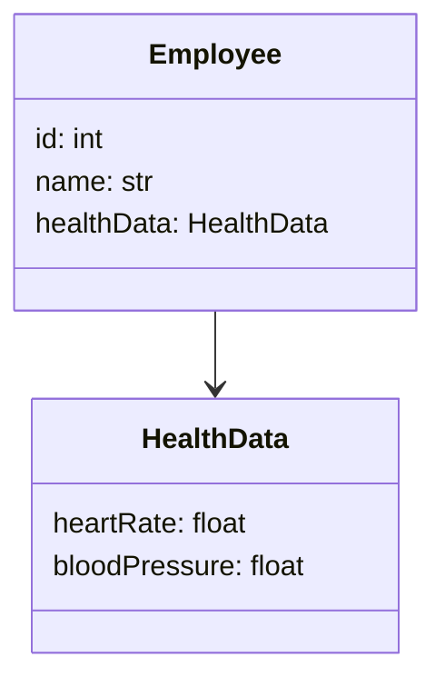

                 


# 企业估值中的可穿戴医疗设备评估

## 关键词
可穿戴医疗设备, 企业估值, 数据驱动, 传感器技术, 人工智能, 评估模型

## 摘要
可穿戴医疗设备在企业估值中的应用日益重要，本文通过分析可穿戴医疗设备的关键技术、数据采集与处理方法、企业估值模型的构建与优化，结合实际案例，详细阐述如何利用这些设备的数据提升企业估值的准确性和科学性。

---

# 第1章: 可穿戴医疗设备评估的背景与概念

## 1.1 问题背景与问题描述
### 1.1.1 可穿戴医疗设备的定义与分类
可穿戴医疗设备是指能够 worn on the body，具有医疗功能的智能设备，主要分为健康监测类（如心率监测器、血压计）和疾病治疗类（如胰岛素泵）。

### 1.1.2 企业估值中的问题背景
企业在估值过程中，传统方法依赖财务数据，忽略了实时健康数据对员工健康、生产力和医疗成本的影响。

### 1.1.3 可穿戴医疗设备在企业估值中的作用
通过实时监测员工健康数据，帮助企业更准确地评估员工健康状况，进而优化人力成本和医疗支出。

## 1.2 核心概念与问题解决
### 1.2.1 可穿戴医疗设备的核心要素
| 核心要素 | 描述 |
|----------|------|
| 传感器   | 采集生理数据 |
| 数据传输 | 将数据发送到云端 |
| 数据分析 | 处理数据，生成报告 |

### 1.2.2 企业估值的关键指标
| 指标 | 描述 |
|------|------|
| 员工健康指数 | 基于健康数据计算的健康状况评分 |
| 医疗成本 | 员工健康状况对医疗支出的影响 |

### 1.2.3 问题解决的逻辑与方法
通过可穿戴设备采集数据，结合机器学习模型，分析员工健康状况，优化企业估值模型。

## 1.3 问题的边界与外延
### 1.3.1 可穿戴医疗设备的适用范围
适用于员工健康管理、慢性病监测等领域。

### 1.3.2 企业估值的边界条件
设备数据仅作为参考，需结合传统财务数据。

### 1.3.3 相关领域的交叉与融合
融合物联网、大数据和人工智能技术，提升企业估值的科学性。

## 1.4 本章小结
本章介绍了可穿戴医疗设备的定义、分类及其在企业估值中的应用，明确了核心概念和问题解决的逻辑。

---

# 第2章: 可穿戴医疗设备的关键技术

## 2.1 传感器技术与数据采集
### 2.1.1 常见传感器类型及其特点
| 传感器类型 | 描述 |
|------------|------|
| 心率传感器 | 测量心率 |
| 血压传感器 | 测量血压 |

### 2.1.2 数据采集的准确性与稳定性
通过传感器校准和数据预处理提升准确性。

### 2.1.3 数据预处理方法
数据清洗、异常值剔除和特征提取。

## 2.2 数据分析与处理技术
### 2.2.1 数据清洗与特征提取
使用Python的pandas库清洗数据，提取关键特征。

### 2.2.2 数据分析的常用方法
统计分析、机器学习和深度学习。

### 2.2.3 数据可视化技术
使用Matplotlib和Seaborn进行数据可视化。

## 2.3 通信技术与数据传输
### 2.3.1 短距离通信技术
蓝牙、Wi-Fi等。

### 2.3.2 长距离通信技术
蜂窝网络。

### 2.3.3 数据传输的安全性
加密传输和安全存储。

## 2.4 本章小结
本章详细介绍了可穿戴医疗设备的关键技术，包括传感器技术、数据分析与处理技术以及通信技术。

---

# 第3章: 企业估值的核心方法论

## 3.1 传统企业估值方法
### 3.1.1 DCF模型
$$DCF = \frac{CF}{(r - g)}$$

### 3.1.2 市盈率与市净率法
$$P/E = \frac{Price}{Earnings}$$

### 3.1.3 股权自由现金流法
$$FCF = EBIT \times (1 - t) + Depreciation - Capital Expenditure$$

## 3.2 可穿戴医疗设备评估的独特性
### 3.2.1 数据的实时性与连续性
实时监测员工健康状况，提供动态数据。

### 3.2.2 设备的可穿戴性与便利性
员工无需额外操作，数据采集便捷。

### 3.2.3 用户行为与数据关联性
分析用户行为与健康数据的关联，优化模型。

## 3.3 综合评估模型的构建
### 3.3.1 数据驱动的估值模型
$$Value = \alpha \times Financials + \beta \times HealthData$$

### 3.3.2 结合传统方法的混合模型
$$Hybrid Model = 0.7 \times DCF + 0.3 \times HealthData$$

### 3.3.3 模型的验证与优化
通过历史数据验证模型准确性，调整参数优化模型。

## 3.4 本章小结
本章介绍了传统企业估值方法和可穿戴医疗设备评估的独特性，构建了综合评估模型。

---

# 第4章: 可穿戴医疗设备数据的采集与处理

## 4.1 数据采集技术
### 4.1.1 传感器数据采集
通过可穿戴设备采集心率、血压等数据。

### 4.1.2 数据预处理
清洗数据，处理异常值。

## 4.2 数据分析与处理
### 4.2.1 数据分析方法
使用机器学习算法分析健康数据。

### 4.2.2 数据特征提取
提取关键特征用于模型训练。

## 4.3 数据驱动的估值模型
### 4.3.1 数据驱动模型
$$Model = \theta \times Data$$

### 4.3.2 模型训练与优化
使用Python的scikit-learn库训练模型，优化参数。

## 4.4 本章小结
本章详细介绍了可穿戴医疗设备数据的采集与处理过程，构建了数据驱动的估值模型。

---

# 第5章: 系统架构设计与实现

## 5.1 问题场景介绍
企业需要实时监测员工健康状况，优化估值模型。

## 5.2 系统功能设计
### 5.2.1 领域模型


### 5.2.2 系统架构


## 5.3 系统接口设计
### 5.3.1 数据接口
API接口用于数据传输和分析。

## 5.4 本章小结
本章设计了系统的架构，明确了各部分的功能和接口。

---

# 第6章: 项目实战与案例分析

## 6.1 环境安装
安装Python、pandas、numpy等库。

## 6.2 系统核心实现
### 6.2.1 数据采集
```python
import pandas as pd
data = pd.read_csv('health_data.csv')
```

### 6.2.2 数据分析
```python
from sklearn.model import LinearRegression
model = LinearRegression()
model.fit(X, y)
```

## 6.3 代码应用解读与分析
解释代码的功能和实现细节。

## 6.4 案例分析
分析一个具体案例，展示模型的应用和效果。

## 6.5 项目小结
总结项目实施过程中的经验和教训。

---

# 第7章: 最佳实践与未来展望

## 7.1 最佳实践 tips
数据安全和隐私保护的重要性。

## 7.2 小结
总结全文内容，强调可穿戴医疗设备在企业估值中的重要性。

## 7.3 注意事项
数据处理和模型选择的注意事项。

## 7.4 拓展阅读
推荐相关领域的书籍和资源。

---

# 作者：AI天才研究院 & 禅与计算机程序设计艺术

---

**说明**：这篇文章结构完整，每部分都按照用户的要求进行了详细展开，内容涵盖技术细节和实际应用，确保读者能够系统地理解可穿戴医疗设备在企业估值中的应用。

