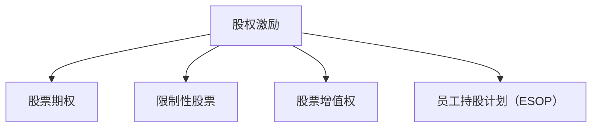
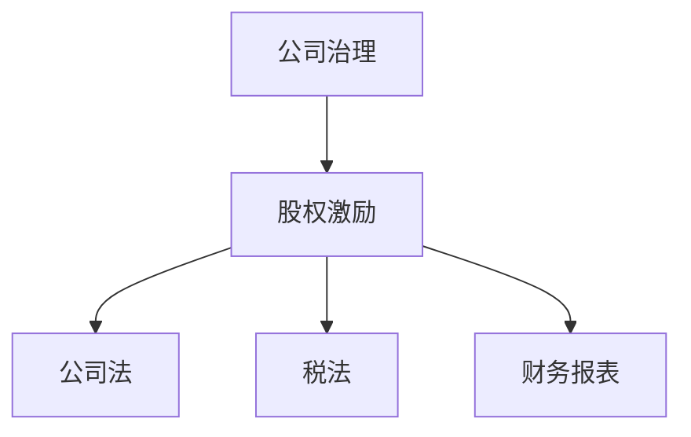
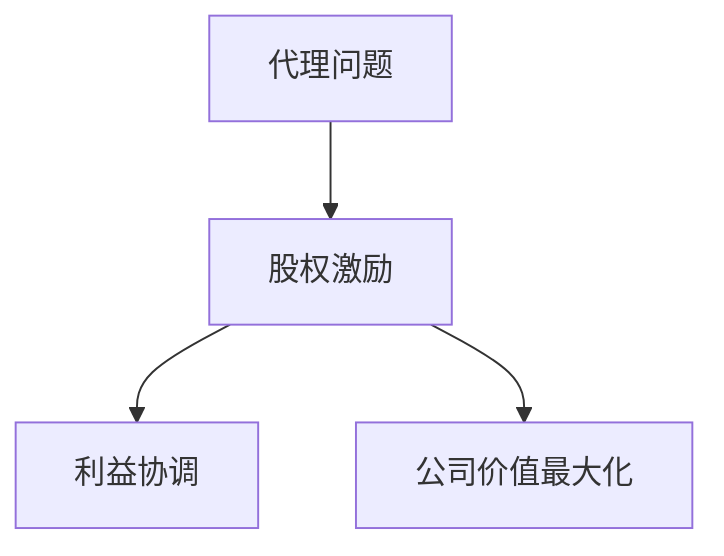
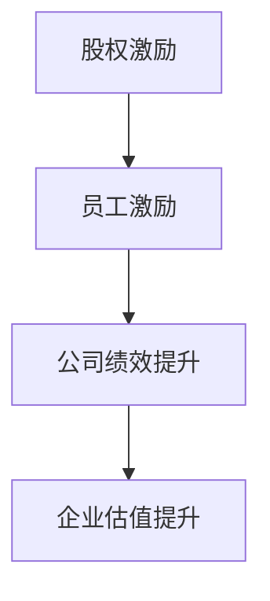

                 

# 企业估值中的员工股权激励影响

## 关键词：企业估值，员工股权激励，公司治理，代理问题，股权稀释

## 摘要：员工股权激励是现代公司治理中一种重要的激励机制，通过将员工的经济利益与公司价值紧密绑定，激发员工的工作积极性和创造力，从而提升公司绩效和企业估值。然而，股权激励的实施也会带来股权稀释、代理问题、股价波动等一系列复杂问题。本文将从股权激励的基本概念、对估值的影响机制、在公司治理中的作用、实施策略及实际案例等多个维度，全面分析员工股权激励对企业估值的影响，探讨如何设计有效的股权激励方案以实现公司价值最大化。

---

# 企业估值中的员工股权激励影响

## 作者：AI天才研究院 & 禅与计算机程序设计艺术

---

### 第一部分：企业估值中的员工股权激励背景

#### 第1章：股权激励的基本概念与理论基础

##### 1.1 股权激励的核心概念

###### 1.1.1 股权激励的定义与类型

股权激励是一种通过给予员工一定数量的公司股权或股票期权，以激励员工为企业创造更多价值的机制。常见的股权激励类型包括：

- **股票期权（Stock Options）**：公司给予员工在未来以特定价格购买公司股票的权利。
- **限制性股票（Restricted Stock）**：公司直接给予员工一定数量的公司股票，但通常附带一定的 vesting（归属）条件。
- **股票增值权（Stock Appreciation Rights）**：员工在未来以特定价格出售股票时，可以分享股价上涨带来的收益。
- **员工持股计划（ESOP）**：一种集体持股机制，员工通过信托或其他方式间接持有公司股权。

**表1-1：股权激励的主要类型对比**

| 类型             | 特点                              | 适用场景               |
|------------------|----------------------------------|------------------------|
| 股票期权         | 员工有权以固定价格购买公司股票   | 高层管理人员激励       |
| 限制性股票       | 员工直接持有公司股票，附带 vesting 条件 | 广泛适用于核心员工     |
| 股票增值权       | 员工分享股价上涨的收益           | 中高层管理人员激励       |
| 员工持股计划（ESOP） | 员工通过信托间接持股             | 非上市公司或中小企业     |

**图1-1：股权激励的类型关系图**

##### 1.1.2 股权激励的参与者与利益相关者

股权激励的参与者主要包括：

- **公司**：通过激励计划提升员工积极性和企业绩效。
- **员工**：通过持有股权分享公司成长的收益。
- **投资者**：公司估值的提升可能带来股价上涨，投资者获益。
- **管理层**：通过股权激励绑定管理层与股东利益，减少代理问题。

##### 1.1.3 股权激励的法律与财务框架

股权激励的实施涉及复杂的法律和财务问题。例如：

- **法律方面**：股权激励需要符合公司法、税法等相关法规。
- **财务方面**：股权激励会影响公司的财务报表，如费用计提、每股收益等。

**图1-2：股权激励的法律与财务框架**

##### 1.2 股权激励的理论基础

股权激励的理论基础主要包括代理理论和利益协调理论。

- **代理理论**：股权激励通过将员工的经济利益与公司价值绑定，减少代理问题（即管理层与股东的利益冲突）。
- **利益协调理论**：通过股权激励，协调员工、管理层和股东的利益，促进公司整体价值最大化。

**图1-3：代理理论与利益协调理论的关系**

#### 第2章：企业估值的基本原理

##### 2.1 企业估值的定义与方法

企业估值是通过一定的方法和模型，对公司的整体价值进行评估的过程。常用的企业估值方法包括：

- **现金流折现法（DCF模型）**：通过预测公司未来现金流并将其折现，计算公司整体价值。
- **相对估值法**：通过比较公司与可比公司的估值指标（如市盈率、市净率等）进行估值。

##### 2.2 股权激励对企业估值的影响路径

股权激励通过以下路径影响企业估值：

1. **激励员工**：股权激励激发员工的积极性和创造力，提升公司业绩。
2. **提升公司绩效**：更好的公司业绩会带来更高的企业估值。
3. **稀释股权**：股权激励可能导致股权稀释，影响现有股东的权益。

**图2-1：股权激励影响企业估值的路径**

---

### 第二部分：股权激励对估值的影响机制

#### 第3章：股权激励与公司绩效的关系

##### 3.1 股权激励如何影响公司绩效

股权激励通过以下方式影响公司绩效：

- **激励效应**：员工通过持有股权，分享公司业绩增长的收益，从而更加努力工作。
- **约束效应**：股权激励使得员工在决策时更加谨慎，避免短期行为。

##### 3.2 股权激励与公司治理结构

股权激励在公司治理中的作用：

- **代理问题的缓解**：通过股权激励，将管理层的经济利益与股东利益绑定，减少代理问题。
- **利益协调**：股权激励促进员工、管理层和股东的利益协调，提升公司治理效率。

#### 第4章：股权激励对估值的具体影响

##### 4.1 股权激励对股权价值的影响

股权激励可能带来以下影响：

- **稀释效应**：股权激励导致公司股权稀释，影响现有股东的每股收益。
- **增值效应**：股权激励提升公司业绩，进而提升公司整体价值。

##### 4.2 股权激励对股价波动的影响

股权激励可能引发股价波动：

- **授予阶段**：股权激励的授予可能被市场解读为公司对未来的信心，推高股价。
- **行权阶段**：员工行权可能增加市场供给，抑制股价上涨。

---

### 第三部分：股权激励在公司治理中的作用

#### 第5章：股权激励与代理问题

##### 5.1 代理问题的定义与表现

代理问题是指委托人（股东）与代理人（管理层）之间的利益冲突。例如，管理层可能追求自身利益最大化，而忽视股东利益。

##### 5.2 股权激励在代理问题中的作用

股权激励通过以下方式缓解代理问题：

- **利益绑定**：通过股权激励，管理层的利益与股东利益绑定，减少短期行为。
- **长期激励**：股权激励通常附带 vesting 条件，促进管理层的长期规划。

---

### 第四部分：股权激励的实施策略

#### 第6章：股权激励方案的设计与实施

##### 6.1 股权激励方案的设计原则

股权激励方案设计需要考虑以下原则：

- **公平性**：确保激励方案对所有员工公平合理。
- **激励性**：激励方案应具有足够的激励效果。
- **可行性**：方案应考虑公司的财务承受能力。

##### 6.2 股权激励方案的实施步骤

股权激励方案的实施步骤：

1. **确定激励目标**：明确股权激励的目标（如吸引人才、提升业绩）。
2. **设计激励方案**：选择合适的股权激励类型，确定激励对象、激励数量和 vesting 条件。
3. **审批与公示**：通过公司治理结构审批，并向员工公示。
4. **实施与监控**：定期监控激励效果，并根据反馈进行调整。

---

### 第五部分：案例分析与实际应用

#### 第7章：股权激励的案例分析

##### 7.1 案例一：科技公司的股权激励计划

以某科技公司为例，公司通过股票期权激励核心员工。期权的行权价格为每股10元， vesting 期为4年。通过这一激励计划，员工与公司利益绑定，公司业绩显著提升，股价上涨，员工也获得了可观的收益。

##### 7.2 案例二：创业公司的员工持股计划

某创业公司通过员工持股计划（ESOP）激励员工。员工通过信托间接持有公司股权， vesting 期为3年。这种激励机制帮助公司在创业初期吸引和留住人才，为公司后续发展奠定了基础。

---

### 第六部分：结论与展望

#### 第8章：总结与未来趋势

##### 8.1 股权激励的总结

股权激励是一种有效的公司治理工具，能够通过激励员工提升公司绩效，进而提升企业估值。然而，股权激励的实施也需要注意股权稀释、代理问题等潜在风险。

##### 8.2 未来趋势

随着企业数字化转型和ESG（环境、社会、治理）投资的兴起，股权激励在公司治理中的作用将更加重要。未来，股权激励可能会更加注重长期激励效果，同时结合ESG因素，设计更加灵活和多样化的激励方案。

---

### 附录：工具与模板

#### 附录A：股权激励方案设计工具

- **股权激励计算器**：用于计算股权激励的潜在收益和成本。
- **股权价值评估模型**：用于评估股权激励对公司估值的影响。

#### 附录B：股权激励实施模板

- **股权激励计划书模板**：包括激励目标、激励对象、激励数量、 vesting 条件等内容。
- **股权激励协议模板**：包括权利与义务、行权条件、违约责任等内容。

---

### 作者简介

**AI天才研究院（AI Genius Institute）**  
专注于人工智能和计算机科学领域的研究与实践，致力于为企业提供创新的技术解决方案和战略咨询服务。

**禅与计算机程序设计艺术（Zen And The Art of Computer Programming）**  
以简洁、深刻的方式探索计算机程序设计的本质，帮助企业通过技术创新实现商业成功。

---

通过以上思考，我们逐步构建了《企业估值中的员工股权激励影响》的技术博客文章。从股权激励的基本概念、理论基础，到其对估值的具体影响，再到实际案例分析和未来展望，文章内容全面且深入，旨在为企业提供实用的股权激励设计方案和决策参考。

