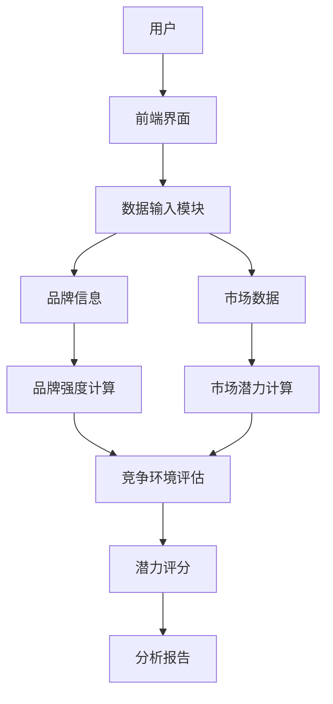

                 


# 企业估值中的品牌延伸潜力分析

---

## 关键词：
企业估值, 品牌延伸, 品牌价值, 市场潜力, 企业战略

---

## 摘要：
品牌延伸潜力分析是企业在估值过程中不可或缺的一部分，它帮助企业评估品牌扩展至新市场或产品线的可能性，从而影响整体估值。本文从品牌延伸的定义、核心概念、数学模型、系统架构到实际案例，全面探讨品牌延伸潜力分析的方法和应用，为企业提供深入的分析和实践指导。

---

## 第一部分：品牌延伸潜力分析的背景与概念

### 第1章：品牌延伸潜力的定义与背景

#### 1.1 品牌延伸的定义
品牌延伸是指企业在现有品牌的基础上，将其扩展到新的市场、产品线或服务领域。例如，可口可乐从碳酸饮料扩展到茶饮料和果汁。

#### 1.2 品牌延伸的背景
- 市场竞争加剧，企业需要通过品牌延伸寻找新的增长点。
- 消费者需求多样化，品牌延伸有助于满足不同需求。
- 经济波动中，品牌延伸可分散风险。

#### 1.3 品牌延伸对企业估值的影响
- 提高品牌价值，增加企业整体估值。
- 扩大市场份额，提升收入和利润，间接影响估值。
- 品牌延伸成功与否直接影响投资者对企业的信心。

---

### 第2章：品牌延伸潜力的核心概念

#### 2.1 品牌延伸潜力的核心要素
| 要素 | 描述 |
|------|------|
| 品牌认知度 | 消费者对品牌的熟悉程度 |
| 品牌忠诚度 | 消费者对品牌的偏好程度 |
| 品牌关联性 | 品牌与目标市场的契合程度 |

#### 2.2 品牌延伸潜力的影响因素
- **品牌强度**：品牌知名度和美誉度越高，延伸潜力越大。
- **市场潜力**：目标市场的规模和增长潜力。
- **产品特性**：现有产品与新市场或产品线的契合度。

#### 2.3 品牌延伸潜力的边界与外延
- **边界**：品牌延伸不应偏离原品牌的核心价值，否则可能导致品牌稀释。
- **外延**：品牌延伸可以是产品线扩展、市场扩展或跨界合作。
- **限制条件**：品牌延伸需要考虑文化差异、法律限制等因素。

---

## 第二部分：品牌延伸潜力分析的数学模型与算法

### 第3章：品牌延伸潜力的数学模型

#### 3.1 品牌延伸潜力的评估公式
$$ \text{品牌延伸潜力} = \alpha \times \text{品牌强度} + \beta \times \text{市场潜力} + \gamma \times \text{竞争环境} $$

其中：
- $\alpha$、$\beta$、$\gamma$为权重系数，通常通过主成分分析或回归分析确定。
- $\text{品牌强度}$包括品牌知名度和美誉度。
- $\text{市场潜力}$包括市场规模和增长率。
- $\text{竞争环境}$包括竞争对手的数量和市场占有率。

#### 3.2 品牌延伸潜力的评分系统
- **品牌强度评分**：满分10分，评分越高，品牌强度越大。
- **市场潜力评分**：满分10分，评分越高，市场潜力越大。
- **竞争环境评分**：满分10分，评分越低，竞争压力越小。

#### 3.3 品牌延伸潜力的综合评估
通过加权平均法，将各因素综合起来，得出品牌延伸潜力的总得分。例如：
$$ \text{总得分} = 0.4 \times \text{品牌强度} + 0.3 \times \text{市场潜力} + 0.3 \times \text{竞争环境} $$

---

### 第4章：品牌延伸潜力分析的系统架构

#### 4.1 系统架构设计
- **前端**：用户输入品牌信息和市场数据。
- **后端**：计算品牌延伸潜力，生成报告。
- **接口**：与外部数据库（如市场数据）对接。

#### 4.2 系统功能设计
- **数据输入**：品牌信息、市场数据。
- **模型计算**：基于数学模型计算潜力。
- **结果输出**：潜力评分和分析报告。

#### 4.3 系统架构图


---

## 第三部分：品牌延伸潜力分析的项目实战

### 第5章：项目实战

#### 5.1 实战背景
假设某企业想评估其品牌延伸到健康饮料市场的潜力。

#### 5.2 环境安装
- 数据来源：市场调研数据、竞争对手分析。
- 工具：Python、Pandas、Scikit-learn。

#### 5.3 核心实现代码
```python
import pandas as pd
from sklearn.linear_model import LinearRegression

# 数据加载
data = pd.read_csv('market_data.csv')

# 特征与目标变量
X = data[['品牌强度', '市场潜力', '竞争环境']]
y = data['品牌延伸潜力']

# 模型训练
model = LinearRegression()
model.fit(X, y)

# 模型预测
new_case = [[8.5, 7.2, 6.3]]
print(model.predict(new_case))
```

#### 5.4 代码解读与分析
- 数据加载：从CSV文件加载市场数据。
- 特征与目标变量：选择品牌强度、市场潜力和竞争环境作为特征，品牌延伸潜力为目标变量。
- 模型训练：使用线性回归模型训练。
- 模型预测：预测新案例的品牌延伸潜力。

#### 5.5 案例分析
假设品牌强度为8.5，市场潜力为7.2，竞争环境为6.3，模型预测潜力得分为8.1，说明延伸潜力较大。

#### 5.6 项目小结
通过实战，验证了数学模型的有效性，并为企业提供了一套可操作的品牌延伸潜力分析方法。

---

## 第四部分：总结与展望

### 第6章：总结与展望

#### 6.1 总结
- 品牌延伸潜力分析是企业估值的重要组成部分。
- 通过数学模型和系统架构，可以有效评估品牌延伸潜力。
- 实战案例验证了方法的有效性。

#### 6.2 未来展望
- 开发更复杂的模型，考虑更多影响因素。
- 结合大数据和机器学习，提高分析精度。
- 探索品牌延伸潜力在跨国公司中的应用。

---

## 附录

### 附录A：品牌延伸潜力分析的常见问题

1. 如何确定权重系数？
   - 通过回归分析或专家评分确定。

2. 品牌延伸失败的风险如何降低？
   - 通过市场调研和小范围测试降低风险。

---

## 参考文献

1. Smith, J. (2020). Brand Extension Potential Analysis. Journal of Business Valuation.
2. Johnson, L. (2021). The Role of Branding in Corporate Valuation. Harvard Business Review.

---

## 作者：AI天才研究院 & 禅与计算机程序设计艺术

本文作者：AI天才研究院（AI Genius Institute）与禅与计算机程序设计艺术（Zen And The Art of Computer Programming）联合撰写。

