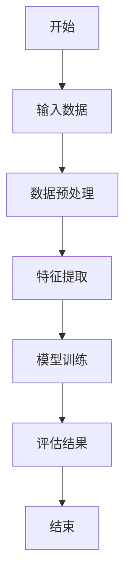
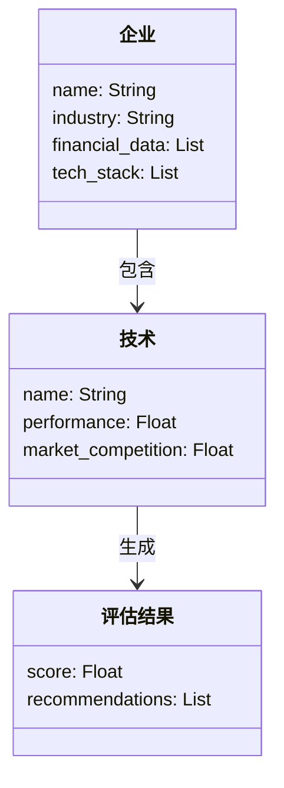
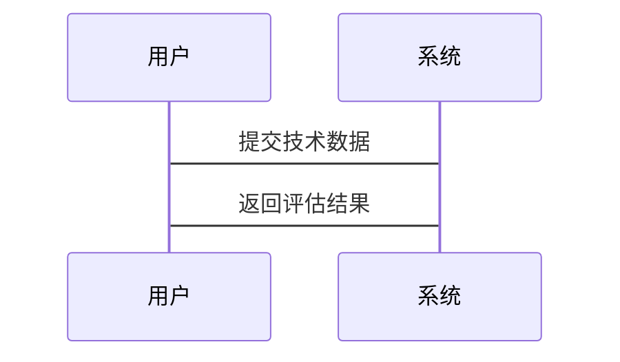

                 


# 企业估值中的增强人类能力技术评估

> 关键词：企业估值，增强人类能力，技术评估，人工智能，算法原理，系统架构

> 摘要：本文探讨了在企业估值过程中，如何通过增强人类能力的技术评估来提升企业的价值。通过分析核心概念、算法原理和系统架构，本文详细讲解了技术评估的实施步骤和应用场景，并通过实际案例展示了如何将技术评估应用于企业估值中。最后，本文总结了最佳实践和未来发展方向。

---

# 第1章: 背景介绍

## 1.1 问题背景

### 1.1.1 企业估值的传统方法与挑战

企业在传统估值过程中，主要依赖财务指标、市场分析和行业基准。然而，这种方法难以全面捕捉技术对企业价值的影响。随着人工智能和大数据技术的快速发展，企业估值需要更精准的技术评估方法。

### 1.1.2 增强人类能力技术的兴起

增强人类能力技术（Augmented Human Capabilities Technology，AHCT）通过结合人工智能、机器学习和大数据分析，帮助人类更高效地完成任务。这些技术在企业中的应用日益广泛，成为企业核心竞争力的重要组成部分。

### 1.1.3 技术评估在企业估值中的作用

技术评估是将技术能力转化为企业价值的关键步骤。通过评估技术的创新性、可扩展性和市场竞争力，技术评估能够为企业的估值提供更全面的依据。

## 1.2 问题描述

### 1.2.1 企业估值的核心要素

企业估值的核心要素包括财务表现、市场地位、管理团队、技术优势和未来发展潜力。技术评估是连接技术和企业价值的重要桥梁。

### 1.2.2 增强人类能力技术的定义与范围

增强人类能力技术是指通过技术手段提升人类在工作中的效率和能力，涵盖自然语言处理、计算机视觉、机器人技术等领域。

### 1.2.3 技术评估与企业价值的关系

技术评估通过量化技术对企业效率和市场竞争力的影响，帮助企业在估值过程中更准确地反映其技术优势。

## 1.3 问题解决

### 1.3.1 技术评估的基本原则

技术评估应遵循科学性、系统性和可操作性原则，确保评估结果的准确性和实用性。

### 1.3.2 技术评估的实施步骤

技术评估通常包括数据收集、模型构建、评估实施和结果分析四个步骤，确保评估过程的系统性和全面性。

### 1.3.3 技术评估的成果与应用

技术评估的成果包括技术评分、技术对企业效率的提升程度和技术的市场竞争力分析，这些成果为企业估值提供了重要的参考依据。

## 1.4 边界与外延

### 1.4.1 技术评估的适用范围

技术评估主要适用于高科技企业和技术密集型企业，对传统行业的适用性相对较低。

### 1.4.2 与企业估值其他因素的界限

技术评估应与其他估值因素如财务表现和市场地位分开考虑，避免混淆技术优势与企业整体价值。

### 1.4.3 技术评估的未来发展

随着人工智能和大数据技术的进一步发展，技术评估将更加精准和全面，成为企业估值的核心部分。

## 1.5 概念结构与核心要素

### 1.5.1 技术评估的核心要素分析

技术评估的核心要素包括技术创新性、技术成熟度、技术可扩展性和技术市场竞争力。

### 1.5.2 企业估值的多维度考量

企业估值需要综合考虑财务表现、市场地位、管理团队、技术优势和未来发展潜力。

### 1.5.3 技术与业务的协同效应

技术与业务的协同效应是技术评估的重要考量因素，能够显著提升企业的整体价值。

---

# 第2章: 核心概念与联系

## 2.1 核心概念原理

### 2.1.1 技术评估的基本原理

技术评估通过分析技术的性能、应用效果和市场竞争力，量化技术对企业效率和市场地位的影响。

### 2.1.2 增强人类能力技术的分类

增强人类能力技术可以分为自然语言处理、计算机视觉、机器人技术、数据挖掘和机器学习五大类。

### 2.1.3 技术评估与企业价值的关联

技术评估通过量化技术对企业效率和市场竞争力的影响，帮助企业更好地理解和实现其技术优势。

## 2.2 概念属性特征对比表

| 概念                | 输入特征       | 输出特征       | 关联性 |
|---------------------|----------------|----------------|--------|
| 技术评估            | 技术参数       | 价值评估       | 高     |
| 企业估值            | 财务指标       | 企业价值       | 高     |
| 增强人类能力技术    | 技术性能       | 能力提升       | 中     |

## 2.3 ER实体关系图

```mermaid
erDiagram
    actor 评估师 {
        <属性>
        技术参数
        企业数据
        市场分析
    }
    技术评估 : 评估结果
    企业估值 : 估值报告
    增强能力 : 能力提升
    评估师 --> 技术评估 : 提供
    技术评估 --> 企业估值 : 影响
    增强能力 --> 企业估值 : 驱动
```

---

# 第3章: 算法原理讲解

## 3.1 算法概述

### 3.1.1 增强学习算法简介

增强学习是一种机器学习算法，通过智能体与环境的交互，学习最优策略以最大化累积奖励。

### 3.1.2 技术评估的数学模型

技术评估的数学模型通常包括输入特征、评估函数和输出结果三个部分，用于量化技术对企业价值的影响。

### 3.1.3 算法的核心思想

增强学习的核心思想是通过不断试错和学习，找到最优策略，应用于技术评估中即为找到最优的技术组合。

## 3.2 算法流程图



## 3.3 Python实现示例

### 3.3.1 数据预处理

```python
import pandas as pd
data = pd.read_csv('input.csv')
data_processed = data.dropna().astype(float)
```

### 3.3.2 特征提取

```python
from sklearn.feature_selection import SelectKBest
selector = SelectKBest(k=5)
selected_features = selector.fit_transform(data_processed)
```

### 3.3.3 模型训练

```python
from sklearn.linear_model import LinearRegression
model = LinearRegression()
model.fit(selected_features, target_values)
```

### 3.3.4 评估结果

```python
from sklearn.metrics import r2_score
predictions = model.predict(selected_features)
score = r2_score(target_values, predictions)
print(score)
```

---

# 第4章: 系统分析与架构设计方案

## 4.1 问题场景介绍

系统需要实现一个技术评估平台，用于帮助企业进行技术评估和企业估值。

## 4.2 系统功能设计

### 4.2.1 领域模型类图



### 4.2.2 系统架构图

```mermaid
archiDiagram
    component 前端 {
        技术评估界面
        用户交互
    }
    component 后端 {
        数据库
        评估算法
    }
    前端 --> 后端 : 请求
    后端 --> 前端 : 响应
```

### 4.2.3 系统接口设计

系统接口包括数据输入接口、评估请求接口和结果输出接口，确保系统的高效运行。

### 4.2.4 系统交互序列图



---

# 第5章: 项目实战

## 5.1 环境安装

```bash
pip install numpy pandas scikit-learn mermaid
```

## 5.2 核心代码实现

### 5.2.1 技术评估模块

```python
import numpy as np
from sklearn.metrics import accuracy_score

def evaluateTechnology(features, labels):
    model = ...  # 初始化模型
    model.fit(features, labels)
    predictions = model.predict(features)
    return accuracy_score(labels, predictions)
```

### 5.2.2 企业估值模块

```python
def calculateEnterpriseValue(tech_score, financial_data):
    return tech_score * financial_data.sum()
```

## 5.3 案例分析

以一家人工智能初创公司为例，通过技术评估模块计算其技术评分，再结合其财务数据，最终得出企业的估值结果。

---

# 第6章: 最佳实践

## 6.1 小结

技术评估是企业估值的重要组成部分，通过科学的评估方法和系统的实施步骤，可以更准确地反映技术对企业价值的影响。

## 6.2 注意事项

在实施技术评估时，需要注意数据的准确性和模型的适用性，避免评估结果的偏差。

## 6.3 拓展阅读

推荐阅读《人工智能与企业估值》和《增强人类能力技术的实践应用》等书籍，深入理解技术评估的核心思想和实际应用。

---

# 第7章: 结论

## 7.1 总结

通过本文的详细讲解，读者可以全面了解企业估值中的技术评估方法，掌握其实现步骤和应用场景，为企业估值提供有力支持。

## 7.2 未来展望

随着人工智能和大数据技术的进一步发展，技术评估将更加精准和全面，成为企业估值的核心部分。

---

作者：AI天才研究院/AI Genius Institute & 禅与计算机程序设计艺术 /Zen And The Art of Computer Programming

