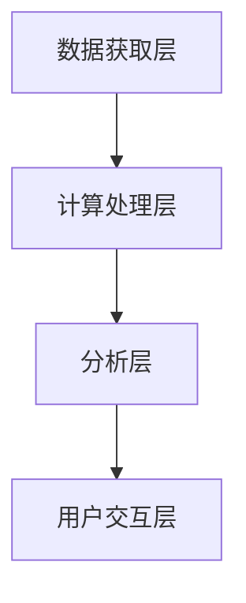
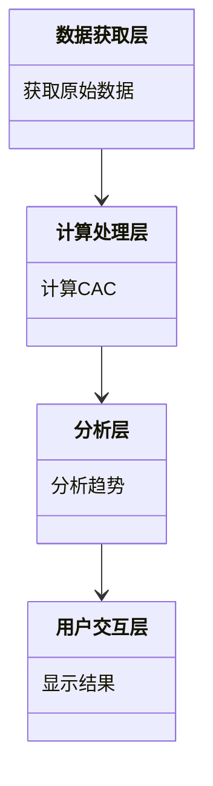
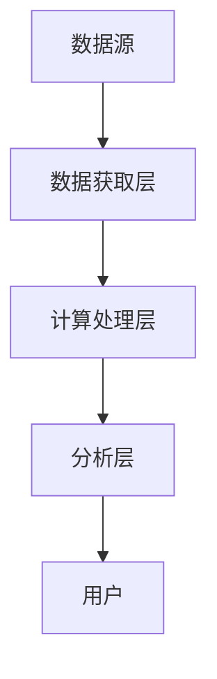

                 


# 客户获取成本分析系统架构

## 章节标题：客户获取成本分析系统架构

### 章节目标

通过本章节，读者将了解如何构建一个完整的客户获取成本（CAC）分析系统，包括系统架构设计、功能模块划分、数据流设计以及接口设计。

---

### 3.3 系统架构设计

#### 3.3.1 系统架构概述

客户获取成本分析系统采用分层架构，包括数据获取层、计算处理层、分析层和用户交互层。



#### 3.3.2 系统架构图



---

### 3.4 数据流设计

#### 3.4.1 数据流概述

数据从数据源流入系统，经过处理和分析，最终生成结果并输出给用户。



---

### 3.5 接口设计

#### 3.5.1 系统接口概述

系统需要与外部数据源、数据库和用户进行交互，定义了以下接口：

1. 数据获取接口：从数据源获取客户数据。
2. 计算接口：计算CAC值。
3. 分析接口：分析CAC趋势。
4. 显示接口：将结果呈现给用户。

---

### 3.6 项目实战：系统架构实现

#### 3.6.1 环境搭建

1. 安装Python和相关库（如Pandas、Matplotlib）。
2. 确定数据源（CSV文件或数据库）。

#### 3.6.2 核心代码实现

```python
import pandas as pd
import matplotlib.pyplot as plt

# 数据获取
data = pd.read_csv('client_data.csv')

# 计算CAC
cac = data['营销费用'] + data['销售费用']
cac_per_client = cac / data['客户数量']

# 可视化
plt.plot(data['时间'], cac_per_client)
plt.xlabel('时间')
plt.ylabel('CAC')
plt.title('CAC趋势分析')
plt.show()
```

---

### 3.7 小结

通过本章节的学习，读者了解了如何构建一个完整的客户获取成本分析系统，包括系统架构设计、数据流设计和接口设计。通过实际案例，读者掌握了系统实现的基本方法。

---

## 章节总结

客户获取成本分析系统的构建需要从数据获取、计算处理、分析和用户交互四个层面进行设计。通过合理规划系统架构和数据流，可以高效地实现客户获取成本的分析和可视化。实际案例中的代码实现进一步巩固了理论知识，帮助读者更好地理解和应用这些分析方法。

