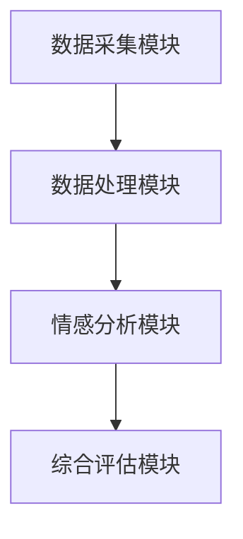
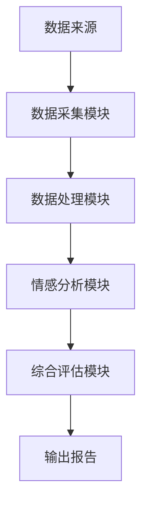
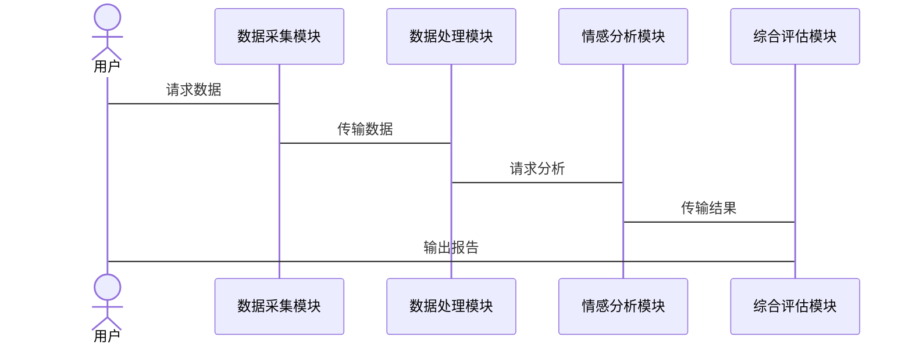

                 


# 企业估值中的情感计算技术应用评估

> 关键词：企业估值、情感计算、自然语言处理、机器学习、深度学习

> 摘要：本文探讨了情感计算技术在企业估值中的应用，详细分析了情感计算的核心原理、数学模型、系统架构设计以及实际案例，展示了如何通过情感数据分析提升企业估值的准确性。

---

# 第1章: 企业估值与情感计算技术概述

## 1.1 企业估值的基本概念

### 1.1.1 企业估值的定义与核心要素

企业估值是通过对企业的财务状况、市场表现、管理团队等多个因素进行综合评估，确定其市场价值的过程。传统估值方法主要依赖财务指标，如收入、利润和现金流，但忽视了企业内外部情感因素对企业价值的影响。

### 1.1.2 传统企业估值方法的局限性

传统估值方法在处理非财务因素时存在局限性，例如忽视市场情绪、客户满意度和员工士气等情感因素对企业价值的影响。这些因素可能在短期内影响企业表现，甚至在长期影响企业生存和发展。

### 1.1.3 情感计算技术的引入与意义

情感计算技术通过分析文本、语音和图像中的情感信息，量化情感因素对企业价值的影响。引入情感计算技术可以补充传统估值方法的不足，提供更全面的企业评估。

---

## 1.2 情感计算技术的定义与特点

### 1.2.1 情感计算技术的定义

情感计算（Affective Computing）是通过计算机技术分析和识别人类情感、情绪和心理状态的过程。它涉及自然语言处理、语音识别和计算机视觉等技术，旨在理解和模拟人类情感。

### 1.2.2 情感计算的核心特征

- **实时性**：情感计算技术能够实时分析数据，捕捉情感变化。
- **多样性**：情感计算支持多种情感维度的分析，如快乐、悲伤、愤怒等。
- **适应性**：情感计算系统能够根据情感信息调整行为或决策。

### 1.2.3 情感计算与传统数据分析的区别

| 特性       | 情感计算技术              | 传统数据分析技术          |
|------------|---------------------------|---------------------------|
| 数据来源    | 文本、语音、图像           | 结构化数据（财务指标）     |
| 分析目标    | 情感、情绪、心理状态       | 事实、趋势、规律          |
| 输出形式    | 情感评分、情绪分类         | 数值、统计结果            |

---

## 1.3 情感计算技术在企业估值中的应用前景

### 1.3.1 情感计算技术的潜在应用场景

- **市场情绪分析**：通过社交媒体、新闻媒体分析市场对企业的看法。
- **客户满意度评估**：通过客户反馈分析客户对企业产品或服务的满意度。
- **员工情绪监测**：通过员工反馈分析员工对企业管理的满意度和忠诚度。

### 1.3.2 企业采用情感计算技术的优势

- **提升估值准确性**：综合考虑情感因素，提供更全面的估值结果。
- **增强决策能力**：通过情感数据辅助管理层做出更明智的决策。
- **及时捕捉市场变化**：快速响应市场情绪变化，优化企业战略。

### 1.3.3 情感计算技术应用的挑战与机遇

- **挑战**：情感数据的不完全性和主观性，以及情感计算技术的复杂性和成本。
- **机遇**：随着AI和大数据技术的发展，情感计算技术在企业估值中的应用前景广阔。

---

## 1.4 本章小结

本章介绍了企业估值的基本概念和情感计算技术的定义、特点及其在企业估值中的应用前景。情感计算技术通过分析情感数据，为传统估值方法提供了新的视角和工具，有助于提升估值的准确性和全面性。

---

# 第2章: 情感计算技术的核心原理

## 2.1 情感计算技术的理论基础

### 2.1.1 情感计算的定义与目标

情感计算的目标是通过技术手段识别、理解和模拟人类情感，以便在人机交互中提供更智能化的服务。

### 2.1.2 情感计算的核心算法原理

情感计算的核心算法包括自然语言处理（NLP）、机器学习（ML）和深度学习（DL）。这些算法通过分析文本、语音和图像中的情感信息，生成情感评分或分类结果。

### 2.1.3 情感计算与自然语言处理的关系

自然语言处理是情感计算的重要组成部分，负责从文本中提取情感信息。情感计算则基于这些信息进行进一步的分析和应用。

---

## 2.2 情感计算技术的关键步骤

### 2.2.1 数据采集与预处理

数据采集是情感计算的第一步，主要通过社交媒体、新闻媒体、客户反馈等渠道获取文本数据。预处理包括分词、去除停用词、词干提取等步骤。

### 2.2.2 情感分析模型的构建

情感分析模型基于训练数据进行训练，学习文本中的情感特征。常用的情感分析模型包括支持向量机（SVM）、朴素贝叶斯（Naive Bayes）和深度学习模型（如LSTM、Transformer）。

### 2.2.3 情感结果的解释与应用

情感分析结果可以用于企业估值，如评估市场情绪、客户满意度和员工士气。通过将情感评分与财务指标结合，可以生成更全面的企业估值报告。

---

## 2.3 情感计算技术的核心算法

### 2.3.1 基于规则的情感分析

基于规则的情感分析通过预定义的规则和情感词典对文本进行情感分类。例如，使用情感词典中的正面词汇和负面词汇对文本进行分类。

### 2.3.2 基于机器学习的情感分析

基于机器学习的情感分析通过训练模型自动学习情感特征。常用的算法包括支持向量机（SVM）和朴素贝叶斯（Naive Bayes）。

### 2.3.3 基于深度学习的情感分析

基于深度学习的情感分析使用神经网络模型，如LSTM和Transformer，对文本进行情感分析。这些模型能够捕捉文本中的深层语义信息，提高情感分析的准确性。

---

## 2.4 情感计算技术的优缺点对比

| 特性             | 基于规则的情感分析 | 基于机器学习的情感分析 | 基于深度学习的情感分析 |
|------------------|---------------------|-------------------------|-------------------------|
| 优点             | 实现简单，易于解释 | 高度自动化，准确性高    | 高精度，捕捉深层语义   |
| 缺点             | 依赖规则，灵活性差 | 对特征工程依赖较高      | 计算资源消耗大，实现复杂 |

---

## 2.5 本章小结

本章详细介绍了情感计算技术的核心原理，包括数据采集与预处理、情感分析模型的构建以及情感计算技术的核心算法。情感计算技术通过分析情感数据，为企业估值提供了新的可能性。

---

# 第3章: 情感计算技术的数学模型与算法实现

## 3.1 情感计算技术的数学模型

### 3.1.1 情感计算的基本数学模型

情感计算的基本数学模型可以表示为：

$$ \text{情感评分} = f(\text{文本输入}) $$

其中，\( f \) 是情感分析模型，文本输入是需要分析的文本数据。

### 3.1.2 基于概率论的情感分析模型

基于概率论的情感分析模型使用贝叶斯定理对文本进行分类。例如，朴素贝叶斯模型的分类概率可以表示为：

$$ P(\text{类别}|x) = \frac{P(x|\text{类别}) \cdot P(\text{类别})}{P(x)} $$

### 3.1.3 基于深度学习的情感分析模型

基于深度学习的情感分析模型使用神经网络对文本进行分类。例如，LSTM模型的结构可以表示为：

$$ \text{LSTM}(x) = \text{f}(\text{输入}, \text{隐藏层}) $$

---

## 3.2 情感计算算法的实现步骤

### 3.2.1 数据预处理与特征提取

数据预处理包括文本分词、去除停用词、词干提取等步骤。特征提取可以通过TF-IDF方法提取关键词，或者使用词嵌入技术（如Word2Vec）生成词向量。

### 3.2.2 模型训练与优化

模型训练使用训练数据对情感分析模型进行训练，优化目标函数（如交叉熵损失）以提高模型的准确性。

### 3.2.3 模型评估与调优

模型评估通过测试数据对模型进行评估，使用准确率、召回率和F1值等指标衡量模型性能。模型调优包括调整超参数（如学习率、批次大小）和优化模型结构。

---

## 3.3 情感计算算法的数学公式

### 3.3.1 情感分析的分类问题公式

情感分析的分类问题可以表示为：

$$ \hat{y} = \text{argmax}_{y} P(y|x) $$

其中，\( x \) 是输入文本，\( y \) 是情感类别。

### 3.3.2 基于LSTM的情感分析模型公式

LSTM模型的结构可以表示为：

$$ \text{LSTM}(x) = \text{LSTMCell}(\text{输入}, \text{隐藏层}) $$

其中，LSTMCell 是LSTM的基本单元，隐藏层是模型的内部状态。

### 3.3.3 基于Transformer的情感分析模型公式

Transformer模型的结构可以表示为：

$$ \text{Transformer}(x) = \text{MultiHead}(x) $$

其中，MultiHead 是Transformer模型的多头注意力机制。

---

## 3.4 本章小结

本章详细介绍了情感计算技术的数学模型和算法实现，包括基于规则、机器学习和深度学习的情感分析模型。这些模型为情感数据的分析提供了理论基础和技术支持。

---

# 第4章: 情感计算技术在企业估值中的应用

## 4.1 情感数据的采集与分析

### 4.1.1 情感数据的来源

情感数据可以来自多个渠道，包括社交媒体（如微博、Twitter）、新闻媒体、客户反馈和员工反馈。

### 4.1.2 情感数据的预处理

情感数据的预处理包括文本清洗、分词、去除停用词和词干提取等步骤。

---

## 4.2 情感数据与企业估值的结合

### 4.2.1 情感数据的特征提取

通过情感分析技术，可以将文本数据转化为情感特征，如情感评分、情感类别和情感强度。

### 4.2.2 情感特征与财务指标的结合

将情感特征与财务指标（如收入、利润、现金流）结合，可以生成更全面的企业估值报告。

---

## 4.3 情感计算技术在企业估值中的实际案例

### 4.3.1 案例一：社交媒体市场情绪分析

通过分析社交媒体上的用户评论，评估市场对某企业的看法。例如，使用情感分析模型对Twitter上的评论进行分类，生成市场情绪指数。

### 4.3.2 案例二：客户满意度评估

通过分析客户反馈，评估客户对企业产品或服务的满意度。例如，使用情感分析模型对客户评价进行分类，生成客户满意度评分。

---

## 4.4 本章小结

本章介绍了情感数据在企业估值中的应用，包括情感数据的采集与分析、情感数据与财务指标的结合以及实际案例分析。情感数据的应用为传统企业估值提供了新的视角和工具。

---

# 第5章: 情感计算技术的企业价值评估

## 5.1 企业价值评估的核心要素

### 5.1.1 财务指标

财务指标是企业价值评估的核心要素，包括收入、利润、现金流等。

### 5.1.2 市场因素

市场因素包括市场情绪、行业竞争状况和宏观经济环境等。

### 5.1.3 管理因素

管理因素包括企业管理层的能力、战略规划和管理团队的稳定性。

---

## 5.2 情感计算技术在企业价值评估中的作用

### 5.2.1 情感数据对财务指标的影响

情感数据可以通过影响市场情绪、客户满意度和员工士气，间接影响企业的财务指标。

### 5.2.2 情感数据对市场因素的影响

情感数据可以通过分析市场情绪，预测市场趋势，优化企业战略。

### 5.2.3 情感数据对管理因素的影响

情感数据可以通过分析员工情绪，优化企业管理，提升员工满意度和忠诚度。

---

## 5.3 情感计算技术在企业价值评估中的实际应用

### 5.3.1 案例分析

通过分析社交媒体上的市场情绪和客户反馈，评估某企业的市场地位和客户满意度，进而优化企业估值。

### 5.3.2 模型构建

基于情感数据和财务指标，构建综合评估模型，生成企业价值评估报告。

---

## 5.4 本章小结

本章详细介绍了情感计算技术在企业价值评估中的作用和实际应用，展示了情感数据在企业估值中的重要性。

---

# 第6章: 情感计算技术在企业风险管理中的应用

## 6.1 企业风险管理的核心要素

### 6.1.1 市场风险

市场风险包括市场需求变化、价格波动等。

### 6.1.2 信用风险

信用风险包括客户违约、供应商违约等。

### 6.1.3 运营风险

运营风险包括生产中断、供应链中断等。

---

## 6.2 情感计算技术在企业风险管理中的作用

### 6.2.1 情感数据对市场风险的影响

情感数据可以通过分析市场情绪，预测市场需求变化，优化企业战略。

### 6.2.2 情感数据对信用风险的影响

情感数据可以通过分析客户情绪，预测客户违约风险，优化信用管理。

### 6.2.3 情感数据对运营风险的影响

情感数据可以通过分析员工情绪，预测员工离职率，优化企业运营。

---

## 6.3 情感计算技术在企业风险管理中的实际应用

### 6.3.1 案例分析

通过分析社交媒体上的市场情绪和客户反馈，预测某企业的市场需求变化和客户违约风险，优化企业风险管理。

### 6.3.2 模型构建

基于情感数据和风险管理指标，构建综合风险评估模型，生成企业风险管理报告。

---

## 6.4 本章小结

本章详细介绍了情感计算技术在企业风险管理中的作用和实际应用，展示了情感数据在企业风险管理中的重要性。

---

# 第7章: 情感计算技术在企业估值中的应用案例

## 7.1 案例一：社交媒体市场情绪分析

### 7.1.1 案例背景

某企业希望通过分析社交媒体上的市场情绪，优化企业估值。

### 7.1.2 数据采集与分析

通过Twitter API获取相关文本数据，使用情感分析模型进行分类，生成市场情绪指数。

### 7.1.3 案例结果

市场情绪指数显示市场对某企业的看法较为积极，企业估值可能被低估。

---

## 7.2 案例二：客户满意度评估

### 7.2.1 案例背景

某企业希望通过分析客户反馈，优化客户关系管理。

### 7.2.2 数据采集与分析

通过客服系统获取客户反馈，使用情感分析模型进行分类，生成客户满意度评分。

### 7.2.3 案例结果

客户满意度评分显示客户对企业产品或服务的满意度较高，企业估值可能被高估。

---

## 7.3 案例三：员工情绪监测

### 7.3.1 案例背景

某企业希望通过分析员工情绪，优化企业管理。

### 7.3.2 数据采集与分析

通过员工反馈系统获取员工情绪数据，使用情感分析模型进行分类，生成员工情绪指数。

### 7.3.3 案例结果

员工情绪指数显示员工对企业管理的满意度较低，企业管理层需要优化管理策略。

---

## 7.4 本章小结

本章通过多个实际案例展示了情感计算技术在企业估值中的应用，验证了情感数据在企业估值中的重要性。

---

# 第8章: 情感计算技术的系统架构设计

## 8.1 系统功能设计

### 8.1.1 数据采集模块

数据采集模块负责从社交媒体、新闻媒体和客户反馈系统中采集情感数据。

### 8.1.2 数据处理模块

数据处理模块负责对采集的数据进行预处理，包括文本清洗、分词和特征提取。

### 8.1.3 情感分析模块

情感分析模块负责对处理后的数据进行情感分析，生成情感评分或分类结果。

### 8.1.4 综合评估模块

综合评估模块负责将情感数据与财务指标结合，生成企业估值报告。

---

## 8.2 系统架构设计

### 8.2.1 系统架构图



### 8.2.2 数据流图



---

## 8.3 系统接口设计

### 8.3.1 数据接口

数据接口负责与外部数据源（如社交媒体API）交互，获取情感数据。

### 8.3.2 模型接口

模型接口负责与情感分析模型交互，获取情感评分或分类结果。

### 8.3.3 报告接口

报告接口负责生成企业估值报告，并输出给用户。

---

## 8.4 系统交互设计

### 8.4.1 系统交互流程



---

## 8.5 本章小结

本章详细介绍了情感计算技术的系统架构设计，包括系统功能设计、架构图、接口设计和系统交互设计。这些设计为情感计算技术的实现提供了理论支持。

---

# 第9章: 情感计算技术的项目实战

## 9.1 项目背景

### 9.1.1 项目目标

通过情感计算技术分析社交媒体上的市场情绪，优化企业估值。

### 9.1.2 项目范围

分析某企业的社交媒体数据，生成市场情绪指数，优化企业估值报告。

---

## 9.2 项目核心实现

### 9.2.1 环境安装

安装Python、TensorFlow和自然语言处理库（如NLTK、spaCy）。

### 9.2.2 核心代码实现

以下是情感分析模型的核心代码：

```python
import tensorflow as tf
from tensorflow.keras import layers

# 定义情感分析模型
model = tf.keras.Sequential()
model.add(layers.Embedding(input_dim=词汇表大小, output_dim=词向量维度, input_length=文本长度))
model.add(layers.LSTM(units= lstm单元数))
model.add(layers.Dense(units=2, activation='softmax'))
model.compile(optimizer='adam', loss='sparse_categorical_crossentropy', metrics=['accuracy'])
```

### 9.2.3 代码应用解读

情感分析模型使用LSTM结构，输入为词向量，输出为情感类别（正面/负面）。模型通过训练数据进行优化，提高情感分析的准确性。

---

## 9.3 项目小结

本章通过实际项目展示了情感计算技术的应用，从项目背景、环境安装到核心代码实现，详细介绍了情感计算技术的实现过程。

---

# 第10章: 情感计算技术的应用总结与展望

## 10.1 情感计算技术的应用总结

### 10.1.1 核心成果

情感计算技术通过分析情感数据，为传统企业估值提供了新的视角和工具，提高了企业估值的准确性和全面性。

### 10.1.2 实际价值

情感计算技术在企业估值中的应用具有重要的实际价值，可以帮助企业更好地理解和预测市场趋势，优化企业战略。

---

## 10.2 情感计算技术的发展展望

### 10.2.1 技术进步

随着AI和大数据技术的发展，情感计算技术在企业估值中的应用将更加广泛和深入。

### 10.2.2 应用拓展

情感计算技术将拓展到更多领域，如金融投资、市场营销和人力资源管理等。

---

## 10.3 本章小结

本章总结了情感计算技术在企业估值中的应用成果，并展望了未来的发展前景，为读者提供了更全面的视角。

---

# 作者：AI天才研究院/AI Genius Institute & 禅与计算机程序设计艺术 /Zen And The Art of Computer Programming

---

以上是《企业估值中的情感计算技术应用评估》的技术博客文章大纲。通过以上章节的详细分析和实际案例的展示，读者可以全面了解情感计算技术在企业估值中的应用及其实际价值。

