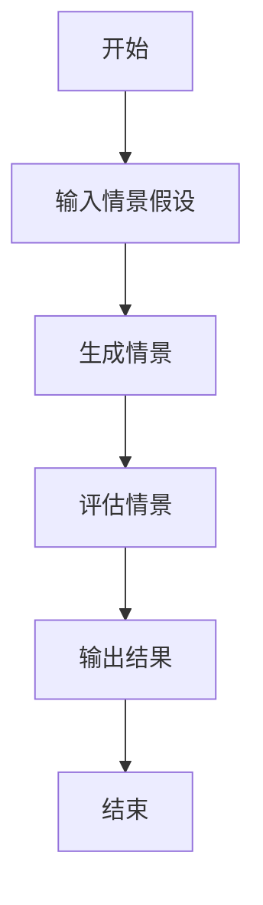

                 


# 企业估值中的情景分析技巧

## 关键词：情景分析、企业估值、风险管理、金融建模、蒙特卡洛模拟、贝叶斯分析

## 摘要：  
企业估值是金融领域的重要任务之一，而情景分析是评估企业价值时不可或缺的工具。本文将详细介绍情景分析在企业估值中的应用，包括其理论基础、核心方法、实际案例以及系统设计。通过分析不同情景对企业价值的影响，帮助读者掌握如何利用情景分析优化企业估值过程。

---

## 第一部分: 企业估值中的情景分析基础

## 第1章: 情景分析的定义与作用

### 1.1 情景分析的定义
#### 1.1.1 什么是情景分析
情景分析是一种通过假设不同情景（如经济环境变化、市场波动等）来评估企业或资产未来表现的方法。它帮助企业预测在不同假设条件下，企业价值的变化情况。

#### 1.1.2 情景分析的作用与意义
- **风险评估**：通过分析不同情景下的企业价值，识别潜在风险。
- **决策支持**：帮助企业制定更稳健的财务和战略决策。
- **估值优化**：通过比较不同情景，找到最优估值方案。

#### 1.1.3 情景分析与企业估值的关系
情景分析是企业估值的重要工具，通过设定不同情景，可以更全面地评估企业价值。

### 1.2 情景分析的分类
#### 1.2.1 历史情景分析
基于历史数据，分析企业过去的表现，预测未来趋势。

#### 1.2.2 假设情景分析
基于假设条件（如政策变化、技术进步等），评估企业价值的变化。

#### 1.2.3 预测情景分析
结合市场预测和专家意见，评估企业在未来不同情景下的表现。

### 1.3 情景分析的核心要素
#### 1.3.1 情景假设的设定
- 明确情景的假设条件，如经济增长率、利率变化等。
- 设定情景的权重，反映不同情景的可能性。

#### 1.3.2 数据来源与处理
- 数据来源：历史数据、市场预测、行业报告等。
- 数据处理：清洗、归一化、标准化等。

#### 1.3.3 模型构建与应用
- 构建情景分析模型，将不同情景与企业估值相结合。
- 应用模型进行模拟，分析不同情景下的企业价值。

### 1.4 情景分析在企业估值中的应用
#### 1.4.1 企业估值的基本框架
- 企业估值的基本方法：现金流折现法、可比公司法等。
- 情景分析在估值中的作用：通过不同情景模拟，优化估值结果。

#### 1.4.2 情景分析与企业战略的关系
- 情景分析帮助企业制定灵活的战略。
- 不同情景下的战略选择对估值的影响。

### 1.5 本章小结
本章介绍了情景分析的定义、分类和核心要素，并探讨了情景分析在企业估值中的应用。

---

## 第2章: 情景分析的理论基础

### 2.1 情景分析的理论模型
#### 2.1.1 三阶段模型
- 第一阶段：设定情景假设。
- 第二阶段：构建模型。
- 第三阶段：分析结果。

#### 2.1.2 四阶段模型
- 在三阶段基础上增加风险评估和优化阶段。

#### 2.1.3 概率树模型
- 通过概率树分析不同情景的可能性和影响。

### 2.2 情景分析的数学基础
#### 2.2.1 随机变量与概率分布
- 随机变量的定义：反映不确定性。
- 概率分布的应用：评估不同情景的概率。

#### 2.2.2 蒙特卡洛模拟
- 蒙特卡洛模拟的原理：通过多次模拟，评估不同情景下的企业价值。
- 模拟步骤：设定参数、生成随机数、计算结果、统计分析。

#### 2.2.3 贝叶斯定理
- 贝叶斯定理的应用：基于先验概率，更新后验概率。
- 在情景分析中的应用：根据新数据调整情景概率。

### 2.3 情景分析的算法原理
#### 2.3.1 情景生成算法
- 基于历史数据生成情景。
- 基于假设条件生成情景。

#### 2.3.2 情景评估算法
- 计算情景对企业价值的影响。
- 比较不同情景下的估值结果。

#### 2.3.3 情景优化算法
- 优化情景参数，提高估值准确性。
- 调整情景权重，反映不同情景的重要性。

### 2.4 本章小结
本章详细介绍了情景分析的理论模型和数学基础，为后续应用提供了理论支持。

---

## 第3章: 情景分析在企业估值中的应用

### 3.1 企业估值的基本方法
#### 3.1.1 现金流折现法
- 现金流折现法的原理：将未来现金流折现为现值。
- 情景分析的应用：通过不同情景下的现金流预测，计算企业价值。

#### 3.1.2 可比公司法
- 可比公司法的原理：通过比较可比公司的估值，确定目标公司的价值。
- 情景分析的应用：分析不同情景下可比公司的表现，调整目标公司估值。

#### 3.1.3 股权自由现金流法
- 股权自由现金流法的原理：计算企业股权部分的自由现金流，折现为股权价值。
- 情景分析的应用：通过不同情景下的现金流预测，计算股权价值。

### 3.2 情景分析在估值模型中的应用
#### 3.2.1 情景假设的设定
- 设定不同情景的假设条件，如经济指标、行业趋势等。
- 确定情景的权重，反映不同情景的可能性。

#### 3.2.2 情景分析对估值的影响
- 不同情景对企业价值的影响：通过模拟不同情景，分析企业价值的变化。
- 情景分析对估值误差的控制：通过比较不同情景，优化估值结果。

#### 3.2.3 情景分析的结果解读
- 解读不同情景下的估值结果。
- 提出基于情景分析的估值建议。

### 3.3 情景分析与企业价值的关系
#### 3.3.1 不同情景对企业价值的影响
- 经济繁荣情景下，企业价值上升。
- 经济衰退情景下，企业价值下降。
- 不同行业情景下，企业价值的变化趋势。

#### 3.3.2 情景分析对估值误差的控制
- 通过情景分析，识别潜在风险，减少估值误差。
- 情景分析在估值过程中的优化作用。

#### 3.3.3 情景分析在风险评估中的作用
- 通过情景分析，评估不同风险对企业价值的影响。
- 提出风险管理策略，降低企业风险。

### 3.4 本章小结
本章探讨了情景分析在企业估值中的具体应用，分析了不同情景对企业价值的影响，并提出了优化估值的建议。

---

## 第4章: 情景分析的系统设计

### 4.1 情景分析系统的功能模块
#### 4.1.1 数据输入模块
- 数据输入界面：用户输入情景假设、市场数据等。
- 数据处理功能：清洗、归一化、标准化。

#### 4.1.2 情景生成模块
- 基于历史数据生成情景。
- 基于假设条件生成情景。

#### 4.1.3 情景评估模块
- 计算不同情景下的企业价值。
- 比较不同情景下的估值结果。

#### 4.1.4 结果输出模块
- 输出情景分析报告。
- 可视化展示情景对企业价值的影响。

### 4.2 情景分析系统的架构设计
#### 4.2.1 系统功能设计
- 系统功能模块图：展示各模块之间的关系。
- 系统交互流程图：展示用户与系统之间的交互流程。

#### 4.2.2 系统架构设计
- 分层架构：数据层、业务逻辑层、用户界面层。
- 模块化设计：各模块独立开发，便于维护和扩展。

#### 4.2.3 系统接口设计
- API接口：提供外部调用功能。
- 数据接口：与数据库或其他系统的数据接口。

### 4.3 情景分析系统的实现
#### 4.3.1 系统实现的代码示例
```python
def generate_scenario():
    # 生成情景
    return scenario

def evaluate_scenario(scenario):
    # 评估情景
    return value
```

#### 4.3.2 系统实现的流程图


### 4.4 本章小结
本章详细介绍了情景分析系统的功能模块、架构设计和实现过程，为实际应用提供了技术支持。

---

## 第5章: 情景分析的项目实战

### 5.1 项目背景与目标
- 项目背景：某企业需要进行估值，希望通过情景分析优化估值结果。
- 项目目标：利用情景分析，评估不同情景对企业价值的影响。

### 5.2 数据收集与处理
- 数据来源：历史财务数据、市场预测、行业报告等。
- 数据处理：清洗、归一化、标准化。

### 5.3 情景分析模型的构建
- 情景假设的设定：如经济增长率、利率变化等。
- 模型构建：现金流折现法、可比公司法等。

### 5.4 情景分析的实现
- 编写代码：实现情景生成、评估等功能。
- 调试优化：确保模型运行稳定。

### 5.5 案例分析与结果解读
- 不同情景下的估值结果：如乐观情景、中性情景、悲观情景。
- 情景分析对企业决策的建议：如调整财务策略、优化业务模式等。

### 5.6 本章小结
本章通过实际案例，详细展示了情景分析在项目中的应用过程，为读者提供了实践参考。

---

## 第6章: 情景分析的最佳实践

### 6.1 情景分析中的注意事项
- 情景假设的合理性：确保假设条件符合实际。
- 数据的准确性：数据来源可靠，处理得当。
- 模型的适用性：选择合适的模型，避免过度复杂。

### 6.2 情景分析的未来发展趋势
- 技术进步：人工智能、大数据等技术的应用，提升情景分析的效率和准确性。
- 方法创新：不断优化情景分析的方法，适应新的市场需求。

### 6.3 情景分析中的风险管理
- 识别潜在风险：通过情景分析，识别可能影响企业价值的风险因素。
- 制定风险管理策略：如分散投资、建立应急基金等。

### 6.4 本章小结
本章总结了情景分析的应用经验和未来发展趋势，为读者提供了实践指导。

---

## 作者信息

作者：AI天才研究院/AI Genius Institute & 禅与计算机程序设计艺术 /Zen And The Art of Computer Programming

---

以上是《企业估值中的情景分析技巧》的技术博客文章的完整目录大纲和内容。文章详细介绍了情景分析在企业估值中的理论基础、应用方法和实际案例，帮助读者全面掌握情景分析技巧，并将其应用于实际工作中。

