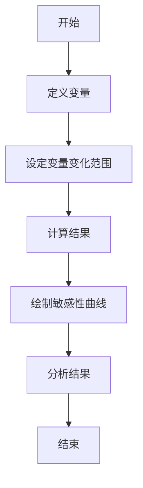

                 


# 《企业估值中的敏感性分析技巧》

---

## 关键词：企业估值、敏感性分析、风险管理、数据建模、决策优化、技术分析

---

## 摘要：  
在企业估值过程中，敏感性分析是一种关键的技术工具，用于评估关键变量对整体估值的影响。本文系统地介绍了敏感性分析的核心概念、数学模型、应用场景以及实际案例。通过逐步分析，读者将学会如何利用敏感性分析优化决策，降低风险，并提升企业估值的准确性。

---

## 第一部分: 企业估值与敏感性分析基础

---

## 第1章: 敏感性分析的背景与概念

---

### ## 1.1 企业估值中的问题背景

#### ### 1.1.1 企业估值的核心挑战

企业估值是商业决策中的核心问题，涉及对企业未来现金流、市场风险、财务状况等多方面的评估。然而，估值过程中存在诸多不确定性，例如：

- **数据的不确定性**：财务数据可能存在误差或不完整。
- **模型的假设**：估值模型依赖于假设（如增长率、折现率等），这些假设可能不准确。
- **市场波动**：宏观经济和行业波动会影响企业价值。

#### ### 1.1.2 问题描述与解决方法

敏感性分析是一种系统性方法，用于评估关键变量对企业估值的影响。通过分析变量的变化对估值结果的影响程度，可以帮助决策者识别关键风险点并制定应对策略。

#### ### 1.1.3 敏感性分析的边界与外延

- **边界**：敏感性分析仅关注变量变化对估值的影响，不考虑变量之间的相互作用。
- **外延**：敏感性分析可以与概率分析结合，提供更全面的风险评估。

---

#### ### ## 1.2 敏感性分析的基本原理

#### ### 1.2.1 敏感性分析的数学模型

敏感性分析的核心是通过改变输入变量，观察输出结果的变化。常用的方法包括：

1. **线性回归模型**：假设输出与输入变量呈线性关系。
2. **方差分析模型**：通过变量变化对企业估值的方差贡献进行评估。

#### ### 1.2.2 敏感性分析的适用场景

- 适用于数据有限、模型简单的情况。
- 适用于需要快速评估变量影响的场景。

#### ### 1.2.3 敏感性分析与其他分析方法的对比

| 分析方法 | 描述 | 优点 | 缺点 |
|----------|------|------|------|
| 确定性分析 | 假设变量固定 | 简单 | 忽略不确定性 |
| 概率分析 | 考虑变量概率分布 | 更精确 | 计算复杂 |
| 敏感性分析 | 分析变量影响 | 直观 | 忽略变量相关性 |

---

#### ### ## 1.3 敏感性分析在企业估值中的应用

#### ### 1.3.1 企业估值中的关键变量识别

识别关键变量是敏感性分析的第一步，例如：

- 营收增长率
- 毛利率
- 折现率

#### ### 1.3.2 敏感性分析对企业决策的影响

通过分析关键变量的影响，企业可以：

- 优化财务策略
- 制定风险管理措施
- 调整估值模型假设

#### ### 1.3.3 实际案例中的敏感性分析应用

以某科技公司为例，通过敏感性分析发现，折现率的变化对估值的影响最大，因此在决策中需特别关注利率波动。

---

## 第二部分: 敏感性分析的核心概念与联系

---

## 第2章: 敏感性分析的核心概念

---

### ## 2.1 敏感性分析的数学模型

#### ### 2.1.1 线性回归模型

线性回归模型假设输出与输入变量呈线性关系，公式为：

$$ y = \beta_0 + \beta_1 x_1 + \beta_2 x_2 + \ldots + \beta_n x_n $$

其中，$y$ 是输出，$x_i$ 是输入变量，$\beta_i$ 是回归系数。

#### ### 2.1.2 方差分析模型

方差分析模型通过变量变化对企业估值的方差贡献进行评估，公式为：

$$ \text{方差贡献率} = \frac{\text{变量变化对总方差的贡献}}{\text{总方差}} $$

---

#### ### ## 2.2 敏感性分析的属性特征对比

| 属性 | 确定性分析 | 概率分析 | 敏感性分析 |
|------|------------|----------|------------|
| 数据要求 | 固定值 | 概率分布 | 变化范围 |
| 计算复杂度 | 低 | 高 | 中等 |
| 输出 | 单一结果 | 概率分布 | 影响程度 |

---

#### ### ## 2.3 实体关系图与流程图

#### 实体关系图（ER图）：

```mermaid
er
    股东 <-- 管理层 : 依赖
    管理层 --> 估值模型 : 输入假设
    估值模型 --> 投资者 : 输出结果
```

#### 流程图：



---

## 作者：AI天才研究院/AI Genius Institute & 禅与计算机程序设计艺术 /Zen And The Art of Computer Programming

