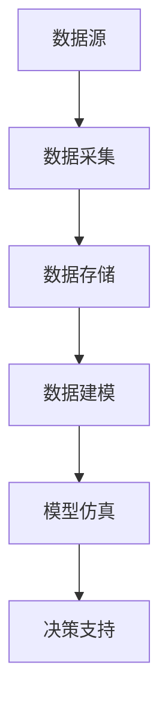

                 


# 企业估值中的数字孪生城市项目评估

> 关键词：数字孪生城市，企业估值，项目评估，大数据，人工智能，系统架构设计

> 摘要：数字孪生城市作为现代城市规划和管理的重要技术手段，其在企业估值中的应用日益广泛。本文从数字孪生城市的背景与概念出发，深入探讨其核心原理、算法与系统架构设计，结合实际案例分析，详细阐述数字孪生城市项目评估的流程与方法。通过本文，读者将能够全面理解数字孪生城市在企业估值中的价值，并掌握如何利用该技术进行高效的项目评估。

---

# 第一部分: 数字孪生城市项目评估背景与基础

## 第1章: 数字孪生城市的背景与概念

### 1.1 数字孪生城市的核心概念

数字孪生城市（Digital Twin City）是指通过数字化技术，将真实城市中的基础设施、交通、环境、人口等要素进行数字化建模，并在虚拟空间中构建一个与真实城市高度一致的数字模型。这种技术能够实时反映真实城市的动态变化，并支持数据驱动的决策分析。

#### 1.1.1 数字孪生城市的核心概念

- **数据驱动**：数字孪生城市依赖于实时数据的采集与分析，能够动态反映城市运行状态。
- **虚拟与现实的映射**：数字孪生城市通过建模技术，将现实世界中的城市要素映射到虚拟空间中。
- **实时仿真**：通过数据驱动的仿真模型，数字孪生城市能够模拟城市在不同条件下的运行状态。

#### 1.1.2 数字孪生城市与传统城市规划的对比

| 对比维度 | 数字孪生城市 | 传统城市规划 |
|----------|--------------|---------------|
| 数据来源 | 实时数据采集 | 历史数据与假设 |
| 模型更新 | 动态更新 | 静态模型 |
| 决策支持 | 数据驱动 | 专家经验主导 |

#### 1.1.3 数字孪生城市的应用价值

- **提高决策效率**：通过实时数据分析，数字孪生城市能够快速提供决策支持。
- **降低成本**：通过虚拟仿真，可以提前预测和优化城市规划方案。
- **提升城市管理能力**：数字孪生城市能够帮助城市管理者更好地应对突发事件。

### 1.2 数字孪生城市的技术基础

数字孪生城市的核心技术包括大数据、人工智能和物联网等。

#### 1.2.1 大数据技术在数字孪生中的应用

- **数据采集**：通过传感器、摄像头等设备采集城市运行数据。
- **数据存储**：使用分布式数据库存储海量城市数据。
- **数据分析**：利用大数据分析技术，提取有价值的城市运行特征。

#### 1.2.2 人工智能技术在数字孪生中的应用

- **模型训练**：利用机器学习算法训练数字孪生城市的仿真模型。
- **预测与优化**：通过AI技术预测城市未来发展状态，并优化城市规划方案。

#### 1.2.3 物联网技术在数字孪生中的应用

- **实时感知**：通过物联网设备感知城市运行的实时状态。
- **智能控制**：利用物联网技术实现城市设施的智能控制。

### 1.3 数字孪生城市在企业估值中的意义

#### 1.3.1 数字孪生城市对企业估值的影响

- **提升估值准确性**：数字孪生城市能够提供更精确的城市运行数据，帮助企业更准确地评估项目价值。
- **降低估值风险**：通过虚拟仿真，企业可以提前预测项目可能面临的风险，从而降低估值误差。

#### 1.3.2 数字孪生城市在项目评估中的作用

- **项目选址优化**：通过数字孪生模型，企业可以优化项目选址，降低投资风险。
- **项目收益预测**：利用数字孪生模型，企业可以预测项目的未来收益。

#### 1.3.3 数字孪生城市与企业战略的关系

- **战略规划支持**：数字孪生城市能够帮助企业制定更科学的城市发展战略。
- **资源配置优化**：通过数字孪生模型，企业可以优化资源配置，提高投资效率。

---

## 第2章: 数字孪生城市的核心概念与联系

### 2.1 数字孪生城市的核心要素

#### 2.1.1 数据采集与处理

- **数据采集**：通过传感器、摄像头等设备采集城市运行数据。
- **数据清洗**：对采集到的原始数据进行去噪和归一化处理。
- **数据建模**：利用数据分析技术，构建城市运行的数学模型。

#### 2.1.2 模型构建与仿真

- **模型构建**：基于数据构建数字孪生城市的仿真模型。
- **模型仿真**：通过仿真模型预测城市未来运行状态。

#### 2.1.3 评估指标与分析

- **评估指标**：包括经济指标、社会指标、环境指标等。
- **指标分析**：通过对指标的分析，评估项目的可行性和收益潜力。

#### 2.1.4 数据驱动的决策支持

- **数据可视化**：通过可视化技术，将数据以直观的方式呈现给决策者。
- **决策支持**：基于数据驱动的分析结果，提供决策支持。

### 2.2 数字孪生城市的核心原理

#### 2.2.1 数据流图分析



#### 2.2.2 数字孪生模型的构建过程

1. **数据采集**：通过传感器、摄像头等设备采集城市运行数据。
2. **数据建模**：利用数据分析技术，构建城市运行的数学模型。
3. **模型仿真**：通过仿真模型预测城市未来运行状态。
4. **数据可视化**：将数据以直观的方式呈现给决策者。

#### 2.2.3 数据驱动的决策支持

- **数据可视化**：通过图表、仪表盘等形式展示数据。
- **决策支持**：基于数据驱动的分析结果，提供决策支持。

### 2.3 数字孪生城市与企业估值的关系

#### 2.3.1 数字孪生城市在企业估值中的应用场景

- **项目选址优化**：通过数字孪生模型，优化项目选址，降低投资风险。
- **项目收益预测**：利用数字孪生模型，预测项目的未来收益。

#### 2.3.2 数字孪生城市对企业价值的影响

- **提升企业竞争力**：通过数字孪生技术，企业能够更科学地进行城市规划和项目评估。
- **降低企业投资风险**：通过数字孪生模型，企业可以提前预测项目可能面临的风险。

#### 2.3.3 数字孪生城市在项目评估中的具体作用

- **项目选址优化**：通过数字孪生模型，优化项目选址，降低投资风险。
- **项目收益预测**：利用数字孪生模型，预测项目的未来收益。

---

## 第3章: 数字孪生城市项目评估的核心方法

### 3.1 数据驱动的项目评估方法

#### 3.1.1 数据采集与处理

- **数据采集**：通过传感器、摄像头等设备采集城市运行数据。
- **数据清洗**：对采集到的原始数据进行去噪和归一化处理。
- **数据建模**：利用数据分析技术，构建城市运行的数学模型。

#### 3.1.2 数据建模与分析

- **数据建模**：基于数据构建数字孪生城市的仿真模型。
- **数据分析**：通过对数据的分析，评估项目的可行性和收益潜力。

#### 3.1.3 数据可视化与决策支持

- **数据可视化**：通过图表、仪表盘等形式展示数据。
- **决策支持**：基于数据驱动的分析结果，提供决策支持。

### 3.2 数字孪生城市项目评估的流程

#### 3.2.1 项目需求分析

- **需求识别**：识别项目的目标和需求。
- **需求分析**：分析需求的可行性和实现方式。

#### 3.2.2 数据建模与仿真

- **数据建模**：基于数据构建数字孪生城市的仿真模型。
- **模型仿真**：通过仿真模型预测城市未来运行状态。

#### 3.2.3 评估结果分析与优化

- **结果分析**：通过对仿真结果的分析，评估项目的可行性和收益潜力。
- **优化调整**：根据分析结果，优化项目方案。

### 3.3 数字孪生城市项目评估的数学模型

#### 3.3.1 数据流图分析模型


#### 3.3.2 项目评估的数学公式

$$
\text{项目价值} = \text{收益} - \text{成本}
$$

$$
\text{收益} = \sum_{i=1}^{n} r_i \times p_i
$$

$$
\text{成本} = \sum_{j=1}^{m} c_j \times q_j
$$

其中，$r_i$ 是收益，$p_i$ 是概率，$c_j$ 是成本，$q_j$ 是数量。

#### 3.3.3 数学模型的实现与优化

- **模型实现**：通过编程语言（如Python）实现数学模型。
- **模型优化**：通过调整参数，优化模型的性能和准确性。

---

## 第4章: 数字孪生城市项目评估的系统架构设计

### 4.1 系统功能设计

#### 4.1.1 数据采集模块

- **功能描述**：通过传感器、摄像头等设备采集城市运行数据。
- **实现方式**：使用物联网技术实现数据采集。

#### 4.1.2 数据建模模块

- **功能描述**：基于数据构建数字孪生城市的仿真模型。
- **实现方式**：使用机器学习算法训练模型。

#### 4.1.3 数据分析模块

- **功能描述**：通过对数据的分析，评估项目的可行性和收益潜力。
- **实现方式**：使用大数据分析技术进行数据处理。

### 4.2 系统架构设计

#### 4.2.1 系统架构图


#### 4.2.2 系统接口设计

- **数据接口**：提供API接口，供其他系统调用数据。
- **用户接口**：提供可视化界面，供用户进行数据查询和分析。

#### 4.2.3 系统交互流程

1. 用户通过可视化界面提交数据查询请求。
2. 系统通过API接口获取数据。
3. 数据经过处理后，返回分析结果。
4. 用户通过可视化界面查看分析结果。

---

## 第5章: 数字孪生城市项目评估的项目实战

### 5.1 环境安装

- **操作系统**：建议使用Linux系统。
- **开发工具**：安装Python、Jupyter Notebook等开发工具。
- **依赖库安装**：安装numpy、pandas、matplotlib等数据处理库。

### 5.2 核心代码实现

```python
import numpy as np
import pandas as pd
import matplotlib.pyplot as plt

# 数据加载
data = pd.read_csv('city_data.csv')

# 数据清洗
data.dropna(inplace=True)

# 数据建模
model = np.polyfit(data['x'], data['y'], 1)

# 模型仿真
def predict(x):
    return model[0] * x + model[1]

# 可视化
plt.scatter(data['x'], data['y'])
plt.plot(data['x'], predict(data['x']), color='red')
plt.show()
```

### 5.3 案例分析与解读

- **案例背景**：某城市计划建设一个新的商业区。
- **数据采集**：采集该区域的交通流量、人口密度等数据。
- **数据建模**：基于数据构建数字孪生模型，预测商业区的未来收益。
- **结果分析**：通过模型仿真，评估项目的可行性和收益潜力。

### 5.4 项目小结

- **项目成果**：成功构建数字孪生模型，预测项目收益。
- **经验总结**：数据质量对模型准确性的影响至关重要。
- **未来优化方向**：进一步优化模型，提高预测精度。

---

## 第6章: 数字孪生城市项目评估的总结与展望

### 6.1 总结

数字孪生城市作为现代城市规划和管理的重要技术手段，其在企业估值中的应用具有重要意义。通过数字孪生技术，企业能够更科学地进行城市规划和项目评估，提高决策效率，降低成本，提升企业竞争力。

### 6.2 展望

随着大数据、人工智能等技术的不断发展，数字孪生城市在企业估值中的应用将更加广泛和深入。未来，数字孪生城市将与更多的企业应用场景相结合，为企业提供更强大的决策支持。

---

## 作者

作者：AI天才研究院 & 禅与计算机程序设计艺术

---

通过本文，读者可以全面了解数字孪生城市在企业估值中的应用，掌握数字孪生城市项目评估的核心方法和系统架构设计。希望本文能够为从事企业估值和城市规划的读者提供有价值的参考和指导。

