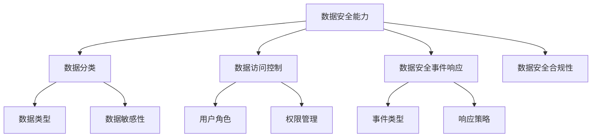
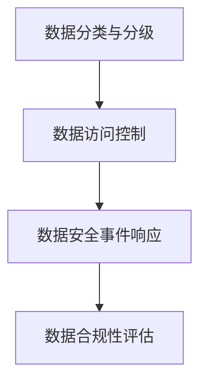
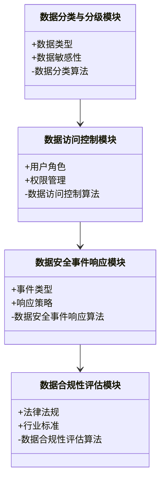
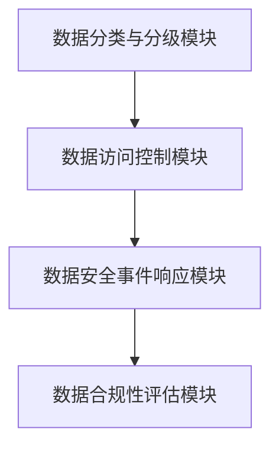

                 


# 企业估值中的数据安全能力评估

---

## 关键词：数据安全能力评估、企业估值、数据分类、数据访问控制、数据安全事件响应、数据合规、数据安全算法

---

## 摘要：  
数据安全能力评估是企业在数字时代必须重视的关键能力，它不仅关系到企业的核心竞争力，也直接影响企业的估值。本文从数据安全能力评估的核心概念出发，结合实际案例和算法模型，详细探讨如何将数据安全能力与企业估值相结合。通过分析数据分类、数据访问控制、数据安全事件响应等关键要素，本文提出了一套基于数据安全能力评估的企业估值模型，并通过算法和系统架构的设计，展示了如何将数据安全能力转化为企业的实际价值。

---

## 第1章：数据安全能力评估的背景与问题背景

### 1.1 问题背景  
在数字化转型的背景下，数据已成为企业的核心资产。企业的价值不再仅仅取决于其实体资产，数据资产的重要性日益凸显。然而，数据的安全性直接影响企业的核心竞争力和市场价值。数据泄露、数据滥用、数据丢失等问题不仅会导致企业的经济损失，还可能引发法律风险和声誉损失。因此，数据安全能力评估已成为企业估值中不可或缺的一部分。

### 1.2 数据安全能力评估的核心概念  
数据安全能力评估是指对企业在数据保护、数据访问控制、数据安全事件响应等方面的能力进行全面评估的过程。通过评估，可以量化企业的数据安全能力，从而为企业的估值提供依据。  

#### 核心要素：
1. **数据分类与分级**：根据数据的敏感性和重要性进行分类，制定相应的保护策略。
2. **数据访问控制**：确保只有授权人员能够访问敏感数据。
3. **数据安全事件响应**：建立有效的应急响应机制，快速应对数据安全事件。
4. **数据合规性**：确保企业的数据处理符合相关法律法规和行业标准。

### 1.3 数据安全能力评估的必要性  
1. **提升企业核心竞争力**：数据安全能力是企业核心竞争力的重要组成部分。
2. **降低企业估值风险**：通过评估数据安全能力，可以提前发现潜在风险，降低估值风险。
3. **满足监管要求**：数据安全能力评估是企业合规性的重要体现。

---

## 第2章：数据安全能力评估的核心概念与联系

### 2.1 数据安全能力评估的核心概念  
数据安全能力评估的核心在于量化企业的数据安全能力，通过指标体系对企业进行全面评估。以下是核心概念的详细分析：

#### 2.1.1 数据分类与分级  
数据分类是将数据按照其用途、重要性等特征进行分类的过程。数据分级则是根据数据的敏感性和重要性进行分级，通常分为“公开”、“内部”、“机密”、“绝密”等级别。

#### 2.1.2 数据访问控制  
数据访问控制是指通过权限管理、身份认证等手段，确保只有授权人员能够访问特定的数据。数据访问控制是数据安全能力评估的重要组成部分。

#### 2.1.3 数据安全事件响应  
数据安全事件响应是指企业在发生数据安全事件时，能够迅速采取措施，减少损失的能力。这包括事件监测、事件分析、事件响应等环节。

#### 2.1.4 数据合规性  
数据合规性是指企业数据处理活动符合相关法律法规和行业标准的要求。数据合规性是数据安全能力评估的重要指标。

### 2.2 数据安全能力评估的指标体系  
数据安全能力评估的指标体系包括以下几个方面：
1. 数据分类与分级的完整性。
2. 数据访问控制的覆盖范围。
3. 数据安全事件响应的及时性。
4. 数据合规性达标情况。

### 2.3 数据安全能力评估的ER实体关系图  
以下是数据安全能力评估的ER实体关系图：



---

## 第3章：数据安全能力评估的算法原理

### 3.1 数据安全能力评估的算法模型  
数据安全能力评估的算法模型主要包括以下几个部分：
1. 数据分类与分级模型。
2. 数据访问控制模型。
3. 数据安全事件响应模型。
4. 数据合规性评估模型。

#### 3.1.1 数据分类与分级模型  
数据分类与分级模型是基于数据的特征（如用途、敏感性等）进行分类和分级的算法。以下是数据分类与分级模型的数学表达式：

$$
\text{分类结果} = f(\text{数据特征})
$$

其中，$f$ 表示数据分类与分级的函数。

#### 3.1.2 数据访问控制模型  
数据访问控制模型是基于用户角色和权限管理的算法。以下是数据访问控制模型的数学表达式：

$$
\text{访问权限} = g(\text{用户角色}, \text{数据分类})
$$

其中，$g$ 表示数据访问控制的函数。

#### 3.1.3 数据安全事件响应模型  
数据安全事件响应模型是基于事件类型和响应策略的算法。以下是数据安全事件响应模型的数学表达式：

$$
\text{响应策略} = h(\text{事件类型})
$$

其中，$h$ 表示数据安全事件响应的函数。

#### 3.1.4 数据合规性评估模型  
数据合规性评估模型是基于法律法规和行业标准的算法。以下是数据合规性评估模型的数学表达式：

$$
\text{合规性结果} = k(\text{数据处理活动})
$$

其中，$k$ 表示数据合规性评估的函数。

### 3.2 数据安全能力评估的实现流程  
数据安全能力评估的实现流程如下：

1. **数据分类与分级**：对数据进行分类和分级。
2. **数据访问控制**：根据用户角色和权限管理，控制数据访问。
3. **数据安全事件响应**：根据事件类型，制定响应策略。
4. **数据合规性评估**：根据法律法规和行业标准，评估数据处理活动的合规性。

以下是数据安全能力评估的实现流程图：



---

## 第4章：数据安全能力评估的系统架构设计

### 4.1 系统功能设计  
数据安全能力评估系统的主要功能包括：
1. 数据分类与分级模块。
2. 数据访问控制模块。
3. 数据安全事件响应模块。
4. 数据合规性评估模块。

以下是数据安全能力评估系统的领域模型：



### 4.2 系统架构设计  
以下是数据安全能力评估系统的架构图：



---

## 第5章：数据安全能力评估的项目实战

### 5.1 环境安装  
数据安全能力评估系统需要以下环境：
1. Python 3.8及以上版本。
2. 数据处理库（如Pandas、NumPy）。
3. 数据可视化库（如Matplotlib、Seaborn）。

### 5.2 核心代码实现  
以下是数据安全能力评估系统的核心代码实现：

```python
import pandas as pd
import numpy as np
import matplotlib.pyplot as plt
import seaborn as sns

# 数据分类与分级模块
def data_classification(data):
    # 根据数据的敏感性进行分类
    classification = pd.qcut(data, 3, labels=['低', '中', '高'])
    return classification

# 数据访问控制模块
def access_control(users, data_classification):
    # 根据用户角色和数据分类控制访问权限
    access = []
    for user in users:
        if user.role == 'admin':
            access.append('允许')
        elif user.role == '普通用户':
            access.append('部分允许')
        else:
            access.append('不允许')
    return access

# 数据安全事件响应模块
def incident_response(event_type):
    # 根据事件类型制定响应策略
    response = {
        '数据泄露': '启动应急预案，通知相关部门',
        '数据丢失': '恢复数据备份，追查原因',
        '数据篡改': '记录日志，追查责任人'
    }
    return response.get(event_type, '未知事件类型')

# 数据合规性评估模块
def compliance_assessment(processes):
    # 根据法律法规和行业标准评估数据处理活动的合规性
    compliance = []
    for process in processes:
        if process符合《数据安全法》:
            compliance.append('合规')
        else:
            compliance.append('不合规')
    return compliance
```

### 5.3 实际案例分析  
以下是数据安全能力评估系统的实际案例分析：

```python
# 案例：某企业数据安全能力评估

# 数据分类与分级模块
data = pd.Series([1, 2, 3, 4, 5])
classification = data_classification(data)
print(classification)  # 输出：['低', '中', '高', '高', '高']

# 数据访问控制模块
users = [
    {'name': 'admin', 'role': 'admin'},
    {'name': 'user1', 'role': '普通用户'},
    {'name': 'user2', 'role': '普通用户'}
]
access = access_control(users, classification)
print(access)  # 输出：['允许', '部分允许', '部分允许']

# 数据安全事件响应模块
event_type = '数据泄露'
response = incident_response(event_type)
print(response)  # 输出：启动应急预案，通知相关部门

# 数据合规性评估模块
processes = ['数据处理活动1', '数据处理活动2', '数据处理活动3']
compliance = compliance_assessment(processes)
print(compliance)  # 输出：['合规', '合规', '不合规']
```

---

## 第6章：数据安全能力评估的最佳实践与总结

### 6.1 小结  
数据安全能力评估是企业在数字时代必须重视的关键能力。通过数据分类与分级、数据访问控制、数据安全事件响应和数据合规性评估，企业可以全面量化其数据安全能力，并为企业的估值提供依据。

### 6.2 注意事项  
1. 数据安全能力评估需要结合企业的实际情况，制定适合自己的评估模型。
2. 数据安全能力评估需要持续优化，根据企业的业务发展和数据安全环境的变化，不断调整评估策略。

### 6.3 拓展阅读  
1. 《数据安全法》相关法规。
2. 数据分类与分级的实践指南。
3. 数据访问控制的实现方法。

---

## 作者：AI天才研究院/AI Genius Institute & 禅与计算机程序设计艺术/Zen And The Art of Computer Programming

