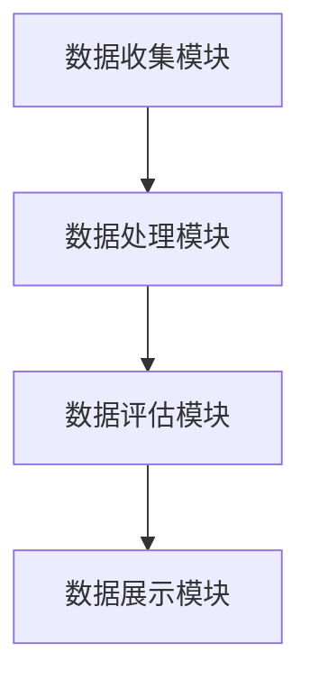

                 


# 企业估值中的数据隐私保护能力评估

## 关键词：企业估值，数据隐私，数据安全，隐私保护，数据分类

## 摘要：本文深入探讨了数据隐私保护能力评估在企业估值中的重要性。通过分析数据隐私保护的核心概念、评估方法和算法原理，结合实际案例和系统架构设计，为企业提供一套全面的数据隐私保护能力评估体系，帮助企业在数字化时代中实现价值最大化。

---

## 第一章：数据隐私保护能力评估的背景与意义

### 1.1 数据隐私保护的重要性

#### 1.1.1 数字化时代的隐私挑战
- 数据成为核心资产，隐私保护需求日益增长。
- 数字化转型中，数据泄露风险增加。
- 隐私保护不仅是合规要求，更是企业信任的基石。

#### 1.1.2 数据隐私保护的法律与合规要求
- GDPR、CCPA等法规对企业数据隐私的要求。
- 数据隐私保护的合规性对企业运营的影响。

#### 1.1.3 数据隐私保护对企业估值的影响
- 数据隐私能力直接影响企业市场价值。
- 数据隐私问题可能导致企业估值下降或损失。

### 1.2 企业估值中的数据隐私问题

#### 1.2.1 数据隐私对企业价值的影响
- 数据隐私能力影响企业信用和市场形象。
- 数据隐私问题可能导致企业面临法律风险和财务损失。

#### 1.2.2 数据隐私风险对企业估值的潜在威胁
- 数据泄露事件对企业估值的负面影响。
- 数据隐私问题可能导致客户信任下降，进而影响企业收入和利润。

#### 1.2.3 数据隐私保护能力评估的必要性
- 通过评估数据隐私保护能力，帮助企业识别和 mitigate 风险。
- 评估数据隐私能力，提升企业估值和市场竞争力。

### 1.3 数据隐私保护能力评估的核心概念

#### 1.3.1 数据隐私保护能力的定义
- 数据隐私保护能力是指企业在收集、存储、处理和使用数据的过程中，保护数据隐私的能力。
- 包括数据分类、访问控制、加密、脱敏等技术手段。

#### 1.3.2 数据隐私保护能力的评估维度
- 数据分类与分级：根据数据的重要性进行分类，制定相应的保护措施。
- 数据访问控制：确保只有授权人员可以访问敏感数据。
- 数据加密与脱敏：通过加密和脱敏技术保护数据不被未经授权的访问。
- 数据生命周期管理：从数据生成到销毁的全生命周期管理。

#### 1.3.3 数据隐私保护能力与企业估值的关系
- 数据隐私保护能力越强，企业估值越高。
- 数据隐私保护能力是企业市场竞争力的重要组成部分。

### 1.4 本章小结
本章通过分析数据隐私保护的重要性、企业估值中的数据隐私问题，以及数据隐私保护能力评估的核心概念，为后续的评估方法和实践提供了理论基础。

---

## 第二章：数据隐私保护能力评估的核心概念

### 2.1 数据隐私保护能力的构成要素

#### 2.1.1 数据分类与分级
- 数据分类：根据数据的类型、用途和敏感程度进行分类。
- 数据分级：将数据分为不同级别，制定不同的保护措施。

#### 2.1.2 数据访问控制
- 访问控制策略：基于角色的访问控制（RBAC）和基于属性的访问控制（ABAC）。
- 最小权限原则：确保用户只能访问其职责所需的最小权限。

#### 2.1.3 数据加密与脱敏
- 数据加密：对敏感数据进行加密，防止未经授权的访问。
- 数据脱敏：对敏感数据进行匿名化处理，确保数据在使用过程中无法还原原始数据。

#### 2.1.4 数据生命周期管理
- 数据生成：确保数据在生成时符合隐私保护要求。
- 数据存储：采用安全存储技术，防止数据泄露。
- 数据处理：确保数据处理过程中的隐私保护。
- 数据销毁：安全销毁数据，防止数据被还原。

### 2.2 数据隐私保护能力的评估指标

#### 2.2.1 数据安全策略的完善性
- 数据安全策略的全面性：是否覆盖数据全生命周期管理。
- 数据安全策略的可操作性：是否能够有效指导数据保护工作。

#### 2.2.2 数据访问权限的合理性
- 访问权限的最小化原则：用户是否有不必要的访问权限。
- 权限审计：定期审计用户权限，确保权限的合理性和合规性。

#### 2.2.3 数据加密技术的先进性
- 加密算法的强度：是否采用先进的加密算法，如AES-256。
- 加密密钥管理：是否采用安全的密钥管理方式，如密钥加密。

#### 2.2.4 数据隐私保护的合规性
- 是否符合相关法律法规要求。
- 是否通过第三方认证，如ISO 27001。

### 2.3 数据隐私保护能力与企业估值的关系

#### 2.3.1 数据隐私保护能力对企业信用的影响
- 强大的数据隐私保护能力提升企业信用。
- 数据隐私问题可能导致企业信用下降。

#### 2.3.2 数据隐私保护能力对企业市场价值的影响
- 数据隐私能力越强，企业市场价值越高。
- 数据隐私问题可能导致企业市场价值下降。

#### 2.3.3 数据隐私保护能力对企业长期发展的支持
- 数据隐私能力是企业长期发展的核心竞争力。
- 数据隐私保护能力提升企业品牌价值和客户信任。

### 2.4 本章小结
本章详细分析了数据隐私保护能力的构成要素和评估指标，并探讨了其与企业估值的关系，为后续的评估方法和实践提供了理论依据。

---

## 第三章：数据隐私保护能力评估的算法原理与数学模型

### 3.1 数据隐私保护能力评估的数学模型

#### 3.1.1 数据隐私保护能力的量化方法
- 数据隐私保护能力的评分方法：基于多维度评估指标的加权评分。
- 数据隐私保护能力的量化公式：
$$ \text{评分} = \sum_{i=1}^{n} (\text{指标}_i \times \text{权重}_i) $$

#### 3.1.2 数据隐私保护能力的评分标准
- 评分标准的制定：基于数据隐私保护能力的评估指标和权重。
- 评分等级的划分：如A、B、C、D、E五级评分。

#### 3.1.3 数据隐私保护能力的综合评估模型
- 综合评估模型的构建：将多个评估指标综合考虑，得出综合评分。
- 综合评分的计算公式：
$$ \text{综合评分} = \sum_{i=1}^{n} (\text{指标}_i \times \text{权重}_i) $$

### 3.2 数据隐私保护能力评估的算法流程

#### 3.2.1 数据收集与预处理
- 数据收集：收集企业的数据隐私保护相关数据。
- 数据预处理：清洗、转换和标准化数据。

#### 3.2.2 数据特征提取
- 数据特征提取方法：基于统计分析和机器学习的特征提取。
- 数据特征的选择：选择对数据隐私保护能力影响较大的特征。

#### 3.2.3 数据隐私风险评估
- 数据隐私风险的计算：基于特征的加权计算。
- 数据隐私风险的分类：高、中、低风险分类。

#### 3.2.4 数据隐私保护能力评分
- 数据隐私保护能力评分：基于风险评估结果，得出评分。
- 数据隐私保护能力评分的解释：评分越高，数据隐私保护能力越强。

### 3.3 数据隐私保护能力评估的数学公式

#### 3.3.1 数据隐私保护能力的评分公式
$$ \text{评分} = \frac{\sum_{i=1}^{n} (\text{符合项数}_i \times \text{权重}_i)}{\sum_{i=1}^{n} \text{权重}_i} \times 100 $$

#### 3.3.2 数据隐私风险的计算公式
$$ \text{风险} = \sum_{i=1}^{n} (\text{风险因素}_i \times \text{权重}_i) $$

### 3.4 本章小结
本章通过数学模型和算法流程，详细讲解了数据隐私保护能力评估的原理和方法，为实际应用提供了理论支持。

---

## 第四章：数据隐私保护能力评估的系统架构设计

### 4.1 系统架构设计概述

#### 4.1.1 系统功能模块
- 数据收集模块：负责收集企业的数据隐私保护相关数据。
- 数据处理模块：对收集到的数据进行清洗、转换和标准化。
- 数据评估模块：基于数学模型进行数据隐私保护能力评估。
- 数据展示模块：将评估结果以图表形式展示。

#### 4.1.2 系统架构设计
- 分层架构：数据采集层、数据处理层、数据评估层和数据展示层。
- 模块化设计：每个功能模块独立开发，便于维护和升级。

#### 4.1.3 系统接口设计
- 数据接口：与企业数据源对接，获取数据。
- 评估接口：与第三方评估机构对接，获取评估结果。
- 展示接口：与企业内部系统对接，展示评估结果。

### 4.2 系统功能设计

#### 4.2.1 数据分类与分级模块
- 数据分类：根据数据类型和敏感程度进行分类。
- 数据分级：制定数据分级标准，进行分级管理。

#### 4.2.2 数据访问控制模块
- 访问控制策略：基于角色的访问控制（RBAC）和基于属性的访问控制（ABAC）。
- 权限管理：用户权限的分配、修改和审计。

#### 4.2.3 数据加密与脱敏模块
- 数据加密：采用AES-256等加密算法，对敏感数据进行加密。
- 数据脱敏：采用匿名化技术，对敏感数据进行脱敏处理。

#### 4.2.4 数据生命周期管理模块
- 数据生成：确保数据在生成时符合隐私保护要求。
- 数据存储：采用安全存储技术，防止数据泄露。
- 数据处理：确保数据处理过程中的隐私保护。
- 数据销毁：安全销毁数据，防止数据被还原。

### 4.3 系统架构设计图



### 4.4 本章小结
本章通过系统架构设计，详细讲解了数据隐私保护能力评估系统的功能模块和系统架构，为实际应用提供了设计依据。

---

## 第五章：数据隐私保护能力评估的项目实战

### 5.1 项目背景与目标

#### 5.1.1 项目背景
- 某企业面临数据隐私保护能力评估的需求。
- 通过评估数据隐私保护能力，提升企业估值。

#### 5.1.2 项目目标
- 评估企业的数据隐私保护能力。
- 提出改进建议，提升数据隐私保护能力。

### 5.2 项目实施步骤

#### 5.2.1 数据收集与预处理
- 收集企业的数据隐私保护相关数据。
- 数据清洗和标准化处理。

#### 5.2.2 数据特征提取
- 选择对数据隐私保护能力影响较大的特征。
- 数据特征的提取和处理。

#### 5.2.3 数据隐私风险评估
- 基于数学模型进行数据隐私风险评估。
- 数据隐私风险的分类和分析。

#### 5.2.4 数据隐私保护能力评分
- 计算数据隐私保护能力评分。
- 评分结果的解释和分析。

### 5.3 系统核心实现源代码

#### 5.3.1 数据收集模块
```python
def collect_data():
    # 数据收集代码
    pass
```

#### 5.3.2 数据处理模块
```python
def process_data(data):
    # 数据处理代码
    pass
```

#### 5.3.3 数据评估模块
```python
def evaluate_data(data):
    # 数据评估代码
    pass
```

#### 5.3.4 数据展示模块
```python
def display_results(results):
    # 数据展示代码
    pass
```

### 5.4 代码应用解读与分析

#### 5.4.1 数据收集模块
- 数据收集模块负责从企业内部系统中收集数据隐私保护相关数据。
- 数据收集模块需要确保数据的完整性和准确性。

#### 5.4.2 数据处理模块
- 数据处理模块对收集到的数据进行清洗、转换和标准化处理。
- 数据处理模块需要确保数据的一致性和规范性。

#### 5.4.3 数据评估模块
- 数据评估模块基于数学模型对数据隐私保护能力进行评估。
- 数据评估模块需要确保评估结果的准确性和可解释性。

#### 5.4.4 数据展示模块
- 数据展示模块将评估结果以图表形式展示，便于企业理解和分析。
- 数据展示模块需要确保结果的直观性和用户友好性。

### 5.5 实际案例分析和详细讲解剖析

#### 5.5.1 案例背景
- 某企业面临数据隐私保护能力评估的需求。
- 通过评估数据隐私保护能力，提升企业估值。

#### 5.5.2 案例分析
- 数据隐私保护能力评估结果：企业数据隐私保护能力得分为75分。
- 评估结果分析：企业在数据分类与分级、数据访问控制等方面存在不足。
- 改进建议：加强数据分类与分级管理，优化数据访问控制策略。

### 5.6 项目小结
本章通过项目实战，详细讲解了数据隐私保护能力评估的实施步骤和系统实现，为企业提供了实际的操作指南。

---

## 第六章：数据隐私保护能力评估的最佳实践与注意事项

### 6.1 最佳实践

#### 6.1.1 数据隐私保护能力评估的注意事项
- 数据隐私保护能力评估需要结合企业的实际情况。
- 数据隐私保护能力评估需要定期进行，确保评估结果的及时性和准确性。

#### 6.1.2 数据隐私保护能力评估的优化建议
- 加强数据分类与分级管理。
- 优化数据访问控制策略。
- 提升数据加密与脱敏技术水平。
- 定期进行数据隐私保护能力评估。

### 6.2 数据隐私保护能力评估的小结

#### 6.2.1 数据隐私保护能力评估的重要性
- 数据隐私保护能力评估是企业估值的重要组成部分。
- 数据隐私保护能力评估是企业风险管理的重要工具。

#### 6.2.2 数据隐私保护能力评估的未来发展趋势
- 数据隐私保护能力评估将更加注重数据的动态管理。
- 数据隐私保护能力评估将更加智能化和自动化。

### 6.3 注意事项

#### 6.3.1 数据隐私保护能力评估的实施风险
- 数据隐私保护能力评估可能面临数据泄露风险。
- 数据隐私保护能力评估可能面临数据处理的合规性风险。

#### 6.3.2 数据隐私保护能力评估的应对措施
- 加强数据隐私保护能力评估过程中的风险管理。
- 确保数据隐私保护能力评估的合规性。

### 6.4 拓展阅读

#### 6.4.1 数据隐私保护的国际法规
- GDPR（通用数据保护条例）
- CCPA（加利福尼亚消费者隐私法案）

#### 6.4.2 数据隐私保护的技术发展
- 隐私计算（Privacy Computing）
- 零知识证明（Zero-Knowledge Proof）

### 6.5 本章小结
本章总结了数据隐私保护能力评估的最佳实践和注意事项，为企业提供了实际操作的参考。

---

## 作者：AI天才研究院/AI Genius Institute & 禅与计算机程序设计艺术 /Zen And The Art of Computer Programming

---

以上是一个详细的《企业估值中的数据隐私保护能力评估》的技术博客文章大纲。

