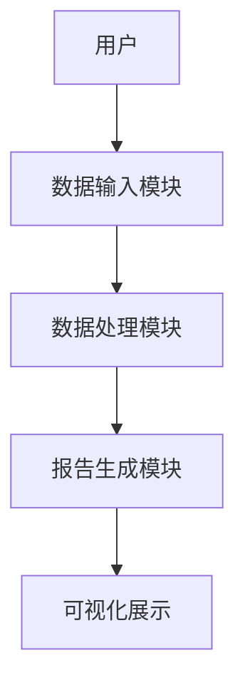

                 


# 《企业估值中的杜邦分析法》

## 关键词：
杜邦分析法, 企业估值, 净资产收益率, 财务分析, 投资评估

## 摘要：
杜邦分析法是一种经典的财务分析方法，通过分解净资产收益率（ROE）来评估企业的财务表现和价值。本文详细介绍了杜邦分析法的核心概念、分解步骤、关键指标分析、实际应用案例以及系统架构设计。通过理论与实践相结合，帮助读者掌握杜邦分析法在企业估值中的应用，提升财务分析和投资决策能力。

---

## 第一章: 引言

### 1.1 企业估值的重要性
企业估值是评估企业价值的关键步骤，影响投资决策、融资和并购等重要商业活动。杜邦分析法作为一种高效的财务分析工具，能够帮助投资者深入理解企业的财务健康状况。

### 1.2 杜邦分析法的背景
杜邦分析法由杜邦公司于1924年开发，最初用于评估企业的财务表现。通过分解ROE，杜邦分析法揭示了企业盈利能力和资本结构之间的关系，成为企业估值的重要工具。

### 1.3 本书的目标
本篇文章旨在通过详细讲解杜邦分析法的原理、应用和实际案例，帮助读者掌握这一方法在企业估值中的应用，提升财务分析能力。

---

## 第二章: 杜邦分析法的基础理论

### 2.1 杜邦分析法的定义
杜邦分析法通过分解ROE，揭示企业盈利能力、资产周转率和资本结构之间的关系。ROE = 净利率 × 资产周转率 × 权益乘数。

### 2.2 ROE的三步分解法
1. 净利率：净利润 / 营业收入
2. 资产周转率：营业收入 / 总资产
3. 权益乘数：总资产 / 股东权益

### 2.3 杜邦分析法与企业估值的关系
杜邦分析法帮助企业识别影响ROE的关键因素，进而优化资本结构和运营效率，提升企业价值。

---

## 第三章: 杜邦分析法的核心分析

### 3.1 净利率分析
净利率反映了企业的盈利效率。通过分析净利率，可以评估企业的成本控制和销售效率。

#### 净利率计算公式：
$$ \text{净利率} = \frac{\text{净利润}}{\text{营业收入}} $$

### 3.2 资产周转率分析
资产周转率衡量企业利用资产创造收入的能力。高资产周转率表明企业资产使用效率高。

#### 资产周转率计算公式：
$$ \text{资产周转率} = \frac{\text{营业收入}}{\text{总资产}} $$

### 3.3 权益乘数分析
权益乘数反映企业的杠杆程度。高权益乘数意味着企业使用更多负债，风险较高。

#### 权益乘数计算公式：
$$ \text{权益乘数} = \frac{\text{总资产}}{\text{股东权益}} $$

---

## 第四章: 杜邦分析法的实际应用

### 4.1 制造业企业的应用
以某制造企业为例，通过杜邦分析法计算其ROE，并分解净利率、资产周转率和权益乘数，分析企业的财务表现。

### 4.2 科技企业的应用
科技企业通常资产周转率较低，但净利率较高。通过杜邦分析法，可以评估科技企业的盈利能力和资本结构。

---

## 第五章: 系统分析与架构设计

### 5.1 系统功能设计
- 数据输入：企业财务数据
- 数据处理：计算ROE、净利率、资产周转率和权益乘数
- 结果展示：可视化报告

#### 系统功能模块图：


### 5.2 系统架构设计
采用分层架构，包括数据层、业务逻辑层和表示层，确保系统的高效和可扩展性。

#### 系统架构图：


---

## 第六章: 项目实战

### 6.1 环境安装
安装必要的财务分析工具和编程环境，如Python和Pandas库。

### 6.2 代码实现
编写Python代码，计算杜邦分析法的各项指标。

#### 代码示例：
```python
import pandas as pd

# 输入数据
data = {
    '净利润': [100],
    '营业收入': [500],
    '总资产': [1000],
    '股东权益': [500]
}

df = pd.DataFrame(data)

# 计算指标
net_margin = df['净利润'] / df['营业收入']
asset_turnover = df['营业收入'] / df['总资产']
equity_multiplier = df['总资产'] / df['股东权益']
roe = net_margin * asset_turnover * equity_multiplier

print(f"净利率: {net_margin.values[0]}")
print(f"资产周转率: {asset_turnover.values[0]}")
print(f"权益乘数: {equity_multiplier.values[0]}")
print(f"ROE: {roe.values[0]}")
```

### 6.3 案例分析
以某制造企业为例，分析其杜邦指标，并提出优化建议。

---

## 第七章: 总结与展望

### 7.1 总结
杜邦分析法通过分解ROE，帮助企业识别关键财务指标，优化资本结构和运营效率，提升企业价值。

### 7.2 未来展望
随着大数据和人工智能的发展，杜邦分析法将与新技术结合，为企业估值提供更精准的分析工具。

---

## 附录

### A. 术语表
- 净资产收益率（ROE）：净利润 / 股东权益
- 净利率：净利润 / 营业收入
- 资产周转率：营业收入 / 总资产
- 权益乘数：总资产 / 股东权益

### B. 工具推荐
- Python编程语言
- Pandas库
- Matplotlib可视化库

### C. 参考文献
1. 葛家澍. 《财务报表分析》
2. 罗伯特·卡普兰. 《管理会计》

---

## 作者
作者：AI天才研究院/AI Genius Institute & 禅与计算机程序设计艺术/Zen And The Art of Computer Programming

