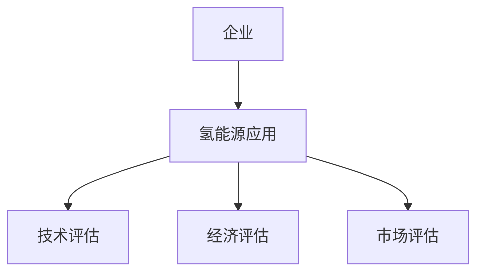
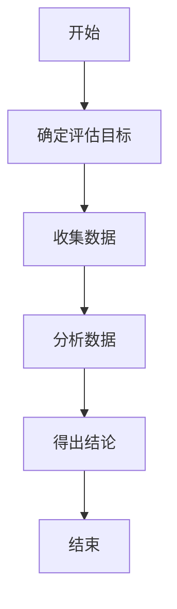
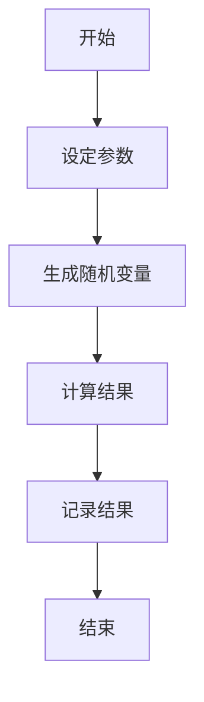
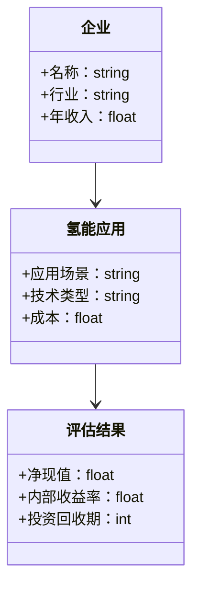
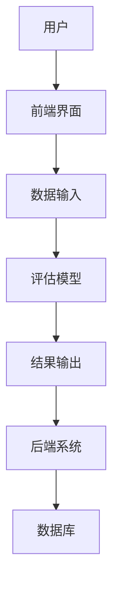

                 


# 企业估值中的氢能源应用评估

> 关键词：氢能源、企业估值、净现值法、氢能应用、技术评估

> 摘要：随着全球能源结构转型的推进，氢能源作为一种清洁、高效、可持续的能源载体，正在逐步成为企业估值中的重要考量因素。本文从氢能源的基本概念、应用场景、评估方法等多个维度展开，系统性地分析了氢能源在企业估值中的核心作用，并通过实际案例展示了如何将氢能源应用评估融入企业价值分析体系中。

---

## 第一部分: 氢能源的基本概念与重要性

### 第1章: 氢能源的基本概念与重要性

#### 1.1 氢能源的基本概念
氢能源是一种以氢气（H₂）为载体的能源形式，通过氢的氧化反应释放能量。氢气可以通过多种方式获取和储存，主要包括电解水制氢、天然气 reforming 制氢、生物制氢等。氢能源具有清洁、高效、可储存和可运输的特点，被视为实现碳中和目标的重要能源载体。

#### 1.2 氢能源在企业估值中的重要性
氢能源的应用正在逐步改变企业的生产模式和商业模式。企业通过引入氢能源技术，可以降低能源成本、减少碳排放，同时提升产品竞争力。因此，在企业估值中，评估氢能源的应用潜力和经济性变得尤为重要。

#### 1.3 氢能与传统能源的对比
与传统化石能源相比，氢能源具有以下优势：
- 清洁性：氢能燃烧只产生水，无碳排放。
- 高效性：氢能的能量密度高，适合长距离运输和大规模储存。
- 可持续性：氢能可以通过可再生能源制取，实现低碳甚至零碳排放。

然而，氢能源也面临一些挑战，如制氢成本高、储存和运输难度大等。

### 第2章: 氢能源在企业中的应用场景

#### 2.1 工业领域
氢能源在工业领域的主要应用包括：
- **化工行业**：用于生产氨、甲醇等化学品。
- **钢铁行业**：用于炼钢过程中的还原剂。
- **电子行业**：用于半导体制造中的清洗和蚀刻工艺。

#### 2.2 交通领域
氢能源在交通领域的应用主要集中在燃料电池汽车（FCEV）上。与传统燃油车和电动车相比，FCEV具有加氢时间短、续航里程长的优势，特别适合长途运输和公共交通领域。

#### 2.3 能源储存与电网
氢能源可以作为可再生能源（如风能、太阳能）的储能介质，通过电解水制氢技术将多余的电能转化为氢能储存，再在需要时通过燃料电池将氢能转化为电能。

---

## 第二部分: 氢能源应用评估的核心概念与联系

### 第3章: 氢能源应用评估的核心概念

#### 3.1 评估的定义与范围
氢能源应用评估是指对企业在生产过程中引入或扩大氢能源使用规模的可行性、经济性和环境效益进行系统性分析。评估的范围包括技术可行性、经济可行性和市场可行性三个方面。

#### 3.2 评估的主要指标
- **技术可行性**：包括制氢技术的成熟度、设备可靠性、工艺复杂性等。
- **经济可行性**：包括初始投资成本、运营成本、能源价格波动等。
- **环境效益**：包括碳排放减少量、环境外部性成本等。

#### 3.3 评估的流程与方法
氢能源应用评估的流程通常包括以下几个步骤：
1. 确定评估目标。
2. 收集相关数据。
3. 建立数学模型。
4. 进行模拟计算。
5. 得出结论并提出建议。

### 第4章: 核心概念的联系与对比

#### 4.1 氢能与其他能源的对比
以下是氢能与其他能源的对比分析：

| **能源类型** | **优点** | **缺点** | **适用场景** |
|--------------|----------|----------|--------------|
| 氢能         | 清洁、高效、可储存 | 制造成本高、储存难度大 | 工业、交通、能源储存 |
| 石油         | 能量密度高、应用广泛 | 碳排放高、不可再生 | 传统交通、工业 |
| 太阳能       | 可再生、分布广泛 | 间歇性、能量密度低 | 建筑、小型发电 |

#### 4.2 氢能应用评估的实体关系图
以下是氢能源应用评估的实体关系图：



#### 4.3 氢能应用评估的流程图
以下是氢能应用评估的流程图：



---

## 第三部分: 氢能源应用评估的算法原理

### 第5章: 氢能应用评估的数学模型

#### 5.1 净现值法（Net Present Value, NPV）
净现值法是一种常用的财务评估方法，用于衡量项目投资的经济可行性。公式如下：

$$ NPV = \sum_{t=1}^{n} \frac{CF_t}{(1 + r)^t} $$

其中：
- \( CF_t \) 是第 \( t \) 年的现金流。
- \( r \) 是折现率。

以下是用 Python 实现净现值法的代码示例：

```python
def calculate_npv(cash_flows, discount_rate):
    npv = 0
    for t, cf in enumerate(cash_flows):
        npv += cf / (1 + discount_rate) ** t
    return npv

# 示例数据
cash_flows = [100, 200, 300, 400]
discount_rate = 0.1

npv = calculate_npv(cash_flows, discount_rate)
print(f"净现值为：{npv}")
```

#### 5.2 蒙特卡洛模拟
蒙特卡洛模拟是一种用于评估不确定性的概率方法，适用于氢能源项目中成本、市场需求等变量的不确定性分析。以下是蒙特卡洛模拟的流程图：



---

## 第四部分: 系统分析与架构设计

### 第6章: 氢能应用评估系统的功能设计

#### 6.1 领域模型
以下是氢能应用评估系统的领域模型：



#### 6.2 系统架构设计
以下是氢能应用评估系统的架构图：



---

## 第五部分: 项目实战

### 第7章: 氢能公交车投资评估案例

#### 7.1 环境安装
安装 Python 和必要的库（如 numpy、pandas、scipy）。

#### 7.2 核心代码实现
以下是氢能公交车投资评估的代码实现：

```python
import numpy as np

# 输入参数
initial_investment = 500000  # 初始投资（美元）
annual_revenue = 200000     # 年收入（美元）
annual_cost = 80000         # 年成本（美元）
discount_rate = 0.1         # 折现率
period = 5                   # 评估周期（年）

# 净现值计算
npv = 0
for t in range(period):
    cf = annual_revenue - annual_cost
    npv += cf / (1 + discount_rate) ** t

print(f"净现值为：{npv}")
```

#### 7.3 案例分析与解读
以上代码计算了氢能公交车项目的净现值，结果为正，说明该项目具有经济可行性。

---

## 第六部分: 最佳实践与小结

### 第8章: 最佳实践

#### 8.1 关键点总结
- 在企业估值中，氢能源的应用潜力和经济性是核心考量因素。
- 净现值法是常用的评估方法，但需要结合实际情况调整参数。
- 氢能技术的不确定性和市场需求的波动性需要通过蒙特卡洛模拟等方法进行风险分析。

#### 8.2 小结
氢能源作为清洁、高效、可持续的能源载体，正在逐步改变企业的生产模式和商业模式。通过科学的评估方法，企业可以更好地把握氢能源应用的机遇和挑战，实现可持续发展。

---

## 作者：AI天才研究院/AI Genius Institute & 禅与计算机程序设计艺术/Zen And The Art of Computer Programming

---

通过以上详细的技术博客文章，我们系统性地探讨了氢能源在企业估值中的应用评估，从背景介绍到实际案例分析，帮助读者全面理解氢能源在企业价值分析中的重要性。

