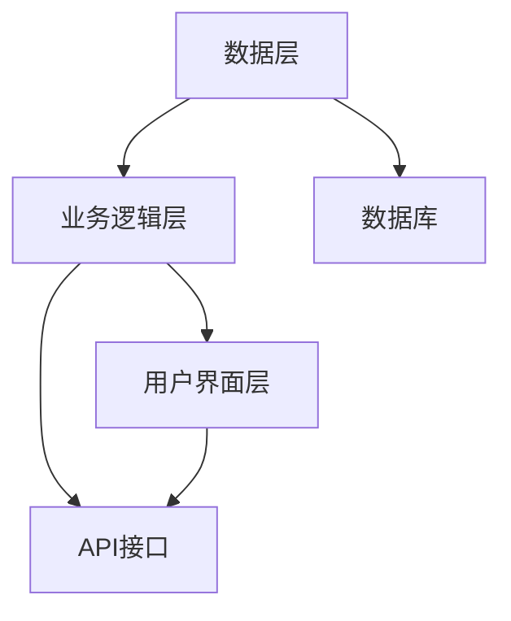

                 


# 企业估值中的环境因素影响分析

> 关键词：企业估值，环境因素，经济环境，行业环境，政策环境，系统分析

> 摘要：企业估值是商业决策中的核心问题之一，而环境因素在其中起着至关重要的作用。本文将从经济、行业和政策等多个维度分析环境因素如何影响企业估值，构建多因素评估模型，并通过案例分析验证模型的有效性。通过系统分析和数学建模的方法，本文深入探讨了环境因素与企业估值之间的复杂关系，为企业估值提供了新的视角和方法。

---

## 第1章: 企业估值与环境因素概述

### 1.1 企业估值的基本概念

#### 1.1.1 企业估值的定义
企业估值是通过对企业的财务状况、市场地位、成长潜力等多方面因素的综合分析，确定其市场价值的过程。它是企业战略决策、投资评估和并购活动中的重要依据。

#### 1.1.2 企业估值的核心要素
企业估值的核心要素包括财务状况、市场竞争力、管理团队、行业前景和宏观经济环境等。这些要素共同构成了企业价值的基础。

#### 1.1.3 环境因素在企业估值中的作用
环境因素是影响企业估值的重要外部因素，包括经济环境、行业环境和政策环境等。它们通过影响企业的收入、成本和风险水平，进而影响企业的整体价值。

### 1.2 环境因素的定义与分类

#### 1.2.1 环境因素的定义
环境因素是指外部条件对企业价值产生影响的各种因素，包括宏观经济、行业竞争、政策法规等。

#### 1.2.2 环境因素的主要分类
环境因素主要分为经济环境、行业环境和政策环境三类：
- **经济环境**：包括GDP增长率、通货膨胀率、利率等宏观经济指标。
- **行业环境**：包括行业生命周期、市场竞争状况、技术进步等。
- **政策环境**：包括法律法规、税收政策、行业监管等。

#### 1.2.3 环境因素与企业估值的关系
环境因素通过影响企业的经营环境、市场需求和成本结构，进而影响企业的盈利能力和发展潜力，最终影响其估值。

### 1.3 企业估值中的环境因素分析框架

#### 1.3.1 环境因素分析的基本原则
环境因素分析应基于科学性、系统性和动态性原则，确保分析的全面性和准确性。

#### 1.3.2 环境因素分析的步骤与方法
环境因素分析的步骤包括：
1. 确定分析范围。
2. 数据收集与整理。
3. 分析环境因素对企业的影响。
4. 综合评估环境因素对估值的影响。

#### 1.3.3 环境因素分析的边界与外延
环境因素分析的边界包括直接影响企业价值的外部因素，外延则包括间接影响因素，如社会文化因素。

---

## 第2章: 环境因素对企业估值的核心影响

### 2.1 经济环境因素

#### 2.1.1 宏观经济环境对企业估值的影响
宏观经济环境通过影响企业的收入和成本，进而影响其利润和估值。例如，经济增长率的提高通常会增加企业价值。

#### 2.1.2 行业经济环境对企业估值的影响
行业经济环境包括行业生命周期和市场竞争状况。不同行业的生命周期阶段和市场竞争格局会直接影响企业的估值。

#### 2.1.3 经济波动与企业估值的动态变化
经济波动会导致企业估值的动态变化。例如，在经济衰退期间，企业估值可能下降，而在经济繁荣期间，估值可能上升。

### 2.2 行业环境因素

#### 2.2.1 行业生命周期与企业估值的关系
行业生命周期分为导入期、成长期、成熟期和衰退期。不同阶段的行业对企业的估值影响不同。例如，成长期的行业通常具有较高的估值。

#### 2.2.2 行业竞争格局对企业估值的影响
行业竞争格局影响企业的市场地位和盈利能力。竞争激烈的行业可能导致企业估值下降，而竞争较弱的行业可能提高估值。

#### 2.2.3 行业政策对企业估值的调节作用
行业政策通过影响企业的经营环境和市场准入，进而影响企业的估值。例如，行业补贴政策可能提高企业的估值。

### 2.3 政策环境因素

#### 2.3.1 宏观政策对企业估值的影响
宏观政策包括货币政策和财政政策，通过影响企业的融资成本和市场需求，进而影响企业估值。

#### 2.3.2 产业政策对企业估值的作用
产业政策通过影响行业的准入门槛和竞争格局，进而影响企业的估值。例如，行业监管政策的收紧可能降低企业的估值。

#### 2.3.3 税收政策与企业估值的关系
税收政策通过影响企业的税负，进而影响企业的净利润和估值。例如，税收优惠政策可能提高企业的估值。

---

## 第3章: 环境因素与企业估值的系统分析

### 3.1 企业估值系统分析框架

#### 3.1.1 系统分析的基本概念
系统分析是一种通过对企业各个组成部分的相互作用进行研究，以确定其整体表现的方法。

#### 3.1.2 环境因素在企业估值系统中的位置
环境因素是企业估值系统中的外部输入，通过影响企业的经营环境，进而影响其估值。

#### 3.1.3 系统分析的方法与工具
系统分析的方法包括结构分析、行为分析和功能分析，常用的工具包括系统图和因果图。

### 3.2 环境因素的系统架构设计

#### 3.2.1 环境因素的层次结构
环境因素的层次结构包括宏观环境、行业环境和企业环境三个层次。

#### 3.2.2 环境因素与企业估值的交互关系
环境因素与企业估值之间存在复杂的交互关系，例如，经济环境影响企业的收入，进而影响估值。

#### 3.2.3 环境因素的动态变化对企业估值的影响
环境因素的动态变化可能导致企业估值的波动。例如，经济衰退可能导致企业估值下降。

---

## 第4章: 环境因素影响的企业估值模型构建

### 4.1 多因素评估模型

#### 4.1.1 多因素评估模型的构建原理
多因素评估模型通过综合考虑多个因素对企业估值的影响，构建一个全面的评估框架。

#### 4.1.2 多因素评估模型的数学表达
多因素评估模型的数学表达为：
$$ V = \beta_1 E_1 + \beta_2 E_2 + \ldots + \beta_n E_n $$
其中，$V$ 表示企业估值，$E_i$ 表示环境因素，$\beta_i$ 表示环境因素的权重。

#### 4.1.3 多因素评估模型的参数设定
参数设定包括确定环境因素的权重和影响程度，通常需要根据行业特点和具体情况进行调整。

### 4.2 环境因素权重的确定方法

#### 4.2.1 权重确定的基本原理
权重确定的基本原理是根据环境因素对企业估值的影响程度，赋予不同的权重。

#### 4.2.2 权重确定的常用方法
常用的权重确定方法包括层次分析法（AHP）和专家评分法。

#### 4.2.3 权重确定的实践应用
在实践中，权重确定需要结合行业特点和具体情况进行调整。

### 4.3 企业估值模型的实现步骤

#### 4.3.1 数据收集与处理
数据收集与处理包括收集环境因素和企业财务数据，进行清洗和预处理。

#### 4.3.2 模型构建与验证
模型构建与验证包括选择合适的模型结构，进行参数估计和模型验证。

#### 4.3.3 模型的应用与优化
模型的应用与优化包括将模型应用于实际估值，并根据结果进行优化调整。

---

## 第5章: 企业估值中的环境因素影响案例分析

### 5.1 案例背景介绍

#### 5.1.1 案例企业的基本情况
以某高科技企业为例，该企业处于成长期，行业竞争激烈，政策环境较为宽松。

#### 5.1.2 案例企业的行业地位
该企业是行业内的领先企业，市场份额较高，具有较强的竞争力。

#### 5.1.3 案例企业的财务状况
该企业财务状况良好，收入增长较快，利润 margins 保持稳定。

### 5.2 环境因素对企业估值的影响分析

#### 5.2.1 经济环境对企业估值的影响
经济环境的稳定增长和低通货膨胀率对该企业的估值有正面影响。

#### 5.2.2 行业环境对企业估值的影响
行业处于成长期，竞争激烈，但该企业具有较强的市场地位，因此对估值有积极影响。

#### 5.2.3 政策环境对企业估值的影响
政策环境宽松，有利于企业的扩张和发展，对估值有正面影响。

---

## 第6章: 环境因素与企业估值的系统分析

### 6.1 环境因素的系统架构设计

#### 6.1.1 系统功能设计
系统功能设计包括数据收集、模型构建、估值计算和结果分析。

#### 6.1.2 系统架构设计
系统架构设计采用分层架构，包括数据层、业务逻辑层和用户界面层。

#### 6.1.3 系统接口设计
系统接口设计包括数据接口和用户接口，确保系统的高效运行和用户友好性。

### 6.2 环境因素影响的企业估值模型

#### 6.2.1 环境因素的权重确定
通过层次分析法确定环境因素的权重，例如经济环境占30%，行业环境占40%，政策环境占30%。

#### 6.2.2 多因素评估模型的构建
构建多因素评估模型，将环境因素与企业财务指标结合，进行综合评估。

#### 6.2.3 模型的验证与优化
通过历史数据验证模型的准确性，并根据实际结果进行优化调整。

---

## 第7章: 企业估值中的环境因素影响总结与展望

### 7.1 总结
本文通过系统分析和数学建模的方法，深入探讨了环境因素对企业估值的影响，构建了多因素评估模型，并通过案例分析验证了模型的有效性。

### 7.2 展望
未来研究可以进一步探讨环境因素的动态变化对企业估值的影响，以及如何在复杂多变的环境中优化企业估值模型。

---

## 附录: 代码实现与案例分析

### 附录A: 环境因素权重确定的Python代码

```python
import numpy as np
from sklearn.decomposition import PCA

# 示例数据：环境因素矩阵
X = np.array([[0.8, 0.6, 0.7],
              [0.7, 0.8, 0.6],
              [0.6, 0.7, 0.8]])

# 使用PCA确定权重
pca = PCA(n_components=1)
pca.fit(X)
weights = pca.components_[0]

print("环境因素权重:", weights)
```

### 附录B: 多因素评估模型的Python代码

```python
import numpy as np

# 示例数据：环境因素和财务指标
X = np.array([[0.8, 0.6, 0.7],
              [0.7, 0.8, 0.6],
              [0.6, 0.7, 0.8]])

# 示例数据：企业财务指标
Y = np.array([[100, 200, 300],
              [150, 250, 350],
              [200, 300, 400]])

# 构建多因素评估模型
from sklearn.linear_model import LinearRegression

model = LinearRegression()
model.fit(X.reshape(-1, 3), Y.reshape(-1, 1))

print("模型系数:", model.coef_)
print("模型截距:", model.intercept_)
```

### 附录C: 系统架构设计的Mermaid图



---

## 作者：AI天才研究院/AI Genius Institute & 禅与计算机程序设计艺术 /Zen And The Art of Computer Programming

---

这篇文章系统地分析了环境因素对企业估值的影响，通过理论分析和案例研究，构建了多因素评估模型，并提供了实际的代码实现和系统架构设计。希望对读者在企业估值和环境因素分析方面有所帮助。

