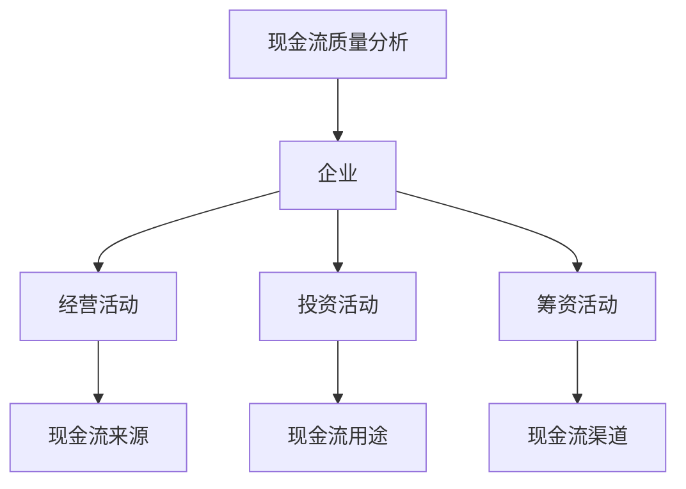
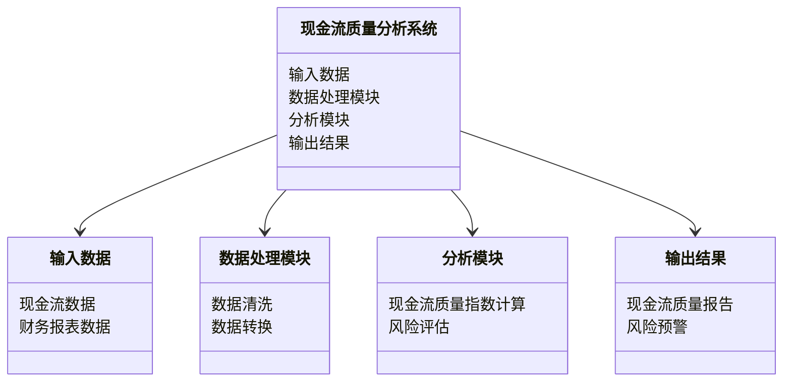

                 


# 《企业估值中的现金流质量分析》

---

## 关键词：
现金流质量分析、企业估值、财务健康度、现金流预测、财务风险

---

## 摘要：
现金流质量分析是企业估值中的核心环节，直接关系到企业的财务健康度和投资价值。本文从现金流质量分析的背景、核心概念、算法原理、系统架构到项目实战，全面解析现金流质量分析的关键要素和方法。通过数学模型、系统设计和实际案例分析，帮助读者掌握现金流质量分析的核心逻辑和应用场景，为企业的估值和风险管理提供有力支持。

---

## 正文：

### 第1章：现金流质量分析的背景与意义

#### 1.1 企业估值的核心要素
企业估值是投资者和企业管理者关注的核心问题之一。现金流作为企业的生命线，是企业价值评估的重要依据。现金流的质量直接影响企业的财务健康度和未来发展潜力。

**问题背景**：企业在经营过程中，现金流的流入和流出是衡量企业财务状况的核心指标。然而，许多企业在追求收入增长的同时，忽视了现金流的质量，导致企业陷入财务困境。

**问题描述**：现金流质量分析的核心在于识别现金流的真实性和可持续性。高质量的现金流意味着企业能够持续盈利并为未来发展提供资金支持。

**问题解决**：通过现金流质量分析，可以帮助企业在估值过程中更准确地评估其财务状况，识别潜在风险，并制定合理的财务策略。

**边界与外延**：现金流质量分析不仅关注当前的现金流状况，还包括对未来现金流的预测和管理。其外延涵盖了企业的整体财务健康度和市场环境的影响。

**概念结构与核心要素**：现金流质量分析包括现金流的来源、规模、时间和风险四个核心要素。通过分析这些要素，可以全面评估企业的现金流质量。

---

#### 1.2 现金流质量分析的背景
现金流质量分析的背景可以从经济环境、企业管理需求和投资者行为三个方面进行分析。

**经济环境**：经济周期波动、行业竞争格局和政策变化都会影响企业的现金流质量。例如，在经济下行周期，企业可能面临现金流减少的风险。

**企业管理需求**：企业需要通过现金流质量分析来优化财务管理，提高资金使用效率，并制定合理的投资决策。

**投资者行为**：投资者在评估企业价值时，高度关注现金流的质量。高质量的现金流意味着企业具有更强的偿债能力和盈利能力。

---

#### 1.3 现金流质量分析的核心要素
现金流质量分析的核心要素包括现金流的分类、质量指标和评估方法。

**现金流的分类**：
- **经营活动现金流**：反映企业日常经营的现金流情况。
- **投资活动现金流**：反映企业投资活动的现金流情况。
- **筹资活动现金流**：反映企业筹资活动的现金流情况。

**质量指标**：
- **现金流比率**：如经营活动现金流净额与净利润的比率。
- **现金流波动性**：现金流的稳定性和可预测性。
- **现金流增长性**：现金流的未来增长潜力。

**评估方法**：
- **定性分析**：通过对企业经营环境、管理团队和行业地位的分析，评估现金流质量。
- **定量分析**：通过财务指标和数学模型，量化现金流质量。

---

### 第2章：现金流质量分析的核心概念

#### 2.1 现金流质量的定义与属性
现金流质量是指企业在一定时期内现金流的真实性和可持续性。高质量的现金流意味着企业能够持续产生正向现金流，并且现金流的来源稳定、可预测。

**属性特征对比表**：

| 属性       | 高质量现金流       | 低质量现金流       |
|------------|--------------------|--------------------|
| 来源        | 经营活动为主        | 投资或筹资为主      |
| 稳定性      | 高                 | 低                 |
| 波动性       | 低                 | 高                 |
| 可持续性     | 高                 | 低                 |
| 风险        | 低                 | 高                 |

---

#### 2.2 现金流质量分析的实体关系图

以下是现金流质量分析的实体关系图（使用 Mermaid 流程图）：



---

### 第3章：现金流质量分析的数学模型与公式

#### 3.1 现金流质量分析的数学模型
现金流质量分析可以通过多种数学模型进行评估。以下是一个常用的加权平均模型：

$$ \text{现金流质量指数} = \sum_{i=1}^{n} w_i \cdot q_i $$

其中：
- \( w_i \) 是第 \( i \) 个指标的权重。
- \( q_i \) 是第 \( i \) 个指标的评分（通常为 1-5 分）。

#### 3.2 现金流质量分析的层次分析法（AHP）

层次分析法是一种常用的多准则决策分析方法。以下是其数学模型：

$$ \text{权重} = \frac{\sum_{j=1}^{n} a_{ij}}{\sum_{j=1}^{n} \sum_{i=1}^{n} a_{ij}}} $$

其中：
- \( a_{ij} \) 是第 \( i \) 个指标对第 \( j \) 个准则的权重。

---

### 第4章：现金流质量分析的系统架构与算法原理

#### 4.1 系统功能设计
以下是现金流质量分析系统的领域模型（使用 Mermaid 类图）：



---

### 第5章：项目实战

#### 5.1 环境安装
以下是现金流质量分析系统的环境安装说明：

```bash
# 安装Python和相关库
pip install numpy pandas scikit-learn matplotlib
```

---

#### 5.2 核心代码实现
以下是现金流质量分析的核心代码实现：

```python
import numpy as np
import pandas as pd
from sklearn.metrics import pairwise_distances

# 示例数据
data = {
    '经营活动现金流净额': [100, 80, 120, 90],
    '净利润': [80, 70, 90, 60],
    '非现金费用': [20, 15, 18, 12],
    '折旧与摊销': [15, 10, 20, 8]
}

df = pd.DataFrame(data)

# 计算现金流质量指数
def cash_flow_quality_index(row):
    return row['经营活动现金流净额'] / (row['净利润'] - row['非现金费用'] - row['折旧与摊销'])

df['现金流质量指数'] = df.apply(cash_flow_quality_index, axis=1)
print(df)
```

---

#### 5.3 案例分析
以某企业为例，分析其现金流质量指数：

```python
# 输入数据
data = {
    '经营活动现金流净额': [200, 150, 180, 160],
    '净利润': [150, 120, 140, 130],
    '非现金费用': [30, 25, 28, 22],
    '折旧与摊销': [20, 18, 22, 16]
}

df = pd.DataFrame(data)
# 计算现金流质量指数
df['现金流质量指数'] = df.apply(cash_flow_quality_index, axis=1)
print(df)
```

---

### 第6章：高级话题与拓展阅读

#### 6.1 现金流预测模型
现金流预测是现金流质量分析的重要延伸。以下是现金流预测的简单模型：

$$ \text{预测现金流} = \text{历史现金流} \times (1 + \text{增长率}) $$

---

#### 6.2 风险管理
现金流质量分析可以帮助企业识别潜在的财务风险，并制定相应的风险管理策略。

---

## 结语

现金流质量分析是企业估值中的核心环节，其重要性不容忽视。通过本文的详细讲解，读者可以掌握现金流质量分析的核心概念、算法原理和系统架构，并通过实际案例掌握其应用方法。未来，随着人工智能和大数据技术的不断发展，现金流质量分析将更加精准和智能化。

---

## 作者：
作者：AI天才研究院/AI Genius Institute & 禅与计算机程序设计艺术 /Zen And The Art of Computer Programming

