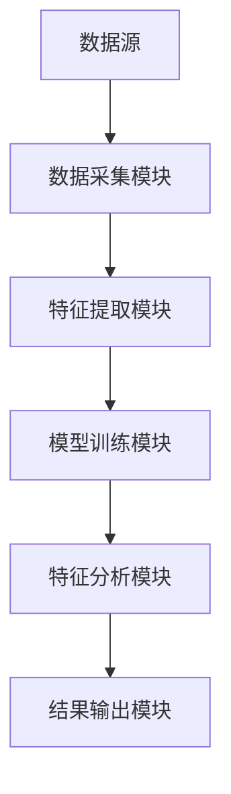

                 


# 《企业估值中的生物识别技术应用评估》

> 关键词：企业估值，生物识别技术，特征提取，算法原理，系统架构

> 摘要：本文探讨了生物识别技术在企业估值中的应用，分析了其核心概念、算法原理和系统架构，并通过案例展示了其实际应用价值。

---

# 第一部分: 企业估值中的生物识别技术应用背景

## 第1章: 生物识别技术与企业估值概述

### 1.1 生物识别技术的发展与现状

#### 1.1.1 生物识别技术的定义与分类

生物识别技术是利用人体的生物特征进行身份验证的技术。常见的生物特征包括指纹、面部特征、声音、虹膜等。生物识别技术可以分为基于生理特征和基于行为特征两类。生理特征如指纹、面部识别等，行为特征如声音识别、签名识别等。

#### 1.1.2 生物识别技术在企业估值中的应用背景

企业估值需要考虑企业的财务状况、市场表现、管理团队等多个因素。传统的估值方法依赖于财务报表和市场数据，存在信息不对称和主观判断的问题。生物识别技术通过提供客观的特征分析，可以弥补传统方法的不足。

#### 1.1.3 生物识别技术的演变与发展趋势

随着技术的进步，生物识别技术从简单的特征匹配发展到基于深度学习的特征提取。未来，生物识别技术将更加智能化和个性化，应用场景也将更加广泛。

### 1.2 企业估值的基本概念与方法

#### 1.2.1 企业估值的定义与重要性

企业估值是对企业价值的评估，是投资决策的重要依据。准确的估值可以帮助投资者识别潜在风险和机会，优化资源配置。

#### 1.2.2 传统企业估值方法的局限性

传统估值方法依赖财务数据和市场假设，存在数据不完整、模型假设过于简化等问题。例如，DCF模型需要准确预测未来现金流，但现实中难以做到。

#### 1.2.3 生物识别技术如何弥补传统估值方法的不足

生物识别技术可以通过分析企业管理层的特征（如面部表情、语音语调）来评估其诚信度和决策能力，从而提供额外的信息支持估值。

### 1.3 生物识别技术在企业估值中的应用价值

#### 1.3.1 提高估值准确性的潜力

生物识别技术可以提取企业的管理团队特征，评估其能力和稳定性，从而提高估值的准确性。

#### 1.3.2 降低估值过程中的信息不对称

通过分析企业的员工特征，可以评估企业文化和技术实力，帮助投资者更好地了解企业的潜在价值。

#### 1.3.3 提升企业估值的效率与透明度

生物识别技术可以自动化处理大量数据，提高估值效率。同时，透明的特征分析过程可以增强投资者的信任。

### 1.4 本章小结

本章介绍了生物识别技术的发展现状及其在企业估值中的应用背景，分析了传统估值方法的局限性，并探讨了生物识别技术如何弥补这些不足。

---

## 第2章: 生物识别技术的核心概念与评估框架

### 2.1 生物识别技术的核心概念

#### 2.1.1 生物特征的提取与处理

生物特征的提取是生物识别技术的基础。例如，面部识别需要提取面部特征点，指纹识别需要提取指纹纹线。

#### 2.1.2 生物识别算法的基本原理

生物识别算法通过对提取的特征进行匹配，判断是否为同一人。常见的算法包括模板匹配、特征匹配和深度学习模型。

#### 2.1.3 生物识别系统的性能指标

系统性能指标包括识别准确率、误报率、漏报率等。这些指标帮助评估系统的可靠性。

### 2.2 企业估值中的生物识别技术应用框架

#### 2.2.1 生物识别技术在企业估值中的应用场景

生物识别技术可以应用于企业高管的特征分析、员工团队稳定性评估、企业文化分析等方面。

#### 2.2.2 生物识别技术与企业估值的结合模型

通过将生物识别特征与财务数据结合，构建综合估值模型。例如，结合高管的面部特征和企业的财务指标进行估值。

#### 2.2.3 生物识别技术在企业估值中的数据流分析

数据流包括特征提取、数据预处理、模型训练、特征分析和估值结果输出。

### 2.3 生物识别技术与企业估值的核心联系

#### 2.3.1 生物识别技术如何影响企业估值的输入数据

生物识别技术可以提供额外的特征数据，丰富估值模型的输入。

#### 2.3.2 生物识别技术如何优化估值模型的输出结果

通过引入特征分析，可以优化估值模型的预测精度。

#### 2.3.3 生物识别技术在企业估值中的多维度应用

生物识别技术可以应用于高管能力评估、员工稳定性分析、企业文化评估等多个维度。

### 2.4 本章小结

本章详细介绍了生物识别技术的核心概念，并探讨了其在企业估值中的应用框架和核心联系。

---

## 第3章: 生物识别技术在企业估值中的算法原理

### 3.1 生物识别算法的分类与选择

#### 3.1.1 常见的生物识别算法介绍

包括模板匹配算法、特征匹配算法、深度学习算法等。

#### 3.1.2 不同算法在企业估值中的适用场景

例如，深度学习算法适用于复杂特征提取，模板匹配适用于快速匹配。

#### 3.1.3 算法选择的依据与优化策略

根据数据类型和任务需求选择算法，并通过参数调优和模型优化提升性能。

### 3.2 基于特征提取的生物识别算法

#### 3.2.1 主成分分析（PCA）原理

PCA通过降维提取数据的主要特征，公式如下：

$$
Y = X \cdot P^T
$$

其中，$X$是原始数据矩阵，$P$是主成分矩阵。

#### 3.2.2 线性判别分析（LDA）原理

LDA通过最大化类间差异和最小化类内差异进行特征提取，公式如下：

$$
\max \frac{\text{Between-class scatter}}{\text{Within-class scatter}}
$$

#### 3.2.3 算法实现的步骤与流程

包括数据预处理、特征提取、模型训练和结果评估。

### 3.3 基于深度学习的生物识别算法

#### 3.3.1 卷积神经网络（CNN）在生物识别中的应用

CNN通过卷积层和池化层提取图像特征，适用于面部识别。

#### 3.3.2 循环神经网络（RNN）在生物识别中的应用

RNN适用于时间序列数据，如语音识别。

#### 3.3.3 深度学习算法的优缺点分析

优点包括高精度和自适应性，缺点包括计算复杂和数据依赖性。

### 3.4 算法性能评估与优化

#### 3.4.1 算法性能的评估指标

包括准确率、召回率、F1值等。

#### 3.4.2 算法优化的策略

包括数据增强、模型调参和集成学习。

### 3.5 本章小结

本章详细介绍了生物识别算法的分类和原理，并探讨了其在企业估值中的应用。

---

## 第4章: 生物识别技术在企业估值中的系统架构设计

### 4.1 系统功能设计

#### 4.1.1 系统功能模块

包括数据采集、特征提取、模型训练、特征分析和结果输出。

#### 4.1.2 系统功能流程

数据采集 → 特征提取 → 模型训练 → 特征分析 → 结果输出。

### 4.2 系统架构设计

#### 4.2.1 系统架构图



#### 4.2.2 模块交互流程

数据采集模块接收数据，特征提取模块进行特征提取，模型训练模块训练模型，特征分析模块分析特征，结果输出模块输出估值结果。

### 4.3 系统接口设计

#### 4.3.1 接口定义

例如，特征提取模块与模型训练模块之间的接口。

#### 4.3.2 接口交互流程

数据传递、处理和返回结果。

### 4.4 系统交互设计

#### 4.4.1 交互流程图

```mermaid
sequenceDiagram
    participant 用户
    participant 数据采集模块
    participant 特征提取模块
    participant 模型训练模块
    participant 结果输出模块
    用户 → 数据采集模块: 提供数据
    数据采集模块 → 特征提取模块: 提交数据
    特征提取模块 → 模型训练模块: 提供特征
    模型训练模块 → 结果输出模块: 提供估值结果
    结果输出模块 → 用户: 输出结果
```

### 4.5 本章小结

本章详细介绍了生物识别技术在企业估值中的系统架构设计，包括功能模块、接口设计和交互流程。

---

## 第5章: 生物识别技术在企业估值中的项目实战

### 5.1 环境安装与配置

#### 5.1.1 系统环境要求

例如，Python 3.8及以上，安装必要的库如OpenCV、TensorFlow。

#### 5.1.2 安装依赖库

使用pip安装所需库：

```bash
pip install numpy matplotlib scikit-learn tensorflow
```

### 5.2 核心代码实现

#### 5.2.1 特征提取代码

```python
import numpy as np
from sklearn.decomposition import PCA

def extract_features(data):
    pca = PCA(n_components=2)
    features = pca.fit_transform(data)
    return features
```

#### 5.2.2 模型训练代码

```python
from sklearn.svm import SVC

def train_model(features, labels):
    model = SVC()
    model.fit(features, labels)
    return model
```

#### 5.2.3 特征分析与估值代码

```python
import matplotlib.pyplot as plt

def analyze_features(features):
    plt.scatter(features[:, 0], features[:, 1])
    plt.xlabel('Feature 1')
    plt.ylabel('Feature 2')
    plt.show()
```

### 5.3 案例分析与结果解读

#### 5.3.1 数据准备

假设我们有高管的面部图像数据，提取特征后进行分析。

#### 5.3.2 数据分析与模型训练

提取特征后，使用SVM模型进行训练，评估模型性能。

#### 5.3.3 实际案例分析

通过实际案例分析，展示生物识别技术如何影响企业估值结果。

### 5.4 本章小结

本章通过实际项目展示了生物识别技术在企业估值中的应用，包括环境配置、代码实现和案例分析。

---

## 第6章: 生物识别技术在企业估值中的最佳实践与总结

### 6.1 小结

总结生物识别技术在企业估值中的应用价值和优势。

### 6.2 注意事项

提醒读者注意数据隐私、算法可解释性等问题。

### 6.3 拓展阅读

推荐相关领域的书籍和论文，供读者进一步学习。

### 6.4 本章小结

本章总结了生物识别技术在企业估值中的应用，并提出了未来的研究方向。

---

## 附录: 术语表与参考文献

### 附录A: 术语表

列出文章中出现的专业术语及其定义。

### 附录B: 参考文献

列出文章中引用的书籍和文献资料。

---

# 作者：AI天才研究院 & 禅与计算机程序设计艺术

---

通过以上结构和内容，我们详细探讨了生物识别技术在企业估值中的应用，从背景介绍到算法原理，再到系统设计和实际案例，全面解析了这一技术在企业估值中的潜力和价值。

