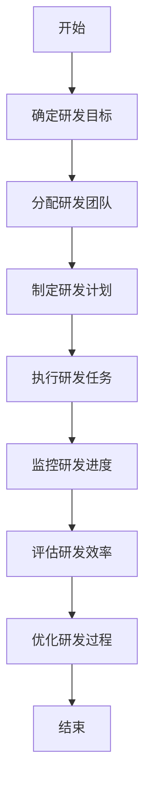
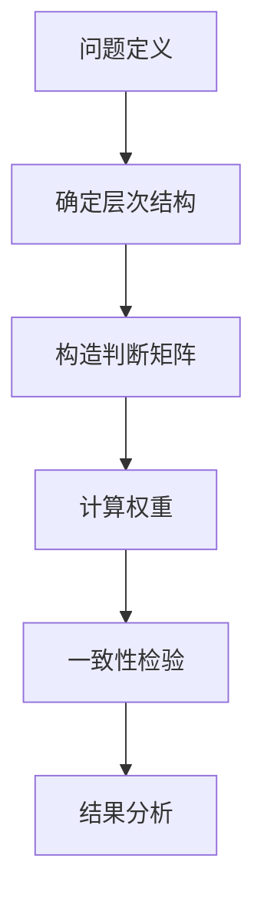
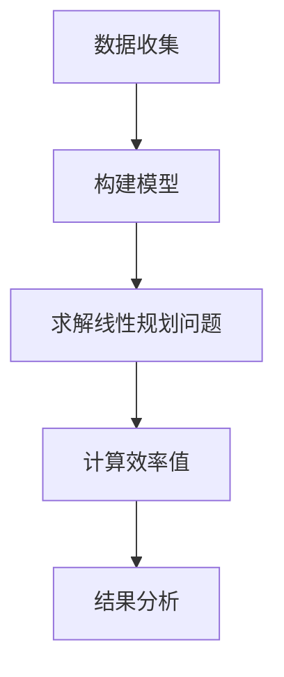
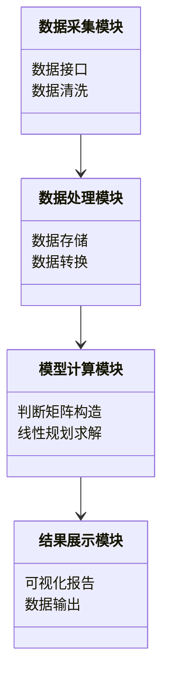
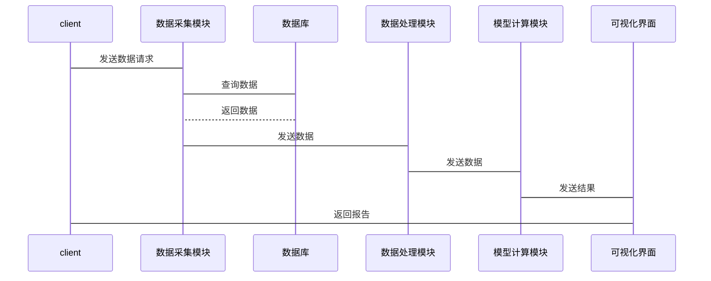

                 


# 企业估值中的研发效率评估

## 关键词：研发效率，企业估值，层次分析法，数据包络分析，研发团队

## 摘要：  
本文探讨了研发效率在企业估值中的重要性，分析了研发效率的核心概念、关键指标及其与企业价值的关系。通过层次分析法（AHP）和数据包络分析（DEA）等方法，详细阐述了研发效率的评估过程，并结合实际案例，展示了如何通过系统化的方法提升企业研发效率，进而增强企业估值。本文还讨论了影响研发效率的因素，并提出了优化研发效率的策略。

---

# 第1章：研发效率评估的背景与核心概念

## 1.1 研发效率评估的背景

企业估值是一个复杂的系统工程，通常涉及财务指标、市场表现、管理能力等多个方面。然而，在科技高度发达的今天，研发效率已成为企业核心竞争力的重要组成部分。研发效率不仅影响企业的创新能力，还直接影响企业的长期盈利能力。在高技术产业中，研发效率甚至可以决定企业的生存与发展。

### 1.1.1 研发效率对企业价值的影响

- **研发投入产出比**：衡量单位研发投入带来的收益，高效率的研发团队能够以更低的成本实现更高的创新产出。
- **研发周期**：缩短研发周期可以更快地将创新成果转化为市场价值，提高企业的资金周转效率。
- **技术领先性**：高效的研发能够确保企业保持技术领先，从而在市场竞争中占据优势地位。

### 1.1.2 研发效率评估与其他评估方法的区别

传统的企业估值方法（如DCF模型、EV/EBITDA等）主要关注财务指标，而研发效率评估则关注企业内部的研发过程和效率。通过评估研发效率，可以更准确地预测企业的未来盈利能力，尤其是在科技型企业中，研发效率是决定企业估值的关键因素。

## 1.2 研发效率评估的核心概念与问题描述

### 1.2.1 研发效率的定义与特征

- **定义**：研发效率是指企业在单位时间内将研发投入转化为创新成果的能力，通常包括研发投入、研发周期、研发团队规模等多个维度。
- **特征**：
  - 高效性：单位投入产生更高的产出。
  - 可持续性：能够长期保持高效的创新能力。
  - 可衡量性：可以通过具体指标进行量化评估。

### 1.2.2 研发效率评估的关键指标

- **研发投入产出比**：研发投入占总收入的比例，以及研发投入带来的专利数量、新产品数量等。
- **研发周期**：从研发立项到产品上市的时间长度。
- **研发团队规模与效率**：单位研发人员的产出效率。

### 1.2.3 研发效率评估与企业估值的关系

- **直接影响**：研发效率高，创新能力强，企业估值上升。
- **间接影响**：研发效率高，企业能够更快地响应市场变化，增强市场竞争力，从而间接提升估值。

---

# 第2章：研发效率评估的核心概念与联系

## 2.1 核心概念的属性特征对比

### 2.1.1 研发投入与产出的关系

- **研发投入**：企业的研发投入包括人力成本、材料成本等。
- **产出**：包括专利数量、新产品数量、技术进步带来的收入增长等。
- **对比分析**：高投入不一定带来高产出，关键在于效率。例如，投入相同的情况下，产出更高的企业研发效率更高。

### 2.1.2 研发周期与效率的关联

- **研发周期短**：意味着企业能够更快地将创新成果转化为市场价值。
- **效率高**：单位时间内的产出更高，研发周期可能更短或相同。

### 2.1.3 研发团队规模与效率的平衡

- **团队规模**：大规模团队可能在某些情况下效率更高，但管理成本也更高。
- **效率**：小团队可能更灵活，效率更高，但规模过小可能导致资源不足。

## 2.2 实体关系图与流程图

### 2.2.1 研发效率评估的实体关系图（ER图）

```mermaid
erDiagram
    战略目标
    {
        id: integer
        目标名称: string
    }
    研发项目
    {
        id: integer
        项目名称: string
        开始时间: date
        结束时间: date
    }
    研发团队
    {
        id: integer
        团队名称: string
        人员数量: integer
    }
    研发效率评估
    {
        id: integer
        评估时间: date
        评估结果: string
    }
    战略目标<->研发项目: 实现
    研发项目<->研发团队: 实施
    研发团队<->研发效率评估: 评估
```

### 2.2.2 研发效率评估的流程图（Mermaid）



---

# 第3章：研发效率评估的算法原理

## 3.1 层次分析法（AHP）在研发效率评估中的应用

### 3.1.1 层次分析法的基本原理

层次分析法是一种定性与定量相结合的决策分析方法，适用于多因素决策问题。它将复杂的决策问题分解为多个层次，通过构造判断矩阵来计算各因素的权重。

### 3.1.2 层次分析法的步骤与流程图



### 3.1.3 层次分析法的数学模型与公式

- 判断矩阵的构造：
  $$A = [a_{ij}]$$
  其中$a_{ij}$表示因素$i$相对于因素$j$的重要性。

- 特征向量计算：
  $$\lambda_{max} = \frac{\sum_{i=1}^{n} \lambda_i}{n}$$

## 3.2 数据包络分析（DEA）在研发效率评估中的应用

### 3.2.1 数据包络分析的基本原理

数据包络分析是一种基于线性规划的效率评估方法，适用于多输入多输出的情况。它通过构建生产前沿面来评估每个决策单元的效率。

### 3.2.2 数据包络分析的步骤与流程图



### 3.2.3 数据包络分析的数学模型与公式

- 效率计算：
  $$\theta_i = \min \left\{ \frac{\sum_{j=1}^{n} \lambda_j y_{ij}}{\sum_{k=1}^{m} \lambda_k x_{ik}} \right\}$$

---

# 第4章：研发效率评估的系统分析与架构设计

## 4.1 系统分析与功能需求

### 4.1.1 系统功能需求分析

- 数据采集：收集企业的研发投入、研发周期、专利数量等数据。
- 数据处理：对数据进行清洗和预处理。
- 模型计算：应用层次分析法或数据包络分析进行效率评估。
- 结果展示：生成可视化报告，展示评估结果。

### 4.1.2 系统功能模块设计（Mermaid类图）



## 4.2 系统架构设计

### 4.2.1 系统架构设计（Mermaid架构图）


## 4.3 系统接口设计

- 数据接口：提供API用于数据采集和数据处理。
- 可视化接口：提供API用于生成可视化报告。

## 4.4 系统交互设计（Mermaid序列图）



---

# 第5章：研发效率评估的项目实战

## 5.1 项目背景

以一家科技公司为例，评估其研发效率并优化其研发过程。

## 5.2 项目实施步骤

### 5.2.1 环境安装

- 安装Python和相关库（如numpy、pandas、scipy）。
- 安装mermaid和相关工具。

### 5.2.2 数据收集

- 收集企业的研发投入、研发周期、专利数量等数据。

### 5.2.3 核心算法实现

#### 层次分析法的Python实现

```python
import numpy as np

def calculate_weights(matrix):
    # 计算特征向量
    eig, vec = np.linalg.eig(matrix)
    max_eig = eig.max()
    weight = vec[:, np.argmax(eig)] / vec[:, np.argmax(eig)].sum()
    return weight

# 示例判断矩阵
matrix = np.array([
    [1, 3, 2],
    [1/3, 1, 2/3],
    [1/2, 3/2, 1]
])
weights = calculate_weights(matrix)
print("权重向量为：", weights)
```

#### 数据包络分析的Python实现

```python
import pandas as pd
from py DEA import DEA

data = pd.DataFrame({
    '输入1': [10, 15, 20],
    '输入2': [5, 7, 10],
    '输出1': [2, 3, 4]
})

deamodel = DEA(data)
efficiency = deamodel.calculate_efficiency()
print("效率值为：", efficiency)
```

### 5.2.4 结果分析与优化

- 根据评估结果，优化研发过程，例如增加团队协作效率、缩短研发周期。

---

# 第6章：总结与展望

## 6.1 总结

研发效率评估是企业估值中的重要环节，通过层次分析法和数据包络分析等方法，可以准确评估企业的研发效率，并为其估值提供依据。

## 6.2 未来展望

随着人工智能和大数据技术的发展，研发效率评估将更加智能化和精准化。未来的研究可以结合机器学习模型，进一步提升评估的准确性和效率。

---

# 作者：AI天才研究院 & 禅与计算机程序设计艺术

---

以上是《企业估值中的研发效率评估》的完整目录大纲和文章内容，涵盖了从背景到算法、系统设计再到项目实战的各个方面，希望对读者有所帮助！

