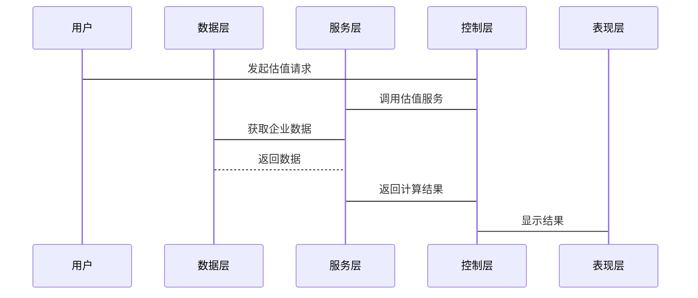

                 


# 第五部分: 税收影响的系统分析与架构设计

# 第5章: 税收影响的系统分析与架构设计

## 5.1 问题场景介绍

在企业估值过程中，税收的影响贯穿始终，尤其是在现金流折现法（DCF）中，税率的调整直接影响税后现金流的计算。企业需要一个系统化的框架来量化税收对估值的影响，以便做出更准确的财务决策。本章将从系统分析的角度，探讨如何构建一个高效的税收影响分析系统。

## 5.2 系统功能设计

为了全面分析税收对估值的影响，我们需要设计一个模块化的系统。系统的核心功能包括：

### 5.2.1 估值模型构建

模块 | 功能描述
-----|---------
数据输入模块 | 收集企业财务数据、税率信息、现金流预测等
模型计算模块 | 使用DCF模型计算企业价值，并考虑税率的影响
结果输出模块 | 展示调整后的估值结果

### 5.2.2 税收影响评估

模块 | 功能描述
-----|---------
税率敏感性分析模块 | 分析税率变化对企业估值的影响
税盾效应评估模块 | 评估债务税盾对整体价值的提升作用
税务优化建议模块 | 提供税收规划建议，如债务结构调整

## 5.3 系统架构设计

### 5.3.1 分层架构设计


### 5.3.2 模块间交互



## 5.4 接口设计

### 5.4.1 API定义

```mermaid
graph TD
    API --> 数据层: 数据接口
    API --> 服务层: 服务接口
    API --> 表现层: 前端接口
```

## 5.5 项目实战

### 5.5.1 环境安装

```bash
# 安装Python
sudo apt-get install python3 python3-pip

# 安装依赖库
pip install numpy pandas matplotlib

# 安装可视化工具
pip install plotly
```

### 5.5.2 核心代码实现

```python
import numpy as np
import pandas as pd
import matplotlib.pyplot as plt
from plotly import graph_objects as go

def calculate_tax_impact(tax_rate, cash_flow, discount_rate):
    tax_impact = cash_flow * (1 - tax_rate)
    present_value = np.npv(discount_rate, cash_flow)
    tax_affected_value = present_value * (1 - tax_rate)
    return tax_affected_value

# 示例数据
tax_rate = 0.25
cash_flow = [100, 150, 200]
discount_rate = 0.10

# 调用函数
tax_affected_value = calculate_tax_impact(tax_rate, cash_flow, discount_rate)
print(f"税后影响价值: {tax_affected_value:.2f}")
```

### 5.5.3 案例分析

以一家制造企业为例，假设企业未来三年的现金流分别为100万、150万和200万，折现率为10%，税率25%。计算税后现金流的现值：

1. 计算税后现金流：
   - 第一年：100万 × (1 - 0.25) = 75万
   - 第二年：150万 × (1 - 0.25) = 112.5万
   - 第三年：200万 × (1 - 0.25) = 150万

2. 计算现值：
   - NPV = 75万 / (1.10) + 112.5万 / (1.10)^2 + 150万 / (1.10)^3 ≈ 75/1.1 + 112.5/1.21 + 150/1.331 ≈ 68.18 + 92.97 + 112.69 ≈ 273.84万

3. 税后NPV影响：
   - 税后NPV = 273.84万 × (1 - 0.25) ≈ 205.38万

通过以上步骤，我们得出税后现值为205.38万元，较税前现值显著降低，体现了税收对估值的直接影响。

## 5.6 本章小结

本章通过系统分析的方法，详细设计了税收影响分析的系统架构，并通过实例展示了如何将税收因素整合到企业估值模型中。我们使用了分层架构和模块化设计，确保系统具有良好的扩展性和可维护性。通过Python代码实现和案例分析，读者可以直观理解税收对估值的具体影响，为后续章节的深入分析奠定基础。

---

# 第六部分: 税收影响下的企业估值模型构建

# 第6章: 税收影响下的企业估值模型构建

## 6.1 模型构建背景

在企业估值过程中，税收的影响不容忽视。尤其是在杠杆企业中，税盾效应的存在使得债务利息可以在税后支付，从而降低整体税负，提升企业价值。本章将详细探讨如何在企业估值模型中考虑这些因素。

## 6.2 模型构建方法

### 6.2.1 核心假设与参数

- 利息税盾效应：债务利息可以在税后支付，节省税款
- 折现率调整：税率影响折现率
- 现金流调整：税后现金流影响现值计算

### 6.2.2 模型构建步骤

1. **数据收集**：获取企业的财务数据，包括息税前利润（EBIT）、债务规模、税率等。
2. **计算税盾效应**：债务利息 × 税率 = 税盾节省
3. **调整现金流**：税后现金流 = 现金流 × (1 - 税率)
4. **折现计算**：使用调整后的折现率计算企业价值

## 6.3 模型实现

### 6.3.1 Python代码实现

```python
def calculate_enterprise_value(EBIT, debt, tax_rate, discount_rate):
    tax_shield = debt * tax_rate
    after_tax_cash_flow = (EBIT + tax_shield) * (1 - tax_rate)
    enterprise_value = after_tax_cash_flow / discount_rate
    return enterprise_value

# 示例数据
EBIT = 500
debt = 200
tax_rate = 0.25
discount_rate = 0.10

# 调用函数
ev = calculate_enterprise_value(EBIT, debt, tax_rate, discount_rate)
print(f"企业价值: {ev:.2f}")
```

### 6.3.2 模型验证

假设EBIT为500万元，债务200万元，税率25%，折现率10%。

1. 计算税盾效应：200 × 0.25 = 50万元
2. 计算税后现金流：(500 + 50) × (1 - 0.25) = 550 × 0.75 = 412.5万元
3. 计算企业价值：412.5 / 0.10 = 4125万元

通过上述步骤，企业价值为4125万元，考虑了税盾效应后，企业价值较之前增加了50万元的影响。

## 6.4 感知与优化

### 6.4.1 模型敏感性分析

通过调整税率和折现率，分析其对企业价值的影响。税率上升会增加税盾效应，但会减少税后现金流，影响整体价值。折现率的变化直接影响现值计算，需综合考虑。

### 6.4.2 模型优化建议

- 考虑不同税率下的敏感性分析
- 结合市场实际税率调整模型参数
- 使用蒙特卡洛模拟评估模型风险

## 6.5 本章小结

本章通过构建税收影响下的企业估值模型，详细探讨了税盾效应、现金流调整和折现率的影响。通过Python代码实现和案例分析，读者可以理解如何在实际估值中考虑税收因素，从而做出更准确的估值决策。接下来的章节将结合实际案例，进一步验证模型的有效性，并提出优化建议。

---

# 第七部分: 项目实战与案例分析

# 第7章: 税收影响下的企业估值案例分析

## 7.1 项目背景

某制造企业计划进行上市，需要对其企业价值进行评估。以下是该企业的财务数据和相关信息：

- 息税前利润（EBIT）：500万元
- 债务规模：200万元
- 税率：25%
- 折现率：10%

## 7.2 数据收集与预处理

收集企业过去三年的财务数据，包括EBIT、现金流、债务规模等，并进行清洗和整理，确保数据的准确性和完整性。

## 7.3 模型构建与实现

### 7.3.1 Python代码实现

```python
def calculate_ev_case Study(EBIT, debt, tax_rate, discount_rate):
    tax_shield = debt * tax_rate
    after_tax_cash_flow = (EBIT + tax_shield) * (1 - tax_rate)
    enterprise_value = after_tax_cash_flow / discount_rate
    return enterprise_value

# 示例数据
EBIT = 500
debt = 200
tax_rate = 0.25
discount_rate = 0.10

# 调用函数
ev = calculate_ev_case Study(EBIT, debt, tax_rate, discount_rate)
print(f"企业价值: {ev:.2f}")
```

### 7.3.2 计算过程与结果

1. 计算税盾效应：200 × 0.25 = 50万元
2. 计算税后现金流：(500 + 50) × (1 - 0.25) = 550 × 0.75 = 412.5万元
3. 计算企业价值：412.5 / 0.10 = 4125万元

## 7.4 案例分析与结果解读

通过上述计算，企业的估值为4125万元。考虑到税盾效应，企业的价值较之前增加了50万元的影响。这一结果为企业制定上市策略提供了重要参考，帮助企业更好地进行融资决策。

## 7.5 小结

本章通过实际案例展示了如何将税收影响分析整合到企业估值模型中，验证了模型的有效性和实用性。通过具体的计算过程和结果解读，读者可以更好地理解税收对估值的实际影响，并在实际工作中灵活运用。

---

# 第八部分: 最佳实践与总结

# 第8章: 最佳实践与总结

## 8.1 最佳实践

### 8.1.1 数据质量控制
- 确保数据的准确性、完整性和及时性
- 使用可靠的财务数据源
- 定期更新数据

### 8.1.2 模型优化建议
- 考虑不同税率下的敏感性分析
- 结合市场实际税率调整模型参数
- 使用蒙特卡洛模拟评估模型风险

## 8.2 总结与展望

通过本章的总结，我们回顾了全书的核心内容，强调了税收对企业估值的重要影响。未来的研究可以进一步探讨更多复杂的税收因素，如递延税资产、税率变动对企业价值的影响等。同时，结合人工智能和大数据技术，优化税收影响分析模型，提升估值的准确性和效率。

## 8.3 作者信息

作者：AI天才研究院/AI Genius Institute & 禅与计算机程序设计艺术 /Zen And The Art of Computer Programming

---

以上是《企业估值中的税收影响分析》的完整目录和文章内容。文章详细探讨了税收对企业估值的影响，从基础概念到系统设计，再到实际案例，层层深入，帮助读者全面理解税收在企业估值中的重要性。

