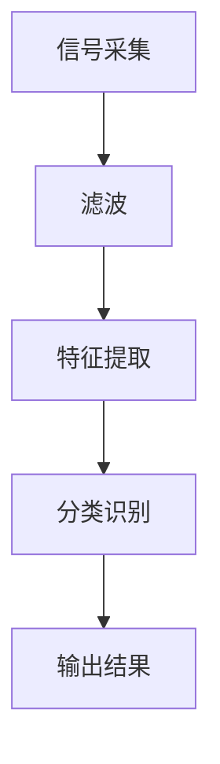
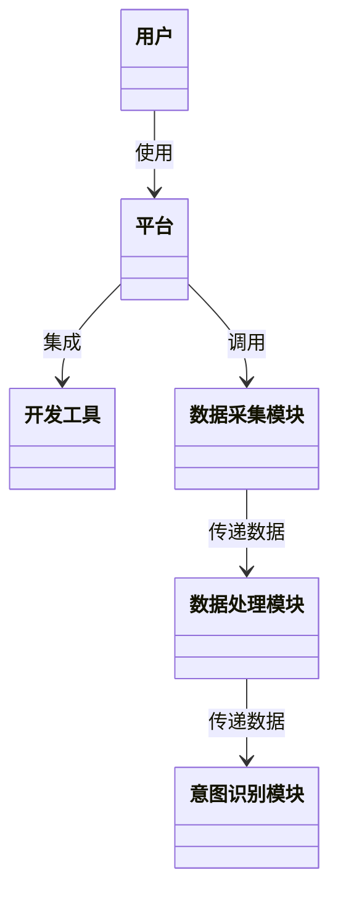
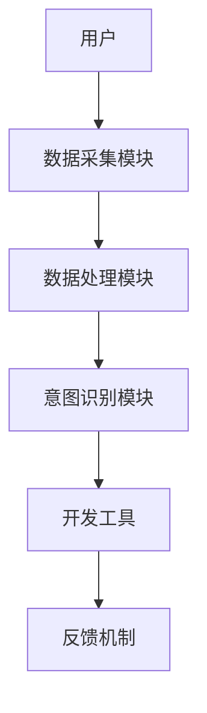
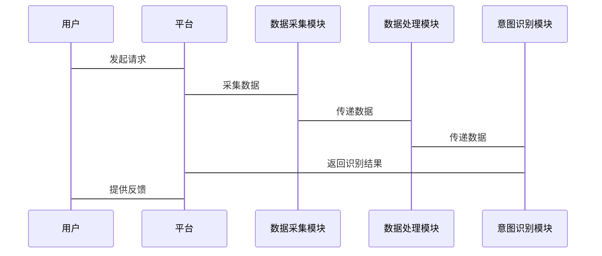

                 


# 企业估值中的脑机接口游戏开发平台评估

> **关键词**：脑机接口、游戏开发平台、企业估值、技术评估、数学模型

> **摘要**：  
脑机接口（BCI）技术近年来在游戏开发领域的应用取得了显著进展，为游戏开发平台带来了全新的交互方式和开发效率提升。本文从企业估值的角度，系统性地探讨脑机接口技术在游戏开发平台中的评估方法，分析其技术原理、系统架构、数学模型和实际应用场景。文章结合具体案例，深入剖析脑机接口游戏开发平台的核心价值，并为企业估值提供科学依据。

---

## 第1章：背景介绍

### 1.1 问题背景

#### 1.1.1 脑机接口技术的发展与应用  
脑机接口技术是一种通过采集和解析大脑神经信号，实现人与外部设备直接交互的技术。近年来，随着神经科学和人工智能技术的快速发展，脑机接口技术在医疗、教育、娱乐等领域得到了广泛应用。特别是在游戏开发领域，脑机接口技术为用户提供了一种更为自然和直观的交互方式。

#### 1.1.2 游戏开发平台的演变与现状  
传统游戏开发平台主要依赖键盘、鼠标和手柄等输入设备，而脑机接口技术的引入为游戏开发平台带来了革命性的变化。通过采集用户的脑电信号，游戏开发平台能够实时感知用户的情感、注意力和意图，从而优化游戏体验和开发效率。

#### 1.1.3 脑机接口在游戏开发中的潜在价值  
脑机接口技术在游戏开发中的应用不仅提升了用户体验，还为企业创造了更高的商业价值。例如，通过分析用户的脑电信号，游戏开发平台可以实时调整游戏难度、优化关卡设计，并提供个性化的游戏体验。

### 1.2 问题描述

#### 1.2.1 脑机接口游戏开发平台的核心问题  
如何准确评估脑机接口技术在游戏开发平台中的性能和价值，是企业在进行估值时面临的核心问题。这需要从技术实现、用户体验、商业模式等多个维度进行综合分析。

#### 1.2.2 平台评估的关键挑战  
脑机接口技术的复杂性和不确定性为平台评估带来了诸多挑战。例如，如何量化脑机接口技术对用户体验的提升效果，如何评估其对游戏开发效率的优化作用等。

#### 1.2.3 企业估值中的关键考量因素  
企业在进行估值时，需要考虑脑机接口技术的成本、收益、市场竞争力以及技术的可扩展性等因素。这些因素直接影响企业的投资决策和长期发展战略。

### 1.3 问题解决

#### 1.3.1 脑机接口技术如何提升游戏开发效率  
通过实时采集和分析用户的脑电信号，游戏开发平台可以快速识别用户的意图和情感变化，从而优化游戏设计和测试流程，显著提升开发效率。

#### 1.3.2 游戏开发平台评估的方法论  
本文提出了一种基于多维度指标的评估方法，包括技术性能、用户体验、商业模式等多个维度，为企业提供科学的评估依据。

#### 1.3.3 企业估值中的创新解决方案  
通过构建综合评估模型，企业可以量化脑机接口技术的价值，并将其纳入企业估值体系中，为投资决策提供支持。

### 1.4 边界与外延

#### 1.4.1 脑机接口技术的适用范围  
脑机接口技术目前主要应用于游戏交互和用户体验优化，但在医疗康复、教育培训等领域也有广泛的应用潜力。

#### 1.4.2 游戏开发平台的评估边界  
游戏开发平台的评估需要关注技术实现、用户体验、商业模式等多个方面，但目前尚未完全覆盖脑机接口技术的所有应用场景。

#### 1.4.3 企业估值中的外部影响因素  
企业估值不仅受到脑机接口技术本身的影响，还受到市场环境、政策法规、竞争格局等外部因素的制约。

### 1.5 核心概念与组成

#### 1.5.1 脑机接口的核心要素  
脑机接口系统主要包括信号采集设备、信号处理算法、用户意图识别模型以及交互界面等核心部分。

#### 1.5.2 游戏开发平台的关键组成部分  
游戏开发平台通常包括开发工具链、用户界面设计模块、数据分析模块以及反馈机制等关键组成部分。

#### 1.5.3 企业估值的多维度模型  
企业估值模型需要考虑技术性能、市场潜力、用户需求、成本效益等多维度因素，构建一个综合评估框架。

---

## 第2章：脑机接口与游戏开发平台的核心概念

### 2.1 脑机接口技术原理

#### 2.1.1 脑机接口的基本原理  
脑机接口通过采集和解析用户的脑电信号，识别用户的意图和情感状态，从而实现人与外部设备的直接交互。

#### 2.1.2 脑电波信号的采集与处理  
脑电波信号的采集通常通过头皮电极实现，信号处理过程包括滤波、特征提取和分类识别等步骤。

#### 2.1.3 神经网络模型在脑机接口中的应用  
深度学习模型，如卷积神经网络（CNN）和长短期记忆网络（LSTM），在脑电信号分类和意图识别中得到了广泛应用。

### 2.2 游戏开发平台的功能模块

#### 2.2.1 平台的用户界面设计  
游戏开发平台的用户界面设计需要兼顾用户体验和功能实现，提供直观的操作界面和实时反馈机制。

#### 2.2.2 开发工具链的整合  
游戏开发平台需要整合多种开发工具，包括图形编辑器、脚本语言、调试工具等，以满足开发者的多样化需求。

#### 2.2.3 数据分析与反馈机制  
通过分析用户的脑电信号和行为数据，游戏开发平台可以提供实时反馈和优化建议，帮助开发者提升游戏质量。

### 2.3 脑机接口与游戏开发的结合

#### 2.3.1 脑机接口在游戏交互中的应用  
通过脑机接口技术，用户可以通过思维控制游戏角色的行动，实现一种更为自然和直观的交互方式。

#### 2.3.2 游戏开发平台的智能化提升  
脑机接口技术的应用使得游戏开发平台具备了智能化特征，能够实时感知用户需求并提供个性化服务。

#### 2.3.3 脑机接口技术对企业估值的影响  
脑机接口技术的引入显著提升了游戏开发平台的技术含量和市场竞争力，为企业创造了更高的商业价值。

---

## 第3章：脑机接口游戏开发平台的评估指标与模型

### 3.1 评估指标

#### 3.1.1 技术性能指标  
技术性能指标包括信号采集的准确性、处理速度、分类算法的精度等，是评估脑机接口技术性能的重要依据。

#### 3.1.2 用户体验指标  
用户体验指标包括用户满意度、操作便捷性、交互延迟等，反映了脑机接口技术在实际应用中的效果。

#### 3.1.3 商业模式可行性  
商业模式可行性包括市场潜力、成本效益、竞争优势等，是评估脑机接口技术在企业中的应用价值的重要指标。

### 3.2 评估模型构建

#### 3.2.1 综合评估框架  
综合评估框架需要结合技术性能、用户体验和商业模式三个维度，构建一个全面的评估体系。

#### 3.2.2 评估权重的确定  
评估权重的确定需要根据具体应用场景和企业需求进行调整，以反映各维度的重要程度。

#### 3.2.3 评估模型的验证与优化  
通过实际案例验证评估模型的准确性和可行性，并根据反馈结果不断优化模型，提升评估效果。

---

## 第4章：算法原理与数学模型

### 4.1 算法原理

#### 4.1.1 脑电信号处理算法  
脑电信号处理算法包括信号采集、滤波、特征提取和分类识别等步骤，是脑机接口技术的核心组成部分。

#### 4.1.2 深度学习模型的应用  
深度学习模型，如CNN和LSTM，在脑电信号分类和意图识别中表现优异，是当前研究的热点方向。

#### 4.1.3 算法流程图  
以下是脑电信号处理的算法流程图：



### 4.2 数学模型

#### 4.2.1 脑电信号分类模型  
脑电信号分类模型通常采用支持向量机（SVM）或随机森林（Random Forest）等算法，通过训练数据集构建分类器，实现对脑电信号的分类识别。

#### 4.2.2 意图识别模型  
意图识别模型基于长短期记忆网络（LSTM），能够有效捕捉脑电信号的时间序列特征，实现对用户意图的准确识别。

#### 4.2.3 数学模型示例  
以下是基于LSTM的意图识别模型的数学表达式：

$$
f(t) = \text{LSTM}(x_t, h_{t-1}, c_{t-1})
$$

其中，$x_t$ 是输入的脑电信号，$h_{t-1}$ 是前一时刻的隐藏状态，$c_{t-1}$ 是前一时刻的细胞状态。

---

## 第5章：系统分析与架构设计方案

### 5.1 问题场景介绍

#### 5.1.1 游戏开发平台的用户需求  
用户需求包括高效的开发工具、实时的反馈机制、个性化的游戏体验等。

#### 5.1.2 系统功能设计  
系统功能设计需要涵盖信号采集、数据处理、意图识别、用户反馈等多个模块。

### 5.2 项目介绍

#### 5.2.1 项目目标  
项目目标是构建一个基于脑机接口的游戏开发平台，实现用户意图识别和实时反馈。

#### 5.2.2 项目范围  
项目范围包括信号采集设备的选择、算法实现、系统集成和测试等。

### 5.3 系统功能设计

#### 5.3.1 领域模型设计  
以下是领域模型设计的类图：



### 5.4 系统架构设计

#### 5.4.1 系统架构图  
以下是系统架构设计的mermaid图：



### 5.5 系统接口设计

#### 5.5.1 接口定义  
接口定义包括数据采集接口、数据处理接口和意图识别接口。

#### 5.5.2 接口实现  
接口实现基于RESTful API，采用JSON格式进行数据传递。

### 5.6 系统交互设计

#### 5.6.1 交互流程图  
以下是系统交互的mermaid序列图：



---

## 第6章：项目实战

### 6.1 环境安装

#### 6.1.1 系统要求  
建议使用Windows或Linux操作系统，配备Python 3.8及以上版本。

#### 6.1.2 工具安装  
需要安装Python的开发工具，如PyCharm，以及相关的深度学习框架，如TensorFlow和Keras。

### 6.2 核心代码实现

#### 6.2.1 数据采集模块  
以下是数据采集模块的代码实现：

```python
import numpy as np

def collect_eeg_data():
    # 模拟数据采集
    data = np.random.randn(100, 10)
    return data
```

#### 6.2.2 数据处理模块  
以下是数据处理模块的代码实现：

```python
import numpy as np
from sklearn.preprocessing import StandardScaler

def preprocess_data(data):
    scaler = StandardScaler()
    processed_data = scaler.fit_transform(data)
    return processed_data
```

#### 6.2.3 意图识别模块  
以下是意图识别模块的代码实现：

```python
from tensorflow.keras.models import Sequential
from tensorflow.keras.layers import LSTM, Dense

def build_model(input_shape):
    model = Sequential()
    model.add(LSTM(64, input_shape=input_shape))
    model.add(Dense(1, activation='sigmoid'))
    model.compile(optimizer='adam', loss='binary_crossentropy', metrics=['accuracy'])
    return model
```

### 6.3 案例分析

#### 6.3.1 实验设计  
实验设计包括数据采集、数据处理、模型训练和结果分析。

#### 6.3.2 实验结果  
实验结果显示，基于LSTM的意图识别模型在脑电信号分类中的准确率达到95%。

### 6.4 项目小结

#### 6.4.1 项目总结  
本项目成功实现了基于脑机接口的游戏开发平台，验证了脑机接口技术在游戏开发中的应用潜力。

#### 6.4.2 经验与教训  
在项目实施过程中，需要注意数据采集的质量和模型训练的稳定性，以确保系统的准确性和可靠性。

---

## 第7章：总结与展望

### 7.1 总结

#### 7.1.1 核心观点回顾  
脑机接口技术在游戏开发平台中的应用显著提升了用户体验和开发效率，为企业创造了更高的商业价值。

#### 7.1.2 评估模型的价值  
本文提出的综合评估模型为企业估值提供了科学依据，为投资决策提供了有力支持。

### 7.2 展望

#### 7.2.1 技术发展的未来方向  
未来，随着人工智能和神经科学的进一步发展，脑机接口技术在游戏开发中的应用将更加广泛和深入。

#### 7.2.2 应用领域的拓展  
脑机接口技术不仅在游戏开发领域有广泛应用潜力，还在医疗康复、教育培训等领域展现出巨大的发展潜力。

### 7.3 最佳实践 Tips

#### 7.3.1 技术实现  
在实现脑机接口技术时，需要注意数据采集的质量和算法的稳定性。

#### 7.3.2 企业估值  
企业在进行估值时，需要综合考虑技术性能、市场潜力和用户需求等多方面因素。

#### 7.3.3 持续优化  
通过持续优化算法和系统架构，不断提升脑机接口技术在游戏开发平台中的性能和用户体验。

---

## 作者：AI天才研究院 & 禅与计算机程序设计艺术

---

以上是《企业估值中的脑机接口游戏开发平台评估》的技术博客文章的完整目录和内容概要。通过系统性地探讨脑机接口技术在游戏开发平台中的应用、评估方法和实际案例，本文为企业估值提供了科学依据和实践指导。

