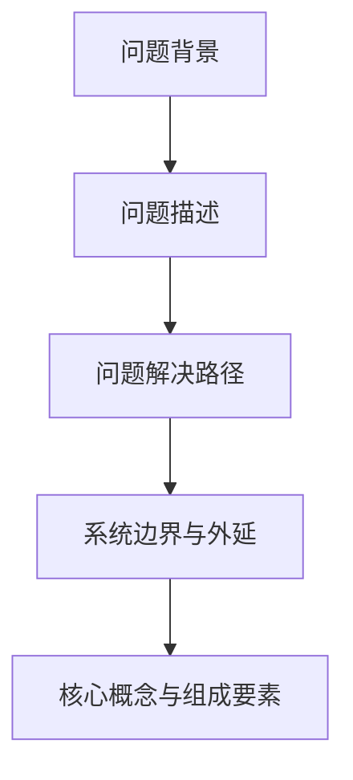
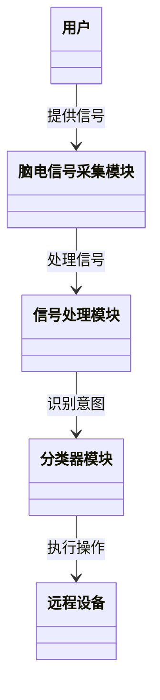
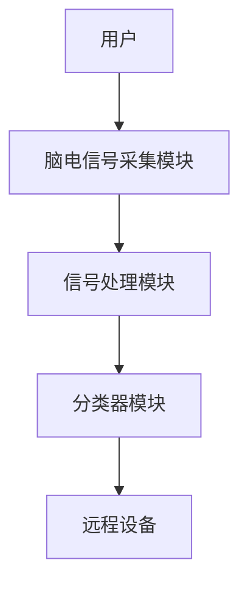
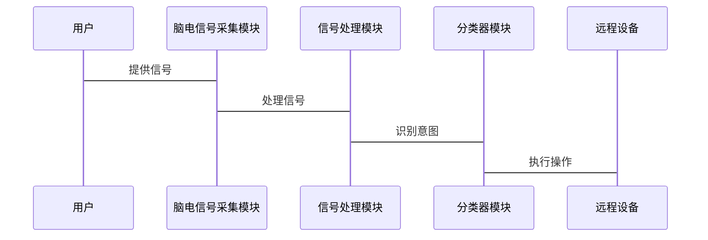

                 


# 企业估值中的脑机接口远程操控系统评估

> 关键词：企业估值，脑机接口，远程操控系统，系统评估，技术分析，项目实施

> 摘要：脑机接口技术作为一种新兴的前沿科技，正在逐步改变企业估值的方式。本文通过分析脑机接口远程操控系统的原理、架构、算法及实际应用，探讨其在企业估值中的潜在价值与评估方法。文章从背景介绍、系统设计、算法原理、项目实战等多角度展开，结合实际案例和数学模型，为企业估值中的脑机接口远程操控系统评估提供全面的技术支持和实践指导。

---

## 第一部分: 脑机接口远程操控系统背景介绍

### 第1章: 脑机接口远程操控系统背景介绍

#### 1.1 脑机接口远程操控系统的定义与核心概念

##### 1.1.1 问题背景与问题描述
在企业估值领域，传统的评估方法主要依赖于财务数据和市场分析，难以全面考虑技术驱动的动态因素。脑机接口（BCI）技术作为一种革命性的技术，能够实现人脑与计算机的直接交互，为企业的远程操控和智能化管理提供了新的可能。然而，这一技术的引入也带来了新的挑战，例如如何评估其对企业价值的具体影响。

##### 1.1.2 问题解决的路径与方法
通过分析脑机接口技术的原理、系统架构和应用场景，结合企业估值的方法论，构建一套适用于脑机接口远程操控系统的评估框架。这一框架将结合技术指标和企业绩效数据，为企业估值提供更全面的参考。

##### 1.1.3 系统的边界与外延
脑机接口远程操控系统的边界包括硬件设备、软件算法和用户界面，其外延则涉及数据采集、信号处理、系统控制等多个环节。系统的核心属性包括实时性、准确性、可靠性和可扩展性。

##### 1.1.4 核心概念与组成要素
- **核心概念**：脑机接口、远程操控、企业估值。
- **组成要素**：数据采集模块、信号处理模块、分类器模块、系统控制模块。



#### 1.2 脑机接口技术的基本原理

##### 1.2.1 脑机接口的工作原理
脑机接口通过采集和解析脑电信号（EEG），将其转化为可被计算机理解和执行的指令。这一过程包括数据采集、信号处理、特征提取和分类器设计四个阶段。

##### 1.2.2 远程操控系统的实现机制
远程操控系统基于脑机接口技术，通过用户的脑电信号实现对远程设备的控制。系统主要包括数据采集端、信号处理端和执行端三个部分。

##### 1.2.3 系统的核心属性与特征对比
- **实时性**：快速响应用户意图。
- **准确性**：确保信号识别的高精度。
- **可靠性**：系统稳定运行，避免误操作。
- **可扩展性**：支持多种设备和场景。

##### 1.2.4 ER实体关系图架构
```mermaid
graph TD
    User-> EEG数据采集: 提供脑电信号
    EEG数据采集-> 信号处理模块: 处理信号
    信号处理模块-> 分类器模块: 识别意图
    分类器模块-> 远程设备: 执行操作
```

---

## 第二部分: 脑机接口远程操控系统的数学模型与算法原理

### 第2章: 脑机接口远程操控系统的数学模型与算法原理

#### 2.1 核心算法原理

##### 2.1.1 神经信号处理流程
脑电信号的处理流程包括数据采集、预处理、特征提取和分类器设计。预处理步骤包括去噪和降采样，特征提取采用小波变换和经验模态分解（EMD）。

##### 2.1.2 信号特征提取方法
常用的特征提取方法包括时域特征（均值、方差）和频域特征（功率谱密度、频带能量）。特征提取过程可以通过以下公式表示：

$$
\text{特征向量} = \left[ \mu, \sigma, \text{PSD}, \text{频带能量} \right]
$$

##### 2.1.3 分类器设计与实现
分类器采用支持向量机（SVM）和随机森林（RF）的集成方法，公式如下：

$$
y = \arg\max_{i} \sum_{j=1}^{n} w_{ij} x_j
$$

##### 2.1.4 系统控制算法
系统控制算法基于分类器输出，采用模糊控制和PID控制的结合方法，公式如下：

$$
u = \text{模糊控制}(e) + \text{PID}(e, e_{\text{prev}}, t)
$$

#### 2.2 数学模型与公式

##### 2.2.1 神经信号特征提取的数学表达
特征提取过程可以表示为：

$$
x_{\text{特征}} = f(x_{\text{原始}})
$$

其中，$f$ 是特征提取函数。

##### 2.2.2 分类器的损失函数与优化
损失函数采用交叉熵损失：

$$
L = -\sum_{i=1}^{N} y_i \log(p_i) + (1 - y_i) \log(1 - p_i)
$$

优化过程使用Adam优化器：

$$
\theta_{t+1} = \theta_t - \eta \frac{\partial L}{\partial \theta_t}
$$

##### 2.2.3 控制算法的数学推导
模糊控制规则可以通过以下公式表示：

$$
u = \text{IF} \; e \; \text{THEN} \; u_{\text{high}}
$$

PID控制算法如下：

$$
u = K_p e + K_i \int e \, dt + K_d \frac{de}{dt}
$$

---

## 第三部分: 脑机接口远程操控系统的系统分析与架构设计

### 第3章: 脑机接口远程操控系统的系统分析与架构设计

#### 3.1 问题场景介绍

##### 3.1.1 系统应用场景分析
脑机接口远程操控系统在企业中的应用场景包括远程设备控制、智能辅助决策和企业数据可视化。

##### 3.1.2 项目目标与范围界定
项目目标是构建一个基于脑机接口的远程操控系统，并评估其对企业价值的影响。范围包括系统设计、算法实现和评估模型构建。

##### 3.1.3 系统功能需求分析
系统功能需求包括数据采集、信号处理、意图识别和设备控制。

##### 3.1.4 项目实施计划与资源分配
项目实施计划包括需求分析、系统设计、开发测试和部署上线。

#### 3.2 系统功能设计

##### 3.2.1 领域模型设计（Mermaid类图）


##### 3.2.2 系统架构设计（Mermaid架构图）


##### 3.2.3 系统接口设计
系统接口设计包括用户接口（UI）、数据接口（API）和设备接口（硬件）。

##### 3.2.4 系统交互设计（Mermaid序列图）


---

## 第四部分: 脑机接口远程操控系统的项目实战

### 第4章: 脑机接口远程操控系统的项目实战

#### 4.1 环境安装与配置

##### 4.1.1 开发环境搭建
开发环境包括Python、Matplotlib、Scikit-learn和TensorFlow。

##### 4.1.2 必要工具与库的安装
安装必要的库，如：

```bash
pip install numpy matplotlib scikit-learn tensorflow
```

##### 4.1.3 数据采集与预处理工具
使用OpenBCI或EEGLAB进行数据采集和预处理。

##### 4.1.4 系统运行环境要求
系统要求包括Python 3.8及以上版本、64位操作系统和4GB内存。

#### 4.2 核心代码实现

##### 4.2.1 神经信号处理代码

```python
import numpy as np
from sklearn import svm, ensemble

# 数据预处理
def preprocess(data):
    # 去噪
    filtered_data = np.apply_along_axis(lambda x: butterworth_filter(x, order=2, cutoff=40), 1, data)
    return filtered_data

# 特征提取
def extract_features(data):
    features = []
    for channel in data:
        # 时域特征
        mu = np.mean(channel)
        std = np.std(channel)
        # 频域特征
        fft = np.abs(np.fft.fft(channel))
        fft_power = np.mean(fft)
        features.append([mu, std, fft_power])
    return np.array(features)

# 分类器训练
def train_classifier(features, labels):
    clf = ensemble.RandomForestClassifier(n_estimators=100)
    clf.fit(features, labels)
    return clf

# 分类器预测
def predict(clf, new_features):
    return clf.predict(new_features)
```

##### 4.2.2 分类器代码

```python
# SVM分类器
svm_clf = svm.SVC(kernel='rb

