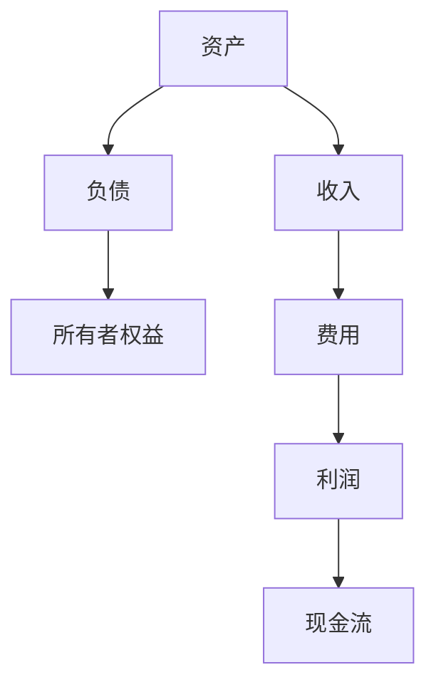
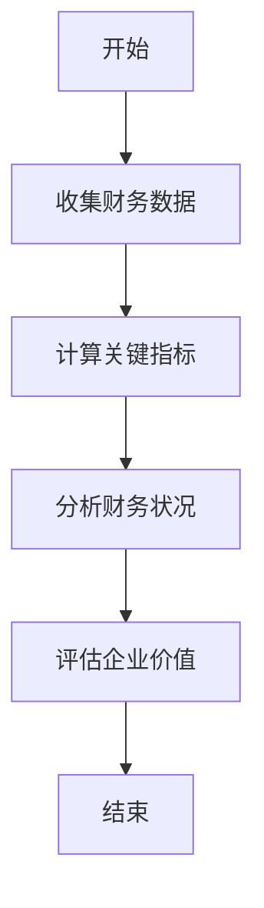
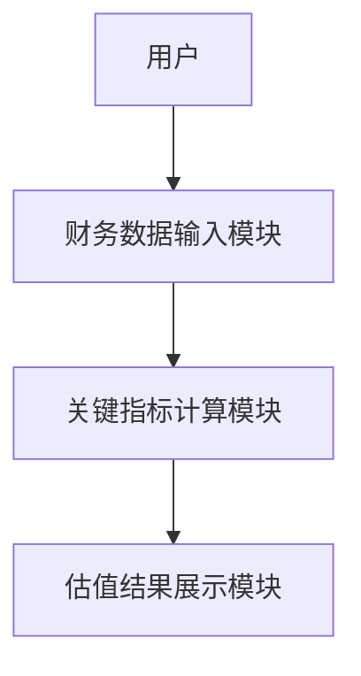

                 


# 企业估值中的财务报表分析方法

> 关键词：企业估值、财务报表分析、财务指标、估值模型、现金流量、财务健康度

> 摘要：企业估值是投资决策中的核心环节，而财务报表分析是企业估值的基础。本文从财务报表分析的基本概念出发，深入探讨了企业在不同估值场景下的财务指标计算方法，结合实际案例详细分析了财务报表数据对估值模型的影响，并通过系统化的架构设计展示了如何构建高效的财务报表分析与估值系统。文章内容涵盖了从理论到实践的完整流程，旨在帮助读者掌握企业估值中的财务报表分析方法，提升投资决策的准确性。

---

# 第1章: 财务报表分析与企业估值概述

## 1.1 财务报表分析的基本概念

### 1.1.1 财务报表的定义与组成

企业的财务报表是反映企业在一定会计期间内财务状况、经营成果和现金流量的书面文件。它通常包括三个主要部分：

1. **资产负债表（Balance Sheet）**：反映企业在某一特定日期的资产、负债和所有者权益的状况。
2. **利润表（Income Statement）**：反映企业在一定会计期间的收入、费用和利润情况。
3. **现金流量表（Cash Flow Statement）**：反映企业在一定会计期间内现金流入和流出的情况。

### 1.1.2 企业估值的定义与意义

企业估值是指通过对企业财务状况、经营能力和未来发展前景的分析，确定企业价值的过程。企业估值的意义在于为投资者提供决策依据，帮助其评估投资的价值和风险。

### 1.1.3 财务报表分析在企业估值中的作用

财务报表分析是企业估值的核心环节。通过对财务报表的分析，可以提取关键财务指标，评估企业的盈利能力和财务健康状况，为估值模型的建立提供数据支持。

---

## 1.2 财务报表分析的核心要素

### 1.2.1 资产、负债与所有者权益的构成

资产是企业拥有或控制的资源，负债是企业需要偿还的债务，所有者权益是企业净资产的价值。三者之间的关系可以用以下公式表示：

$$资产 = 负债 + 所有者权益$$

### 1.2.2 收入、费用与利润的关系

收入是企业在一定会计期间内通过销售商品或提供服务所获得的总收入，费用是企业在经营过程中发生的各项支出，利润是收入减去费用后的净收益。

$$利润 = 收入 - 费用$$

### 1.2.3 现金流量的来源与用途

现金流量是企业在一定会计期间内现金和现金等价物的流入和流出。现金流量表通常分为以下三部分：

1. **经营活动现金流**：反映企业日常经营活动的现金流。
2. **投资活动现金流**：反映企业投资活动的现金流。
3. **筹资活动现金流**：反映企业筹资活动的现金流。

---

## 1.3 企业估值的基本方法

### 1.3.1 市盈率法

市盈率法是一种常用的估值方法，其公式为：

$$市盈率 = \frac{股票价格}{每股收益}$$

通过市盈率法可以估算出企业的目标股价。

### 1.3.2 市净率法

市净率法的公式为：

$$市净率 = \frac{股票价格}{每股净资产}$$

市净率法适用于净资产占主导地位的企业。

### 1.3.3 现金流折现法

现金流折现法（DCF）是通过将未来现金流折现到现值来估算企业价值的方法。其公式为：

$$DCF = \sum_{t=1}^{n} \frac{CF_t}{(1 + r)^t} + \frac{TV}{(1 + r)^n}$$

其中，$CF_t$ 是第 $t$ 年的现金流，$r$ 是折现率，$TV$ 是终值。

---

## 1.4 财务报表分析与企业估值的边界

### 1.4.1 财务报表分析的局限性

财务报表分析的局限性包括：

1. 财务报表可能存在会计估计和主观判断的影响。
2. 财务报表反映的是过去的情况，无法直接预测未来。
3. 财务报表分析需要结合行业特点和企业具体情况。

### 1.4.2 企业估值的假设与前提

企业估值的假设包括：

1. 企业持续经营假设。
2. 市场有效假设。
3. 财务数据真实性和完整性假设。

### 1.4.3 财务报表分析与企业估值的结合

财务报表分析与企业估值的结合需要综合考虑定量分析和定性分析，确保估值结果的合理性和准确性。

---

## 1.5 本章小结

本章介绍了财务报表分析与企业估值的基本概念，重点分析了财务报表的核心要素及其在企业估值中的作用。通过市盈率法、市净率法和现金流折现法的对比，帮助读者理解不同估值方法的适用场景。

---

# 第2章: 财务报表分析的核心概念与联系

## 2.1 财务报表分析的核心原理

### 2.1.1 资产负债表的结构与分析

资产负债表反映企业在某一特定日期的资产、负债和所有者权益的状况。通过分析资产负债表，可以评估企业的财务健康状况和偿债能力。

### 2.1.2 利润表的结构与分析

利润表反映企业在一定会计期间内的收入、费用和利润情况。通过分析利润表，可以评估企业的盈利能力。

### 2.1.3 现金流量表的结构与分析

现金流量表反映企业在一定会计期间内的现金流入和流出情况。通过分析现金流量表，可以评估企业的现金流健康状况。

---

## 2.2 财务报表分析的核心要素对比

### 2.2.1 资产负债表与利润表的联系

资产负债表和利润表之间的联系主要体现在资产的变化和利润的实现上。例如，净利润的变化会影响所有者权益的变化。

### 2.2.2 现金流量表与利润表的联系

现金流量表与利润表之间的联系主要体现在现金流与利润的关系上。例如，净利润可能与现金流不一致，需要通过调整非现金费用和折旧等项目来计算现金流。

### 2.2.3 财务报表分析中的关键指标

关键指标包括：

1. **流动比率**：衡量企业的短期偿债能力。
2. **速动比率**：衡量企业的短期偿债能力。
3. **净利润率**：衡量企业的盈利能力。

---

## 2.3 财务报表分析的ER实体关系图

以下是财务报表分析的ER实体关系图：



---

## 2.4 本章小结

本章通过分析财务报表的核心要素及其联系，帮助读者理解财务报表的整体结构和内在逻辑。通过ER实体关系图，直观地展示了财务报表各部分之间的关系。

---

# 第3章: 财务报表分析的算法原理

## 3.1 财务报表分析的数学模型

### 3.1.1 资产负债表分析模型

资产负债表分析模型可以通过以下公式表示：

$$资产 = 负债 + 所有者权益$$

### 3.1.2 利润表分析模型

利润表分析模型可以通过以下公式表示：

$$利润 = 收入 - 费用$$

### 3.1.3 现金流量表分析模型

现金流量表分析模型可以通过以下公式表示：

$$净现金流 = 现金流入 - 现金流出$$

---

## 3.2 财务报表分析的公式推导

### 3.2.1 市盈率公式

市盈率公式为：

$$市盈率 = \frac{股票价格}{每股收益}$$

---

### 3.2.2 市净率公式

市净率公式为：

$$市净率 = \frac{股票价格}{每股净资产}$$

---

### 3.2.3 现金流折现公式

现金流折现公式为：

$$DCF = \sum_{t=1}^{n} \frac{CF_t}{(1 + r)^t} + \frac{TV}{(1 + r)^n}$$

---

## 3.3 财务报表分析的流程图

以下是财务报表分析的流程图：



---

## 3.4 本章小结

本章通过数学模型和公式推导，详细讲解了财务报表分析的核心算法原理。通过流程图，直观地展示了财务报表分析的完整流程。

---

# 第4章: 系统分析与架构设计方案

## 4.1 问题场景介绍

### 4.1.1 企业估值的典型场景

企业估值的典型场景包括：

1. **企业并购**：在企业并购中，估值是确定并购价格的重要依据。
2. **投资决策**：投资者在进行投资决策时需要对企业进行估值。
3. **上市融资**：企业在上市融资时需要进行估值。

---

### 4.1.2 财务报表分析的系统需求

财务报表分析系统的功能需求包括：

1. **数据输入**：支持用户输入企业财务数据。
2. **指标计算**：自动计算关键财务指标。
3. **估值模型**：支持多种估值模型的计算。
4. **结果展示**：直观展示估值结果。

---

## 4.2 系统功能设计

### 4.2.1 财务数据输入模块

财务数据输入模块是系统的输入端，用户需要输入企业的财务数据，包括资产负债表、利润表和现金流量表。

---

### 4.2.2 关键指标计算模块

关键指标计算模块是系统的核心部分，通过计算流动比率、速动比率、净利润率等关键指标，评估企业的财务状况。

---

### 4.2.3 估值结果展示模块

估值结果展示模块是系统的输出端，通过图表和文字形式展示企业的估值结果。

---

## 4.3 系统架构设计

以下是系统的架构设计图：



---

## 4.4 本章小结

本章通过系统分析与架构设计方案，展示了如何构建高效的财务报表分析与估值系统。通过功能设计和架构设计，帮助读者理解系统的整体结构和实现流程。

---

# 第5章: 项目实战

## 5.1 环境安装与配置

为了进行财务报表分析，需要安装以下工具：

1. **Excel**：用于数据输入和计算。
2. **Python**：用于编程和数据分析。
3. **Matplotlib**：用于数据可视化。

---

## 5.2 核心实现源代码

以下是Python实现的财务报表分析代码：

```python
import pandas as pd
import numpy as np
import matplotlib.pyplot as plt

# 输入财务数据
data = {
    '资产': [100, 200, 300],
    '负债': [50, 100, 150],
    '所有者权益': [50, 100, 150]
}

df = pd.DataFrame(data)

# 计算关键指标
流动比率 = df['资产'] / df['负债']
速动比率 = (df['资产'] - df['存货']) / df['负债']

# 绘制图表
plt.figure(figsize=(10, 6))
plt.plot(流动比率, label='流动比率')
plt.plot(速动比率, label='速动比率')
plt.xlabel('年份')
plt.ylabel('比率')
plt.legend()
plt.show()
```

---

## 5.3 代码应用解读与分析

上述代码通过Python和Pandas库输入财务数据，计算流动比率和速动比率，并通过Matplotlib绘制图表。通过分析图表，可以直观地看出企业的财务状况。

---

## 5.4 实际案例分析和详细讲解剖析

以某公司为例，假设其财务数据如下：

| 年份 | 资产 | 负债 | 所有者权益 |
|------|------|------|------------|
| 2020 | 100  | 50   | 50         |
| 2021 | 200  | 100  | 100        |
| 2022 | 300  | 150  | 150        |

通过计算，可以得出：

- 2020年的流动比率 = 100 / 50 = 2
- 2021年的流动比率 = 200 / 100 = 2
- 2022年的流动比率 = 300 / 150 = 2

从上述结果可以看出，企业的流动比率保持稳定，说明企业的短期偿债能力较强。

---

## 5.5 本章小结

本章通过项目实战，详细讲解了财务报表分析的实现过程。通过代码和实际案例分析，帮助读者理解如何将理论应用于实践。

---

# 第6章: 总结与展望

## 6.1 总结

本篇文章从财务报表分析的基本概念出发，深入探讨了企业在不同估值场景下的财务指标计算方法，结合实际案例详细分析了财务报表数据对估值模型的影响，并通过系统化的架构设计展示了如何构建高效的财务报表分析与估值系统。

---

## 6.2 展望

未来，随着人工智能技术的发展，财务报表分析和企业估值将更加智能化和自动化。通过机器学习和大数据技术，可以进一步提升财务报表分析的准确性和效率。

---

# 作者

**作者：AI天才研究院/AI Genius Institute & 禅与计算机程序设计艺术 /Zen And The Art of Computer Programming**

