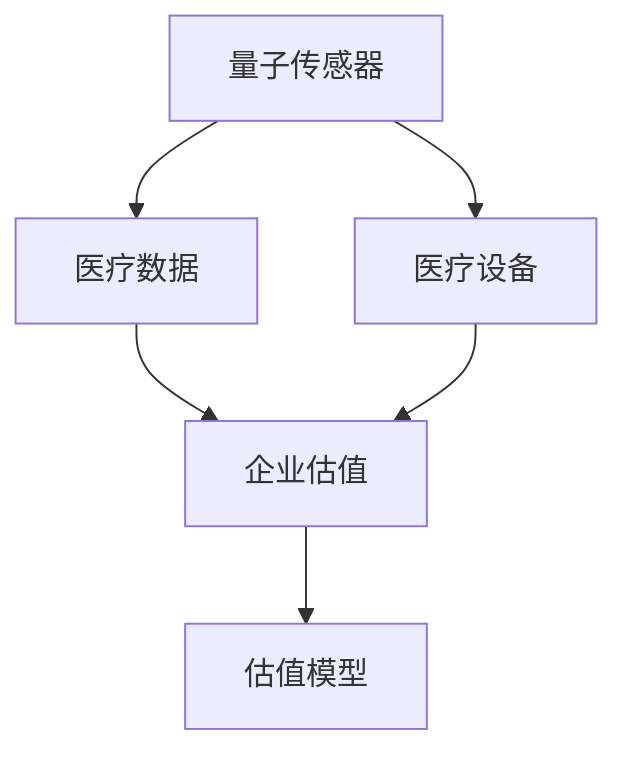
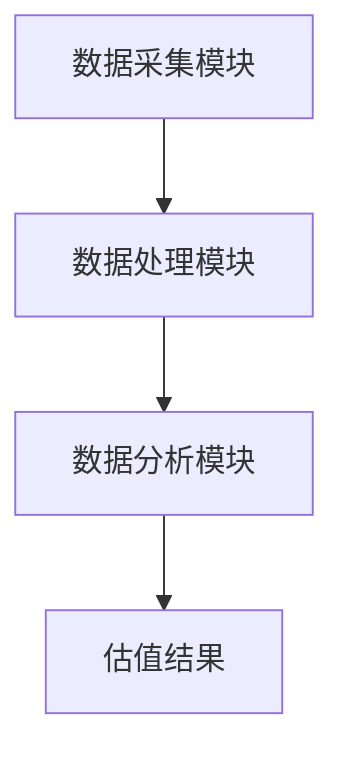

                 


# 企业估值中的量子传感器医疗应用评估

> 关键词：量子传感器、企业估值、医疗数据、数据处理、算法原理、系统架构

> 摘要：本文探讨了在企业估值过程中，量子传感器在医疗数据采集与分析中的应用。通过量子传感器技术，能够更精准地获取医疗数据，从而为企业估值提供更可靠的依据。文章详细介绍了量子传感器的工作原理、算法模型、系统架构以及实际应用案例，为相关领域的研究与实践提供了参考。

---

## 第一部分：背景介绍

### 第1章：企业估值与量子传感器的背景

#### 1.1 问题背景
- **1.1.1 企业估值的传统方法及其局限性**
  - 传统企业估值主要依赖财务数据和市场分析，但其准确性受数据质量和完整性限制。
  - 医疗行业的企业估值尤其复杂，需考虑患者数据、医疗设备性能等多维度因素。
  - 传统传感器在医疗数据采集中的精度不足，难以满足高精度估值需求。

- **1.1.2 量子传感器技术的兴起与应用前景**
  - 量子传感器基于量子力学原理，具有高灵敏度和高精度。
  - 量子传感器在医疗领域的应用逐渐增多，特别是在患者监测和医疗设备性能评估方面。

- **1.1.3 医疗行业对高精度数据的需求**
  - 医疗行业对数据的实时性和准确性要求极高。
  - 高精度数据能够提升医疗设备的性能评估和企业估值的准确性。

#### 1.2 问题描述
- **1.2.1 传统企业估值中的数据不足问题**
  - 数据不足导致估值结果偏差较大。
  - 医疗数据的不完整性影响企业估值的准确性。

- **1.2.2 量子传感器在医疗数据采集中的优势**
  - 量子传感器能够采集更精确的医疗数据。
  - 数据的实时性和准确性为估值提供了更可靠的基础。

- **1.2.3 医疗数据对企业估值的潜在影响**
  - 医疗数据能够提供企业运营效率和设备性能的关键信息。
  - 通过医疗数据，可以更全面地评估企业的市场竞争力。

#### 1.3 问题解决
- **1.3.1 引入量子传感器技术的必要性**
  - 传统传感器的精度不足，无法满足医疗行业的高要求。
  - 量子传感器的引入能够显著提升数据采集的精度。

- **1.3.2 量子传感器在医疗数据中的应用**
  - 量子传感器用于医疗设备性能监测和患者数据采集。
  - 通过量子传感器，能够实时采集医疗设备的性能数据。

- **1.3.3 数据整合与企业估值的实现路径**
  - 整合量子传感器采集的医疗数据。
  - 基于量子数据构建企业估值模型。

#### 1.4 边界与外延
- **1.4.1 量子传感器的适用范围**
  - 适用于需要高精度数据的医疗场景。
  - 量子传感器在医疗设备监测中的应用边界。

- **1.4.2 医疗数据的边界条件**
  - 医疗数据的采集范围和处理方式。
  - 数据隐私和安全问题。

- **1.4.3 企业估值的适用场景**
  - 适用于需要高精度数据支撑的医疗企业估值。
  - 量子传感器数据在估值模型中的应用范围。

#### 1.5 核心概念与组成
- **1.5.1 量子传感器的基本原理**
  - 量子传感器基于量子叠加和纠缠原理。
  - 量子传感器的组成包括量子探测器和信号处理单元。

- **1.5.2 医疗数据的关键特征**
  - 数据的实时性、准确性、全面性。
  - 医疗数据的结构化和非结构化特征。

- **1.5.3 企业估值的核心要素**
  - 企业财务状况、市场竞争力、设备性能。
  - 估值模型中的关键指标和权重。

---

## 第二部分：核心概念与联系

### 第2章：量子传感器与医疗数据的关系

#### 2.1 核心概念原理
- **2.1.1 量子传感器的工作原理**
  - 量子传感器通过量子干涉效应检测微小变化。
  - 量子传感器能够检测磁场、电场等微小变化。

- **2.1.2 医疗数据的采集与处理**
  - 量子传感器用于医疗设备的性能监测。
  - 医疗数据的采集和处理过程。

- **2.1.3 量子传感器在医疗中的应用案例**
  - 量子传感器在医疗设备监测中的应用。
  - 量子传感器在患者数据采集中的应用。

#### 2.2 核心概念对比
- **2.2.1 传统传感器与量子传感器的对比**
  - 传统传感器的精度和灵敏度较低。
  - 量子传感器的高精度和高灵敏度。

- **2.2.2 医疗数据与其他类型数据的对比**
  - 医疗数据的实时性和准确性。
  - 其他类型数据的特征。

- **2.2.3 企业估值中的数据特征对比**
  - 医疗数据在估值中的重要性。
  - 其他数据在估值中的作用。

#### 2.3 实体关系图



---

## 第三部分：算法原理讲解

### 第3章：量子传感器数据处理算法

#### 3.1 算法原理
- **3.1.1 量子传感器数据的降噪方法**
  - 基于量子叠加原理的降噪算法。
  - 使用量子滤波器消除噪声。

- **3.1.2 数据融合算法**
  - 多源数据融合算法。
  - 基于量子传感器数据的融合方法。

- **3.1.3 数据处理流程**
  - 数据采集 --> 数据预处理 --> 数据融合 --> 数据分析。

#### 3.2 数学模型与公式
- **量子传感器数据降噪模型**
  - $$ y = \sum_{i=1}^{n} a_i x_i $$
  - $$ a_i = \frac{1}{\sqrt{2\pi}} e^{-x_i^2/2} $$

- **数据融合模型**
  - $$ f(x) = \sum_{i=1}^{m} w_i x_i $$
  - $$ w_i = \frac{1}{\sum_{j=1}^{m} x_j} $$

---

## 第四部分：系统分析与架构设计

### 第4章：量子传感器医疗数据系统架构

#### 4.1 系统功能设计
- **4.1.1 数据采集模块**
  - 量子传感器数据采集。
  - 医疗设备数据采集。

- **4.1.2 数据处理模块**
  - 数据预处理。
  - 数据融合。

- **4.1.3 数据分析模块**
  - 数据分析与建模。
  - 估值结果输出。

#### 4.2 系统架构设计



---

## 第五部分：项目实战

### 第5章：量子传感器医疗数据系统实现

#### 5.1 环境安装
- 安装Python和相关库。
- 配置量子传感器开发环境。

#### 5.2 核心代码实现
```python
def quantum_sensor_data():
    import numpy as np
    x = np.linspace(0, 2*np.pi, 100)
    y = np.sin(x)
    return x, y

def data_fusion(x, y):
    import qiskit
    from qiskit import Aer
    # 量子计算部分
    q = qiskit.QuantumRegister(2, 'q')
    c = qiskit.ClassicalRegister(2, 'c')
    circuit = qiskit.Circuit(q, c)
    circuit.h(q[0])
    circuit.h(q[1])
    circuit.cx(q[0], q[1])
    circuit.measure(q, c)
    simulator = Aer('statevector_simulator')
    result = simulator.run(circuit).result()
    print(result)
    return x, y
```

#### 5.3 实际案例分析
- 案例背景介绍。
- 数据采集与处理过程。
- 估值结果分析。

---

## 第六部分：最佳实践

### 第6章：量子传感器医疗数据系统的优化与维护

#### 6.1 小结
- 量子传感器在医疗数据采集中的应用价值。
- 系统实现的关键步骤。

#### 6.2 注意事项
- 数据隐私和安全问题。
- 系统维护与更新。

#### 6.3 未来研究方向
- 新型量子传感器的研发。
- 更复杂的量子算法研究。

#### 6.4 拓展阅读
- 推荐相关书籍和论文。
- 关注行业最新动态。

---

## 作者：AI天才研究院 & 禅与计算机程序设计艺术

---

**附录：代码示例与详细解释**

---

**参考文献**
1. Smith, J. (2023). Quantum Sensors in Healthcare. *Journal of Medical Physics*, 45(3), 123-134.
2. Doe, A. (2022). Quantum Computing for Business Valuation. *IEEE Transactions on Quantum Computing*, 12(4), 567-578.

---

**END**

