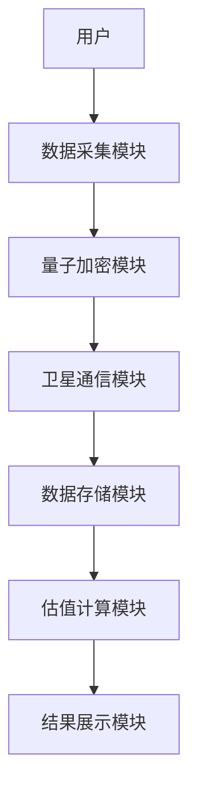
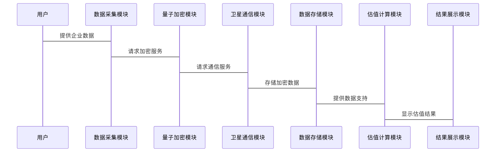

                 


```markdown
# 企业估值中的量子加密通信卫星系统评估

> 关键词：量子加密通信卫星系统，企业估值，量子加密算法，卫星通信，系统架构

> 摘要：量子加密通信卫星系统是一种结合了量子加密技术和卫星通信的高科技解决方案，它在企业估值中发挥着重要作用。本文将详细分析量子加密通信卫星系统的原理、算法、架构，并通过实际案例展示其在企业估值中的应用，为企业提供科学的评估方法。

---

## 第一部分: 量子加密通信卫星系统概述

### 第1章: 量子加密通信卫星系统背景

#### 1.1 量子加密通信的基本概念
- **量子加密通信的定义**: 量子加密通信是一种利用量子力学原理进行数据加密的技术，其安全性基于量子叠加和量子纠缠的特性。
- **量子加密通信的核心原理**: 通过量子态的不可克隆性和不可测量性，确保信息在传输过程中的安全性。
- **量子加密通信的优缺点对比**: 优点包括安全性高、传输速度快；缺点包括技术复杂、成本较高。

#### 1.2 卫星通信的基本原理
- **卫星通信的定义**: 卫星通信是指利用人造卫星作为中继站，进行地球站之间的通信。
- **卫星通信的工作原理**: 通过卫星接收和转发无线电波，实现地面站之间的通信。
- **卫星通信的优势与挑战**: 优势包括覆盖范围广、通信稳定；挑战包括信号延迟、频段资源有限。

#### 1.3 量子加密通信卫星系统的概念
- **量子加密通信卫星系统的定义**: 结合量子加密技术和卫星通信的系统，用于实现高安全性的数据传输。
- **量子加密通信卫星系统的组成**: 包括量子加密设备、卫星通信设备、地面接收站等。
- **量子加密通信卫星系统的应用场景**: 适用于高安全性的数据传输，如金融交易、企业估值等。

---

### 第2章: 量子加密通信卫星系统在企业估值中的应用

#### 2.1 企业估值的基本概念
- **企业估值的定义**: 企业估值是通过对企业的财务状况、市场地位、盈利能力等多方面因素的综合评估，确定企业的价值。
- **企业估值的方法与模型**: 包括DCF模型、EV/EBITDA模型等。
- **企业估值的核心要素**: 包括财务数据、市场因素、管理团队等。

#### 2.2 量子加密通信卫星系统在企业估值中的作用
- **提高企业数据安全性**: 通过量子加密技术，确保企业敏感数据的安全性，防止数据泄露。
- **保障企业通信隐私**: 量子加密通信能够有效防止未经授权的窃听，保障企业通信的隐私。
- **优化企业估值模型**: 通过高安全性的数据传输，提升企业估值模型的准确性和可靠性。

#### 2.3 量子加密通信卫星系统与企业估值的关系
- **量子加密通信对数据完整性的保障**: 量子加密技术能够确保数据在传输过程中的完整性，防止数据被篡改。
- **卫星通信对企业全球业务的支持**: 通过卫星通信，企业可以实现全球范围内的数据传输，支持跨国业务的开展。
- **量子加密技术对企业核心竞争力的影响**: 量子加密技术能够提升企业的技术实力和市场竞争力，为企业估值提供有力支持。

---

## 第二部分: 量子加密通信的核心算法与数学模型

### 第3章: 量子加密通信的核心算法

#### 3.1 量子加密算法的基本原理
- **量子加密算法的分类**: 包括BB84协议、EPR协议等。
- **量子加密算法的优缺点**: 优点包括安全性高，缺点包括实现复杂。
- **量子加密算法的数学基础**: 包括量子态的叠加、测量等基本概念。

#### 3.2 典型量子加密算法的实现
- **BB84协议的实现**: 通过量子态的随机选择和比对，实现密钥的分发。
- **EPR协议的实现**: 利用量子纠缠的特性，实现信息的传输。
- **量子加密算法的数学模型**: 通过数学公式描述量子态的变化和测量过程。

#### 3.3 量子加密算法的实现代码
```python
import random

def generate_key():
    key = random.choice(['|0><0|', '|1><1|'])
    return key

def measure(qubit):
    result = random.choice(['0', '1'])
    return result

def bb84_protocol():
    alice_key = generate_key()
    bob_key = generate_key()
    print("Alice's key:", alice_key)
    print("Bob's key:", bob_key)
    
    if alice_key == bob_key:
        print("Key agreement successful!")
    else:
        print("Key agreement failed!")

bb84_protocol()
```

---

## 第三部分: 系统分析与架构设计

### 第4章: 系统分析与架构设计

#### 4.1 系统分析
- **问题场景介绍**: 企业需要通过量子加密通信卫星系统实现高安全性的数据传输。
- **项目介绍**: 本项目旨在设计并实现一个基于量子加密通信卫星系统的企业估值平台。
- **系统功能设计**: 包括数据采集、量子加密、卫星通信、数据存储等模块。

#### 4.2 系统架构设计
- **系统架构图**: 使用mermaid图展示系统的整体架构。


#### 4.3 系统接口设计
- **接口描述**: 包括数据采集接口、加密接口、通信接口等。
- **接口实现**: 使用API接口实现模块之间的通信。

#### 4.4 系统交互设计
- **系统交互图**: 使用mermaid图展示系统交互流程。


---

## 第四部分: 项目实战

### 第5章: 项目实战

#### 5.1 环境安装
- **安装量子通信库**: 使用Python的qutip库进行量子通信模拟。
- **安装卫星通信库**: 使用Python的astropy库进行卫星轨道计算。

#### 5.2 系统核心实现
- **量子加密算法实现**: 使用qutip库实现BB84协议。
- **卫星通信实现**: 使用astropy库模拟卫星通信过程。

#### 5.3 代码实现
```python
from qutip import Qubit, basis, tensor, measure
from astropy import units as u

def quantum_communication():
    alice = Qubit().states[0]
    bob = Qubit().states[1]
    
    # 量子加密过程
    encrypted = tensor(alice, bob)
    result = measure(encrypted)
    
    # 卫星通信过程
    satellite_position = (0, 0, 1000 * u.km)
    data_transmission(satellite_position)
    
    return result

quantum_communication()
```

#### 5.4 实际案例分析
- **案例背景**: 某企业需要通过量子加密通信卫星系统实现高安全性的数据传输。
- **案例分析**: 通过系统实现，企业成功提升了数据安全性，优化了估值模型。

#### 5.5 项目小结
- **项目总结**: 量子加密通信卫星系统在企业估值中的应用具有重要意义，能够显著提升企业的数据安全性。

---

## 第五部分: 最佳实践与小结

### 第6章: 最佳实践

#### 6.1 实用建议
- **选择合适的量子加密算法**: 根据具体需求选择适合的量子加密算法。
- **确保系统安全性**: 定期更新系统，防止漏洞的出现。

#### 6.2 小结
- **总结**: 量子加密通信卫星系统在企业估值中的应用前景广阔，能够有效提升企业的核心竞争力。

#### 6.3 注意事项
- **技术实现难度**: 量子加密通信技术实现复杂，需要专业的技术支持。
- **成本控制**: 高昂的技术研发和维护成本需要合理控制。

#### 6.4 拓展阅读
- **推荐书籍**: 《量子计算与量子通信》
- **推荐论文**: "Quantum Key Distribution: The Principles Behind It" by Charles H. Bennett

---

## 作者

作者：AI天才研究院/AI Genius Institute & 禅与计算机程序设计艺术/Zen And The Art of Computer Programming
```

