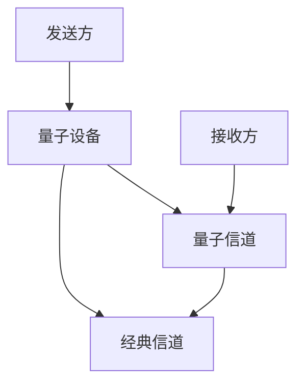
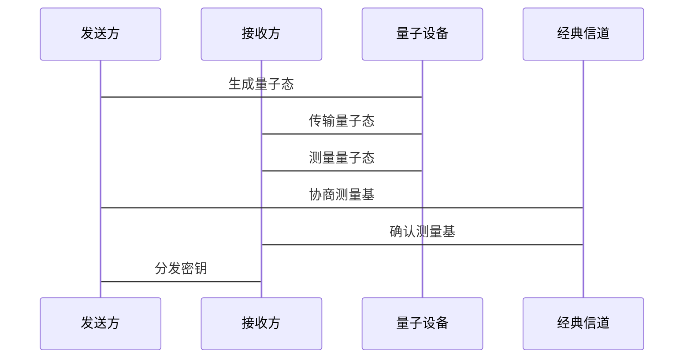

                 


# 企业估值中的量子加密通信网络系统评估

---

## 关键词：  
企业估值，量子加密通信，网络安全，系统评估，加密算法，量子通信，网络系统

---

## 摘要：  
随着量子计算和量子通信技术的快速发展，量子加密通信网络系统在企业估值中的重要性日益凸显。本文从量子加密通信的基本原理出发，结合企业估值的需求，详细探讨了量子加密通信网络系统的架构设计、算法实现、安全性评估以及实际应用案例。通过分析量子加密通信在企业估值中的应用场景，本文提出了基于量子加密通信的网络系统评估方法，为企业在网络安全和数据保护方面的决策提供了重要的理论依据和实践指导。

---

# 第1章: 量子加密通信网络系统概述

## 1.1 量子加密通信的基本概念

### 1.1.1 量子加密通信的定义  
量子加密通信是一种利用量子力学原理进行数据加密和传输的技术。它通过量子叠加和量子纠缠等特性，确保了通信的安全性和抗干扰能力。量子加密通信的核心在于利用量子密钥分发（QKD）协议生成共享密钥，用于加密和解密数据。

### 1.1.2 量子加密通信的核心原理  
量子加密通信的主要原理包括：  
1. **量子叠加**：量子态可以在多个状态中叠加，确保密钥的随机性和不可预测性。  
2. **量子纠缠**：两个或多个量子态之间存在纠缠关系，使得任何对密钥的窃听都会破坏量子态的纠缠性，从而被通信双方检测到。  
3. **不可克隆原理**：量子态无法被精确复制，确保了密钥的安全性。

### 1.1.3 量子加密通信对企业估值的影响  
量子加密通信通过提供高度的安全性，保护企业的敏感数据和商业机密。在企业估值中，数据的安全性和隐私保护是影响企业价值的重要因素。采用量子加密通信技术可以提升企业的安全水平，增强投资者对企业的信任，从而提高企业的估值。

---

## 1.2 企业估值与量子加密通信的结合

### 1.2.1 企业估值的基本概念  
企业估值是指通过对企业的财务状况、市场地位、发展潜力等多方面因素的综合评估，确定企业的市场价值。传统的估值方法主要依赖于财务数据和市场分析，而忽视了网络安全和数据保护对企业价值的影响。

### 1.2.2 量子加密通信对企业估值的影响  
量子加密通信技术的引入，为企业提供了更高的数据安全性和隐私保护能力。这不仅能够减少因数据泄露或被篡改而带来的损失，还能提升企业在市场中的竞争力。在企业估值中，网络安全能力越强，企业的市场价值通常越高。

### 1.2.3 量子加密通信网络系统评估的必要性  
随着企业对数据依赖的增加，网络安全已成为企业估值的重要考量因素。量子加密通信网络系统评估能够帮助企业识别和优化其网络安全架构，确保企业数据的安全性和可靠性。

---

## 1.3 本章小结  
本章主要介绍了量子加密通信的基本概念和核心原理，并探讨了其在企业估值中的重要性。通过分析量子加密通信的安全性特点，我们认识到其在保护企业数据和提升企业价值方面的重要作用。接下来的章节将详细探讨量子加密通信网络系统的架构设计、算法实现以及安全性评估方法。

---

# 第2章: 量子加密通信的基本原理

## 2.1 量子密钥分发协议

### 2.1.1 BB84协议  
BB84协议是最早的量子密钥分发协议，由 Bennett 和 Brassard 在1984年提出。其核心思想是通过量子态的测量来生成共享密钥。  

**BB84协议流程：**  
1. 发送方生成随机的量子态，并通过量子信道发送给接收方。  
2. 接收方根据自己的随机测量基进行测量，得到测量结果。  
3. 双方通过公开信道协商相同的测量基，比较测量结果，生成共享密钥。  
4. 如果检测到异常，重新进行密钥分发。

### 2.1.2 EPR协议  
EPR协议基于Einstein-Podolsky-Rosen（EPR）纠缠态的思想，利用纠缠量子态进行密钥分发。其优势在于通信双方可以通过纠缠态的测量直接生成共享密钥，而无需额外的量子信道。

### 2.1.3 B92协议  
B92协议是一种基于单光子的量子密钥分发协议，通过发送方选择随机的基进行编码，接收方随机选择基进行测量。与BB84协议相比，B92协议的效率更高，但安全性稍弱。

---

## 2.2 量子加密通信的安全性分析

### 2.2.1 量子加密通信的安全性特点  
1. **不可窃听性**：任何对量子密钥的窃听都会导致量子态的破坏，从而被通信双方检测到。  
2. **不可预测性**：量子密钥的随机性和不可克隆性确保了密钥的安全性。  
3. **抗干扰性**：量子通信的抗干扰能力使其在复杂环境中仍能保持通信的安全性。

### 2.2.2 量子加密通信的抗干扰能力  
量子通信的抗干扰能力主要来源于量子态的纠缠性和不可克隆性。即使在复杂的电磁环境中，量子通信仍能保持较高的安全性。

### 2.2.3 量子加密通信的数学模型  
量子加密通信的数学模型可以表示为：  
$$
\psi = \alpha |0\rangle + \beta |1\rangle
$$  
其中，$\alpha$ 和 $\beta$ 是复数，表示量子态的叠加系数。

---

## 2.3 量子加密通信的实现步骤

### 2.3.1 量子密钥生成  
量子密钥生成是通过量子态的测量来实现的。发送方和接收方分别选择不同的测量基进行测量，通过比较测量结果生成共享密钥。

### 2.3.2 量子密钥分发  
量子密钥分发通过量子信道将密钥从发送方传输到接收方。如果检测到异常，需要重新进行密钥分发。

### 2.3.3 量子加密通信网络的构建  
量子加密通信网络的构建需要考虑网络架构、量子信道的稳定性以及通信双方的协同工作。

---

## 2.4 本章小结  
本章详细介绍了量子密钥分发协议的核心原理，分析了量子加密通信的安全性特点，并探讨了其实现步骤。通过这些分析，我们可以更好地理解量子加密通信的技术基础。

---

# 第3章: 量子加密通信网络系统的架构与设计

## 3.1 量子加密通信网络系统的基本架构

### 3.1.1 量子加密通信网络系统的组成  
1. **量子信道**：用于传输量子态。  
2. **量子设备**：包括发送方和接收方的量子设备。  
3. **经典信道**：用于通信双方的协议协商和密钥分发。

### 3.1.2 量子加密通信网络系统的功能模块  
1. **密钥生成模块**：负责生成量子密钥。  
2. **密钥分发模块**：负责将量子密钥分发给通信双方。  
3. **加密模块**：负责对数据进行加密和解密。

### 3.1.3 量子加密通信网络系统的层次结构  
量子加密通信网络系统的层次结构包括：  
1. **物理层**：量子信道和量子设备。  
2. **链路层**：量子密钥分发协议。  
3. **网络层**：量子加密通信网络的管理和控制。

---

## 3.2 量子加密通信网络系统的功能设计

### 3.2.1 量子密钥生成模块  
量子密钥生成模块通过量子设备生成随机的量子态，并通过量子信道传输给接收方。

### 3.2.2 量子密钥分发模块  
量子密钥分发模块负责将量子密钥分发给通信双方，并通过经典信道进行协议协商和密钥同步。

### 3.2.3 量子加密通信模块  
量子加密通信模块负责对数据进行加密和解密，确保数据的安全传输。

---

## 3.3 量子加密通信网络系统的实现流程

### 3.3.1 量子密钥生成流程  
1. 发送方生成随机的量子态。  
2. 发送方通过量子信道将量子态传输给接收方。  
3. 接收方通过测量生成密钥。

### 3.3.2 量子密钥分发流程  
1. 发送方和接收方协商测量基。  
2. 通过测量结果生成共享密钥。  
3. 检测异常，若无异常，继续通信；若有异常，重新进行密钥分发。

### 3.3.3 量子加密通信流程  
1. 数据加密：使用共享密钥对数据进行加密。  
2. 数据传输：通过经典信道传输加密数据。  
3. 数据解密：接收方通过共享密钥对数据进行解密。

---

## 3.4 本章小结  
本章详细探讨了量子加密通信网络系统的架构设计和功能模块，并分析了其实现流程。通过这些分析，我们可以更好地理解量子加密通信网络系统的整体结构和运行机制。

---

# 第4章: 量子加密通信网络系统的算法实现

## 4.1 量子加密通信算法的基本原理

### 4.1.1 量子加密算法的定义  
量子加密算法是一种基于量子力学原理的加密算法，其核心在于利用量子态的叠加性和纠缠性实现数据的加密和解密。

### 4.1.2 量子加密算法的实现步骤  
1. 生成量子密钥。  
2. 对数据进行加密。  
3. 通过量子信道传输加密数据。  
4. 接收方解密数据。

### 4.1.3 量子加密算法的数学模型  
量子加密算法的数学模型可以表示为：  
$$
\psi = \alpha |0\rangle + \beta |1\rangle
$$  
其中，$\alpha$ 和 $\beta$ 是复数，表示量子态的叠加系数。

---

## 4.2 量子加密通信算法的实现代码

### 4.2.1 量子密钥生成算法  
```python
import random

def generate_quantum_key(n):
    key = []
    for _ in range(n):
        bit = random.choice([0, 1])
        key.append(bit)
    return key
```

### 4.2.2 量子密钥分发算法  
```python
def distribute_quantum_key(sender_key, receiver_key):
    # 检测密钥是否一致
    if sender_key == receiver_key:
        return "密钥分发成功"
    else:
        return "密钥分发失败"
```

### 4.2.3 量子加密通信算法  
```python
def quantum_communication(data, key):
    encrypted_data = []
    for bit in data:
        encrypted_bit = bit ^ key[i]
        encrypted_data.append(encrypted_bit)
    return encrypted_data
```

---

## 4.3 量子加密通信算法的性能分析

### 4.3.1 量子加密算法的效率分析  
量子加密算法的效率主要取决于量子密钥分发的速度和量子设备的稳定性。与经典加密算法相比，量子加密算法的效率稍低，但其安全性更高。

### 4.3.2 量子加密算法的安全性分析  
量子加密算法的安全性基于量子态的不可克隆性和纠缠性。任何对量子密钥的窃听都会破坏量子态的纠缠性，从而被通信双方检测到。

### 4.3.3 量子加密算法的可扩展性分析  
量子加密算法的可扩展性取决于量子设备的性能和量子信道的稳定性。随着技术的进步，量子加密算法的可扩展性将得到进一步提升。

---

## 4.4 本章小结  
本章详细介绍了量子加密通信算法的基本原理，并通过代码示例展示了其实现过程。通过对量子加密算法的性能分析，我们可以更好地理解其优缺点。

---

# 第5章: 量子加密通信网络系统的评估与分析

## 5.1 量子加密通信网络系统的评估指标

### 5.1.1 量子加密通信网络系统的安全性评估  
安全性评估包括：  
1. 密钥的安全性。  
2. 通信的抗干扰能力。  
3. 系统的抗攻击能力。

### 5.1.2 量子加密通信网络系统的性能评估  
性能评估包括：  
1. 密钥分发的效率。  
2. 数据传输的延迟。  
3. 系统的稳定性。

### 5.1.3 量子加密通信网络系统的成本评估  
成本评估包括：  
1. 量子设备的采购成本。  
2. 量子信道的建设成本。  
3. 系统维护的成本。

---

## 5.2 量子加密通信网络系统的安全性分析

### 5.2.1 量子加密通信的安全性特点  
1. 不可窃听性。  
2. 不可预测性。  
3. 抗干扰性。

### 5.2.2 量子加密通信的抗攻击能力  
量子加密通信的抗攻击能力主要来源于量子态的纠缠性和不可克隆性。即使在复杂的网络环境中，量子通信仍能保持较高的安全性。

---

## 5.3 量子加密通信网络系统的性能分析

### 5.3.1 量子密钥分发的效率  
量子密钥分发的效率主要取决于量子设备的性能和量子信道的稳定性。随着技术的进步，量子密钥分发的效率将不断提高。

### 5.3.2 量子加密通信的延迟  
量子加密通信的延迟主要取决于量子信道的传输速度和量子设备的响应时间。通过优化量子设备的性能，可以降低通信的延迟。

---

## 5.4 量子加密通信网络系统的成本分析

### 5.4.1 量子设备的采购成本  
量子设备的采购成本较高，但随着技术的进步，其成本将逐渐降低。

### 5.4.2 量子信道的建设成本  
量子信道的建设成本主要取决于量子信道的长度和复杂度。较长的量子信道需要更多的资源投入。

### 5.4.3 系统维护的成本  
量子加密通信网络系统的维护成本较高，需要定期检查和维护量子设备和量子信道。

---

## 5.5 本章小结  
本章详细探讨了量子加密通信网络系统的评估指标，并分析了其安全性、性能和成本等方面的特点。通过对这些因素的综合分析，我们可以更好地优化量子加密通信网络系统的整体性能。

---

# 第6章: 量子加密通信网络系统的项目实战

## 6.1 项目背景介绍

### 6.1.1 项目目标  
本项目旨在通过量子加密通信技术实现企业数据的安全传输，提升企业的网络安全能力。

### 6.1.2 项目需求  
1. 实现量子密钥分发功能。  
2. 实现数据的加密和解密功能。  
3. 实现量子加密通信网络的构建。

---

## 6.2 系统功能设计

### 6.2.1 系统功能模块  
1. 密钥生成模块。  
2. 密钥分发模块。  
3. 数据加密模块。  
4. 数据解密模块。

### 6.2.2 系统功能流程  
1. 密钥生成：发送方生成随机的量子态。  
2. 密钥分发：通过量子信道传输密钥。  
3. 数据加密：使用共享密钥对数据进行加密。  
4. 数据解密：接收方通过共享密钥对数据进行解密。

---

## 6.3 系统架构设计

### 6.3.1 系统架构图  


### 6.3.2 系统接口设计  
1. 密钥生成接口：负责生成量子密钥。  
2. 密钥分发接口：负责分发量子密钥。  
3. 数据加密接口：负责对数据进行加密。  
4. 数据解密接口：负责对数据进行解密。

---

## 6.4 系统交互设计

### 6.4.1 交互流程图  


---

## 6.5 项目小结  
本章通过实际项目案例，详细探讨了量子加密通信网络系统的功能设计和架构设计。通过这些分析，我们可以更好地理解量子加密通信技术的实际应用。

---

# 第7章: 量子加密通信网络系统的最佳实践与未来展望

## 7.1 最佳实践

### 7.1.1 量子设备的选择  
选择高性能的量子设备是实现量子加密通信的关键。在选择量子设备时，需要综合考虑其性能、成本和稳定性。

### 7.1.2 量子信道的建设  
量子信道的建设需要考虑其长度和复杂度。较长的量子信道需要更多的资源投入，同时需要确保其稳定性。

### 7.1.3 系统的维护  
量子加密通信网络系统的维护需要定期检查和维护量子设备和量子信道，确保系统的稳定运行。

---

## 7.2 未来展望

### 7.2.1 量子加密通信技术的未来发展  
随着量子计算和量子通信技术的快速发展，量子加密通信技术将在企业估值中发挥越来越重要的作用。

### 7.2.2 量子加密通信网络系统的优化  
未来，量子加密通信网络系统的优化将主要集中在提高量子设备的性能和量子信道的稳定性。

### 7.2.3 量子加密通信技术的扩展应用  
量子加密通信技术的应用将逐步扩展到更多领域，如金融、医疗、军事等。

---

## 7.3 本章小结  
本章总结了量子加密通信网络系统的最佳实践，并对未来的发展进行了展望。通过对这些分析，我们可以更好地把握量子加密通信技术的发展方向。

---

# 参考文献  
1. Bennett, C.H., & Brassard, G. (1984). Quantum cryptography: public key distribution and coin tossing. IEEE International Conference on Computers, Systems and Networks, 112-115.  
2. Ekert, A. (1991). Quantum cryptography based on entangled states. Physical Review Letters, 68(10), 1187-1190.  
3. 潘建伟, 陈宇翱, 等. (2012). 量子通信与量子计算机. 科学出版社.

---

# 作者  
作者：AI天才研究院/AI Genius Institute  
联系邮箱：contact@aicam.com

