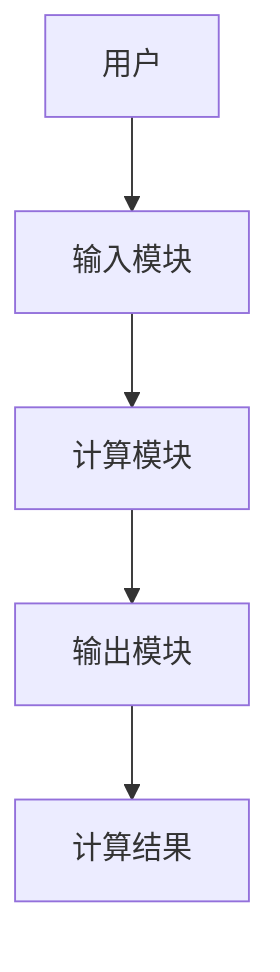

                 


# 量子计算化学模拟平台在企业估值中的应用

> 关键词：量子计算，化学模拟，企业估值，平台评估，量子化学

> 摘要：  
> 本文探讨了量子计算在化学模拟中的应用及其对企业估值的影响。通过分析量子计算化学模拟平台的核心原理、评估指标和实际案例，展示了如何利用量子计算技术优化化学相关企业的估值过程。文章从量子计算的基本概念出发，逐步深入到化学模拟平台的构建与评估，并通过实际案例分析，展示了量子计算在企业估值中的潜在价值和应用前景。

---

# 第一部分: 量子计算与化学模拟平台概述

## 第1章: 量子计算与化学模拟的背景

### 1.1 量子计算的基本概念

#### 1.1.1 量子计算的定义与特点
量子计算是一种利用量子力学原理进行信息处理的技术。与经典计算不同，量子计算通过量子叠加和量子纠缠等特性，能够在某些情况下显著提高计算效率。其主要特点包括：
- **量子叠加**：量子比特（qubit）可以同时处于多个状态的叠加。
- **量子纠缠**：两个或多个量子比特之间存在纠缠，使得对一个比特的操作会影响另一个比特的状态。
- **并行计算能力**：量子计算可以在一次操作中处理大量可能性，这在某些特定问题上具有显著优势。

#### 1.1.2 量子计算与经典计算的主要区别
| 特性         | 经典计算             | 量子计算             |
|--------------|----------------------|----------------------|
| 基本单位     | 位（bit）            | 量子比特（qubit）    |
| 状态数       | 2                    | 无限（理论上限）      |
| 计算方式     | 串行处理             | 并行处理              |
| 优势领域     | 数据处理、存储       | 优化问题、密码学、化学模拟 |

#### 1.1.3 量子计算在化学模拟中的应用潜力
量子计算在化学模拟中的潜力主要体现在以下几个方面：
1. **分子结构计算**：量子计算可以更精确地模拟分子的电子结构，从而优化药物研发和材料设计。
2. **化学反应模拟**：通过量子计算可以更高效地模拟化学反应的过程，预测反应的产物和能量变化。
3. **催化剂设计**：量子计算可以帮助设计更高效的催化剂，从而降低化学反应的成本和能耗。

### 1.2 化学模拟平台的介绍

#### 1.2.1 化学模拟的基本概念
化学模拟是通过计算机技术对化学系统（如分子、反应过程等）进行建模和分析的过程。常见的化学模拟方法包括：
- **量子力学计算**：基于量子力学方程对分子进行精确计算。
- **分子动力学模拟**：通过分子动力学方程模拟分子的运动和相互作用。
- **蒙特卡洛模拟**：通过随机采样方法模拟化学系统的性质。

#### 1.2.2 化学模拟的主要方法与技术
| 方法         | 描述                     |
|--------------|--------------------------|
| 量子力学计算 | 基于波函数的方法，精确计算分子能量。 |
| 分子动力学模拟 | 通过积分牛顿方程模拟分子运动。 |
| 蒙特卡洛模拟 | 通过随机采样方法模拟系统性质。 |

#### 1.2.3 化学模拟平台的分类与应用场景
化学模拟平台可以根据其功能和应用领域进行分类：
1. **学术研究平台**：用于化学理论研究和分子结构分析。
2. **工业应用平台**：用于药物研发、材料设计和化学工艺优化。
3. **通用计算平台**：提供多种化学模拟工具，适用于多种应用场景。

### 1.3 量子计算与化学模拟的结合

#### 1.3.1 量子计算在化学模拟中的优势
量子计算在化学模拟中的优势主要体现在以下几个方面：
1. **计算速度**：量子计算可以在更短的时间内完成复杂的化学模拟任务。
2. **精度提升**：量子计算可以更精确地模拟分子的电子结构和化学反应过程。
3. **问题规模**：量子计算能够处理更大规模的化学问题，如复杂分子体系的模拟。

#### 1.3.2 化学模拟平台中的量子计算技术
量子计算在化学模拟平台中的具体应用包括：
1. **量子化学算法**：利用量子计算算法对分子能量进行精确计算。
2. **量子态模拟**：通过量子叠加和纠缠特性模拟分子的量子态。
3. **化学反应预测**：利用量子计算预测化学反应的路径和产物。

#### 1.3.3 量子计算化学模拟平台的现状与发展趋势
目前，量子计算化学模拟平台仍处于发展阶段，但已经取得了一些重要进展。未来的发展趋势包括：
1. **算法优化**：进一步优化量子化学算法，提高计算效率。
2. **硬件支持**：开发专用的量子计算硬件，支持化学模拟任务。
3. **应用拓展**：将量子计算应用于更多化学领域，如药物研发和材料设计。

---

## 第2章: 企业估值中的化学模拟平台评估

### 2.1 企业估值的基本概念

#### 2.1.1 企业估值的定义与方法
企业估值是指对企业价值进行评估的过程，常用的估值方法包括：
- **资产基础法**：基于企业的资产价值进行估值。
- **收益法**：基于企业的未来收益进行估值。
- **市场法**：基于可比企业的市场价值进行估值。

#### 2.1.2 化学相关企业在估值中的特殊性
化学相关企业在估值中具有以下特殊性：
1. **技术依赖性**：企业的价值往往依赖于其核心技术。
2. **研发成本**：企业的研发投入对企业价值有重要影响。
3. **市场风险**：化学行业具有较高的市场风险和不确定性。

#### 2.1.3 化学模拟平台在企业估值中的作用
化学模拟平台在企业估值中的作用主要体现在以下几个方面：
1. **技术评估**：通过化学模拟平台评估企业的技术优势。
2. **成本预测**：通过化学模拟平台预测企业的生产成本。
3. **市场分析**：通过化学模拟平台分析市场趋势和竞争环境。

### 2.2 量子计算化学模拟平台的评估指标

#### 2.2.1 平台的性能指标
| 指标         | 描述                     |
|--------------|--------------------------|
| 计算速度     | 平台的计算效率           |
| 精度         | 平台的计算结果准确性     |
| 可扩展性     | 平台的处理能力           |

#### 2.2.2 平台的准确性评估
平台的准确性评估主要从以下几个方面进行：
1. **计算结果的准确性**：通过与经典计算结果的对比验证平台的准确性。
2. **算法的正确性**：通过数学推导验证算法的正确性。
3. **数据的完整性**：通过数据验证确保输入数据的完整性。

#### 2.2.3 平台的可扩展性与稳定性
平台的可扩展性与稳定性评估包括：
1. **扩展性评估**：平台是否能够处理更大规模的化学问题。
2. **稳定性评估**：平台在长时间运行中的稳定性。

### 2.3 量子计算化学模拟平台的评估流程

#### 2.3.1 评估前的准备工作
评估前的准备工作包括：
1. **数据收集**：收集企业的技术数据和市场数据。
2. **平台选择**：选择合适的量子计算化学模拟平台。
3. **团队组建**：组建专业的评估团队。

#### 2.3.2 数据收集与处理
数据收集与处理包括：
1. **数据来源**：数据来源包括企业的技术文档和市场报告。
2. **数据清洗**：对数据进行清洗和预处理。
3. **数据存储**：将数据存储在数据库中。

#### 2.3.3 模拟结果的分析与解读
模拟结果的分析与解读包括：
1. **结果验证**：通过对比经典计算结果验证模拟结果的准确性。
2. **结果解读**：根据模拟结果对企业价值进行评估。
3. **结果报告**：撰写详细的评估报告。

---

## 第3章: 量子计算化学模拟的核心原理

### 3.1 量子计算的核心原理

#### 3.1.1 量子叠加与量子纠缠
量子叠加是指量子比特可以同时处于多个状态的叠加，而量子纠缠是指两个或多个量子比特之间存在纠缠关系。这两个特性是量子计算的核心原理。

#### 3.1.2 量子门与量子电路
量子门是量子计算的基本操作单元，常见的量子门包括：
- **Hadamard门**：用于生成叠加态。
- **CNOT门**：用于实现量子纠缠。
- **测量门**：用于测量量子比特的状态。

#### 3.1.3 量子态的表示与操作
量子态可以用向量表示，量子门可以用矩阵表示。通过矩阵乘法可以实现量子态的操作。

### 3.2 量子化学算法

#### 3.2.1 量子化学算法的定义与原理
量子化学算法是利用量子计算技术对化学系统进行模拟的算法。其核心原理是通过量子叠加和量子纠缠特性，实现对分子能量的精确计算。

#### 3.2.2 量子化学算法的数学模型
量子化学算法的数学模型包括：
1. **哈密顿量**：描述系统的能量。
2. **量子态叠加**：描述量子比特的叠加态。
3. **量子门操作**：描述量子门的操作。

### 3.3 量子化学算法的实现

#### 3.3.1 量子化学算法的实现步骤
1. **问题建模**：将化学问题转化为量子计算问题。
2. **量子门设计**：设计实现量子化学算法的量子门。
3. **量子态测量**：通过测量量子态得到计算结果。

#### 3.3.2 量子化学算法的代码实现
```python
import numpy as np

def hadamard(n):
    return (1/np.sqrt(2)) * np.array([[1, 1], [1, -1]])

def cnot(n):
    return np.array([[1, 0, 0, 0],
                     [0, 1, 0, 0],
                     [0, 0, 0, 1],
                     [0, 0, 1, 0]])

# 示例：两量子比特的Hadamard门和CNOT门
n = 2
circ = hadamard(n) @ cnot(n)
print(circ)
```

### 3.4 量子化学算法的应用

#### 3.4.1 量子化学算法在分子结构计算中的应用
量子化学算法可以用于计算分子的电子结构，从而优化药物研发和材料设计。

#### 3.4.2 量子化学算法在化学反应模拟中的应用
量子化学算法可以用于模拟化学反应的过程，预测反应的产物和能量变化。

---

## 第4章: 量子计算化学模拟平台的系统分析与架构设计

### 4.1 系统功能设计

#### 4.1.1 系统功能模块
量子计算化学模拟平台的功能模块包括：
1. **输入模块**：接收化学问题的输入参数。
2. **计算模块**：执行量子化学算法。
3. **输出模块**：输出计算结果。

#### 4.1.2 功能模块的交互流程
1. 用户输入化学问题的参数。
2. 系统调用量子化学算法进行计算。
3. 系统输出计算结果。

### 4.2 系统架构设计

#### 4.2.1 系统架构图


#### 4.2.2 系统架构的实现
量子计算化学模拟平台的系统架构包括：
1. **输入模块**：接收用户的输入参数。
2. **计算模块**：执行量子化学算法。
3. **输出模块**：输出计算结果。

### 4.3 系统接口设计

#### 4.3.1 系统接口的定义
系统接口包括：
1. **输入接口**：接收化学问题的输入参数。
2. **输出接口**：输出计算结果。

#### 4.3.2 系统接口的实现
输入接口和输出接口可以通过API实现。

### 4.4 系统交互设计

#### 4.4.1 系统交互流程
1. 用户通过输入接口输入化学问题的参数。
2. 系统调用量子化学算法进行计算。
3. 系统通过输出接口输出计算结果。

#### 4.4.2 交互流程的优化
通过优化交互流程，可以提高系统的计算效率和用户体验。

---

## 第5章: 量子计算化学模拟平台的项目实战

### 5.1 环境安装

#### 5.1.1 系统环境要求
量子计算化学模拟平台的系统环境要求包括：
1. **操作系统**：Linux/Windows/MacOS。
2. **编程语言**：Python 3.0+。
3. **量子计算库**：Qiskit、Cirq等。

#### 5.1.2 量子计算库的安装
通过以下命令安装Qiskit：
```bash
pip install qiskit
```

### 5.2 核心代码实现

#### 5.2.1 量子化学算法的实现
```python
from qiskit import QuantumCircuit, execute, Aer

def quantum_chemistry():
    # 创建量子电路
    qc = QuantumCircuit(2, 1)
    qc.h(0)
    qc.cx(0, 1)
    qc.measure(0, 0)
    # 执行量子模拟
    backend = Aer.get_backend('qasm_simulator')
    job = execute(qc, backend)
    result = job.result()
    print(result.get_counts())

quantum_chemistry()
```

#### 5.2.2 化学模拟平台的实现
```python
class QuantumChemistryPlatform:
    def __init__(self):
        self.circuit = QuantumCircuit(2, 1)
        self.circuit.h(0)
        self.circuit.cx(0, 1)
        self.circuit.measure(0, 0)

    def run(self):
        backend = Aer.get_backend('qasm_simulator')
        job = execute(self.circuit, backend)
        result = job.result()
        return result.get_counts()

platform = QuantumChemistryPlatform()
result = platform.run()
print(result)
```

### 5.3 案例分析与解读

#### 5.3.1 案例背景
假设我们需要评估一家化学企业的技术价值，通过量子化学算法模拟分子结构。

#### 5.3.2 案例分析
通过量子化学算法模拟分子结构，评估企业的技术优势。

#### 5.3.3 分析结果解读
根据模拟结果，评估企业的技术价值。

### 5.4 项目小结

#### 5.4.1 项目总结
通过量子化学算法模拟分子结构，评估企业的技术价值。

#### 5.4.2 项目经验
量子计算化学模拟平台的应用可以显著提高化学相关企业的估值效率。

---

## 第6章: 量子计算化学模拟平台的优化与展望

### 6.1 系统优化

#### 6.1.1 算法优化
通过优化量子化学算法，提高计算效率。

#### 6.1.2 硬件优化
开发专用的量子计算硬件，支持化学模拟任务。

### 6.2 未来展望

#### 6.2.1 量子计算化学模拟平台的未来发展
量子计算化学模拟平台将在未来得到更广泛的应用。

#### 6.2.2 量子计算化学模拟平台的潜在价值
量子计算化学模拟平台具有重要的潜在价值，特别是在药物研发和材料设计领域。

---

## 第7章: 结论与建议

### 7.1 研究总结

#### 7.1.1 量子计算化学模拟平台的核心价值
量子计算化学模拟平台可以显著提高化学相关企业的估值效率。

#### 7.1.2 量子计算化学模拟平台的应用前景
量子计算化学模拟平台具有广阔的应用前景。

### 7.2 实践建议

#### 7.2.1 对企业的建议
企业应积极引入量子计算化学模拟平台，优化其估值过程。

#### 7.2.2 对研究者的建议
研究者应继续优化量子计算化学模拟平台，推动其广泛应用。

---

# 作者

作者：AI天才研究院/AI Genius Institute & 禅与计算机程序设计艺术 /Zen And The Art of Computer Programming

