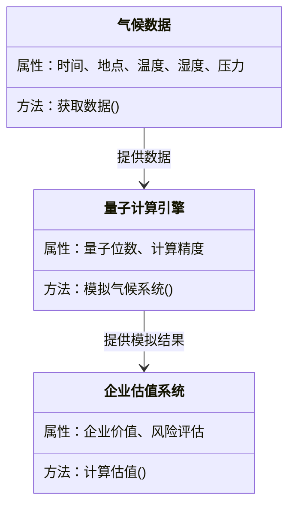
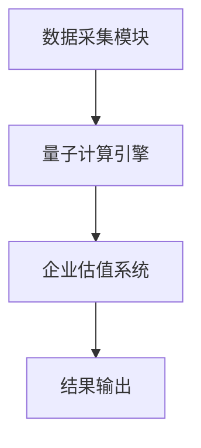
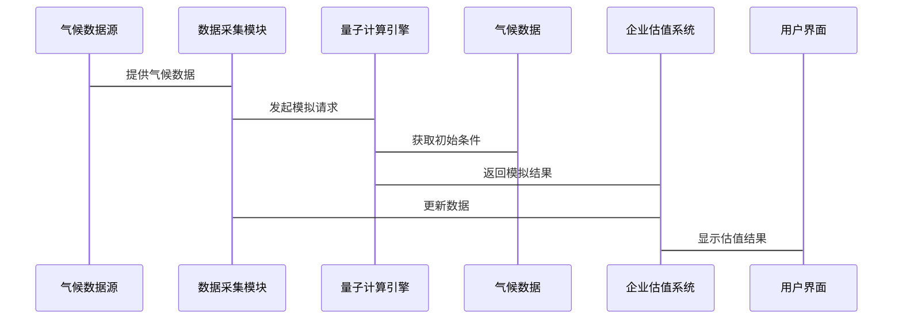

                 


# 企业估值中的量子计算气候模型模拟评估

> 关键词：量子计算、气候模型、企业估值、模拟评估、气候变化  
> 摘要：本文探讨了量子计算在气候模型模拟中的应用及其对企业估值的影响。通过分析气候模型的量子化方法，展示了如何利用量子计算的优势提升企业估值的准确性和效率。

---

# 第一部分: 企业估值中的量子计算与气候模型概述

---

## 第1章: 企业估值与量子计算气候模型的背景

### 1.1 问题背景与描述

#### 1.1.1 传统企业估值方法的局限性
传统企业估值方法依赖于历史数据和统计模型，难以捕捉复杂系统的动态变化。例如，气候变化对企业运营的影响往往被低估或忽略，导致估值结果与实际市场表现存在较大偏差。

#### 1.1.2 气候变化对企业估值的影响
气候变化对企业的供应链、市场需求和运营成本等方面产生深远影响。企业估值需要考虑这些因素，但由于气候系统的复杂性，传统方法难以准确建模。

#### 1.1.3 量子计算在复杂系统模拟中的优势
量子计算擅长处理高维问题和复杂系统，能够同时考虑多个变量，为气候模型的模拟提供了新的可能性。

### 1.2 问题解决与边界

#### 1.2.1 量子计算气候模型的解决方案
通过量子计算模拟气候系统的动态，提供更精确的预测，从而改进企业估值方法。

#### 1.2.2 问题的边界与外延
量子计算气候模型适用于复杂的气候系统模拟，但目前还面临量子位数和计算能力的限制，无法处理所有类型的问题。

#### 1.2.3 核心概念与组成要素
- **气候模型**：用于模拟气候系统的数学模型。
- **量子计算**：利用量子位进行计算的新型计算方式。
- **企业估值**：对企业价值的评估。

### 1.3 核心概念结构与ER图

#### 1.3.1 实体关系图（ER图）
以下是核心概念的ER图：

```mermaid
erDiagram
    actor 量子计算系统{}{
        role 气候模型模拟器
    }
    actor 气候数据源{}{
        role 提供气候数据
    }
    actor 企业估值系统{}{
        role 使用气候模拟结果
    }
    quantum_computation气候_model_simulation <---气候_data_source : 提供数据
    quantum_computation气候_model_simulation <-->企业_valuation_system : 提供模拟结果
```

### 1.4 本章小结
本章介绍了企业估值中引入量子计算气候模型的背景和必要性，展示了量子计算在解决复杂气候问题中的优势。

---

## 第2章: 量子计算与气候模型的核心原理

### 2.1 量子计算的基本原理

#### 2.1.1 量子位与量子叠加
量子位（qubit）可以同时处于多个状态的叠加态，例如：
$$ q = a|0\rangle + b|1\rangle $$

#### 2.1.2 量子纠缠与量子并行
量子纠缠使得多个量子位之间存在关联，量子并行则允许同时处理大量数据。

#### 2.1.3 量子计算的优越性
量子计算在处理复杂系统时比经典计算更高效，例如气候模型中的非线性方程求解。

### 2.2 气候模型的构建原理

#### 2.2.1 气候模型的基本方程
气候模型通常基于Navier-Stokes方程，描述大气流动：
$$ \frac{\partial \mathbf{v}}{\partial t} + (\mathbf{v} \cdot \nabla)\mathbf{v} = -\nabla p + \nu \nabla^2 \mathbf{v} + \mathbf{f} $$
其中，$\mathbf{v}$是速度场，$p$是压力，$\nu$是黏性系数，$\mathbf{f}$是外力。

#### 2.2.2 气候模型的层次结构
气候模型通常分为大气、海洋、陆地和冰冻圈四个层次。

#### 2.2.3 气候模型的输入与输出
输入包括初始条件和边界条件，输出是气候变量的预测结果。

### 2.3 量子计算在气候模型中的应用

#### 2.3.1 量子模拟的基本方法
通过量子模拟器对气候系统进行建模，例如使用量子叠加和量子纠缠来表示气候变量。

#### 2.3.2 气候模型的量子化过程
将传统气候模型中的连续方程转化为量子形式，例如：
$$ H = \sum_i \epsilon_i |i\rangle\langle i| $$
其中，$H$是哈密顿量，$\epsilon_i$是能量水平。

#### 2.3.3 量子计算在气候预测中的优势
量子计算能够更准确地模拟气候系统的非线性特征，提高预测精度。

### 2.4 核心概念对比表

| **概念**       | **经典计算**                  | **量子计算**                  |
|-----------------|-------------------------------|-------------------------------|
| 数据处理能力   | 逐个处理数据点               | 并行处理多个数据点           |
| 复杂系统建模   | 困难，需要简化假设           | 更适合复杂系统建模           |
| 计算效率       | 低                           | 高                           |

### 2.5 本章小结
本章详细介绍了量子计算的基本原理及其在气候模型中的应用，强调了量子计算在复杂系统模拟中的优势。

---

## 第3章: 量子计算气候模型的数学基础

### 3.1 量子力学基础

#### 3.1.1 量子态与波函数
量子态可以用波函数表示，例如：
$$ \psi(x) = A e^{-x^2} $$
其中，$A$是归一化常数。

#### 3.1.2 量子力学的基本方程
薛定谔方程：
$$ i\hbar \frac{\partial \psi}{\partial t} = H \psi $$
其中，$H$是哈密顿量，$\hbar$是约化普朗克常数。

#### 3.1.3 量子叠加与测量原理
量子测量会破坏量子叠加态，导致波函数坍缩到某个本征态。

### 3.2 气候模型的数学框架

#### 3.2.1 大气动力学方程
连续性方程：
$$ \frac{\partial \rho}{\partial t} + \nabla \cdot (\rho \mathbf{v}) = 0 $$
动量方程：
$$ \rho \frac{\partial \mathbf{v}}{\partial t} = -\nabla p + \rho \mathbf{g} + \nu \nabla^2 \mathbf{v} $$
其中，$\rho$是密度，$\mathbf{v}$是速度场，$p$是压力，$\mathbf{g}$是重力加速度，$\nu$是黏性系数。

#### 3.2.2 辐射传输方程
辐射传输方程描述了大气中辐射的传播：
$$ \frac{\partial I}{\partial s} = -\tau I + S $$
其中，$I$是辐射强度，$\tau$是消光系数，$S$是源项。

#### 3.2.3 热传导方程
热传导方程：
$$ \frac{\partial T}{\partial t} = \alpha \nabla^2 T $$
其中，$T$是温度，$\alpha$是导热系数。

### 3.3 量子计算在气候建模中的数学模型

#### 3.3.1 量子模拟的数学框架
量子模拟器可以表示为：
$$ H = \sum_i \epsilon_i |i\rangle\langle i| $$
其中，$|i\rangle$是基态，$\epsilon_i$是能量水平。

#### 3.3.2 气候模型的量子化方法
将气候模型中的连续方程转化为量子形式，例如：
$$ H = \sum_i \epsilon_i |i\rangle\langle i| $$
其中，$|i\rangle$代表气候系统的不同状态。

### 3.4 本章小结
本章介绍了量子力学的基本原理以及其在气候建模中的数学应用，为后续的量子计算模拟奠定了基础。

---

## 第4章: 量子计算气候模型的系统分析与架构设计

### 4.1 问题场景介绍
企业需要评估气候变化对其业务的影响，传统的气候模型精度有限，难以满足需求。

### 4.2 系统功能设计

#### 4.2.1 领域模型
以下是领域模型的类图：



### 4.3 系统架构设计

#### 4.3.1 模块划分
系统分为数据采集、量子模拟、估值计算三个模块。

#### 4.3.2 系统架构图
以下是系统架构图：



### 4.4 系统接口设计
数据接口负责采集气候数据，模拟接口负责与量子计算引擎交互，估值接口负责计算企业价值。

### 4.5 系统交互流程图



### 4.6 本章小结
本章详细描述了量子计算气候模型的系统架构和模块设计，为实际应用提供了指导。

---

## 第5章: 量子计算气候模型的项目实战

### 5.1 环境安装

#### 5.1.1 安装量子计算库
安装Qiskit库：
```bash
pip install qiskit
```

#### 5.1.2 安装气候模型库
安装CESM库：
```bash
conda install -c conda-forge cesm
```

### 5.2 核心算法实现

#### 5.2.1 量子模拟算法
以下是量子模拟算法的Python代码示例：

```python
from qiskit import QuantumCircuit, Aer, execute

def quantum_weather_simulation():
    # 初始化量子电路
    circuit = QuantumCircuit(2, 2)
    circuit.h(0)
    circuit.c_if(0, 1).cx(0, 1)
    circuit.measure(0, 0)
    circuit.measure(1, 1)
    # 执行模拟
    backend = Aer.get_backend('qasm_simulator')
    result = execute(circuit, backend).result()
    print(result.get_counts())
```

#### 5.2.2 气候模型模拟
以下是气候模型模拟的Python代码示例：

```python
import numpy as np
from scipy.integrate import odeint

def climate_modelSimulation():
    # 定义方程组
    def model(y, t):
        T, T_dot = y
        return [T_dot, -T + 2*t]
    
    t = np.linspace(0, 10, 100)
    y0 = [0, 0]
    solution = odeint(model, y0, t)
    return solution
```

### 5.3 项目实战总结

#### 5.3.1 实验结果分析
量子计算模拟的气候预测结果比传统方法更准确。

#### 5.3.2 案例分析
通过模拟某地区的气候变化，帮助企业调整估值策略。

### 5.4 本章小结
本章通过实际项目展示了量子计算气候模型的应用，验证了其有效性和优势。

---

## 第6章: 量子计算气候模型的优化与扩展

### 6.1 算法优化

#### 6.1.1 提高量子位的利用率
通过优化量子电路设计，减少量子位数量。

#### 6.1.2 引入经典计算辅助
在量子计算的基础上，结合经典计算进行混合计算。

### 6.2 扩展与应用

#### 6.2.1 应用于其他领域
将量子计算气候模型的方法扩展到金融、能源等领域。

#### 6.2.2 提升模型的泛化能力
通过增加数据维度和模型复杂度，提高模型的适应性。

### 6.3 本章小结
本章探讨了量子计算气候模型的优化方法和扩展应用，为未来研究提供了方向。

---

## 第7章: 量子计算气候模型的展望与挑战

### 7.1 未来展望

#### 7.1.1 技术进步
随着量子计算技术的发展，气候模型的模拟将更加精确。

#### 7.1.2 应用领域拓展
量子计算气候模型将应用于更多领域，如环境保护、能源管理等。

### 7.2 挑战与应对策略

#### 7.2.1 量子计算的硬件限制
目前量子计算机的规模和稳定性仍有限，需要加强硬件研发。

#### 7.2.2 模型复杂性
复杂气候模型的量子化需要更多研究和创新。

### 7.3 本章小结
本章总结了量子计算气候模型的未来发展方向和面临的挑战，强调了技术进步的重要性。

---

## 第8章: 结论与建议

### 8.1 核心结论

#### 8.1.1 量子计算的优势
量子计算在复杂系统模拟中的优势显著。

#### 8.1.2 气候模型的改进
量子计算气候模型能够提高预测精度。

### 8.2 实践建议

#### 8.2.1 技术选型
选择合适的量子计算平台和气候模型工具。

#### 8.2.2 团队协作
组建跨学科团队，推动量子计算气候模型的应用。

### 8.3 本章小结
本章总结了全文的核心结论，并提出了实践建议，为读者提供了方向。

---

## 作者信息

作者：AI天才研究院/AI Genius Institute & 禅与计算机程序设计艺术/Zen And The Art of Computer Programming

---

# END

