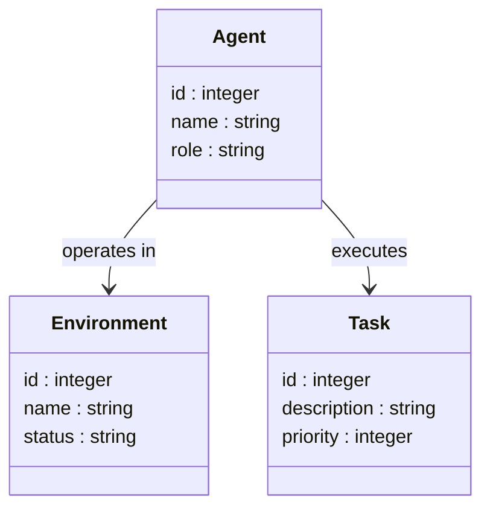
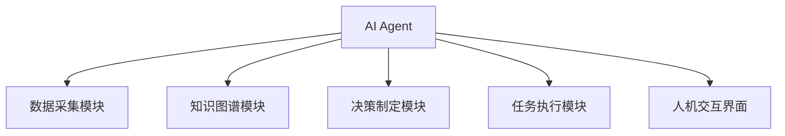

                 


# 企业决策支持系统中的AI Agent角色

## 关键词：企业决策支持系统，AI Agent，人工智能，算法原理，系统架构，项目实战

## 摘要：本文深入探讨了AI Agent在企业决策支持系统中的角色和应用，分析了其核心概念、算法原理、系统架构，并通过项目实战展示了其实际应用。文章从背景介绍开始，详细讲解了AI Agent的基本概念、原理及与相关技术的联系，随后分析了多智能体协作算法、强化学习算法和知识图谱构建算法的原理及其数学模型，最后通过系统架构设计和项目实战，展示了AI Agent在企业决策支持系统中的实际应用和实施过程。

---

# 第一部分: 企业决策支持系统中的AI Agent概述

## 第1章: 企业决策支持系统与AI Agent概述

### 1.1 企业决策支持系统的背景

#### 1.1.1 企业决策支持系统的发展历程
企业决策支持系统（DSS）经历了从早期的基于规则的系统到现代的智能决策支持系统的演变。随着技术的进步，尤其是人工智能（AI）的发展，DSS的功能和复杂性不断提高，为企业决策提供了更加强大的支持。

#### 1.1.2 AI Agent在企业决策中的作用
AI Agent作为DSS的核心组件，能够通过感知环境、推理分析、自主决策和与人协作，显著提升企业的决策效率和准确性。AI Agent的应用帮助企业应对复杂多变的市场环境，优化资源配置，提高竞争力。

#### 1.1.3 当前企业决策支持系统的挑战
当前，企业决策支持系统面临数据多样性、决策实时性、系统可扩展性和安全性等方面的挑战。AI Agent的引入，通过其智能性和学习能力，有效解决了这些问题，提升了系统的适应性和灵活性。

### 1.2 AI Agent的基本概念

#### 1.2.1 什么是AI Agent
AI Agent是一种智能实体，能够感知环境、自主决策、执行任务，并与人类或其他系统进行交互。它具备主动性、反应性、社会性、自主性和学习性等特征。

#### 1.2.2 AI Agent的核心特征
- **主动性**：AI Agent能够主动采取行动，而不是被动响应。
- **反应性**：能够实时感知环境变化并做出反应。
- **社会性**：能够与其他Agent或人类进行协作与竞争。
- **自主性**：具备自主决策的能力，无需外部干预。
- **学习性**：能够通过经验学习和优化自身行为。

#### 1.2.3 AI Agent与传统决策支持系统的区别
传统DSS主要基于规则和数据分析，而AI Agent引入了智能性和自主性，能够进行复杂的情境分析和动态决策，适应性更强。

### 1.3 企业决策支持系统中的AI Agent角色

#### 1.3.1 AI Agent在企业决策中的定位
AI Agent在DSS中扮演决策者、执行者和协调者的角色，能够处理复杂问题，提供决策建议，并执行决策任务。

#### 1.3.2 AI Agent的主要功能与任务
- **数据采集与处理**：收集和分析企业内外部数据。
- **情境分析与推理**：基于数据进行情境分析和逻辑推理。
- **决策制定**：根据分析结果制定最优决策。
- **任务执行**：执行决策任务并反馈结果。
- **协作与沟通**：与其他系统或人员协作，确保决策的顺利执行。

#### 1.3.3 AI Agent与其他技术的协同作用
AI Agent与大数据、云计算、物联网等技术协同工作，形成强大的决策支持能力。例如，结合大数据分析，AI Agent能够更准确地预测市场趋势；结合云计算，实现资源的高效利用。

### 1.4 本章小结
本章介绍了企业决策支持系统的发展背景，详细阐述了AI Agent的基本概念、核心特征及其在企业中的角色。AI Agent的引入，显著提升了DSS的智能化水平，为企业决策提供了更加强大的支持。

---

# 第二部分: AI Agent的核心概念与原理

## 第2章: AI Agent的核心概念与联系

### 2.1 AI Agent的核心概念

#### 2.1.1 AI Agent的定义与分类
AI Agent可以根据智能水平分为反应式Agent和认知式Agent。反应式Agent基于当前感知做出反应，而认知式Agent具备高级推理能力，能够进行长期规划。

#### 2.1.2 AI Agent的属性特征对比表
以下是对不同AI Agent的属性特征对比：

| 特性        | 反应式Agent | 认知式Agent |
|-------------|-------------|-------------|
| 智能水平     | 较低        | 较高        |
| 决策方式     | 基于当前感知 | 基于长期规划 |
| 适用场景     | 简单任务    | 复杂任务    |

#### 2.1.3 AI Agent的实体关系图（ER图）
以下是AI Agent的ER实体关系图：

```mermaid
erDiagram
    class Agent {
        id : integer
        name : string
        role : string
        function : string
    }
    class Environment {
        id : integer
        name : string
        status : string
    }
    class Task {
        id : integer
        description : string
        priority : integer
    }
    Agent --> Environment : operates in
    Agent --> Task : executes
```

### 2.2 AI Agent的原理与机制

#### 2.2.1 AI Agent的基本原理
AI Agent通过感知环境、推理分析、自主决策和执行任务来实现其功能。其基本流程包括数据采集、情境分析、决策制定和任务执行。

#### 2.2.2 AI Agent的感知与推理机制
感知机制通过传感器或数据接口获取环境信息，推理机制基于知识库和推理规则进行分析，得出可能的解决方案。

#### 2.2.3 AI Agent的决策与行动过程
决策机制基于推理结果选择最优行动方案，执行机制将决策转化为具体行动，并反馈执行结果。

### 2.3 AI Agent与相关技术的关系

#### 2.3.1 AI Agent与大数据技术的结合
大数据技术为AI Agent提供了丰富的数据源，AI Agent通过分析这些数据，为企业决策提供支持。

#### 2.3.2 AI Agent与云计算的关系
云计算为AI Agent提供了弹性计算资源，支持其在资源密集型任务中的高效运行。

#### 2.3.3 AI Agent与物联网的协同
物联网设备为AI Agent提供了实时的环境感知数据，AI Agent则通过分析这些数据，优化物联网设备的运行。

### 2.4 本章小结
本章详细分析了AI Agent的核心概念、基本原理及其与相关技术的联系。通过对比不同类型的AI Agent，明确了其适用场景和功能特点。

---

# 第三部分: AI Agent的算法原理与数学模型

## 第3章: AI Agent的算法原理

### 3.1 多智能体协作算法

#### 3.1.1 多智能体协作的基本原理
多智能体协作算法通过多个Agent的协同工作，实现复杂任务的分解与完成。每个Agent负责特定的任务模块，通过通信和协调完成整体目标。

#### 3.1.2 多智能体协作的实现流程
1. 任务分解：将整体任务分解为多个子任务。
2. Agent分配：根据每个Agent的能力分配子任务。
3. 协作通信：通过通信协议进行信息交换和任务协调。
4. 任务执行：各Agent协同完成子任务，实现整体目标。

#### 3.1.3 多智能体协作的优缺点分析
- **优点**：能够处理复杂任务，提高系统的整体性能。
- **缺点**：协作通信增加了系统复杂性和延迟。

### 3.2 强化学习算法

#### 3.2.1 强化学习的基本概念
强化学习是一种通过试错机制，使Agent在与环境的交互中学习最优策略的算法。

#### 3.2.2 强化学习在AI Agent中的应用
强化学习广泛应用于游戏AI、机器人控制等领域，通过不断试错优化决策策略。

#### 3.2.3 强化学习算法的数学模型
强化学习的核心是Q-learning算法，其数学模型如下：

状态转移概率：
$$ P(s' | s, a) $$
表示在状态s下采取动作a后，转移到状态s'的概率。

奖励函数：
$$ R(s, a, s') $$
表示在状态s采取动作a，转移到状态s'后获得的奖励。

Q值更新公式：
$$ Q(s, a) = Q(s, a) + \alpha [R(s, a, s') + \gamma \max Q(s', a') - Q(s, a)] $$

其中，α是学习率，γ是折扣因子。

### 3.3 知识图谱构建算法

#### 3.3.1 知识图谱的基本概念
知识图谱是一种以图结构形式表示知识的语义网络，节点表示实体，边表示实体之间的关系。

#### 3.3.2 知识图谱构建的流程
1. 数据采集：从多种数据源收集数据。
2. 数据清洗：去除噪声数据，确保数据质量。
3. 实体识别与链接：识别实体并建立关联。
4. 关系抽取：提取实体之间的关系。
5. 知识图谱存储：将构建的知识图谱存储在数据库中。

#### 3.3.3 知识图谱在AI Agent中的应用
知识图谱为AI Agent提供了丰富的知识库，支持其进行语义理解、实体识别和关系推理。

### 3.4 本章小结
本章详细讲解了多智能体协作算法、强化学习算法和知识图谱构建算法的原理及其数学模型，为AI Agent的实现提供了理论基础。

---

# 第四部分: AI Agent的系统分析与架构设计

## 第4章: 企业决策支持系统的架构设计

### 4.1 系统需求分析

#### 4.1.1 项目背景与目标
本项目旨在开发一个基于AI Agent的企业决策支持系统，提升企业的决策效率和准确性。

#### 4.1.2 系统功能需求
- 数据采集与处理模块：实时采集企业内外部数据。
- 情境分析模块：基于知识图谱进行情境分析。
- 决策制定模块：通过强化学习算法制定决策。
- 任务执行模块：执行决策任务并反馈结果。
- 人机交互界面：提供友好的用户界面，方便用户操作。

#### 4.1.3 系统非功能需求
- 可扩展性：支持系统的功能扩展和性能优化。
- 安全性：确保数据的安全性和系统的稳定性。
- 实时性：支持实时数据处理和快速决策。

### 4.2 系统功能设计

#### 4.2.1 领域模型设计
以下是系统领域的类图：



#### 4.2.2 系统架构设计
以下是系统的总体架构图：



#### 4.2.3 接口设计与交互流程
系统通过RESTful API与外部系统进行交互，交互流程如下：

1. 用户通过人机交互界面提交决策请求。
2. AI Agent接收请求，启动数据采集模块获取相关数据。
3. 知识图谱模块对数据进行分析和推理，生成决策建议。
4. 决策制定模块结合强化学习算法，选择最优决策方案。
5. 任务执行模块执行决策任务，并将结果反馈给用户。

### 4.3 本章小结
本章详细分析了企业决策支持系统的功能需求和系统架构设计，明确了各模块的职责和交互流程。

---

# 第五部分: AI Agent的项目实战

## 第5章: 项目实战

### 5.1 环境安装与配置

#### 5.1.1 环境需求
- 操作系统：Linux/Windows/MacOS
- Python版本：3.6+
- 依赖库：numpy, pandas, scikit-learn, tensorflow

#### 5.1.2 安装步骤
1. 安装Python和必要的依赖库。
2. 安装TensorFlow和Keras框架。
3. 安装知识图谱构建工具，如NetworkX。

### 5.2 核心代码实现

#### 5.2.1 数据采集模块
以下是数据采集模块的Python代码示例：

```python
import requests
import json

def fetch_data(url):
    response = requests.get(url)
    if response.status_code == 200:
        return json.loads(response.text)
    else:
        return None
```

#### 5.2.2 知识图谱构建模块
以下是知识图谱构建模块的代码示例：

```python
import networkx as nx

def build_knowledge_graph(data):
    G = nx.Graph()
    for item in data:
        G.add_node(item['entity'])
        for relation in item['relations']:
            G.add_edge(item['entity'], relation['target'], weight=relation['weight'])
    return G
```

#### 5.2.3 决策制定模块
以下是决策制定模块的代码示例：

```python
import numpy as np

def reinforcement_learning(env, num_episodes=1000):
    Q = np.zeros((env.observation_space, env.action_space))
    for episode in range(num_episodes):
        state = env.reset()
        while not done:
            action = np.argmax(Q[state])
            next_state, reward, done = env.step(action)
            Q[state][action] += reward
    return Q
```

### 5.3 实际案例分析

#### 5.3.1 案例背景
某企业需要优化其供应链管理，希望通过AI Agent进行决策支持。

#### 5.3.2 数据分析与处理
通过数据采集模块，系统收集了供应商、生产成本、市场需求等数据。

#### 5.3.3 知识图谱构建
基于收集的数据，构建了企业供应链的知识图谱，明确了各实体之间的关系。

#### 5.3.4 决策制定
通过强化学习算法，系统优化了供应链的库存管理和生产计划，提高了企业的运营效率。

### 5.4 本章小结
本章通过实际案例展示了AI Agent在企业决策支持系统中的应用，详细讲解了系统的实现过程和实际效果。

---

# 第六部分: 总结与展望

## 第6章: 总结与展望

### 6.1 最佳实践与经验分享

#### 6.1.1 项目开发经验
在AI Agent的开发过程中，需要注意算法的选择、系统的可扩展性和数据的安全性。

#### 6.1.2 代码实现技巧
建议使用高效的算法和工具，注重代码的可读性和可维护性。

### 6.2 本章小结
本章总结了AI Agent在企业决策支持系统中的应用经验，提出了开发过程中的注意事项和优化建议。

### 6.3 注意事项

#### 6.3.1 系统安全
确保系统的数据安全和系统稳定性。

#### 6.3.2 算法优化
根据实际需求，不断优化算法性能，提高决策效率。

### 6.4 拓展阅读

#### 6.4.1 推荐书籍
- 《人工智能：一种现代的方法》
- 《机器学习实战》

#### 6.4.2 技术博客
建议关注行业内的最新技术动态和优秀实践案例。

---

# 作者：AI天才研究院/AI Genius Institute & 禅与计算机程序设计艺术/Zen And The Art of Computer Programming

---

以上是《企业决策支持系统中的AI Agent角色》的文章内容，希望对您有所帮助！

