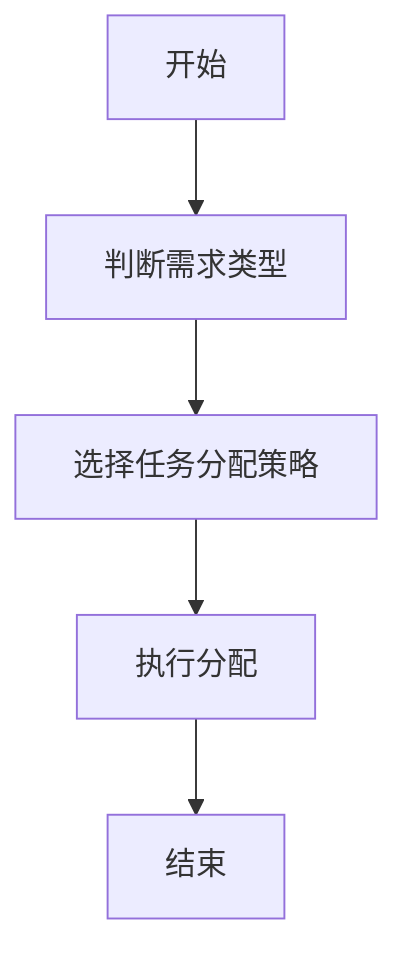
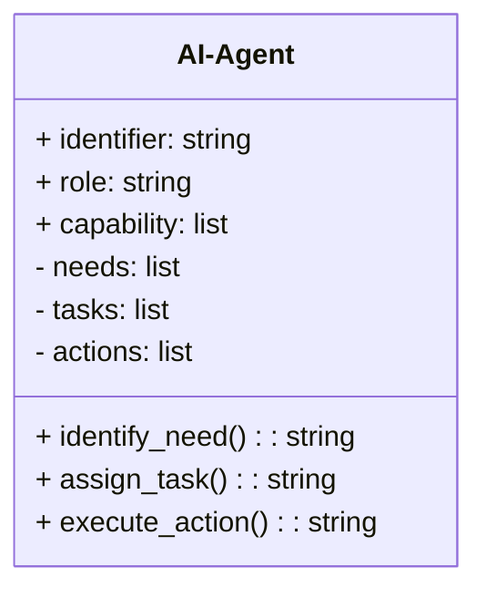

                 


# 企业如何识别AI Agent的应用需求

## 关键词：企业识别，AI Agent，需求分析，系统架构，项目实战，数学模型，技术博客

## 摘要：本文系统地介绍企业如何识别AI Agent的应用需求，从问题背景到算法原理，从系统架构到项目实战，全面解析AI Agent的需求识别过程。通过理论与实践相结合，为企业提供实用的指导。

## 第一部分: 问题背景与描述

### 第1章: 问题背景与描述

#### 1.1 问题背景
- 从传统系统到AI Agent的演进：随着技术进步，企业逐渐从传统软件转向智能化AI Agent，以提升效率和决策能力。
- 企业数字化转型中的AI Agent角色：AI Agent在企业数字化转型中充当智能决策者和执行者的角色，推动业务流程优化。
- 当前企业面临的AI Agent需求识别挑战：需求不明确、技术复杂性和资源有限性是企业识别AI Agent需求的主要挑战。

#### 1.2 问题描述
- 企业需求识别的痛点分析：需求模糊、缺乏专业人才、技术选型复杂等问题增加了需求识别的难度。
- AI Agent在企业中的应用场景：客户服务、流程自动化、智能监控等领域展示了AI Agent的广泛应用。
- 需求识别的关键问题与边界：明确需求范围、选择合适的技术方案以及评估实施可行性是需求识别的关键。

## 第二部分: 核心概念与联系

### 第2章: AI Agent的核心概念与联系

#### 2.1 核心概念原理
- AI Agent的基本定义与特征：智能性、自主性、反应性、社会性等特征使其区别于传统软件。
- AI Agent与传统软件的区别：基于规则的执行与智能决策能力的差异。
- AI Agent的分类与应用场景：根据功能分为决策型、执行型和混合型，应用于不同业务场景。

#### 2.2 概念属性特征对比
- AI Agent与传统软件的区别分析：通过表格对比功能、决策方式、灵活性等方面差异。
- 不同类型AI Agent的特征对比：决策型注重分析能力，执行型强调效率，混合型综合两者优势。
- 属性特征的表格总结：总结各类型AI Agent的优缺点及其适用场景。

#### 2.3 ER实体关系图
```mermaid
er
actor(AI Agent, identifier, role, capability)
actor-|{识别}|->need: 需求识别
need-|{分配}|->task: 任务分配
task-|{执行}|->action: 行动执行
```

## 第三部分: 算法原理与实现

### 第3章: 算法原理与实现

#### 3.1 算法原理
- 需求识别的算法流程：数据收集、需求分析、任务分配、结果反馈的流程。
- 基于NLP的需求分析算法：自然语言处理技术用于解析用户需求。
- 基于决策树的任务分配算法：决策树模型帮助选择最优任务分配方案。

#### 3.2 算法实现
- 需求识别的Python代码实现：
```python
def identify_need(user_input):
    # 简单的需求识别算法示例
    return "识别到的需求"
```

- 任务分配的决策树算法：


#### 3.3 数学模型与公式
- 算法的数学模型：决策树的构建过程涉及概率计算和特征权重。
- 详细公式解释：例如，决策树的分裂标准使用信息增益，公式为：
$$ IG(D, a) = H(D) - \sum_{v} H(D_v) $$

## 第四部分: 系统分析与架构设计

### 第4章: 系统分析与架构设计

#### 4.1 问题场景介绍
- 当前企业在AI Agent需求识别中的典型问题：需求不明确、技术选型困难、实施资源不足。

#### 4.2 项目介绍
- 项目目标：建立AI Agent需求识别系统，提高需求识别的准确性和效率。
- 项目范围：覆盖需求收集、分析、分配和反馈全流程。
- 项目约束：数据隐私、系统性能、用户体验等。

#### 4.3 系统功能设计
- 领域模型设计：


#### 4.4 系统架构设计
- 分层架构：


#### 4.5 系统接口设计
- 需求识别接口：
  - 输入：用户需求描述
  - 输出：识别后的具体需求
  - 接口定义：REST API，使用JSON格式。

#### 4.6 系统交互设计
- 需求识别流程：
```mermaid
sequenceDiagram
actor -->+ System: 提交需求
System ->+ AnalysisModule: 分析需求
AnalysisModule ->+ Database: 查询历史数据
Database --> AnalysisModule: 返回分析结果
AnalysisModule ->- System: 生成识别结果
System --> actor: 返回识别结果
```

## 第五部分: 项目实战

### 第5章: 项目实战

#### 5.1 环境安装
- 安装Python和必要的库：
  - 安装Python：下载并安装最新版本的Python。
  - 安装库：`pip install requests`, `pip install beautifulsoup4`, `pip install scikit-learn`。

#### 5.2 系统核心实现源代码
- 需求识别代码：
```python
import requests
from bs4 import BeautifulSoup
from sklearn.tree import DecisionTreeClassifier
from sklearn.preprocessing import LabelEncoder

# 示例代码，具体实现根据需求调整
def identify_need(user_input):
    # 数据预处理
    # 使用决策树模型进行分类
    # 返回识别结果
    pass
```

#### 5.3 代码解读与分析
- 代码结构：函数`identify_need`接收输入，进行数据处理和模型预测，返回结果。
- 模型训练：使用历史数据训练决策树模型，提升识别准确率。

#### 5.4 实际案例分析
- 案例：客户支持AI Agent需求识别。
  - 需求描述：客户提出问题，系统识别需求类型。
  - 分析过程：通过NLP技术分析问题内容，分类到具体需求类型。
  - 结果：准确识别需求，提高客户满意度。

#### 5.5 项目小结
- 成功案例：展示了AI Agent在实际项目中的应用价值。
- 改进建议：优化算法、增加反馈机制、提升用户体验。

## 第六部分: 最佳实践与总结

### 第6章: 最佳实践

#### 6.1 关键成功因素
- 明确的需求识别流程：确保每一步都有清晰的定义和流程。
- 专业的技术团队：具备AI和系统架构的专业知识。
- 及时的反馈机制：根据反馈优化系统。

#### 6.2 注意事项
- 数据隐私保护：确保数据处理符合隐私法规。
- 系统性能优化：提升处理速度和准确性。
- 用户体验设计：确保界面友好，操作简便。

#### 6.3 拓展阅读
- 推荐书籍：《机器学习实战》、《设计模式》。
- 在线资源：Coursera上的AI课程，Kaggle的数据集。

## 结语

识别AI Agent的需求是企业智能化转型的关键步骤。通过本文的系统介绍，读者可以掌握从背景分析到系统实现的全过程，为实际项目提供指导。未来，随着技术的发展，AI Agent的应用将更加广泛和深入。

## 作者

作者：AI天才研究院 & 禅与计算机程序设计艺术

