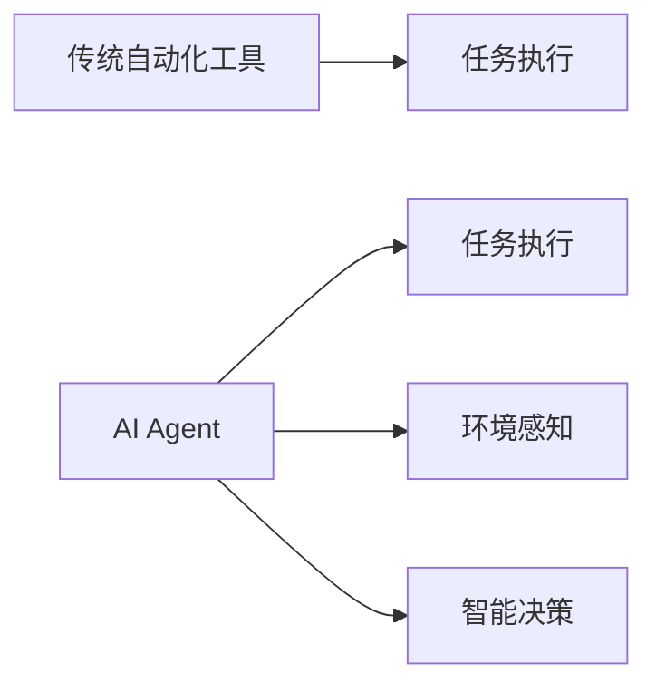
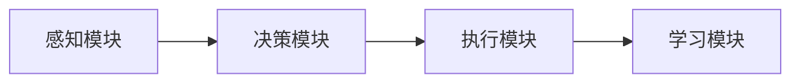
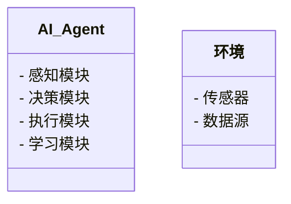
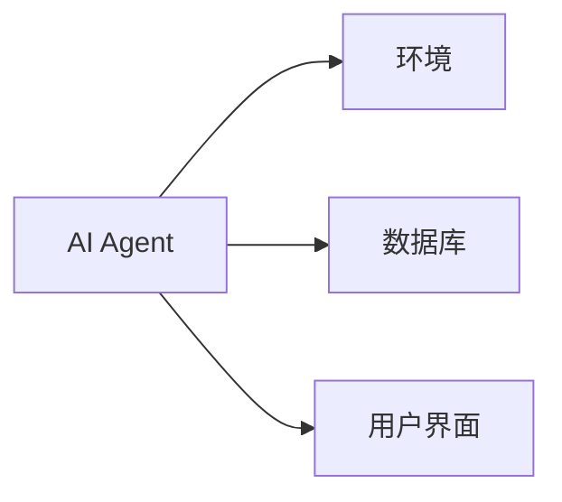
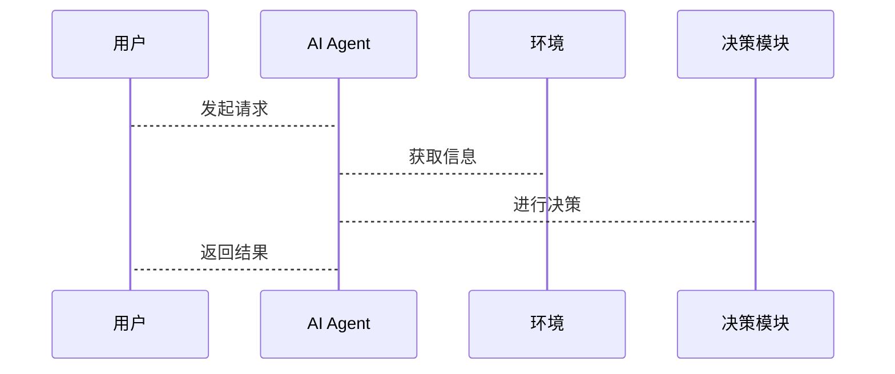

                 


# 企业数字化转型中的AI Agent角色

> 关键词：AI Agent，企业数字化转型，智能自动化，企业架构，技术实现，数字化转型

> 摘要：在企业数字化转型的过程中，AI Agent作为一种智能自动化工具，正在发挥越来越重要的作用。本文将从AI Agent的基本概念、核心原理、系统架构、项目实战以及最佳实践等多个方面，深入探讨AI Agent在企业数字化转型中的角色与应用。通过详细的技术分析和实际案例，本文旨在为企业提供一份全面的AI Agent应用指南，帮助企业更好地实现数字化转型。

---

## 第一部分: 企业数字化转型中的AI Agent角色概述

### 第1章: AI Agent的基本概念与背景

#### 1.1 AI Agent的定义与特点
##### 1.1.1 AI Agent的定义
AI Agent（人工智能代理）是指能够感知环境、自主决策并执行任务的智能实体。它可以是一个软件程序、一个机器人，或者一个嵌入在系统中的智能模块。AI Agent的核心目标是通过智能技术，帮助人类完成复杂任务或优化现有流程。

##### 1.1.2 AI Agent的核心特点
- **智能性**：AI Agent能够理解输入的信息，并基于上下文做出决策。
- **自主性**：AI Agent能够在没有人工干预的情况下自主执行任务。
- **适应性**：AI Agent能够根据环境变化调整自己的行为。
- **协作性**：AI Agent可以与其他系统、人员或AI Agent协同工作。

##### 1.1.3 AI Agent与传统自动化工具的区别
| 特性            | 传统自动化工具             | AI Agent                      |
|-----------------|---------------------------|----------------------------|
| 智能性           | 无或有限                   | 高                           |
| 自主性           | 低                         | 高                           |
| 适应性           | 无                         | 有                           |
| 决策能力         | 无                         | 有                           |

**图1-1 AI Agent与传统自动化工具的对比**



#### 1.2 企业数字化转型的背景
##### 1.2.1 数字化转型的定义与目标
数字化转型是指将企业的业务流程、运营模式和组织结构通过数字化技术进行重构，以实现更高效、更灵活的业务运作。其目标是通过技术手段提升企业的竞争力、客户体验和运营效率。

##### 1.2.2 企业数字化转型中的痛点与挑战
- **流程复杂性**：传统业务流程往往繁琐且效率低下。
- **数据孤岛**：各部门之间的数据无法有效整合，导致信息孤岛。
- **人工依赖**：许多企业仍严重依赖人工操作，难以实现自动化。
- **技术滞后**：部分企业技术基础薄弱，难以支撑数字化转型。

##### 1.2.3 AI Agent在数字化转型中的作用
AI Agent能够通过自动化、智能化的方式优化企业流程，降低人工成本，提升效率。它可以帮助企业在数字化转型中实现以下目标：
- **自动化处理**：自动完成重复性任务。
- **智能决策**：基于数据和模型提供决策支持。
- **实时响应**：快速响应客户需求和市场变化。

#### 1.3 AI Agent在企业中的应用背景
##### 1.3.1 AI Agent的应用场景
- **客户服务**：通过智能客服系统为客户提供24/7支持。
- **流程自动化**：自动处理订单、审批流程等。
- **数据分析**：实时分析数据，提供决策支持。

##### 1.3.2 AI Agent在企业中的价值
- **提升效率**：通过自动化减少人工干预，提升处理速度。
- **降低成本**：减少人力投入，降低运营成本。
- **增强客户体验**：通过智能化服务提升客户满意度。

##### 1.3.3 AI Agent与企业业务流程的结合
AI Agent可以嵌入企业现有业务流程中，通过智能化的方式优化流程。例如，在订单处理流程中，AI Agent可以自动核验订单信息、处理支付、通知物流等。

#### 1.4 本章小结
本章从AI Agent的基本概念出发，分析了其在企业数字化转型中的背景和作用，为后续章节的深入探讨奠定了基础。

---

## 第2章: AI Agent的核心概念与原理

### 第2.1 AI Agent的核心概念
#### 2.1.1 AI Agent的定义与分类
AI Agent可以根据功能和应用场景分为多种类型，例如：
- **执行型AI Agent**：专注于任务执行。
- **决策型AI Agent**：专注于数据分析和决策。
- **学习型AI Agent**：能够通过机器学习不断优化自身。

#### 2.1.2 AI Agent的组成与功能
AI Agent通常由以下几个部分组成：
- **感知模块**：用于感知环境信息。
- **决策模块**：基于感知信息做出决策。
- **执行模块**：执行决策结果。
- **学习模块**：通过反馈不断优化自身。

#### 2.1.3 AI Agent的智能性与自主性
AI Agent的智能性体现在其能够理解、推理和决策；自主性体现在其能够在没有人工干预的情况下完成任务。

### 第2.2 AI Agent的工作原理
#### 2.2.1 信息感知与理解
AI Agent通过传感器、API或其他方式获取环境信息，并将其转化为可处理的数据。

#### 2.2.2 决策与推理
AI Agent基于获取的信息，利用算法进行推理和决策。常见的决策算法包括基于规则的推理和基于机器学习的推理。

#### 2.2.3 行动与反馈
AI Agent根据决策结果执行行动，并通过反馈机制不断优化自身行为。

### 第2.3 AI Agent与传统自动化工具的对比
#### 2.3.1 工具功能的对比
| 功能特性       | 传统自动化工具                 | AI Agent                     |
|----------------|-------------------------------|------------------------------|
| 智能性           | 无或有限                       | 高                           |
| 适应性           | 无                           | 有                           |
| 决策能力         | 无                           | 有                           |

#### 2.3.2 智能性与适应性的对比
**图2-1 AI Agent与传统自动化工具的对比**


### 第2.4 本章小结
本章详细讲解了AI Agent的核心概念和工作原理，分析了其与传统自动化工具的区别，为后续章节的技术实现奠定了基础。

---

## 第3章: AI Agent在企业数字化转型中的应用

### 第3.1 AI Agent在企业中的应用场景
#### 3.1.1 客户服务与支持
AI Agent可以通过智能客服系统为客户提供24/7的在线支持，解决客户问题并提升客户满意度。

#### 3.1.2 业务流程自动化
AI Agent可以自动化处理订单、审批流程等，减少人工干预，提升效率。

#### 3.1.3 数据分析与决策支持
AI Agent可以通过机器学习算法分析企业数据，提供决策支持。

### 第3.2 AI Agent在企业数字化转型中的价值
#### 3.2.1 提高效率与生产力
AI Agent可以通过自动化减少人工干预，提升处理速度。

#### 3.2.2 优化资源分配
AI Agent可以通过智能决策优化资源分配，降低浪费。

#### 3.2.3 支持创新与竞争优势
AI Agent可以通过智能化服务提升客户体验，增强企业的竞争优势。

### 第3.3 AI Agent在企业数字化转型中的挑战
#### 3.3.1 数据隐私与安全问题
AI Agent需要处理大量敏感数据，数据隐私和安全问题亟待解决。

#### 3.3.2 技术实现的复杂性
AI Agent的技术实现涉及多个领域，技术复杂性较高。

#### 3.3.3 人机协作的协调问题
AI Agent与人类员工的协作需要协调，避免冲突和效率低下。

### 第3.4 本章小结
本章分析了AI Agent在企业数字化转型中的应用场景和价值，并探讨了实现过程中可能面临的挑战。

---

## 第4章: AI Agent的核心算法与技术实现

### 第4.1 AI Agent的算法原理
#### 4.1.1 基于规则的AI Agent
基于规则的AI Agent通过预定义的规则进行推理和决策。例如，当订单金额超过一定金额时，触发审核流程。

#### 4.1.2 基于机器学习的AI Agent
基于机器学习的AI Agent可以通过训练模型进行预测和决策。例如，通过自然语言处理技术分析客户反馈，生成相应的回复。

#### 4.1.3 算法实现
以下是基于规则的AI Agent实现示例：

```python
def decide_review(order_amount):
    if order_amount > 1000:
        return True
    else:
        return False
```

### 第4.2 AI Agent的系统架构
#### 4.2.1 系统功能模块
AI Agent系统通常包括以下几个功能模块：
- **感知模块**：负责获取环境信息。
- **决策模块**：负责基于感知信息做出决策。
- **执行模块**：负责执行决策结果。
- **学习模块**：负责优化自身行为。

#### 4.2.2 系统架构图
**图4-1 AI Agent系统架构**



### 第4.3 本章小结
本章详细讲解了AI Agent的核心算法与技术实现，分析了系统架构的设计与实现。

---

## 第5章: 系统分析与架构设计方案

### 第5.1 问题场景介绍
企业数字化转型中，AI Agent需要解决以下问题：
- **流程复杂性**：传统业务流程繁琐且效率低下。
- **数据孤岛**：各部门之间的数据无法有效整合。
- **人工依赖**：许多企业仍严重依赖人工操作。

### 第5.2 项目介绍
本项目旨在通过AI Agent技术优化企业的业务流程，提升效率和客户体验。

### 第5.3 系统功能设计
#### 5.3.1 领域模型设计
**图5-1 领域模型设计**



#### 5.3.2 系统架构设计
**图5-2 系统架构设计**



### 第5.4 系统接口设计
系统接口设计包括：
- **输入接口**：接收环境信息和用户请求。
- **输出接口**：输出决策结果和执行命令。

### 第5.5 系统交互设计
**图5-3 系统交互流程**



### 第5.6 本章小结
本章通过系统分析与架构设计，详细介绍了AI Agent在企业数字化转型中的应用场景和实现方案。

---

## 第6章: 项目实战

### 第6.1 环境安装
项目需要以下环境：
- Python 3.8+
- AI Agent框架（例如，Rasa、Python Agent）

### 第6.2 系统核心实现
#### 6.2.1 AI Agent实现代码
```python
class AI_Agent:
    def __init__(self):
        self感知模块 = 感知模块()
        self决策模块 = 决策模块()
        self执行模块 = 执行模块()
        self学习模块 = 学习模块()

    def process_request(self, request):
        info = self感知模块.perceive(request)
        decision = self决策模块.decide(info)
        self执行模块.execute(decision)
        feedback = self执行模块.get_feedback()
        self学习模块.learn(feedback)
```

#### 6.2.2 代码应用解读
上述代码展示了AI Agent的基本实现，包括感知、决策、执行和学习模块。

### 第6.3 实际案例分析
以客户服务场景为例，AI Agent可以自动处理客户的咨询请求，提供24/7的在线支持。

### 第6.4 项目小结
本章通过实际项目实战，详细讲解了AI Agent的实现过程和应用案例。

---

## 第7章: 最佳实践与注意事项

### 第7.1 最佳实践
- **数据安全**：确保AI Agent处理的数据安全。
- **技术实现**：选择合适的AI Agent框架和算法。
- **人机协作**：合理分配人机任务，避免冲突。

### 第7.2 小结
总结本文的主要内容，强调AI Agent在企业数字化转型中的重要性。

### 第7.3 注意事项
- **数据隐私**：注意保护用户隐私和数据安全。
- **技术复杂性**：技术实现可能存在复杂性，需谨慎处理。
- **人机协作**：确保AI Agent与人类员工的协作顺畅。

### 第7.4 拓展阅读
推荐一些相关的技术书籍和资源，供读者进一步学习。

---

## 作者：AI天才研究院/AI Genius Institute & 禅与计算机程序设计艺术 /Zen And The Art of Computer Programming

---

以上是《企业数字化转型中的AI Agent角色》的技术博客文章的完整目录和内容框架，涵盖了从基本概念到实际应用的各个方面，旨在为企业提供一份全面的AI Agent应用指南。

