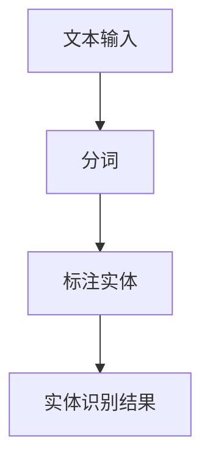
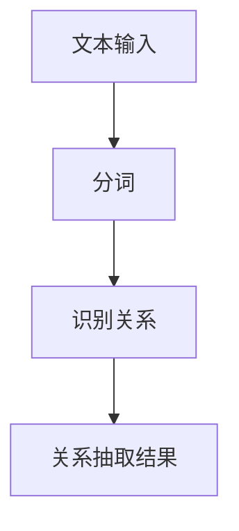
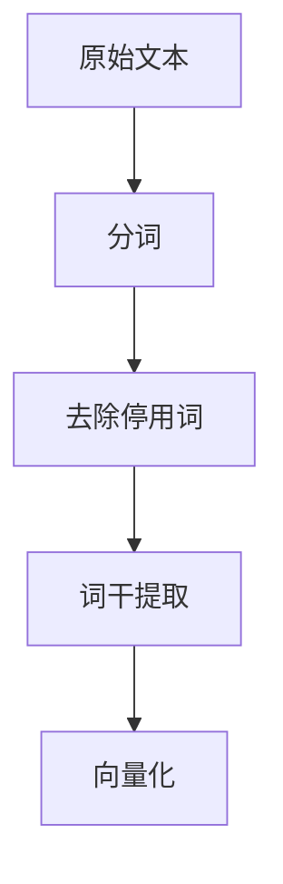
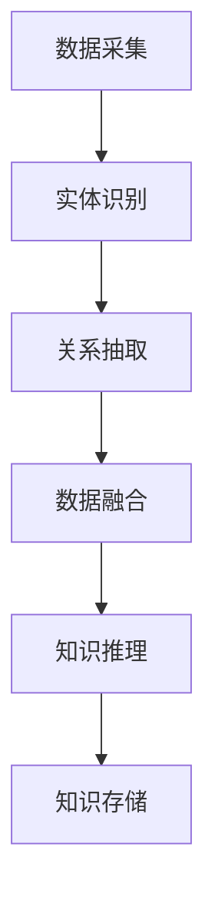
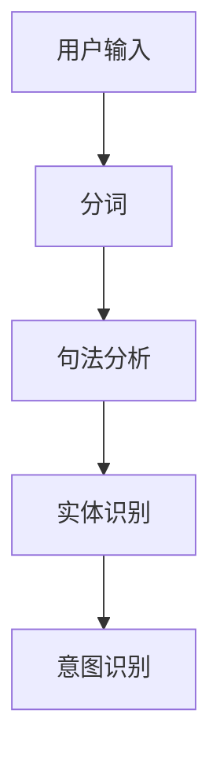
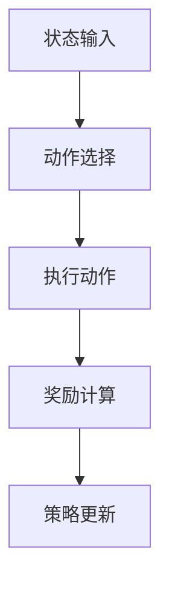
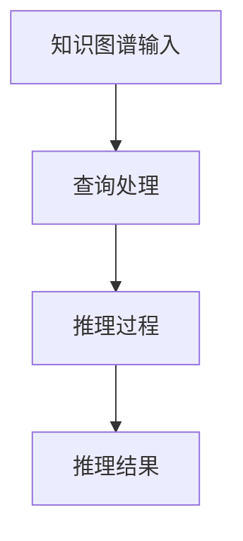

                 


# 企业知识图谱与AI Agent的深度融合应用

> 关键词：企业知识图谱，AI Agent，知识图谱构建，自然语言处理，强化学习，知识推理

> 摘要：本文深入探讨了企业知识图谱与AI Agent的深度融合应用，从知识图谱和AI Agent的核心概念出发，分析了其在企业中的应用背景和必要性。通过详细讲解知识图谱构建算法、AI Agent的核心算法、知识图谱与AI Agent的协同优化，以及企业知识图谱与AI Agent的系统架构设计，结合项目实战案例，展示了如何在实际企业场景中实现知识图谱与AI Agent的深度融合，为企业智能化转型提供有力支持。

## 第4章: 知识图谱构建算法

### 4.1 实体识别与关系抽取算法

#### 4.1.1 实体识别算法
实体识别是知识图谱构建的第一步，旨在从文本中识别出实体并标注其类型。常用的实体识别算法包括：

- **基于规则的实体识别**：通过预定义的规则和模式匹配来识别实体。
- **统计模型**：使用机器学习算法（如CRF）进行序列标注。
- **深度学习模型**：使用RNN、LSTM等模型进行序列标注。



#### 4.1.2 关系抽取算法
关系抽取旨在从文本中识别出实体之间的关系。常用的关系抽取算法包括：

- **基于模式匹配**：通过预定义的关系模式进行匹配。
- **统计模型**：使用CRF进行关系抽取。
- **深度学习模型**：使用CNN、RNN等模型进行关系抽取。



#### 4.1.3 实体识别与关系抽取的代码实现

```python
import spacy
nlp = spacy.load("en_core_web_sm")

def entity_recognition(text):
    doc = nlp(text)
    entities = []
    for ent in doc.ents:
        entities.append((ent.start, ent.end, ent.label_))
    return entities

def relation_extraction(text):
    doc = nlp(text)
    relations = []
    for ent in doc.ents:
        for dep in ent.depents:
            if dep.head.pos_ in ["NOUN", "PROPN"]:
                relations.append((dep.start, dep.head.start, dep.rel))
    return relations

text = "Google was founded by Larry Page and Sergey Brin in 1998."
print(entity_recognition(text))
print(relation_extraction(text))
```

### 4.2 文本预处理

文本预处理是知识图谱构建的重要步骤，主要包括分词、去除停用词、词干提取等。



### 4.3 知识图谱的构建与优化

知识图谱的构建过程包括数据采集、实体识别、关系抽取、数据融合、知识推理和知识存储。优化方法包括对齐实体、消除冗余、修复错误等。



## 第5章: AI Agent的核心算法

### 5.1 自然语言处理算法

自然语言处理是AI Agent理解用户需求的关键技术，常用算法包括分词、句法分析、实体识别、情感分析等。



### 5.2 强化学习算法

强化学习是AI Agent决策优化的重要算法，常用算法包括Q-learning、Deep Q-Network、Actor-Critic等。



### 5.3 知识图谱推理算法

知识图谱推理是AI Agent利用知识图谱进行推理的关键技术，常用算法包括基于规则的推理、基于概率的推理、基于深度学习的推理等。



### 5.4 代码实现

```python
import numpy as np
import networkx as nx

def knowledge_graph_reasoning(graph, start, end):
    paths = nx.all_shortest_paths(graph, start=start, end=end)
    for path in paths:
        print(path)
    return paths

graph = nx.DiGraph()
graph.add_edges_from([('A', 'B'), ('B', 'C'), ('C', 'D')])
print(knowledge_graph_reasoning(graph, 'A', 'D'))
```

## 第6章: 知识图谱与AI Agent的协同优化

### 6.1 知识图谱对AI Agent的优化

知识图谱为AI Agent提供丰富的知识支持，提高其理解和决策能力。

### 6.2 AI Agent对知识图谱的反向优化

AI Agent通过与用户的交互，不断优化知识图谱的准确性和完整性。

### 6.3 知识图谱与AI Agent的双向优化

知识图谱与AI Agent的双向优化包括知识更新、模型优化和用户体验优化。

### 6.4 综合案例分析

以智能客服为例，知识图谱帮助AI Agent更好地理解用户需求，AI Agent通过与用户的交互优化知识图谱。

## 第7章: 企业知识图谱与AI Agent的系统架构设计

### 7.1 系统功能模块

知识图谱构建模块、知识图谱存储与管理模块、AI Agent交互模块。

### 7.2 系统架构设计

基于微服务架构，采用分布式部署，实现知识图谱与AI Agent的高效协同。

### 7.3 系统接口设计

RESTful API接口设计，实现知识图谱与AI Agent之间的数据交互。

### 7.4 系统交互流程

用户发起请求，AI Agent解析请求，调用知识图谱服务，返回结果。

## 第8章: 项目实战

### 8.1 环境安装

安装必要的库，如spaCy、networkx、scikit-learn等。

### 8.2 核心代码实现

实现知识图谱构建和AI Agent交互的核心代码。

### 8.3 案例分析

分析一个实际的企业应用场景，展示知识图谱与AI Agent的深度融合应用。

### 8.4 项目小结

总结项目实现的关键点和注意事项。

## 第9章: 最佳实践、小结、注意事项、拓展阅读

### 9.1 最佳实践

数据质量、模型优化、用户体验优化。

### 9.2 小结

总结全文，强调知识图谱与AI Agent深度融合的重要性。

### 9.3 注意事项

数据隐私、模型可解释性、系统稳定性。

### 9.4 拓展阅读

推荐相关书籍和论文，供读者深入学习。

---

作者：AI天才研究院/AI Genius Institute & 禅与计算机程序设计艺术 /Zen And The Art of Computer Programming

