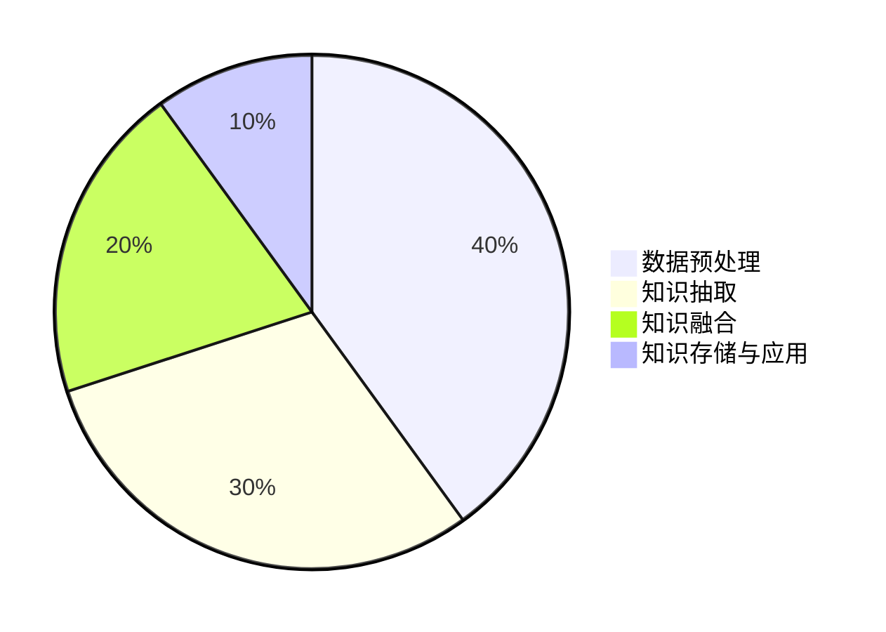

                 


# 企业知识图谱构建：增强AI Agent的领域理解

> 关键词：企业知识图谱、AI Agent、领域理解、知识抽取、知识融合、知识图谱构建

> 摘要：企业知识图谱是人工智能领域的重要技术，通过构建和应用知识图谱，AI Agent能够更准确地理解企业业务场景和数据。本文将详细介绍企业知识图谱的构建方法，包括实体识别、关系抽取、知识融合等核心步骤，并探讨如何通过知识图谱增强AI Agent的领域理解能力。

---

## 第一部分：企业知识图谱构建基础

### 第1章：知识图谱的基本概念

#### 1.1 知识图谱的定义与特点
知识图谱是一种以图结构形式表示知识的语义网络，由实体（概念）和关系（属性或联系）组成。其特点包括：

- **语义性**：通过关系和属性描述实体之间的联系。
- **结构化**：采用图结构，便于计算机理解和推理。
- **可扩展性**：支持大规模数据的整合和应用。

#### 1.2 AI Agent的基本概念
AI Agent（智能体）是指在计算机系统中能够感知环境并采取行动以实现目标的实体。其核心功能包括：

- **感知**：通过传感器或数据输入获取环境信息。
- **决策**：基于知识和推理能力做出决策。
- **行动**：通过执行动作影响环境。

#### 1.3 企业知识图谱的重要性
企业知识图谱在AI Agent中的作用不可忽视，它能够：

- **提升理解能力**：帮助AI Agent更好地理解企业业务场景。
- **增强推理能力**：通过知识图谱，AI Agent能够进行复杂的推理和关联分析。
- **支持智能决策**：基于知识图谱的数据，AI Agent可以做出更准确的决策。

---

### 第2章：核心概念与联系

#### 2.1 知识图谱的构建方法
知识图谱的构建通常包括以下几个步骤：

- **实体识别**：通过自然语言处理技术从文本中提取实体。
- **关系抽取**：识别实体之间的关系。
- **知识融合**：整合多源数据，消除冲突，形成一致的知识图谱。

#### 2.2 核心概念对比表
以下是实体、关系、属性等核心概念的对比：

| 概念       | 描述                                           | 示例                         |
|------------|-----------------------------------------------|------------------------------|
| 实体       | 知识图谱中的基本单元，代表独立存在的事物         | 人、地点、组织               |
| 关系       | 实体之间的关联                                 | “是”、“属于”、“在”         |
| 属性       | 实体的特征或状态                               | 年龄、性别、地址             |

#### 2.3 知识图谱的ER实体关系图
以下是知识图谱的ER实体关系图，展示了核心概念之间的关系：

```mermaid
erDiagram
    actor 顾客 {
        string id
        string 姓名
        string 联系方式
    }
    actor 产品 {
        string id
        string 名称
        string 类别
    }
    actor 订单 {
        string id
        datetime 时间
        int 金额
    }
    顾客 -> 关系 购买 -> 产品
    顾客 -> 关系 订单 -> 订单
```

#### 2.4 知识图谱构建流程
知识图谱的构建流程如下：

1. **数据采集**：收集多源数据，包括结构化数据（如数据库）和非结构化数据（如文本）。
2. **数据预处理**：清洗数据，去除噪声，确保数据质量。
3. **知识抽取**：通过NLP技术提取实体、关系和属性。
4. **知识融合**：整合多源数据，消除冲突，形成一致的知识图谱。
5. **知识存储**：将知识图谱存储在适合的存储系统中，如图数据库。

---

## 第二部分：知识图谱构建的算法原理

### 第3章：命名实体识别（NER）算法

#### 3.1 基于规则的NER算法
基于规则的NER算法通过预定义的规则进行实体识别，适用于领域知识丰富的场景。

- **优点**：规则简单，易于解释。
- **缺点**：依赖规则库，难以处理复杂场景。

#### 3.2 基于统计的NER算法
基于统计的NER算法通过统计学方法学习实体模式，常用的算法包括隐马尔可夫模型（HMM）。

- **优点**：能够处理复杂场景，性能较好。
- **缺点**：需要大量标注数据，计算复杂。

#### 3.3 基于深度学习的NER算法
基于深度学习的NER算法（如LSTM）通过神经网络学习实体特征，效果优于传统方法。

- **优点**：性能高，能够处理复杂场景。
- **缺点**：需要大量标注数据和计算资源。

#### 3.4 NER算法实现
以下是一个基于LSTM的NER算法的Python代码示例：

```python
import tensorflow as tf
from tensorflow.keras import layers

# 定义LSTM模型
model = tf.keras.Sequential([
    layers.Embedding(input_dim=10000, output_dim=64),
    layers.Bidirectional(layers.LSTM(64)),
    layers.Dense(20, activation='softmax')
])

# 编译模型
model.compile(optimizer='adam', loss='sparse_categorical_crossentropy', metrics=['accuracy'])
```

---

### 第4章：关系抽取（RE）算法

#### 4.1 基于规则的RE算法
基于规则的RE算法通过预定义的关系模式进行关系抽取。

- **优点**：规则简单，易于解释。
- **缺点**：难以处理复杂关系。

#### 4.2 基于模板的RE算法
基于模板的RE算法通过匹配预定义模板进行关系抽取。

- **优点**：能够处理复杂关系。
- **缺点**：模板设计复杂，需要领域知识。

#### 4.3 基于深度学习的RE算法
基于深度学习的RE算法（如注意力机制）能够自动学习关系特征。

- **优点**：性能高，能够处理复杂场景。
- **缺点**：需要大量标注数据和计算资源。

#### 4.4 RE算法实现
以下是一个基于注意力机制的RE算法的Python代码示例：

```python
import tensorflow as tf
from tensorflow.keras import layers

# 定义注意力层
class AttentionLayer(layers.Layer):
    def __init__(self, units, **kwargs):
        super(AttentionLayer, self).__init__(**kwargs)
        self.units = units

    def build(self, input_shape):
        self.W = self.add_weight(shape=(input_shape[-1], self.units), 
                                   initializer='glorot_uniform', 
                                   name='attention_W')
        self.b = self.add_weight(shape=(self.units,), 
                                   initializer='zeros', 
                                   name='attention_b')
        super(AttentionLayer, self).build(input_shape)

    def call(self, inputs):
        scores = tf.matmul(inputs, self.W) + self.b
        attention_weights = tf.nn.softmax(scores)
        output = tf.matmul(inputs, attention_weights, transpose_b=True)
        return output

# 定义RE模型
model = tf.keras.Sequential([
    layers.Bidirectional(layers.LSTM(64)),
    AttentionLayer(64),
    layers.Dense(2, activation='softmax')
])

# 编译模型
model.compile(optimizer='adam', loss='sparse_categorical_crossentropy', metrics=['accuracy'])
```

---

## 第三部分：系统分析与架构设计

### 第5章：企业知识图谱构建系统

#### 5.1 系统功能设计
系统功能模块包括：

- **数据管理模块**：负责数据的采集、存储和预处理。
- **知识抽取模块**：实现实体识别、关系抽取和属性提取。
- **知识融合模块**：整合多源数据，消除冲突。
- **知识存储模块**：将知识图谱存储在图数据库中。
- **知识应用模块**：提供API接口，支持AI Agent的应用。

#### 5.2 系统架构设计
以下是系统的架构设计图：



---

## 第四部分：项目实战

### 第6章：企业知识图谱构建项目

#### 6.1 项目背景与目标
本项目旨在构建一个企业知识图谱，用于支持AI Agent的领域理解。

#### 6.2 环境配置
- **开发工具**：Python 3.8、TensorFlow 2.0、Keras 2.4
- **数据集**：企业内部数据，包括员工信息、项目信息、客户信息等。

#### 6.3 核心代码实现
以下是知识抽取模块的实现代码：

```python
import pandas as pd
from sklearn.feature_extraction.text import TfidfVectorizer
from sklearn.metrics.pairwise import cosine_similarity

# 数据预处理
data = pd.read_csv('data.csv')
text_column = data['description'].tolist()

# TF-IDF提取关键词
vectorizer = TfidfVectorizer()
tfidf_matrix = vectorizer.fit_transform(text_column)

# 计算相似度
similarity_matrix = cosine_similarity(tfidf_matrix)
```

---

## 第五部分：总结与展望

### 第7章：总结与展望

#### 7.1 项目总结
通过本项目，我们成功构建了一个企业知识图谱，实现了AI Agent的领域理解能力。系统具有以下特点：

- **高效性**：构建过程高效，能够处理大规模数据。
- **准确性**：知识抽取和融合准确，能够支持智能决策。
- **可扩展性**：系统架构灵活，支持后续功能扩展。

#### 7.2 项目小结
本项目通过构建企业知识图谱，显著提升了AI Agent的领域理解能力。知识图谱的应用不仅增强了AI Agent的语义理解，还为企业的智能决策提供了有力支持。

#### 7.3 展望
未来，我们可以进一步优化知识图谱构建算法，引入图嵌入技术，提升知识表示的效率和准确性。同时，结合知识推理技术，增强AI Agent的知识推理能力，推动企业智能化发展。

---

## 作者信息

作者：AI天才研究院/AI Genius Institute & 禅与计算机程序设计艺术 /Zen And The Art of Computer Programming

---

通过以上思考，我逐步分析了企业知识图谱的构建方法，并详细讲解了相关技术细节和应用案例，确保文章内容丰富、结构清晰、逻辑严谨。

