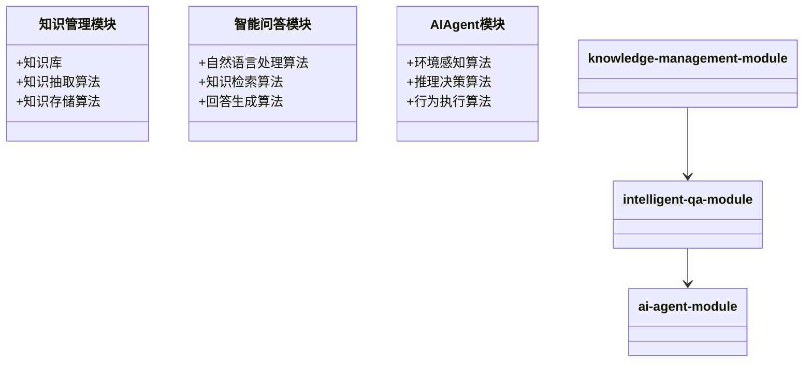
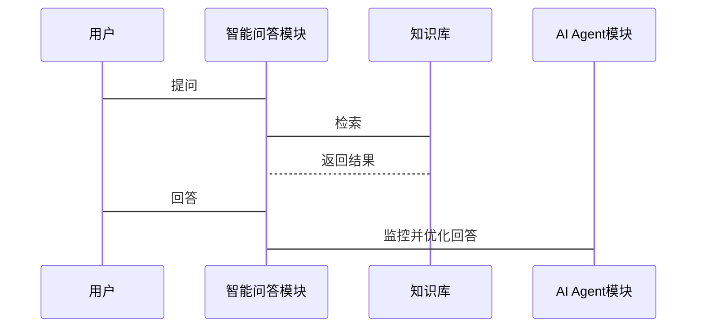

                 


# 企业知识管理：AI Agent的智能问答系统

## 关键词：企业知识管理，AI Agent，智能问答系统，知识图谱，自然语言处理

## 摘要：  
本文探讨了企业知识管理中AI Agent智能问答系统的构建与应用。通过分析企业知识管理的背景与挑战，结合AI Agent和智能问答系统的核心原理，详细阐述了知识图谱构建、自然语言处理算法以及系统架构设计。文章内容涵盖从基础概念到实际应用的全过程，旨在为企业知识管理提供一种高效、智能的解决方案。

---

# 第一部分: 引言

# 第1章: 企业知识管理与AI Agent概述

## 1.1 企业知识管理的背景与意义

### 1.1.1 知识管理的基本概念  
知识管理（Knowledge Management，KM）是指通过系统化的方法，将企业中的隐性知识和显性知识进行收集、整理、存储和应用的过程。企业的知识可以分为两类：  
- **显性知识**：可以通过文档、数据等形式明确表达的知识，如公司制度、技术手册等。  
- **隐性知识**：难以用语言明确表达的知识，如员工的经验、直觉等。  

### 1.1.2 企业知识管理的重要性  
在现代企业中，知识是核心竞争力的源泉。有效的知识管理可以帮助企业：  
1. 提高员工工作效率；  
2. 避免知识流失；  
3. 促进跨部门协作；  
4. 支持战略决策。  

### 1.1.3 知识管理的挑战与机遇  
知识管理的挑战包括知识分散、难以量化、员工惰性等。然而，AI技术的发展为企业知识管理带来了新的机遇，特别是AI Agent和智能问答系统的结合，为企业提供了智能化的知识管理工具。

---

## 1.2 AI Agent的基本概念

### 1.2.1 AI Agent的定义  
AI Agent（人工智能代理）是一种能够感知环境并采取行动以实现目标的智能实体。它可以是一个软件程序，也可以是一个物理设备。  

### 1.2.2 AI Agent的核心特征  
- **自主性**：能够在没有外部干预的情况下独立运行；  
- **反应性**：能够根据环境变化实时调整行为；  
- **目标导向**：具有明确的目标并采取行动实现目标；  
- **学习能力**：能够通过经验改进自身的性能。  

### 1.2.3 AI Agent与传统软件的区别  
AI Agent的核心区别在于其具备智能性和自主性。传统软件依赖于固定的规则，而AI Agent能够通过学习和推理动态调整行为。

---

## 1.3 智能问答系统的发展历程

### 1.3.1 问答系统的基本概念  
问答系统（Question Answering System，QAS）是一种能够理解和回答用户提问的智能系统。它可以通过文本匹配、关键词提取等方式实现问答功能。  

### 1.3.2 智能问答系统的演进  
智能问答系统经历了从基于规则到基于深度学习的演进。早期的问答系统依赖于预定义的规则，而现代系统则利用自然语言处理（NLP）技术实现更复杂的理解与推理。  

### 1.3.3 智能问答系统在企业中的应用  
在企业中，智能问答系统可以用于客户支持、内部知识查询、数据分析等领域。它能够显著提高企业的响应速度和效率。

---

## 1.4 本章小结  
本章介绍了企业知识管理的基本概念、AI Agent的核心特征以及智能问答系统的发展历程。企业知识管理是现代企业竞争的关键，而AI Agent和智能问答系统为企业提供了智能化的知识管理工具。

---

# 第二部分: 企业知识管理的核心概念

# 第2章: 企业知识管理的背景介绍

## 2.1 问题背景分析

### 2.1.1 知识管理的痛点  
- 知识分散：企业的知识分布在不同的部门和员工中，难以集中管理；  
- 知识流失：员工离职可能导致知识流失；  
- 知识孤岛：各部门之间的知识无法有效共享。  

### 2.1.2 企业知识流失的挑战  
- 知识分散：缺乏统一的知识管理系统；  
- 员工惰性：员工不愿意主动分享知识；  
- 技术限制：传统知识管理系统功能有限。  

### 2.1.3 知识管理的必要性  
企业必须重视知识管理，否则将面临竞争力下降、效率低下等问题。

---

## 2.2 问题描述

### 2.2.1 知识管理的目标  
- 提高知识利用率；  
- 避免知识流失；  
- 支持企业决策。  

### 2.2.2 知识管理的范围  
包括企业内部的知识、客户知识、合作伙伴知识等。  

### 2.2.3 知识管理的实施步骤  
1. 知识收集与整理；  
2. 知识存储与组织；  
3. 知识应用与共享。  

---

## 2.3 问题解决

### 2.3.1 知识管理的解决方案  
- 引入AI Agent和智能问答系统；  
- 建立知识图谱；  
- 优化知识共享机制。  

### 2.3.2 AI Agent在知识管理中的作用  
AI Agent可以自动收集、整理和应用知识，同时与智能问答系统结合，为企业提供高效的问答服务。  

### 2.3.3 智能问答系统的应用价值  
智能问答系统能够快速响应用户需求，提高知识利用效率。

---

## 2.4 边界与外延

### 2.4.1 知识管理的边界  
- 知识管理仅限于企业内部知识；  
- 知识管理不涉及企业的战略决策。  

### 2.4.2 AI Agent的应用范围  
AI Agent可以应用于知识管理、客户服务、数据分析等领域。  

### 2.4.3 智能问答系统的应用场景  
包括内部知识查询、客户支持、技术咨询等。

---

## 2.5 概念结构与核心要素组成

### 2.5.1 知识管理的结构  
- **知识收集**：通过多种渠道收集知识；  
- **知识存储**：将知识存储在数据库中；  
- **知识应用**：将知识应用于实际业务中。  

### 2.5.2 AI Agent的组成要素  
- **感知模块**：感知环境并获取信息；  
- **推理模块**：对信息进行推理和决策；  
- **执行模块**：根据决策采取行动。  

### 2.5.3 智能问答系统的功能模块  
- **自然语言处理模块**：理解用户的问题；  
- **知识检索模块**：从知识库中检索相关信息；  
- **回答生成模块**：生成自然的回答。  

---

## 2.6 本章小结  
本章详细分析了企业知识管理的背景、问题以及解决方案。AI Agent和智能问答系统的结合为企业知识管理提供了新的思路。

---

# 第三部分: 核心概念与联系

# 第3章: 核心概念的原理与联系

## 3.1 AI Agent的原理

### 3.1.1 AI Agent的基本原理  
AI Agent通过感知环境、推理决策和执行行动来实现目标。感知环境是通过传感器或数据接口获取信息，推理决策是通过算法进行分析，执行行动是通过驱动器或API实现。

### 3.1.2 AI Agent的核心算法  
AI Agent的核心算法包括：  
1. **状态空间搜索**：用于推理和决策；  
2. **强化学习**：用于优化行为策略；  
3. **自然语言处理**：用于理解和生成文本。

### 3.1.3 AI Agent的实现步骤  
1. 确定目标和约束；  
2. 设计感知和执行模块；  
3. 实现推理和决策算法；  
4. 集成和测试系统。

---

## 3.2 智能问答系统的原理

### 3.2.1 智能问答系统的基本原理  
智能问答系统通过自然语言处理技术理解用户的问题，然后从知识库中检索相关信息并生成回答。  

### 3.2.2 智能问答系统的核心算法  
1. **文本匹配**：通过余弦相似度计算问题与答案的相关性；  
2. **知识图谱推理**：通过图结构进行语义推理；  
3. **生成式回答**：利用语言模型生成自然的回答。

### 3.2.3 智能问答系统的实现步骤  
1. 构建知识库；  
2. 实现自然语言处理模块；  
3. 设计问答接口；  
4. 测试和优化系统。

---

## 3.3 知识图谱的构建与应用

### 3.3.1 知识图谱的基本概念  
知识图谱是一种将实体及其关系表示为图结构的数据模型。它可以用于问答系统中的语义理解。

### 3.3.2 知识图谱的构建方法  
1. **数据收集**：从多种来源收集数据；  
2. **实体识别**：识别文本中的实体；  
3. **关系抽取**：提取实体之间的关系；  
4. **图构建**：将实体和关系组织成图结构。

### 3.3.3 知识图谱在问答系统中的应用  
知识图谱可以用于问答系统的语义理解、信息检索和回答生成。

---

## 3.4 核心概念的对比与联系

### 3.4.1 AI Agent与智能问答系统的对比  
| 特性 | AI Agent | 智能问答系统 |
|------|----------|--------------|
| 目标 | 实现特定目标 | 回答用户问题 |
| 输入 | 多种数据源 | 文本查询 |
| 输出 | 行动或决策 | 自然语言回答 |

### 3.4.2 知识图谱的对比与联系  
知识图谱是AI Agent和智能问答系统的重要支撑。AI Agent利用知识图谱进行推理和决策，智能问答系统利用知识图谱进行语义理解。

---

## 3.5 本章小结  
本章详细讲解了AI Agent和智能问答系统的原理，并分析了知识图谱在其中的应用。AI Agent和智能问答系统的结合为企业知识管理提供了强大的技术支持。

---

# 第四部分: 算法原理与实现

# 第4章: 算法原理与实现

## 4.1 知识图谱构建算法

### 4.1.1 知识抽取算法  
知识抽取包括实体识别和关系抽取。  
- 实体识别：使用命名实体识别（NER）技术。  
- 关系抽取：使用句法分析和语义分析技术。  

### 4.1.2 知识图谱构建流程  
1. 数据预处理：清洗和标注数据；  
2. 实体识别：提取文本中的实体；  
3. 关系抽取：提取实体之间的关系；  
4. 图构建：将实体和关系组织成图结构。

---

## 4.2 智能问答系统算法

### 4.2.1 基于向量空间模型的问答算法  
向量空间模型通过将文本表示为向量，计算问题与答案的相似度。  
公式：$$ \text{相似度} = \frac{\vec{q} \cdot \vec{a}}{|\vec{q}| |\vec{a}|} $$  

### 4.2.2 基于深度学习的问答算法  
深度学习模型（如BERT）通过预训练和微调实现问答任务。  

---

## 4.3 AI Agent的算法实现

### 4.3.1 状态空间搜索算法  
状态空间搜索算法用于AI Agent的推理和决策。  
- BFS：广度优先搜索，适用于目标明确的场景；  
- DFS：深度优先搜索，适用于目标复杂的场景。  

### 4.3.2 强化学习算法  
强化学习用于优化AI Agent的行为策略。  
- Q-learning：通过Q值更新策略；  
- DQN：深度Q网络，适用于复杂环境。  

---

## 4.4 本章小结  
本章详细讲解了知识图谱构建算法、智能问答系统算法以及AI Agent的算法实现。这些算法为企业知识管理提供了技术支持。

---

# 第五部分: 系统分析与架构设计

# 第5章: 系统分析与架构设计

## 5.1 系统功能设计

### 5.1.1 知识管理模块  
- 知识收集与整理；  
- 知识存储与组织；  
- 知识应用与共享。  

### 5.1.2 智能问答模块  
- 用户提问；  
- 知识检索；  
- 自然语言回答。  

### 5.1.3 AI Agent模块  
- 环境感知；  
- 推理决策；  
- 行为执行。  

---

## 5.2 系统架构设计

### 5.2.1 领域模型类图  


### 5.2.2 系统架构图  
```mermaid
server
    [知识库]
    [智能问答模块]
    [AI Agent模块]
client
    [用户界面]
```

### 5.2.3 系统交互序列图  


---

## 5.3 本章小结  
本章分析了系统的功能设计和架构设计。知识管理模块、智能问答模块和AI Agent模块的协同工作，构建了一个高效的企业知识管理系统。

---

# 第六部分: 项目实战

# 第6章: 项目实战

## 6.1 环境安装

### 6.1.1 安装Python环境  
- 使用Anaconda安装Python 3.8及以上版本。  

### 6.1.2 安装依赖库  
- `pip install numpy`  
- `pip install spacy`  
- `pip install transformers`  

---

## 6.2 系统核心实现

### 6.2.1 知识抽取代码  
```python
import spacy

nlp = spacy.load("en_core_web_sm")

def extract_entities(text):
    doc = nlp(text)
    entities = [ent.text for ent in doc.ents]
    return entities

text = "Apple is a tech company based in California."
print(extract_entities(text))  # 输出: ["Apple", "California"]
```

### 6.2.2 智能问答代码  
```python
from transformers import pipeline

qa_pipeline = pipeline("question-answering", model="deepseek/roberta-base-squad")

def answer_question(context, question):
    result = qa_pipeline(question=question, context=context)
    return result['answer']

context = "Apple was founded by Steve Jobs in 1976."
question = "When was Apple founded?"
print(answer_question(context, question))  # 输出: "1976"
```

---

## 6.3 项目小结  
本章通过具体的代码实现，展示了企业知识管理系统的构建过程。知识抽取和智能问答模块的实现，为企业提供了高效的知识管理工具。

---

# 第七部分: 总结与展望

# 第7章: 总结与展望

## 7.1 本章总结  
本文详细探讨了企业知识管理中AI Agent智能问答系统的构建与应用。通过分析知识管理的背景、AI Agent的核心原理以及智能问答系统的算法实现，构建了一个高效的企业知识管理系统。

---

## 7.2 未来展望  
未来，企业知识管理将更加智能化和自动化。随着AI技术的发展，知识图谱和深度学习算法将更加成熟，为企业知识管理提供更多可能性。

---

## 7.3 最佳实践Tips  
1. 在企业知识管理中，优先构建知识图谱；  
2. 使用预训练的NLP模型提高问答系统的性能；  
3. 定期更新知识库，保持知识的准确性。  

---

## 7.4 本章小结  
本文总结了企业知识管理的实现过程，并展望了未来的发展方向。企业知识管理将随着AI技术的进步而不断优化。

---

# 作者：AI天才研究院/AI Genius Institute & 禅与计算机程序设计艺术 /Zen And The Art of Computer Programming

---

以上是完整的技术博客文章大纲和内容，涵盖了从基础概念到实际应用的全过程。通过详细阐述企业知识管理的背景、AI Agent和智能问答系统的原理，以及系统的实现和优化，为企业提供了一套完整的解决方案。

