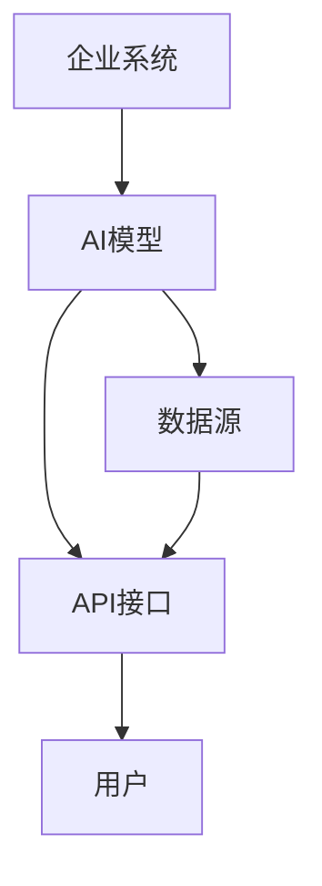
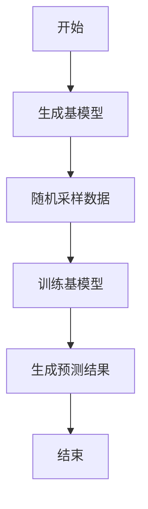
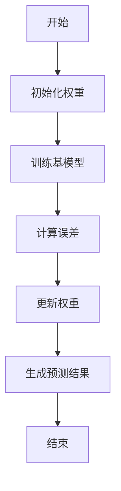
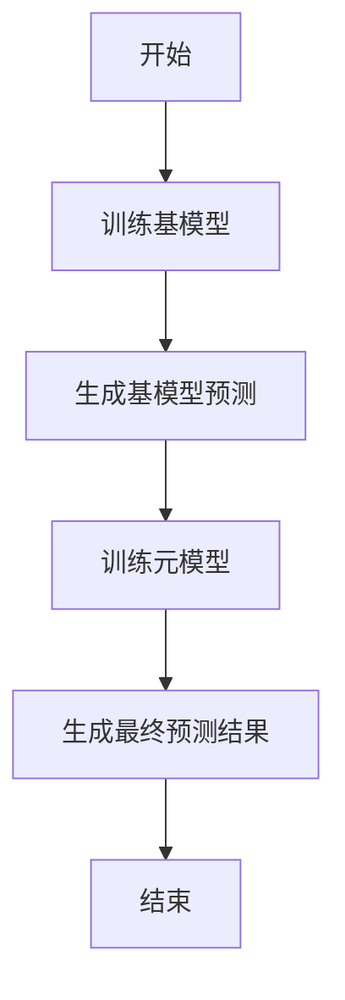
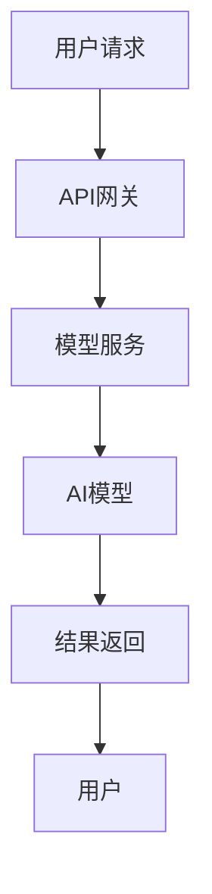

                 


# 企业系统中AI模型的集成与部署

> 关键词：AI模型，集成，部署，企业系统，系统架构，API设计，数据处理

> 摘要：本文深入探讨了企业系统中AI模型的集成与部署的关键问题，从背景、核心概念、算法原理到系统架构设计、实战案例和最佳实践，全面分析了AI模型在企业系统中的应用现状和未来趋势。通过详细的技术分析和实际案例，本文为企业系统中AI模型的集成与部署提供了系统化的解决方案和实践指导。

---

# 第一部分: 企业系统中AI模型的集成与部署背景

## 第1章: 企业系统中AI模型的集成与部署背景

### 1.1 AI模型在企业系统中的应用现状
#### 1.1.1 企业系统智能化转型的背景
随着人工智能技术的快速发展，企业系统正在经历从传统信息化向智能化转型的过程。AI模型作为实现智能化的核心技术，逐渐成为企业系统中的重要组成部分。企业通过集成AI模型，可以提升业务处理效率、优化决策过程，并为用户提供更智能的服务。

#### 1.1.2 AI模型在企业中的潜在价值
AI模型的应用为企业带来了巨大的价值，例如：
- **自动化处理**：通过AI模型实现业务流程的自动化，减少人工干预。
- **数据驱动决策**：利用AI模型对海量数据进行分析，为企业提供数据支持的决策依据。
- **个性化服务**：通过AI模型实现用户行为分析，提供个性化的产品和服务。

#### 1.1.3 当前企业系统中AI模型的应用挑战
尽管AI模型在企业系统中有广泛的应用潜力，但其集成与部署仍然面临诸多挑战，例如：
- **技术复杂性**：AI模型的集成需要考虑数据格式、接口兼容性、性能优化等问题。
- **数据隐私与安全**：企业系统中涉及大量敏感数据，如何确保数据在AI模型中的安全性和隐私性是一个重要挑战。
- **模型迭代与更新**：AI模型需要定期迭代和更新，以适应业务需求的变化。

### 1.2 AI模型集成与部署的核心问题
#### 1.2.1 AI模型集成的关键问题
AI模型的集成需要解决以下关键问题：
- **模型选择**：如何选择适合业务需求的AI模型。
- **接口设计**：如何设计模型与企业系统的接口，确保数据的高效传输和处理。
- **性能优化**：如何优化AI模型的性能，以满足企业系统对响应速度和准确率的要求。

#### 1.2.2 模型部署的主要挑战
AI模型的部署需要考虑以下主要挑战：
- **环境配置**：如何确保AI模型在目标环境中的正确运行。
- **资源分配**：如何合理分配计算资源，以支持AI模型的运行。
- **容错与恢复**：如何设计模型的容错机制，确保在异常情况下能够快速恢复。

#### 1.2.3 企业系统中AI模型的边界与外延
AI模型在企业系统中的边界与外延决定了其集成与部署的范围。边界包括：
- **输入数据**：AI模型需要处理的输入数据类型和格式。
- **输出结果**：AI模型的输出结果类型和格式。
- **接口规范**：AI模型与企业系统的交互接口规范。

外延包括：
- **数据预处理**：AI模型需要对输入数据进行预处理，确保数据的正确性。
- **模型训练**：AI模型需要进行离线训练，确保模型的准确性和稳定性。
- **模型监控**：AI模型需要进行实时监控，确保模型的运行状态和性能。

### 1.3 企业系统中AI模型集成与部署的需求分析
#### 1.3.1 企业对AI模型集成的需求
企业对AI模型的集成需求主要体现在以下几个方面：
- **功能需求**：AI模型需要具备特定的业务功能，例如分类、回归、聚类等。
- **性能需求**：AI模型需要具备高响应速度和高准确性。
- **兼容性需求**：AI模型需要与企业现有的系统和数据格式兼容。

#### 1.3.2 模型部署的业务需求
模型的部署需要满足以下业务需求：
- **可用性**：AI模型需要在指定环境下稳定运行。
- **可扩展性**：AI模型需要具备扩展能力，能够适应业务需求的变化。
- **可监控性**：AI模型需要具备监控能力，能够实时反馈运行状态。

#### 1.3.3 系统兼容性与扩展性的要求
AI模型的集成与部署需要满足以下系统兼容性和扩展性要求：
- **系统兼容性**：AI模型需要与企业现有的系统和数据格式兼容。
- **可扩展性**：AI模型需要具备扩展能力，能够支持未来的业务需求变化。
- **可维护性**：AI模型需要具备可维护性，能够方便地进行模型更新和优化。

### 1.4 本章小结
本章主要介绍了企业系统中AI模型的集成与部署的背景，包括AI模型在企业系统中的应用现状、集成与部署的核心问题以及企业系统中AI模型的边界与外延。通过分析这些内容，我们可以更好地理解AI模型在企业系统中的重要性以及集成与部署的挑战。

---

# 第二部分: 企业系统中AI模型集成与部署的核心概念

## 第2章: AI模型集成与部署的核心概念

### 2.1 AI模型集成的定义与特点
#### 2.1.1 AI模型集成的定义
AI模型集成是指将多个AI模型整合到一个系统中，通过协同工作来实现特定的业务目标。集成的核心在于如何有效地组合各个模型的优势，弥补单一模型的不足。

#### 2.1.2 集成的核心属性对比
以下是集成的核心属性对比表：

| 属性         | 集成学习         | 单一模型       |
|--------------|-----------------|---------------|
| 性能          | 更优            | 较差          |
| 鲁棒性        | 更强            | 较弱          |
| 可解释性      | 较差            | 更好          |
| 资源消耗      | 较高            | 较低          |

#### 2.1.3 集成与部署的关系
集成与部署是AI模型在企业系统中的两个重要阶段。集成是部署的前提，而部署是集成的延续。集成阶段关注模型的组合和优化，而部署阶段关注模型的运行和监控。

### 2.2 AI模型部署的定义与特点
#### 2.2.1 部署的定义
AI模型部署是指将训练好的AI模型应用到实际业务场景中，通过与企业系统的集成，实现对业务数据的实时处理和反馈。

#### 2.2.2 部署的核心要素
AI模型部署的核心要素包括：
- **环境配置**：确保模型在目标环境中的正确运行。
- **资源分配**：合理分配计算资源，确保模型的高效运行。
- **监控与维护**：实时监控模型的运行状态，并进行必要的维护和优化。

#### 2.2.3 部署与集成的异同
以下是部署与集成的异同对比表：

| 方面         | 集成          | 部署          |
|--------------|--------------|--------------|
| 目标         | 组合模型      | 应用模型      |
| 阶段         | 开发阶段      | 运行阶段      |
| 关注点       | 模型性能      | 系统性能      |

### 2.3 企业系统中AI模型集成与部署的实体关系图
以下是一个简单的实体关系图，展示了AI模型在企业系统中的集成与部署关系：



### 2.4 本章小结
本章主要介绍了AI模型集成与部署的核心概念，包括集成与部署的定义、特点以及两者的关系。通过对比分析，我们可以更好地理解AI模型在企业系统中的集成与部署过程。

---

# 第三部分: 企业系统中AI模型集成的算法原理

## 第3章: AI模型集成的算法原理

### 3.1 集成学习算法概述
#### 3.1.1 集成学习的基本概念
集成学习是一种通过组合多个学习器来提高模型性能的技术。其核心思想是通过多样化的基模型来降低模型的方差和偏差，从而提高模型的准确性和稳定性。

#### 3.1.2 集成学习的核心算法
集成学习的核心算法主要包括以下几种：
- **Bagging算法**：通过随机采样数据来生成多个基模型，并通过投票或平均的方式进行预测。
- **Boosting算法**：通过加权训练数据来生成多个基模型，并通过调整权重来提高模型的性能。
- **Stacking算法**：通过将多个基模型的输出作为输入，构建一个元模型来最终生成预测结果。

#### 3.1.3 集成学习的优缺点
以下是集成学习的优缺点对比表：

| 方面         | 优点               | 缺点               |
|--------------|--------------------|--------------------|
| 性能          | 提高模型准确率       | 计算资源消耗较高    |
| 鲁棒性        | 提高模型的鲁棒性     | 需要处理多个模型的组合 |
| 可解释性      | 可解释性较低        | -                  |

### 3.2 常见的集成算法实现
#### 3.2.1 Bagging算法
Bagging算法是一种基于随机采样的集成算法。以下是Bagging算法的流程图：



#### 3.2.2 Boosting算法
Boosting算法是一种通过调整训练数据权重来生成多个基模型的集成算法。以下是Boosting算法的流程图：



#### 3.2.3 Stacking算法
Stacking算法是一种通过构建元模型来组合多个基模型的集成算法。以下是Stacking算法的流程图：



### 3.3 集成算法的数学模型
#### 3.3.1 Bagging算法的数学模型
Bagging算法的数学模型如下：
$$ y = \frac{1}{k} \sum_{i=1}^{k} h_i(x) $$
其中，$k$是基模型的数量，$h_i(x)$是第$i$个基模型的预测结果。

#### 3.3.2 Boosting算法的数学模型
Boosting算法的数学模型如下：
$$ \alpha_i = \frac{1}{k} \sum_{i=1}^{k} \alpha_i $$
其中，$\alpha_i$是第$i$个基模型的权重系数。

### 3.4 集成算法的优缺点对比
以下是集成算法的优缺点对比表：

| 方面         | Bagging          | Boosting         | Stacking         |
|--------------|------------------|------------------|------------------|
| 性能          | 较高              | 较高              | 较高              |
| 训练时间      | 较短              | 较长              | 中等              |
| 鲁棒性        | 较高              | 较低              | 较高              |

### 3.5 本章小结
本章主要介绍了集成学习算法的基本概念、核心算法以及优缺点对比。通过分析这些内容，我们可以更好地理解AI模型集成的算法原理及其在企业系统中的应用。

---

# 第四部分: 企业系统中AI模型的部署与系统架构设计

## 第4章: AI模型部署的系统架构设计

### 4.1 系统架构设计概述
AI模型的部署需要一个合理的系统架构设计，以确保模型的高效运行和系统的稳定性。以下是AI模型部署的系统架构设计图：



### 4.2 系统功能设计
AI模型部署的系统功能设计包括以下几个方面：
- **数据处理**：对输入数据进行预处理和格式化。
- **模型服务**：负责接收请求、调用AI模型进行预测。
- **结果返回**：将模型的预测结果返回给用户。

### 4.3 系统架构设计的实现
以下是AI模型部署的系统架构设计图：


### 4.4 系统接口设计
AI模型部署的系统接口设计包括以下几个方面：
- **输入接口**：定义输入数据的格式和结构。
- **输出接口**：定义输出结果的格式和结构。
- **监控接口**：定义监控模型运行状态的接口。

### 4.5 系统交互设计
以下是AI模型部署的系统交互图：


### 4.6 本章小结
本章主要介绍了AI模型部署的系统架构设计，包括系统功能设计、架构设计、接口设计和交互设计。通过这些设计，我们可以确保AI模型在企业系统中的高效运行和稳定。

---

# 第五部分: 企业系统中AI模型的实战案例

## 第5章: 企业系统中AI模型的实战案例

### 5.1 实战案例背景
本实战案例以一个电商企业的用户行为预测为例，展示了AI模型在企业系统中的集成与部署过程。

### 5.2 系统环境与工具安装
#### 5.2.1 系统环境要求
- **操作系统**：Linux/Windows/MacOS
- **编程语言**：Python 3.8+
- **框架**：Flask/Django
- **AI框架**：TensorFlow/PyTorch

#### 5.2.2 工具安装
```bash
pip install flask tensorflow
```

### 5.3 系统核心实现
#### 5.3.1 数据预处理
```python
import pandas as pd

# 读取数据
data = pd.read_csv('user_behavior.csv')

# 数据清洗
data = data.dropna()

# 数据标准化
from sklearn.preprocessing import StandardScaler
scaler = StandardScaler()
scaled_data = scaler.fit_transform(data)
```

#### 5.3.2 模型训练
```python
import tensorflow as tf

# 构建模型
model = tf.keras.Sequential([
    tf.keras.layers.Dense(64, activation='relu'),
    tf.keras.layers.Dense(1, activation='sigmoid')
])

# 编译模型
model.compile(optimizer='adam', loss='binary_crossentropy', metrics=['accuracy'])

# 训练模型
model.fit(scaled_data, labels, epochs=10, batch_size=32)
```

#### 5.3.3 模型部署
```python
from flask import Flask, request, jsonify

app = Flask(__name__)

@app.route('/predict', methods=['POST'])
def predict():
    data = request.json['data']
    prediction = model.predict(data)
    return jsonify({'result': prediction.tolist()})

if __name__ == '__main__':
    app.run()
```

### 5.4 项目小结
本实战案例通过电商企业的用户行为预测，展示了AI模型在企业系统中的集成与部署过程。通过数据预处理、模型训练和模型部署，我们可以实现AI模型的高效应用。

---

# 第六部分: 企业系统中AI模型的部署与最佳实践

## 第6章: 企业系统中AI模型的部署与最佳实践

### 6.1 最佳实践
#### 6.1.1 环境配置
- **选择合适的云平台**：例如AWS、Azure、Google Cloud。
- **配置计算资源**：选择适合AI模型运行的计算资源，例如GPU实例。

#### 6.1.2 模型监控
- **实时监控**：通过日志和监控工具实时监控模型的运行状态。
- **性能监控**：监控模型的响应时间和准确率，确保模型的高效运行。

#### 6.1.3 模型迭代
- **定期更新模型**：根据业务需求的变化，定期更新AI模型。
- **模型优化**：通过优化算法和参数，提升模型的性能。

### 6.2 注意事项
- **数据安全**：确保数据在模型中的安全性和隐私性。
- **系统稳定性**：确保系统的稳定运行，避免因系统故障导致模型无法运行。
- **性能调优**：通过优化模型和系统配置，提升模型的响应速度和准确率。

### 6.3 拓展阅读
- **参考文献**：[《机器学习实战》](https://zh.wikipedia.org/wiki/《机器学习实战》)
- **在线课程**：[ Coursera - 机器学习](https://www.coursera.org/)

### 6.4 本章小结
本章主要介绍了企业系统中AI模型部署的最佳实践，包括环境配置、模型监控和模型迭代等方面。通过这些实践，我们可以更好地提升AI模型的性能和系统的稳定性。

---

# 第七部分: 附录

## 附录A: 常用工具与框架

### 附录A.1 常用AI框架
- **TensorFlow**：Google开发的深度学习框架。
- **PyTorch**：Facebook开发的深度学习框架。
- **Keras**：一个高级的神经网络库，支持TensorFlow、Theano和CNTK后端。

### 附录A.2 常用部署工具
- **Docker**：容器化部署工具。
- **Kubernetes**：容器编排工具。
- **Flask/Django**：Web框架，用于构建API接口。

---

# 作者

作者：AI天才研究院/AI Genius Institute & 禅与计算机程序设计艺术 /Zen And The Art of Computer Programming

