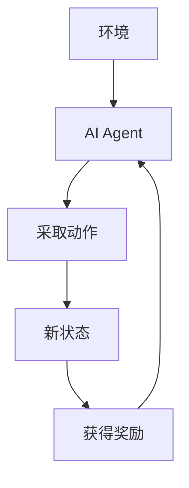
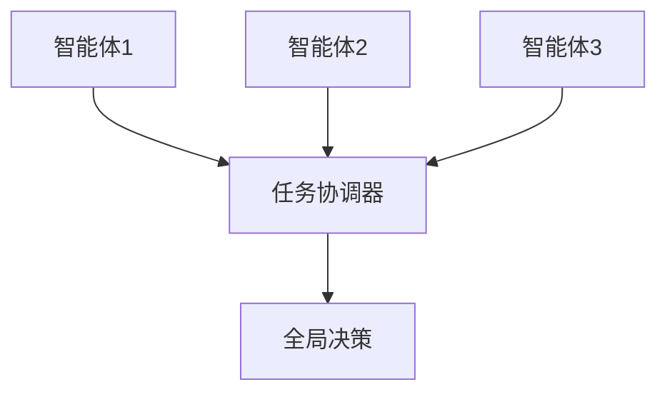
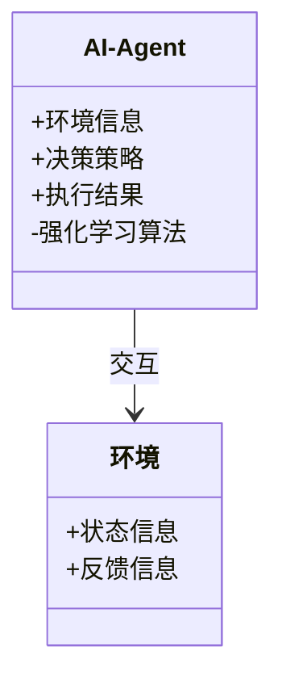
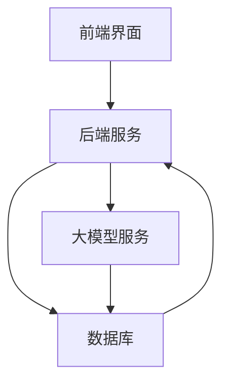

                 


# 企业级AI Agent开发：从需求分析到部署的全流程指南

## 关键词：企业级AI Agent、需求分析、系统架构、开发流程、部署实施、应用案例、开发实战

## 摘要：  
本文为企业级AI Agent的开发提供了全面的指导，从需求分析到部署实施，详细阐述了开发过程中的关键步骤和注意事项。文章首先介绍了AI Agent的基本概念和应用场景，然后深入探讨了其核心技术与算法原理，结合实际案例分析了系统架构设计与实现方案，最后总结了开发中的最佳实践和未来发展趋势。通过本文，读者可以系统性地掌握企业级AI Agent的开发流程，并能够将其应用于实际项目中。

---

# 第一部分: 企业级AI Agent开发背景与概念

## 第1章: AI Agent的基本概念与应用场景

### 1.1 什么是AI Agent  
AI Agent（人工智能代理）是一种能够感知环境、自主决策并执行任务的智能系统。它能够根据输入的信息做出决策，并通过行动与环境交互，以达到特定目标。  

### 1.2 企业级AI Agent的核心特征  
- **自主性**：能够自主决策，无需人工干预。  
- **反应性**：能够实时感知环境变化并做出响应。  
- **目标导向**：以实现特定目标为导向。  
- **可扩展性**：能够处理复杂任务，并与其他系统或AI Agent协作。  

### 1.3 企业级AI Agent的应用场景  
1. **智能客服**：通过自然语言处理（NLP）技术，为用户提供智能化的客服支持。  
2. **流程自动化**：自动化企业内部流程，如审批、报销等。  
3. **供应链优化**：通过预测和优化库存、物流路径，提升供应链效率。  
4. **数据分析与决策支持**：基于大数据分析，为企业的决策提供支持。  

---

# 第二部分: 企业级AI Agent的核心技术与原理

## 第2章: AI Agent的核心技术原理

### 2.1 感知与决策机制  
AI Agent通过传感器或API接口获取环境信息，利用算法进行分析和判断，生成决策策略。  

### 2.2 强化学习（Reinforcement Learning）  
强化学习是一种通过试错机制优化决策的算法。AI Agent通过与环境的交互，不断调整策略，以最大化奖励函数的值。  

#### Q-Learning算法流程图（Mermaid）：  


### 2.3 多智能体协作  
在企业级AI Agent中，多个智能体需要协作完成复杂任务。通过联合学习和知识共享，提升整体系统的智能性和效率。  

#### 多智能体协作架构（Mermaid）：  


---

## 第3章: 基于大模型的AI Agent开发

### 3.1 大模型在AI Agent中的作用  
大模型（如GPT、BERT）通过强大的自然语言处理能力，为AI Agent提供了更智能的交互方式。  

### 3.2 大模型与AI Agent的结合模式  
1. **直接调用**：AI Agent直接调用大模型API，获取所需的自然语言理解和生成能力。  
2. **知识增强**：AI Agent利用大模型的知识库，提升决策的准确性和全面性。  

### 3.3 基于大模型的AI Agent开发流程  
1. **需求分析**：明确AI Agent的功能需求和目标。  
2. **系统设计**：设计AI Agent的架构和功能模块。  
3. **算法实现**：基于强化学习和大模型，实现AI Agent的核心算法。  
4. **测试与优化**：通过实验和反馈，不断优化AI Agent的性能。  

---

# 第三部分: 企业级AI Agent的系统架构与设计

## 第4章: 系统架构设计与实现

### 4.1 系统功能设计  
AI Agent系统功能包括：  
1. **感知模块**：通过传感器或API获取环境信息。  
2. **决策模块**：基于强化学习算法生成决策策略。  
3. **执行模块**：将决策转化为具体行动。  
4. **反馈模块**：收集执行结果并优化策略。  

#### 系统功能设计类图（Mermaid）：  


### 4.2 系统架构设计  
企业级AI Agent的架构通常包括以下几个部分：  
1. **前端界面**：用户与AI Agent交互的界面。  
2. **后端服务**：处理AI Agent的核心逻辑。  
3. **大模型服务**：提供自然语言处理和知识推理能力。  
4. **数据库**：存储系统状态和历史数据。  

#### 系统架构图（Mermaid）：  


### 4.3 接口设计与交互流程  
1. **接口设计**：定义AI Agent与外部系统交互的API接口。  
2. **交互流程**：用户通过前端界面发起请求，后端服务调用大模型服务和数据库，生成响应并返回给用户。  

---

## 第5章: 项目实战与代码实现

### 5.1 环境安装与配置  
- **Python环境**：安装Python 3.8+版本。  
- **依赖库安装**：使用pip安装必要的库，如`numpy`, `tensorflow`, `transformers`等。  

### 5.2 核心代码实现  

#### 强化学习算法实现（Python代码示例）：  
```python
import numpy as np

class AI-Agent:
    def __init__(self, state_space, action_space):
        self.state_space = state_space
        self.action_space = action_space
        self.Q = np.zeros((state_space, action_space))
    
    def perceive(self, state):
        return self.Q[state]
    
    def decide(self, state):
        Q_values = self.perceive(state)
        return np.argmax(Q_values)
    
    def learn(self, state, action, reward, next_state):
        alpha = 0.1
        gamma = 0.9
        self.Q[state][action] += alpha * (reward + gamma * np.max(self.Q[next_state]) - self.Q[state][action])
```

### 5.3 案例分析与代码解读  
通过实际案例分析，详细解读代码实现的每一步，并结合数据和结果，分析AI Agent的性能和效果。  

---

## 第6章: 最佳实践与注意事项

### 6.1 开发中的注意事项  
1. **数据质量**：确保训练数据的多样性和准确性。  
2. **算法优化**：根据实际需求，不断优化AI Agent的算法和模型。  
3. **安全性**：确保AI Agent的安全性和稳定性，避免潜在风险。  

### 6.2 未来发展趋势  
随着大模型技术的不断进步，企业级AI Agent将更加智能化和个性化，应用场景也将更加广泛。  

---

## 第7章: 总结与展望

### 7.1 本文总结  
本文从需求分析到部署实施，全面介绍了企业级AI Agent的开发流程和核心技术，为读者提供了系统的指导和参考。  

### 7.2 未来展望  
随着人工智能技术的不断发展，企业级AI Agent将在更多领域得到应用，为企业创造更大的价值。

---

## 作者：AI天才研究院/AI Genius Institute & 禅与计算机程序设计艺术 /Zen And The Art of Computer Programming  

---

