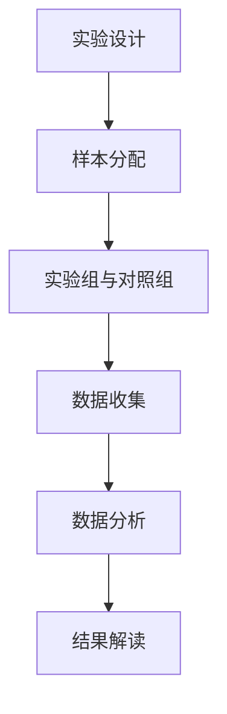
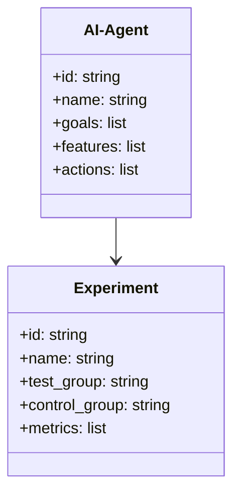
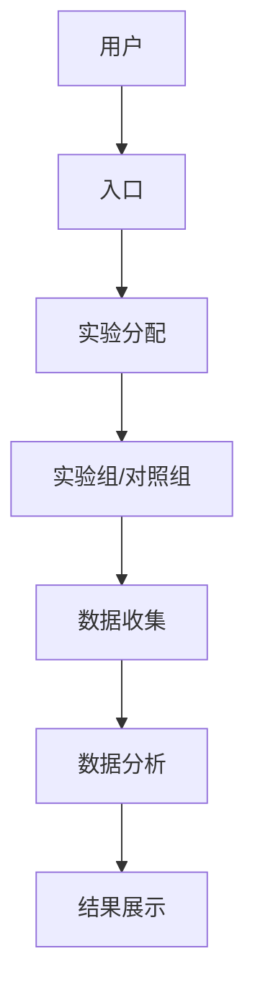
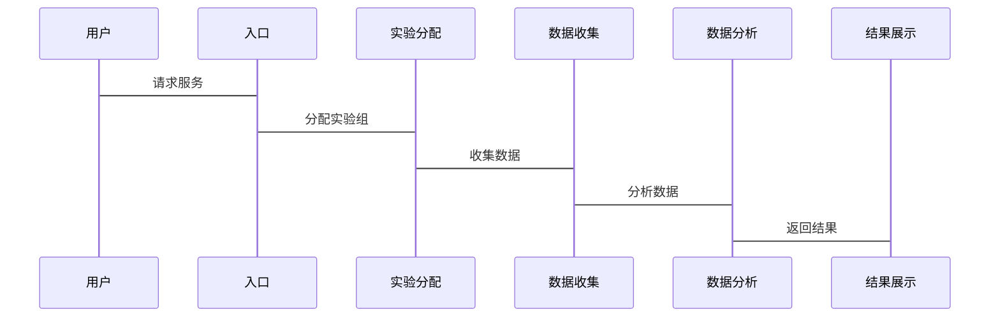

                 


# 企业级AI Agent的A/B测试策略与实施

> 关键词：企业级AI Agent、A/B测试、实验设计、统计假设检验、系统架构、技术实现

> 摘要：本文详细探讨了企业级AI Agent的A/B测试策略与实施方法，从背景介绍、核心概念、算法原理、系统架构到项目实战，结合丰富的实际案例和详细的代码示例，为企业级AI Agent的A/B测试提供全面的解决方案和实践指导。

---

# 第1章 企业级AI Agent与A/B测试概述

## 1.1 企业级AI Agent的定义与特点

### 1.1.1 AI Agent的基本概念
AI Agent（人工智能代理）是指能够感知环境、自主决策并执行任务的智能实体。它能够通过传感器获取信息，利用算法进行分析，并通过执行器与环境交互。

企业级AI Agent的特点包括：
- **复杂性**：涉及多目标优化、高维数据处理。
- **实时性**：需要在动态环境中快速响应。
- **可扩展性**：能够处理大规模数据和复杂场景。
- **可解释性**：要求决策过程透明，便于分析和优化。

### 1.1.2 企业级AI Agent的核心特点
企业级AI Agent在设计和实现上具有以下特点：
- **多目标优化**：同时优化多个业务目标，如用户体验、收益、效率等。
- **高维数据处理**：涉及大量特征和变量，需要高效的数据处理能力。
- **动态适应性**：能够根据环境变化自适应调整策略。

### 1.1.3 企业级AI Agent的应用场景
企业级AI Agent广泛应用于金融、医疗、电商、交通等领域，如智能推荐系统、自动化交易系统、智能客服等。

---

## 1.2 A/B测试的基本概念与作用

### 1.2.1 A/B测试的定义
A/B测试是一种实验方法，通过将用户随机分配到不同的实验组和对照组，比较不同策略或设计对用户行为的影响，从而选择最优方案。

### 1.2.2 A/B测试的核心作用
A/B测试在企业级AI Agent中的作用包括：
- **优化决策**：通过实验验证不同策略的效果，选择最优策略。
- **风险控制**：通过小范围实验，降低全规模 rollout 的风险。
- **数据驱动决策**：基于实验数据，而非主观判断，做出科学决策。

### 1.2.3 A/B测试与传统测试方法的区别
| 方面       | 传统测试方法                 | A/B测试                   |
|------------|------------------------------|---------------------------|
| 目标       | 验证功能正确性               | 比较策略效果，选择最优方案 |
| 方法       | 功能测试、性能测试           | 实验设计、统计分析         |
| 数据来源   | 测试环境数据                 | 实验组和对照组的用户行为数据 |

---

## 1.3 企业级AI Agent中的A/B测试挑战

### 1.3.1 企业级AI Agent的复杂性
- **高维数据**：涉及大量特征，可能导致维度灾难。
- **多目标优化**：需要在多个目标之间找到平衡点。

### 1.3.2 A/B测试在企业级AI Agent中的特殊性
- **实验设计难度大**：需要设计复杂的实验方案，确保实验结果的有效性。
- **数据处理复杂**：需要处理高维数据，确保实验结果的准确性。

### 1.3.3 企业级AI Agent中的A/B测试难点
- **实验周期长**：由于数据量大，实验需要较长时间才能得到显著结果。
- **实验成本高**：由于涉及多个目标，实验成本可能较高。

---

## 1.4 本章小结
本章介绍了企业级AI Agent的基本概念和特点，以及A/B测试的基本原理和作用。同时，分析了在企业级AI Agent中进行A/B测试所面临的挑战和难点，为后续章节的深入探讨奠定了基础。

---

# 第2章 A/B测试的核心原理与数学模型

## 2.1 A/B测试的原理

### 2.1.1 统计假设检验的基本原理
统计假设检验是通过假设检验的方法，基于样本数据推断总体参数是否显著不同的过程。常用的方法包括t检验、卡方检验等。

### 2.1.2 A/B测试中的统计方法
A/B测试中常用的统计方法包括：
- **t检验**：用于比较两组数据的均值差异。
- **置信区间**：用于估计参数的范围，判断差异是否显著。

### 2.1.3 A/B测试的实验设计原则
实验设计原则包括：
- **随机性**：确保样本分配的随机性，避免偏差。
- **对照组与实验组**：设置对照组和实验组，确保实验结果的可比性。
- **样本量**：确保样本量足够大，以提高实验结果的准确性。

---

## 2.2 A/B测试的数学模型

### 2.2.1 统计假设检验的数学公式
假设我们有两个实验组和对照组的样本数据，分别为$X_1$和$X_2$，均值分别为$\mu_1$和$\mu_2$，方差分别为$\sigma_1^2$和$\sigma_2^2$。我们可以通过t检验来判断$\mu_1$和$\mu_2$是否显著不同。

t检验的公式为：
$$
t = \frac{\bar{x}_1 - \bar{x}_2}{\sqrt{\frac{s_1^2}{n_1} + \frac{s_2^2}{n_2}}}
$$

其中，$\bar{x}_1$和$\bar{x}_2$分别是两组的样本均值，$s_1^2$和$s_2^2$是样本方差，$n_1$和$n_2$是样本数量。

### 2.2.2 A/B测试中的置信区间
置信区间的计算公式为：
$$
\mu_1 - \mu_2 = (\bar{x}_1 - \bar{x}_2) \pm z \cdot \sqrt{\frac{s_1^2}{n_1} + \frac{s_2^2}{n_2}}
$$

其中，$z$是置信水平对应的z值，通常为1.96（95%置信水平）。

### 2.2.3 A/B测试中的p值解释
p值是拒绝原假设的概率。如果p值小于显著性水平（如0.05），则拒绝原假设，认为两组之间存在显著差异。

---

## 2.3 A/B测试的流程图



---

## 2.4 本章小结
本章详细介绍了A/B测试的核心原理和数学模型，包括统计假设检验的基本原理、常用的统计方法以及实验设计原则。通过公式和流程图的展示，帮助读者理解A/B测试的实施过程。

---

# 第3章 企业级AI Agent的A/B测试策略

## 3.1 A/B测试的策略制定

### 3.1.1 测试目标的明确
测试目标是A/B测试的核心，需要明确希望通过测试达到什么目的，例如提高用户转化率、降低用户流失率等。

### 3.1.2 测试指标的选择
选择合适的指标是A/B测试成功的关键。常见的指标包括点击率（CTR）、转化率、收益等。

### 3.1.3 测试方案的设计
测试方案的设计需要考虑实验组和对照组的设置、样本量的计算、实验周期的确定等因素。

---

## 3.2 企业级AI Agent的特殊测试策略

### 3.2.1 多目标优化的测试策略
在多目标优化场景下，需要设计多个实验方案，分别优化不同的目标，并找到最优的平衡点。

### 3.2.2 高维数据的测试策略
针对高维数据，可以通过特征选择、降维等技术，简化数据维度，提高实验效率。

### 3.2.3 复杂场景的测试策略
在复杂场景下，可以通过分阶段实验、逐步 rollout 等方法，降低实验风险。

---

## 3.3 A/B测试的实施步骤

### 3.3.1 确定测试目标
明确希望通过测试达到的目标。

### 3.3.2 设计测试方案
设计实验方案，包括实验组和对照组的设置、样本量计算等。

### 3.3.3 执行测试
按照实验方案，执行A/B测试，收集数据。

### 3.3.4 分析结果
对实验数据进行统计分析，判断实验组和对照组之间的差异是否显著。

### 3.3.5 优化策略
根据实验结果，优化策略，选择最优方案。

---

## 3.4 本章小结
本章详细探讨了企业级AI Agent的A/B测试策略，包括测试目标的明确、测试指标的选择、测试方案的设计以及实施步骤。特别针对企业级AI Agent的特殊性，提出了多目标优化、高维数据处理等策略。

---

# 第4章 企业级AI Agent的A/B测试系统架构

## 4.1 系统功能设计

### 4.1.1 测试需求分析
根据企业级AI Agent的特点，分析测试需求，明确测试目标和指标。

### 4.1.2 测试用例设计
根据测试需求，设计详细的测试用例，包括输入、预期输出、测试环境等。

---

## 4.2 系统架构设计

### 4.2.1 领域模型


### 4.2.2 系统架构


---

## 4.3 系统接口设计

### 4.3.1 接口设计
- **实验分配接口**：将用户分配到实验组或对照组。
- **数据收集接口**：收集用户行为数据。
- **数据分析接口**：分析实验数据，返回结果。

### 4.3.2 交互流程


---

## 4.4 本章小结
本章详细介绍了企业级AI Agent的A/B测试系统的功能设计、架构设计和接口设计。通过类图和流程图的展示，帮助读者理解系统的整体结构和交互过程。

---

# 第5章 企业级AI Agent的A/B测试项目实战

## 5.1 环境安装与配置

### 5.1.1 安装依赖
安装必要的工具和库，如Python、Pandas、NumPy、Scipy等。

### 5.1.2 配置实验环境
配置实验环境，包括数据存储、计算资源等。

---

## 5.2 系统核心实现

### 5.2.1 样本分配代码
```python
import random

def assign_sample(user_id):
    if random.random() < 0.5:
        return 'control'
    else:
        return 'test'
```

### 5.2.2 数据收集代码
```python
import logging

def collect_data(user_id, group, action):
    # 数据存储逻辑
    pass
```

### 5.2.3 数据分析代码
```python
import scipy.stats as stats

def analyze_results(test_group, control_group):
    t_stat, p_value = stats.ttest_ind(test_group, control_group)
    return t_stat, p_value
```

---

## 5.3 代码应用解读与分析

### 5.3.1 代码解读
- **样本分配**：随机将用户分配到实验组或对照组。
- **数据收集**：收集用户行为数据，用于后续分析。
- **数据分析**：通过t检验，判断实验组和对照组之间的差异是否显著。

### 5.3.2 代码实现注意事项
- **随机性**：确保样本分配的随机性，避免偏差。
- **数据完整性**：确保数据收集的完整性和准确性。
- **统计显著性**：确保实验结果的统计显著性，避免误判。

---

## 5.4 实际案例分析

### 5.4.1 案例背景
某电商平台希望通过A/B测试，优化智能推荐算法，提高用户点击率。

### 5.4.2 案例实施
- **实验设计**：设计两个实验方案，分别优化推荐算法和用户界面。
- **实验执行**：随机分配用户到实验组和对照组，收集数据。
- **数据分析**：通过t检验，判断实验组和对照组之间的差异是否显著。

### 5.4.3 实验结果
实验结果显示，优化推荐算法的实验组点击率显著高于对照组，因此选择该方案。

---

## 5.5 项目小结
本章通过实际案例，详细讲解了企业级AI Agent的A/B测试项目的实施过程，包括环境配置、代码实现、数据分析和结果解读。

---

# 第6章 企业级AI Agent的A/B测试最佳实践

## 6.1 小结与总结

### 6.1.1 核心要点总结
- 明确测试目标和指标。
- 设计合理的实验方案。
- 确保实验数据的准确性和完整性。

### 6.1.2 经验总结
- 通过小范围实验，降低全规模 rollout 的风险。
- 经常复盘实验结果，优化测试策略。

---

## 6.2 注意事项与风险提示

### 6.2.1 注意事项
- **样本量**：确保样本量足够大，以提高实验结果的准确性。
- **随机性**：确保样本分配的随机性，避免偏差。
- **统计显著性**：确保实验结果的统计显著性，避免误判。

### 6.2.2 风险提示
- **实验周期长**：由于数据量大，实验需要较长时间才能得到显著结果。
- **实验成本高**：由于涉及多个目标，实验成本可能较高。

---

## 6.3 拓展阅读与学习资源

### 6.3.1 推荐书籍
- 《实验方法论》
- 《统计学习习题集》

### 6.3.2 在线资源
- 统计学在线课程
- A/B测试工具文档

---

# 作者

作者：AI天才研究院/AI Genius Institute & 禅与计算机程序设计艺术 /Zen And The Art of Computer Programming

---

本文通过详细分析企业级AI Agent的A/B测试策略与实施，结合实际案例和代码实现，为企业级AI Agent的优化提供了全面的解决方案和实践指导。希望读者能够通过本文，深入了解A/B测试的核心原理和实施方法，为实际应用提供参考。

