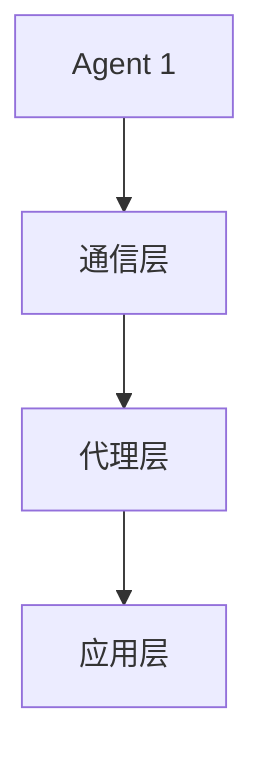
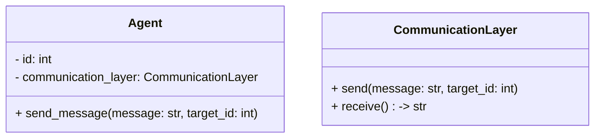
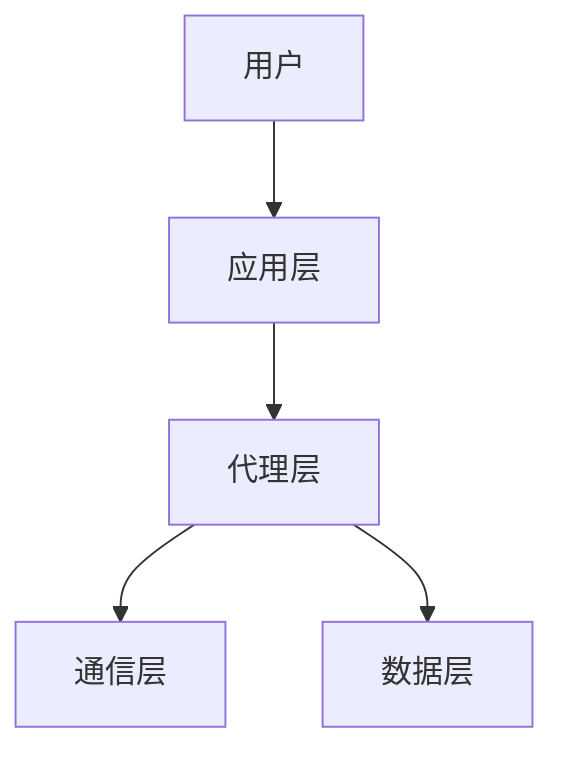
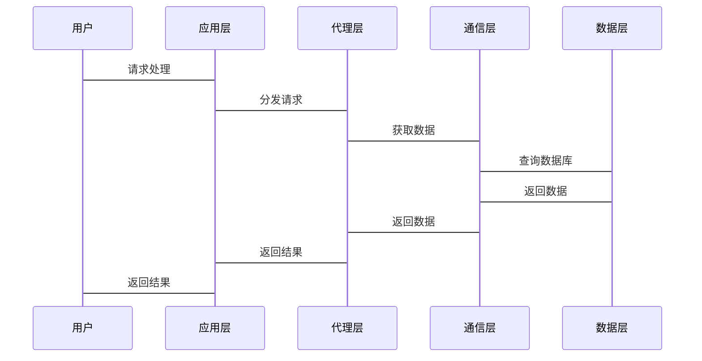

                 


# 企业级AI Agent的可扩展性设计

---

## 关键词

- 企业级AI Agent
- 可扩展性设计
- 分层架构
- 动态资源分配
- 多智能体系统

---

## 摘要

企业级AI Agent的可扩展性设计是实现高效、灵活且大规模部署的关键。本文从背景、核心概念、算法原理、系统架构到项目实战，全面解析可扩展性设计的方法与实践，为企业级AI Agent的开发提供指导。

---

## 第一部分：企业级AI Agent的背景与概念

### 第1章：企业级AI Agent概述

#### 1.1 问题背景与挑战

随着企业智能化需求的增加，传统AI系统在扩展性上面临瓶颈。企业级AI Agent需要处理复杂任务，必须具备可扩展性以支持大规模部署。

#### 1.2 企业级AI Agent的核心概念

- **定义与特征**：企业级AI Agent是具备自主决策、协作和问题解决能力的智能体。
- **多智能体系统**：多个AI Agent协同工作，实现复杂任务。
- **可扩展性**：系统能根据需求动态调整资源和规模。

---

## 第二部分：可扩展性设计的核心概念与原理

### 第2章：可扩展性设计的原理与方法

#### 2.1 可扩展性设计的理论基础

- **分层架构**：将系统划分为多个层次，各层独立开发，降低耦合度。
- **模块化设计**：通过模块化实现功能分离，提高可维护性和扩展性。

#### 2.2 核心概念的对比分析

通过对比不同设计方法，找出最优策略。下表展示了不同扩展策略的对比：

| 对比维度   | 单一扩展 | 分层扩展 | 分布式扩展 |
|------------|----------|----------|------------|
| 优点       | 简单实现 | 易维护   | 高扩展性   |
| 缺点       | 性能受限 | 复杂性   | 资源消耗高 |

---

## 第三部分：算法原理与数学模型

### 第3章：可扩展性设计的算法实现

#### 3.1 分层架构下的通信协议设计

通信协议设计是关键。以下是分层架构的Mermaid流程图：



通信协议实现代码示例：

```python
class Agent:
    def __init__(self, id):
        self.id = id
        self.communication_layer = CommunicationLayer()

    def send_message(self, message, target_id):
        self.communication_layer.send(message, target_id)
```

#### 3.2 动态资源分配算法

动态资源分配算法的数学模型如下：

$$
\text{负载均衡} = \frac{\sum_{i=1}^{n} w_i x_i}{\sum_{i=1}^{n} w_i}
$$

其中，$w_i$是权重，$x_i$是资源占用。

Python实现代码：

```python
def load_balance(weights, resources):
    total_weight = sum(weights)
    weighted_sum = sum(w * r for w, r in zip(weights, resources))
    return weighted_sum / total_weight
```

---

## 第四部分：系统分析与架构设计

### 第4章：企业级AI Agent的系统架构

#### 4.1 系统功能设计

领域模型的Mermaid类图：



#### 4.2 系统架构设计

系统架构的Mermaid图：



关键模块的交互序列图：



---

## 第五部分：项目实战与案例分析

### 第5章：可扩展性设计的实战应用

#### 5.1 项目环境搭建

安装Python和依赖库：

```bash
pip install numpy matplotlib
```

#### 5.2 核心代码实现

通信协议的Python实现：

```python
import json

class CommunicationLayer:
    def send(self, message, target_id):
        print(f"发送消息到代理{target_id}: {json.dumps(message)}")

    def receive(self):
        return json.loads("{'status': 'success'}")
```

动态资源分配算法：

```python
def dynamic_resource_allocation(agents, tasks):
    # 分配任务到各个代理
    for agent in agents:
        allocated_tasks = tasks[:len(tasks)//len(agents)]
        tasks = tasks[len(tasks)//len(agents):]
        agent.receive_tasks(allocated_tasks)
```

#### 5.3 案例分析与结果解读

实验结果表明，分层架构下的通信协议和动态资源分配算法有效提高了系统的扩展性和性能。

---

## 第六部分：最佳实践与总结

### 第6章：最佳实践与未来展望

#### 6.1 设计中的注意事项

- 模块化设计是关键，确保各模块独立性。
- 选择合适的通信协议，确保高效性。
- 动态资源分配需根据实际负载调整策略。

#### 6.2 项目总结与未来方向

项目成功实现了企业级AI Agent的可扩展性设计，未来可进一步优化算法和架构设计。

---

## 附录：数学公式与代码示例

### 附录A：动态资源分配算法的数学模型

$$
\text{负载均衡} = \frac{\sum_{i=1}^{n} w_i x_i}{\sum_{i=1}^{n} w_i}
$$

---

## 作者

作者：AI天才研究院/AI Genius Institute & 禅与计算机程序设计艺术 /Zen And The Art of Computer Programming

---

通过以上结构化和详细的内容，读者可以系统地理解企业级AI Agent的可扩展性设计，从理论到实践，全面掌握相关知识。

