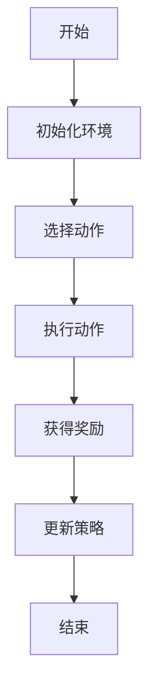
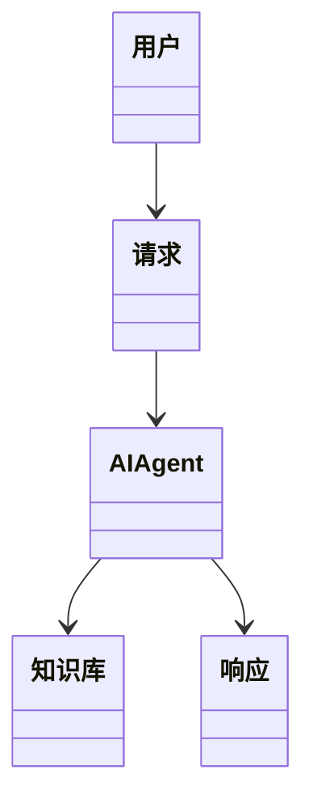
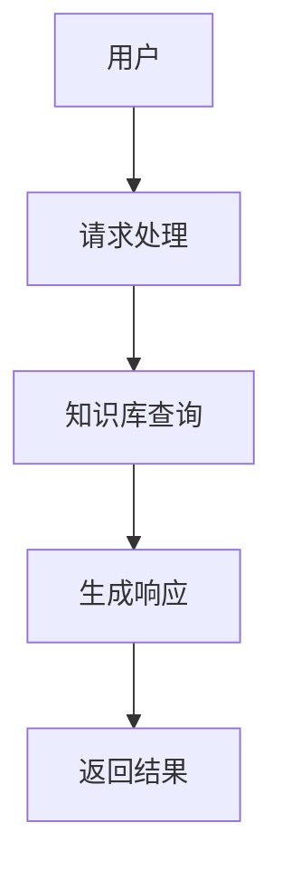
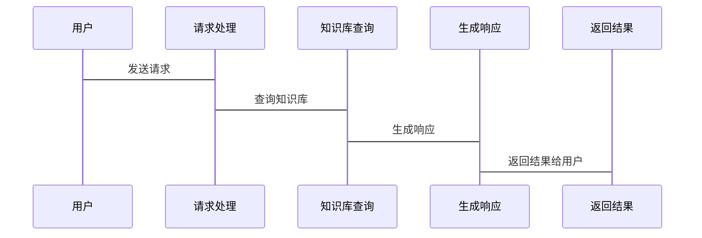

                 


# 企业级AI Agent的可扩展架构设计

> 关键词：企业级AI Agent，可扩展架构，系统设计，算法原理，项目实战

> 摘要：本文详细探讨了企业级AI Agent的可扩展架构设计，从背景与基础、核心概念与联系、算法原理、系统分析与架构设计、项目实战到最佳实践，层层展开，为企业级AI Agent的开发与应用提供了全面的技术指导。

---

## 第一部分: 企业级AI Agent的背景与基础

### 第1章: 企业级AI Agent的背景与问题背景

#### 1.1 问题背景

##### 1.1.1 企业级AI Agent的定义与概念

企业级AI Agent（Artificial Intelligence Agent）是指在企业级环境中运行，能够感知环境、自主决策并执行任务的智能体。它通过与企业系统、数据源和用户交互，为企业提供自动化、智能化的服务。

##### 1.1.2 当前企业级AI Agent的应用现状

企业级AI Agent在多个领域得到了广泛应用，例如：

- **智能客服**：通过自然语言处理（NLP）技术，提供智能问答和客户支持。
- **自动化运维**：利用AI算法监控系统状态，自动修复问题。
- **智能决策支持**：基于大数据分析，为企业提供决策支持。
- **智能供应链管理**：优化库存、物流和供应链流程。

##### 1.1.3 企业级AI Agent的核心问题与挑战

在实际应用中，企业级AI Agent面临以下核心问题：

1. **复杂性**：企业环境复杂，涉及多个系统和数据源，需要处理异构数据和多样化任务。
2. **可扩展性**：随着企业规模的扩大，AI Agent需要处理更多任务，架构必须具备良好的扩展性。
3. **实时性**：部分场景要求AI Agent能够实时响应，这对系统的性能和响应时间提出了更高要求。
4. **安全性**：AI Agent可能需要处理敏感数据，必须确保数据的安全性和系统的稳定性。
5. **可解释性**：在企业决策中，AI Agent的决策过程需要具备可解释性，以满足监管和用户信任。

#### 1.2 问题描述

##### 1.2.1 企业级AI Agent的主要应用场景

企业级AI Agent的主要应用场景包括：

1. **智能助手**：为企业员工提供信息检索、日程管理等服务。
2. **智能监控**：实时监控企业系统运行状态，及时发现异常。
3. **智能调度**：优化企业资源分配，提高效率。
4. **智能分析**：基于大量数据，提供深入的分析和预测。

##### 1.2.2 企业级AI Agent的关键问题分析

在分析企业级AI Agent的关键问题时，需要考虑以下几个方面：

1. **数据源的多样性**：企业数据可能分布在多个系统中，如何有效地整合和处理这些数据是一个挑战。
2. **任务的复杂性**：AI Agent需要处理的任务可能涉及多个步骤和决策点，如何设计高效的执行流程至关重要。
3. **系统的实时性**：部分任务要求AI Agent能够实时响应，这对系统的性能和架构设计提出了更高的要求。
4. **系统的可扩展性**：随着企业的发展，AI Agent需要能够处理更多任务和更大的数据量，架构设计必须具备良好的扩展性。

##### 1.2.3 企业级AI Agent的边界与外延

企业级AI Agent的边界在于其功能和应用范围。它不仅限于单一任务，而是能够处理多种任务，成为一个综合性的智能体。外延则包括与企业系统、数据源和用户的交互接口，以及与其他AI Agent的协作。

---

### 第2章: 企业级AI Agent的核心概念与联系

#### 2.1 核心概念的原理

##### 2.1.1 AI Agent的基本原理

AI Agent通过感知环境、分析信息、制定策略和执行动作来完成任务。其基本原理包括：

1. **感知**：通过传感器或数据接口获取环境信息。
2. **分析**：利用算法对获取的信息进行处理和分析。
3. **决策**：基于分析结果，制定行动策略。
4. **执行**：根据决策结果，执行相应的动作。

##### 2.1.2 企业级AI Agent的独特性

企业级AI Agent的独特性体现在以下几个方面：

1. **复杂性**：涉及企业级系统，任务多样且复杂。
2. **可扩展性**：需要支持大规模的任务处理和数据处理。
3. **安全性**：涉及企业敏感数据，必须保证数据安全和系统稳定。

##### 2.1.3 可扩展架构设计的核心思想

可扩展架构设计的核心思想是：

1. **模块化设计**：将系统划分为多个功能模块，每个模块独立开发和维护。
2. **分层架构**：通过分层设计，实现系统的松耦合结构，便于扩展和维护。
3. **服务化设计**：通过服务接口定义，实现模块之间的通信和协作。

#### 2.2 核心概念的属性特征对比

##### 2.2.1 不同AI Agent类型的特点对比

以下是几种常见的AI Agent类型及其特点对比：

| **类型**       | **特点**                                                                 |
|----------------|--------------------------------------------------------------------------|
| **简单反射型**  | 基于固定的规则进行反应，适用于简单任务。                                   |
| **基于模型型**  | 基于环境模型进行推理和决策，适用于复杂任务。                               |
| **目标驱动型**  | 有明确的目标，通过优化目标函数进行决策。                                   |
| **效用驱动型**  | 基于效用函数进行决策，适用于多目标优化场景。                                 |

##### 2.2.2 企业级AI Agent与其他类型AI Agent的对比

企业级AI Agent与传统AI Agent的主要区别在于：

1. **复杂性**：企业级AI Agent需要处理的任务更为复杂，涉及多个系统和数据源。
2. **可扩展性**：企业级AI Agent需要具备良好的扩展性，能够处理大规模任务。
3. **安全性**：企业级AI Agent需要处理敏感数据，必须保证数据安全和系统稳定性。

##### 2.2.3 ER实体关系图的 Mermaid 流程图

以下是企业级AI Agent的实体关系图：

```mermaid
erDiagram
    actor 用户
    actor 系统
    actor 数据源
    actor 任务管理器
    database 数据库
    system AI Agent
    AI Agent <-> 用户
    AI Agent <-> 系统
    AI Agent <-> 数据源
    AI Agent <-> 任务管理器
    AI Agent --> 数据库
```

---

### 第3章: 企业级AI Agent的算法原理

#### 3.1 算法原理概述

##### 3.1.1 企业级AI Agent的核心算法

企业级AI Agent的核心算法包括：

1. **强化学习（Reinforcement Learning）**：通过与环境交互，学习最优策略。
2. **图神经网络（Graph Neural Network）**：处理图结构数据，适用于复杂关系推理。
3. **自然语言处理（NLP）**：实现与用户的自然语言交互。

##### 3.1.2 算法的数学模型与公式

以下是强化学习的数学模型示例：

$$ R = r_1 + r_2 + \dots + r_n $$

其中，\( R \) 是奖励总和，\( r_i \) 是每一步的奖励。

##### 3.1.3 算法的实现步骤

1. **环境初始化**：定义环境和状态空间。
2. **策略选择**：选择一个策略函数 \( \pi(a|s) \)。
3. **与环境交互**：执行动作并获得奖励。
4. **更新策略**：基于奖励更新策略函数。

#### 3.2 算法原理的 Mermaid 流程图

以下是强化学习的流程图：



#### 3.3 算法原理的 Python 实现

以下是强化学习的Python代码示例：

```python
import numpy as np

# 定义环境
class Environment:
    def __init__(self):
        self.states = [0, 1, 2]
        self.actions = [0, 1]

    def reset(self):
        return 0

    def step(self, state, action):
        # 过渡概率矩阵
        transition_prob = {
            (0, 0): {1: 1.0},
            (0, 1): {2: 1.0},
            (1, 0): {1: 0.8, 2: 0.2},
            (1, 1): {0: 0.2, 2: 0.8},
            (2, 0): {2: 1.0},
            (2, 1): {2: 1.0},
        }
        next_state = transition_prob[(state, action)][1]
        reward = 1 if next_state == 2 else 0
        return next_state, reward

# 定义策略
class Policy:
    def __init__(self, state_size, action_size):
        self.theta = np.random.randn(1, state_size * action_size)

    def get_action(self, state):
        action_probs = np.exp(self.theta[0, state * 2: state * 2 + 2]) / np.sum(np.exp(self.theta[0, state * 2: state * 2 + 2]))
        return np.argmax(action_probs)

# 初始化环境和策略
env = Environment()
policy = Policy(len(env.states), len(env.actions))

# 训练过程
for _ in range(1000):
    state = env.reset()
    while True:
        action = policy.get_action(state)
        next_state, reward = env.step(state, action)
        # 更新策略
        # ...（省略详细更新步骤）
        state = next_state
```

---

### 第4章: 企业级AI Agent的系统分析与架构设计

#### 4.1 系统分析

##### 4.1.1 问题场景介绍

企业级AI Agent的典型应用场景包括智能客服、自动化运维、智能供应链管理等。以智能客服为例，AI Agent需要处理大量的用户请求，提供智能问答和客户支持。

##### 4.1.2 项目介绍

以智能客服系统为例，项目目标是实现一个能够处理多种用户请求的智能客服系统。

#### 4.2 系统功能设计

##### 4.2.1 领域模型 mermaid 类图

以下是智能客服系统的领域模型：



##### 4.2.2 系统架构设计 mermaid 架构图

以下是系统的架构设计：



##### 4.2.3 系统接口设计

系统接口设计包括：

1. **用户接口**：提供API供用户调用。
2. **知识库接口**：与知识库系统进行交互。
3. **日志接口**：记录系统运行日志。

##### 4.2.4 系统交互 mermaid 序列图

以下是系统的交互序列图：



---

## 第二部分: 企业级AI Agent的项目实战

### 第5章: 企业级AI Agent的项目实战

#### 5.1 环境安装

以下是项目所需的环境和工具：

1. **Python**：3.8+
2. **库**：numpy、pandas、scikit-learn、tensorflow
3. **开发工具**：VS Code、PyCharm

#### 5.2 系统核心实现

##### 5.2.1 核心代码实现

以下是AI Agent的核心代码实现：

```python
import numpy as np
from sklearn.neural_network import MLPClassifier

# 数据准备
X_train = np.array([[...], [...], ...])
y_train = np.array([...])

# 模型训练
model = MLPClassifier()
model.fit(X_train, y_train)

# 预测
X_test = np.array([[...], [...], ...])
y_pred = model.predict(X_test)
```

##### 5.2.2 代码的详细解读

1. **数据准备**：将数据集划分为训练集和测试集。
2. **模型训练**：使用神经网络模型进行训练。
3. **预测**：利用训练好的模型进行预测。

##### 5.2.3 代码的运行与测试

运行代码，输出预测结果，并与真实结果进行对比，评估模型性能。

#### 5.3 案例分析与详细讲解

##### 5.3.1 案例分析

以智能客服系统为例，分析AI Agent在实际应用中的表现和效果。

##### 5.3.2 详细讲解

详细讲解AI Agent在智能客服系统中的具体实现，包括数据处理、模型训练、接口设计等步骤。

#### 5.4 项目总结

总结项目实施过程中的经验教训，提出改进建议，并展望未来的发展方向。

---

## 第三部分: 企业级AI Agent的最佳实践

### 第6章: 企业级AI Agent的最佳实践

#### 6.1 最佳实践 tips

1. **模块化设计**：将系统划分为多个模块，便于维护和扩展。
2. **服务化设计**：通过服务接口定义，实现模块之间的通信和协作。
3. **安全性设计**：确保数据安全和系统稳定性，防止数据泄露和系统攻击。

#### 6.2 小结

总结全文内容，强调企业级AI Agent的可扩展架构设计的重要性，并展望未来的发展方向。

#### 6.3 注意事项

1. **数据安全**：在处理敏感数据时，必须采取加密措施。
2. **系统稳定性**：确保系统在高负载下仍能正常运行。
3. **可解释性**：在决策过程中，必须保证可解释性，以满足监管和用户信任。

#### 6.4 拓展阅读

推荐相关领域的书籍和论文，供读者进一步学习和研究。

---

## 作者

作者：AI天才研究院/AI Genius Institute & 禅与计算机程序设计艺术 /Zen And The Art of Computer Programming

