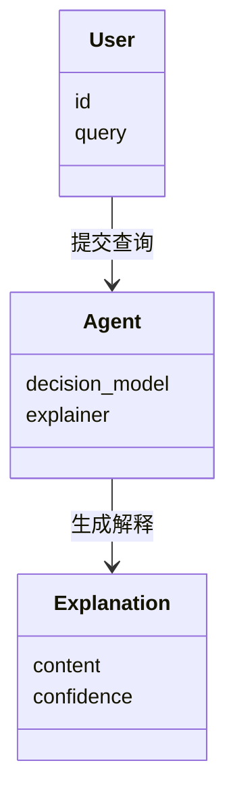
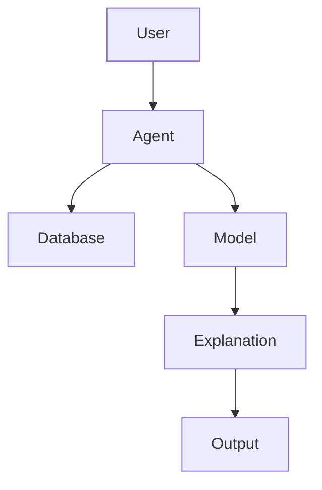
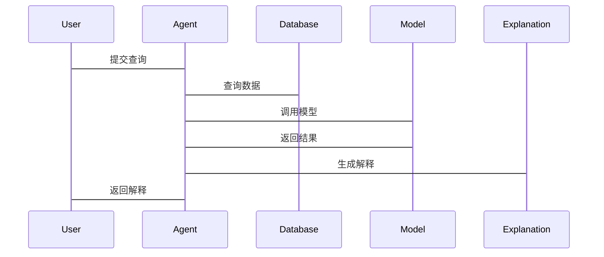

                 


# 企业级AI Agent的可解释性设计与实现

> 关键词：企业级AI Agent，可解释性设计，AI算法，系统架构，项目实战

> 摘要：本文从企业级AI Agent的背景与问题背景出发，详细探讨了AI Agent的核心概念、算法原理、系统架构设计以及项目实战。通过理论分析与实践结合，本文揭示了可解释性设计在企业级AI Agent中的重要性，并提供了一系列可操作的设计与实现方案。

---

# 正文

## 第1章: 企业级AI Agent的背景与问题背景

### 1.1 问题背景

#### 1.1.1 AI Agent的基本概念与定义
AI Agent（人工智能代理）是指能够感知环境并采取行动以实现目标的智能实体。它通过接收输入、处理信息、做出决策并输出结果，能够自主完成特定任务。企业级AI Agent则是指在企业环境中运行，具备高度复杂性和可扩展性的AI代理，通常用于自动化决策、流程优化、客户服务等领域。

#### 1.1.2 企业级AI Agent的应用场景与需求
企业级AI Agent的应用场景广泛，包括：
- **自动化决策支持**：如供应链管理、库存优化、客户关系管理等。
- **智能客服**：通过自然语言处理技术为客户提供智能支持。
- **流程自动化**：如自动审批流程、自动报告生成等。
- **风险管理**：通过实时监控和分析，识别潜在风险并采取措施。

#### 1.1.3 当前AI Agent在企业中的问题与挑战
尽管AI Agent在企业中展现出巨大潜力，但其可解释性问题仍然是主要挑战。AI Agent的决策过程通常依赖复杂的算法，导致其决策过程难以被人类理解。这不仅影响了用户对系统的信任，还可能在出现问题时难以进行有效的调试和优化。

---

### 1.2 问题描述

#### 1.2.1 AI Agent可解释性的重要性
可解释性是企业级AI Agent设计中的核心问题。缺乏可解释性会导致以下问题：
- **信任缺失**：用户无法理解AI Agent的决策过程，从而降低信任。
- **责任追究**：在出现问题时，难以追溯决策的来源。
- **合规性问题**：在金融、医疗等严格监管的行业中，可解释性是合规的基本要求。

#### 1.2.2 当前AI Agent可解释性设计的痛点
当前AI Agent的可解释性设计面临以下痛点：
- **算法复杂性**：深度学习模型（如神经网络）通常被视为“黑箱”，难以解释。
- **数据复杂性**：企业数据往往具有高维性和复杂性，进一步增加了解释的难度。
- **缺乏统一标准**：目前尚无统一的可解释性标准和框架，导致设计缺乏系统性。

#### 1.2.3 企业级AI Agent可解释性设计的核心问题
企业级AI Agent的可解释性设计需要解决以下核心问题：
- **如何平衡可解释性和性能**：在确保可解释性的前提下，不显著降低AI Agent的性能。
- **如何实现可解释性框架**：构建一个能够解释AI Agent决策过程的框架。
- **如何实现可解释性交互**：设计用户友好的交互界面，帮助用户理解AI Agent的决策过程。

---

### 1.3 问题解决

#### 1.3.1 可解释性设计的目标与原则
可解释性设计的目标是：
- 提供清晰的解释，帮助用户理解AI Agent的决策过程。
- 提供可追溯的决策路径，便于问题分析和责任追究。
- 确保解释的准确性和一致性。

可解释性设计的原则包括：
- **透明性**：确保用户能够理解AI Agent的决策过程。
- **可追溯性**：提供决策的详细路径和数据支持。
- **可解释性优先**：在设计过程中优先考虑可解释性。

#### 1.3.2 企业级AI Agent可解释性设计的解决方案
解决方案包括：
- **基于规则的可解释性模型**：通过预定义的规则和逻辑，确保决策过程的可解释性。
- **可解释性增强算法**：在现有算法中加入可解释性增强模块，提高可解释性。
- **可视化工具**：通过可视化技术，将复杂的决策过程简化为易于理解的图形或文本。

#### 1.3.3 解决方案的实现路径与方法
实现路径包括：
1. **需求分析**：明确企业级AI Agent的可解释性需求。
2. **框架设计**：设计可解释性框架，包括数据采集、决策过程记录、解释生成等模块。
3. **算法实现**：选择或开发具有可解释性的算法，并进行实现。
4. **测试与优化**：对可解释性框架进行测试，优化解释的准确性和用户友好性。

---

### 1.4 问题的边界与外延

#### 1.4.1 可解释性设计的边界
- **范围边界**：可解释性设计仅关注AI Agent的决策过程，不涉及数据采集和外部系统集成。
- **时间边界**：可解释性设计需要在实时或近实时范围内提供解释。

#### 1.4.2 企业级AI Agent的外延与扩展
- **扩展性**：企业级AI Agent需要能够扩展到更大的数据规模和更复杂的业务场景。
- **适应性**：能够适应业务规则和数据分布的变化。

#### 1.4.3 相关概念的对比与区分
- **可解释性与可调试性**：可解释性关注理解决策过程，可调试性关注能够通过调试工具定位问题。
- **可解释性与可预测性**：可预测性关注预测结果的准确性，可解释性关注预测结果的原因。

---

### 1.5 概念结构与核心要素组成

#### 1.5.1 可解释性设计的核心要素
- **决策过程记录**：记录AI Agent的决策过程，包括输入数据、处理步骤和输出结果。
- **解释生成模块**：将决策过程转化为易于理解的解释。
- **解释呈现界面**：通过可视化或其他形式将解释呈现给用户。

#### 1.5.2 企业级AI Agent的组成结构
- **感知模块**：接收输入数据并进行初步处理。
- **决策模块**：基于感知模块的输出，进行决策。
- **执行模块**：根据决策结果执行相应的操作。
- **可解释性模块**：记录和解释决策过程。

#### 1.5.3 核心概念之间的关系与联系
- **感知模块与决策模块**：感知模块提供输入数据，决策模块基于这些数据进行决策。
- **决策模块与可解释性模块**：决策模块的输出被可解释性模块记录和解释。
- **可解释性模块与用户交互**：可解释性模块通过用户友好的界面，将解释呈现给用户。

---

## 第2章: 企业级AI Agent的核心概念与联系

### 2.1 核心概念原理

#### 2.1.1 可解释性设计的原理与机制
可解释性设计的原理包括：
- **符号逻辑推理**：通过符号逻辑对决策过程进行推理，确保可解释性。
- **规则驱动解释**：通过预定义的规则生成解释。
- **基于模型的解释**：通过模型的结构和参数生成解释。

#### 2.1.2 企业级AI Agent的核心算法与模型
企业级AI Agent的核心算法包括：
- **基于规则的算法**：通过预定义的规则进行决策。
- **基于逻辑的算法**：通过逻辑推理进行决策。
- **基于概率的算法**：通过概率模型进行决策。

#### 2.1.3 可解释性与AI Agent性能的关系
可解释性与性能的关系需要在设计中进行平衡。过多地追求可解释性可能导致性能下降，而忽视可解释性则可能导致用户信任缺失。

---

### 2.2 核心概念属性特征对比

#### 2.2.1 可解释性与不可解释性的对比
| 特性 | 可解释性 | 不可解释性 |
|------|----------|------------|
| 理解难度 | 较低     | 较高       |
| 信任度 | 高       | 低         |
| 调试难度 | 较低     | 较高       |

#### 2.2.2 企业级AI Agent与个人AI Agent的对比
| 特性 | 企业级AI Agent | 个人AI Agent |
|------|----------------|--------------|
| 数据规模 | 大             | 小           |
| 复杂性 | 高             | 中           |
| 可解释性需求 | 高             | 中           |

#### 2.2.3 不同可解释性设计方法的对比
| 方法 | 基于规则 | 基于符号逻辑 | 基于概率模型 |
|------|----------|--------------|--------------|
| 可解释性 | 高       | 中           | 低           |
| 性能   | 中       | 中           | 高           |

---

### 2.3 ER实体关系图架构

```mermaid
er
    actor: 用户
    agent: AI Agent
    rule: 可解释性规则
    explanation: 解释信息
    action: 行动
    constraint: 约束条件
    user_query: 用户查询
    system_response: 系统响应
    explainability_level: 可解释性级别
    performance_metrics: 性能指标
```

---

## 第3章: 企业级AI Agent的算法原理讲解

### 3.1 算法原理概述

#### 3.1.1 可解释性设计的核心算法
可解释性设计的核心算法包括：
- **基于规则的算法**：通过预定义的规则进行决策。
- **基于符号逻辑的算法**：通过符号逻辑进行推理。
- **基于概率的算法**：通过概率模型进行决策。

#### 3.1.2 企业级AI Agent的算法特点
企业级AI Agent的算法特点包括：
- **高可扩展性**：能够处理大规模数据。
- **高复杂性**：需要处理复杂的业务逻辑。
- **高可解释性**：能够在保证性能的前提下提供可解释的决策。

---

### 3.2 算法原理的数学模型与公式

#### 3.2.1 基于符号逻辑的可解释性模型
$$ P \rightarrow Q $$

#### 3.2.2 基于概率的可解释性模型
$$ P(A|B) = \frac{P(B|A)P(A)}{P(B)} $$

#### 3.2.3 基于规则的可解释性模型
$$ Rule: 如果条件满足，则执行操作 $$

---

### 3.3 算法实现的详细步骤

#### 3.3.1 数据预处理与特征提取
1. **数据清洗**：去除噪声数据，确保数据质量。
2. **特征提取**：从原始数据中提取有用的特征。

#### 3.3.2 模型训练与优化
1. **选择算法**：根据需求选择合适的算法。
2. **训练模型**：使用训练数据训练模型。
3. **优化模型**：通过调整参数优化模型性能。

#### 3.3.3 解释信息的生成与输出
1. **解释信息生成**：根据决策过程生成解释信息。
2. **解释信息输出**：将解释信息以用户友好的形式输出。

---

### 3.4 算法实现的代码示例

```python
def explainable_ai_agent(input_data):
    # 数据预处理
    processed_data = preprocess(input_data)
    
    # 决策过程
    decision = decision_model.predict(processed_data)
    
    # 生成解释
    explanation = generate_explanation(processed_data, decision)
    
    return explanation
```

---

## 第4章: 企业级AI Agent的系统架构设计

### 4.1 系统架构设计

#### 4.1.1 领域模型类图


#### 4.1.2 系统架构图


#### 4.1.3 系统接口设计
- **输入接口**：接收用户查询。
- **输出接口**：输出解释信息。

---

### 4.2 系统交互设计

#### 4.2.1 系统交互流程
1. 用户提交查询。
2. Agent接收查询并进行处理。
3. Agent生成解释信息。
4. 解释信息通过输出接口呈现给用户。

#### 4.2.2 系统交互序列图


---

## 第5章: 企业级AI Agent的项目实战

### 5.1 项目介绍

#### 5.1.1 项目背景
本项目旨在开发一个具有高可解释性的企业级AI Agent，用于智能客服场景。

#### 5.1.2 项目目标
- 提供高效的客户服务。
- 提供可解释的决策过程。

---

### 5.2 系统核心实现

#### 5.2.1 核心代码实现
```python
def preprocess(input_data):
    # 数据预处理代码
    pass

def decision_model(input_data):
    # 决策模型代码
    pass

def generate_explanation(input_data, decision):
    # 生成解释代码
    pass
```

#### 5.2.2 代码应用解读与分析
- **preprocess函数**：对输入数据进行清洗和特征提取。
- **decision_model函数**：基于预处理后的数据进行决策。
- **generate_explanation函数**：根据决策结果生成解释信息。

---

### 5.3 实际案例分析与详细讲解

#### 5.3.1 案例背景
假设用户查询“如何处理订单延迟问题”。

#### 5.3.2 系统处理过程
1. 用户提交查询。
2. 系统进行数据预处理。
3. 决策模型生成决策。
4. 生成解释信息并返回给用户。

---

### 5.4 项目小结

#### 5.4.1 项目总结
通过本项目，我们成功开发了一个具有高可解释性的企业级AI Agent，能够在保证性能的前提下提供清晰的解释。

#### 5.4.2 项目经验
- **经验一**：在设计阶段充分考虑可解释性需求。
- **经验二**：在实现阶段注重算法的可解释性。

---

## 第6章: 企业级AI Agent的总结与展望

### 6.1 总结

#### 6.1.1 核心总结
企业级AI Agent的可解释性设计是实现用户信任和合规性的重要保障。

#### 6.1.2 经验总结
在设计和实现过程中，需要平衡可解释性和性能，并注重算法的透明性和可追溯性。

---

### 6.2 展望

#### 6.2.1 未来发展方向
- **可解释性框架的标准化**：制定统一的可解释性标准。
- **可解释性技术的创新**：探索新的可解释性技术。
- **跨领域应用**：将可解释性设计应用到更多领域。

---

## 结语

企业级AI Agent的可解释性设计与实现是一个复杂而重要的课题。通过本文的探讨，我们不仅了解了其核心概念和算法原理，还通过项目实战展示了其具体实现方法。未来，随着技术的进步和需求的增加，可解释性设计将成为企业级AI Agent设计中的核心要素。

---

**作者：AI天才研究院/AI Genius Institute & 禅与计算机程序设计艺术 /Zen And The Art of Computer Programming**

