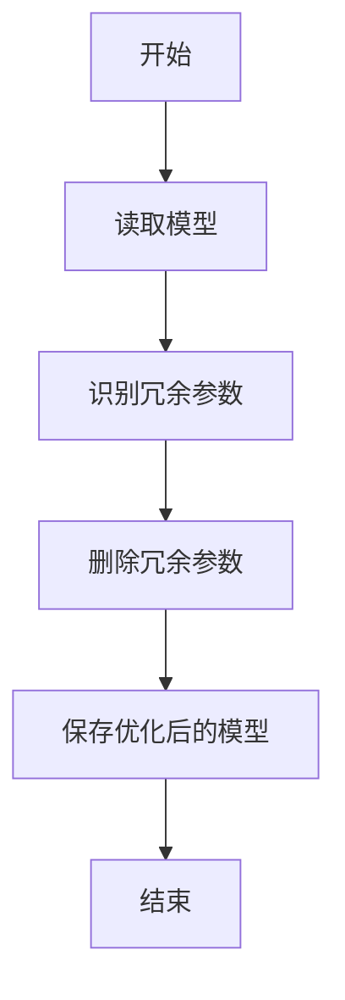
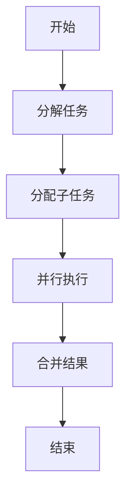
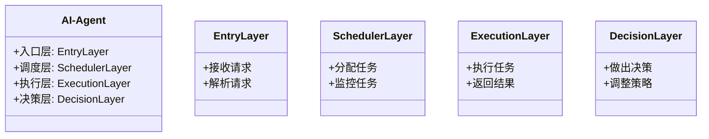

                 


# 企业级AI Agent的性能优化策略

## 关键词：企业级AI Agent、性能优化、算法原理、系统架构、项目实战

## 摘要：  
本文深入探讨企业级AI Agent的性能优化策略，从核心概念到算法原理，再到系统架构和项目实战，全面解析如何提升AI Agent的性能表现。通过详细分析AI Agent的工作原理、优化算法、系统架构设计以及实际案例，本文为技术专家和企业提供了一套系统化的优化方法论。

---

# 第一部分: 企业级AI Agent的背景与概念

## 第1章: 企业级AI Agent的概述

### 1.1 什么是企业级AI Agent
企业级AI Agent是一种具备自主决策能力的智能体，能够在复杂的商业环境中执行任务、解决问题并优化结果。它结合了人工智能、机器学习和自动化技术，能够处理大量数据并提供高效的解决方案。

#### 1.1.1 AI Agent的定义与核心概念
- **定义**：AI Agent是一种能够感知环境、做出决策并采取行动的智能实体。
- **核心概念**：
  - **自主性**：能够在没有外部干预的情况下独立运作。
  - **反应性**：能够实时感知环境变化并做出相应调整。
  - **目标导向性**：始终围绕特定目标执行任务。

#### 1.1.2 企业级AI Agent的特点
- **高可用性**：在企业环境中需要7x24小时稳定运行。
- **高扩展性**：能够处理大量的数据和任务。
- **高智能性**：具备复杂问题的解决能力。

#### 1.1.3 企业级AI Agent与个人AI Agent的区别
- **规模**：企业级AI Agent通常处理更大规模的数据和任务。
- **复杂性**：企业级AI Agent需要应对更复杂的环境和问题。
- **稳定性**：企业级AI Agent对系统的稳定性和可靠性要求更高。

### 1.2 企业级AI Agent的应用场景
企业级AI Agent在多个领域都有广泛的应用，包括但不限于：
- **企业自动化**：自动化处理企业中的重复性任务。
- **智能客服**：提供智能的客户支持服务。
- **供应链优化**：优化企业的供应链管理。

### 1.3 企业级AI Agent的性能优化需求
- **优化目标**：提升响应速度、减少资源消耗、提高决策准确性。
- **优化挑战**：数据量大、任务复杂、环境动态变化。
- **优化策略**：通过算法优化、系统架构调整和资源分配策略提升性能。

---

## 第2章: 企业级AI Agent的核心概念与联系

### 2.1 AI Agent的组成与工作原理
企业级AI Agent通常由以下几个部分组成：
- **感知层**：负责感知环境信息。
- **决策层**：基于感知的信息做出决策。
- **执行层**：执行决策并输出结果。

#### 实体关系图（ER图）
以下是企业级AI Agent的核心实体关系图：

```mermaid
erDiagram
    agent: AI Agent
    environment: 环境
    decision: 决策模块
    action: 行动模块
    data_source: 数据源

    agent --> environment: 感知
    agent --> decision: 输入
    decision --> action: 输出
    agent --> data_source: 读取
```

---

## 第3章: 企业级AI Agent的算法原理

### 3.1 常用优化算法概述
企业级AI Agent的性能优化通常涉及以下几种算法：
- **模型压缩**：通过减少模型参数量来降低计算成本。
- **并行计算**：利用多核处理器或分布式计算提升计算速度。
- **动态调整**：根据环境变化动态调整算法参数。

#### 3.1.1 模型压缩算法
模型压缩是通过剪枝、量化等技术减少模型的大小，同时保持模型的准确性。

#### 3.1.2 并行计算优化算法
并行计算通过将任务分解成多个子任务并行执行，从而提高计算效率。

#### 3.1.3 动态调整算法
动态调整算法能够根据环境变化自动调整模型参数，以适应不同的场景。

### 3.2 算法原理的详细讲解
以下是模型压缩算法的详细流程：



#### 3.2.1 模型压缩算法的数学模型
模型压缩的数学模型如下：

$$ \text{损失函数} = \text{原始损失} + \lambda \times \text{参数数量} $$

其中，$\lambda$ 是惩罚系数，用于平衡模型准确性和参数数量。

#### 3.2.2 并行计算优化的流程图
以下是并行计算的流程图：



---

## 第4章: 企业级AI Agent的系统分析与架构设计

### 4.1 系统分析与需求分析
企业级AI Agent系统需要满足以下需求：
- 高可用性：确保系统在故障情况下仍能正常运行。
- 高扩展性：能够处理大量的数据和任务。
- 高智能性：具备复杂问题的解决能力。

#### 4.1.1 问题场景的描述
企业级AI Agent需要处理复杂的商业环境，包括多任务处理、动态变化的环境和高并发请求。

### 4.2 系统架构设计
以下是企业级AI Agent的系统架构图：


#### 4.2.1 系统功能设计
以下是系统功能设计的类图：



---

## 第5章: 企业级AI Agent的项目实战

### 5.1 环境安装
以下是项目实战的环境安装步骤：

1. 安装Python和相关库：
   ```bash
   pip install numpy pandas scikit-learn
   ```

2. 安装深度学习框架：
   ```bash
   pip install tensorflow keras
   ```

3. 安装并行计算库：
   ```bash
   pip install joblib
   ```

### 5.2 系统核心实现源代码
以下是模型压缩算法的代码实现：

```python
import numpy as np
import tensorflow as tf

def model_compress(model):
    # 识别冗余参数
    weights = model.get_weights()
    # 删除冗余参数
    compressed_weights = [w for w in weights if np.sum(w) != 0]
    # 重新构建模型
    model.set_weights(compressed_weights)
    return model
```

### 5.3 代码应用解读与分析
上述代码通过识别冗余参数并删除它们，从而压缩模型的大小，降低计算成本。

### 5.4 实际案例分析
以一个具体的案例为例，展示如何通过模型压缩算法优化AI Agent的性能。

---

## 第6章: 最佳实践、小结、注意事项和拓展阅读

### 6.1 最佳实践
- 定期监控系统性能，及时调整优化策略。
- 使用分布式计算提升系统的处理能力。
- 定期更新模型，保持系统的先进性。

### 6.2 小结
企业级AI Agent的性能优化需要从算法优化、系统架构设计和资源分配等多个方面入手。通过合理的优化策略，可以显著提升系统的性能和效率。

### 6.3 注意事项
- 在优化过程中，需要注意系统的稳定性和可靠性。
- 优化策略需要根据具体的场景和需求进行调整。
- 需要定期监控系统的性能，及时发现和解决问题。

### 6.4 拓展阅读
- 《深度学习》——Yann LeCun, Yoshua Bengio, Geoffrey Hinton
- 《机器学习实战》——C Sanders

---

## 作者：AI天才研究院 & 禅与计算机程序设计艺术

