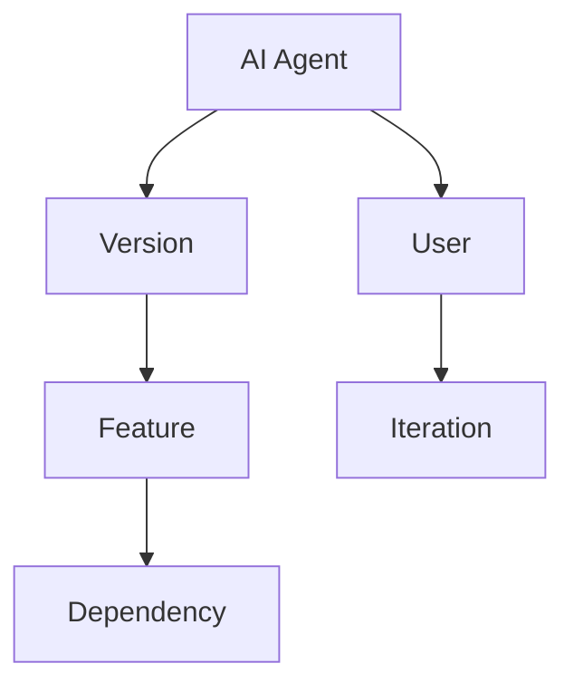
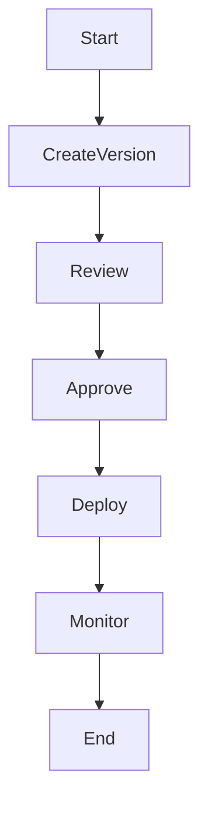
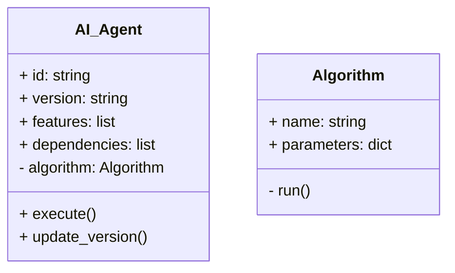
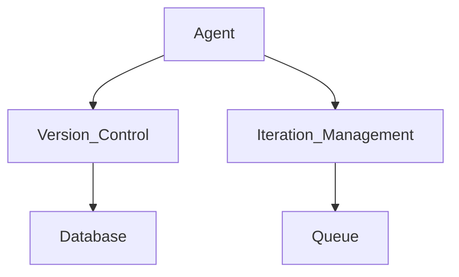
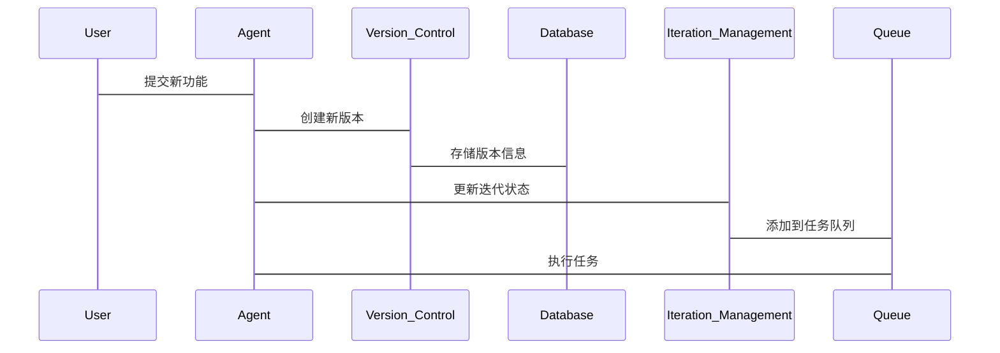

                 


# 企业级AI Agent的版本控制与迭代管理

## 关键词
企业级AI Agent, 版本控制, 迭代管理, 系统架构, 数学模型, 项目实战

## 摘要
本文深入探讨了企业级AI Agent的版本控制与迭代管理的关键问题，分析了其核心概念、算法原理、系统架构及项目实战，旨在为企业级AI Agent的高效管理和优化提供理论支持和实践指导。

---

## 第1章: 企业级AI Agent概述

### 1.1 AI Agent的基本概念
#### 1.1.1 AI Agent的定义与特点
- AI Agent（智能体）：能够感知环境、自主决策并执行任务的智能实体。
- 特点：
  - 智能性：基于AI算法进行决策。
  - 自主性：无需人工干预，自主完成任务。
  - 可扩展性：支持多种应用场景。

#### 1.1.2 企业级AI Agent的核心要素
- 数据源：企业内部数据（CRM、ERP等）。
- 智能引擎：AI算法（如机器学习、自然语言处理）。
- 执行模块：任务执行与反馈机制。

#### 1.1.3 企业级AI Agent的应用场景
- 客户服务：智能客服、自动化问题解决。
- 供应链管理：预测库存、优化物流。
- 金融领域：智能投顾、风险控制。

### 1.2 企业级AI Agent的背景与趋势
#### 1.2.1 AI技术在企业中的发展现状
- AI技术已在企业中广泛应用，推动数字化转型。
- 企业级AI Agent的需求日益增长。

#### 1.2.2 企业级AI Agent的市场需求
- 提高效率：自动化处理复杂任务。
- 降低成本：减少人工干预，降低运营成本。
- 创新驱动：通过AI赋能业务创新。

#### 1.2.3 未来发展趋势与挑战
- 技术挑战：算法优化、模型泛化能力。
- 管理挑战：版本控制与迭代效率。
- 应用挑战：跨平台兼容性与安全性。

### 1.3 企业级AI Agent的版本控制需求
#### 1.3.1 版本控制的重要性
- 确保AI Agent的稳定性和可追溯性。
- 支持回滚：在出现问题时快速恢复。

#### 1.3.2 企业级AI Agent的迭代管理特点
- 快速迭代：频繁更新以适应变化。
- 多团队协作：支持跨部门协作开发。

#### 1.3.3 版本控制与迭代管理的边界与外延
- 边界：仅关注AI Agent的功能版本，不涉及其他系统。
- 外延：与CI/CD（持续集成/交付）流程无缝对接。

---

## 第2章: 企业级AI Agent的核心概念与联系

### 2.1 核心概念原理
#### 2.1.1 AI Agent的生命周期模型
- 开发阶段：需求分析、设计、实现。
- 部署阶段：测试、上线、监控。
- 迭代阶段：优化、更新、维护。

#### 2.1.2 版本控制的核心机制
- 版本记录：记录每次更新的内容。
- 分支管理：支持并行开发。
- 合并策略：处理分支间的代码冲突。

#### 2.1.3 迭代管理的流程与方法
- 需求收集：明确迭代目标。
- 任务分解：将需求分解为可执行的任务。
- 迭代执行：开发、测试、部署。

### 2.2 核心概念属性对比表格
#### 表2-1: 不同版本控制工具的对比
| 特性         | Git       | SVN       | Mercurial |
|--------------|-----------|-----------|-----------|
| 分支支持       | 支持       | 支持       | 支持       |
| 网络协作       | 优秀       | 一般       | 良好       |
| 学习曲线       | 中等       | 低         | 中等       |

#### 表2-2: 迭代管理方法的优缺点分析
| 方法         | 优点                   | 缺点                   |
|--------------|------------------------|------------------------|
| Scrum        | 结构清晰，适合团队协作 | 需要严格的流程管理     |
| Kanban       | 灵活性高，实时反馈     | 需要持续监控           |
| Agile        | 适应变化，客户参与     | 需要较高的团队成熟度   |

### 2.3 ER实体关系图


---

## 第3章: 企业级AI Agent的版本控制算法原理

### 3.1 版本控制流程


### 3.2 版本控制算法实现
```python
def create_version(branch: str) -> str:
    version = f"v{increment_version()}"
    commit_changes(branch)
    push_to_remote(version)
    return version

def increment_version() -> int:
    current_version = get_current_version()
    return current_version + 1

def commit_changes(branch: str):
    # 使用Git进行提交
    os.system(f"git add . && git commit -m 'Update version to {increment_version()}'")
```

### 3.3 数学模型与公式
版本控制的冲突概率可以用概率论模型表示：
$$ P(\text{冲突}) = \sum_{i=1}^{n} P(\text{冲突在第i次提交}) $$

迭代管理的优化可以用动态规划模型表示：
$$ \text{Optimal Plan} = \argmin_{i} \sum_{t=1}^{T} c_t(i) $$
其中，$c_t(i)$ 表示第$t$次迭代的成本。

---

## 第4章: 企业级AI Agent的系统架构设计

### 4.1 问题场景介绍
- 需求：企业级AI Agent需要支持频繁的版本更新和迭代。
- 问题：如何设计高效的版本控制与迭代管理系统？

### 4.2 系统功能设计
- 领域模型：AI Agent的功能模块及其交互关系。


### 4.3 系统架构设计


### 4.4 系统接口设计
- 接口1：创建新版本
  ```http
  POST /api/version/create
  Content-Type: application/json
  {
      "branch": "main",
      "message": "Update features"
  }
  ```

- 接口2：提交迭代任务
  ```http
  POST /api/iteration/submit
  Content-Type: application/json
  {
      "task_id": "123",
      "status": "completed"
  }
  ```

### 4.5 系统交互流程


---

## 第5章: 企业级AI Agent的项目实战

### 5.1 环境安装
```bash
pip install gitpython
pip install python-scm
```

### 5.2 系统核心实现源代码
```python
from gitpython import Git

def create_version():
    repo = Git.init()
    repo.add(all=True)
    repo.commit(message="New version")
    repo.push()
```

### 5.3 代码应用解读与分析
- 代码功能：初始化Git仓库，提交所有更改并推送到远程仓库。
- 实际应用：用于版本控制的自动化管理。

### 5.4 实际案例分析
- 案例背景：某企业AI客服系统需要更新NLP模型。
- 案例实施：
  1. 创建新分支：`git checkout -b new-feature`
  2. 更新模型：`update model`
  3. 提交代码：`git add . && git commit -m "Update NLP model"`
  4. 合并分支：`git merge new-feature`
  5. 部署上线：`deploy to production`

### 5.5 项目小结
- 成功实现了AI Agent的版本控制与迭代管理。
- 提高了开发效率和系统稳定性。

---

## 第6章: 企业级AI Agent的最佳实践

### 6.1 最佳实践Tips
- 工具选择：根据团队需求选择合适的版本控制工具。
- 迭代管理：采用Scrum或Kanban方法，确保高效协作。
- 文档管理：保持文档的实时更新与版本控制同步。

### 6.2 小结
- 企业级AI Agent的版本控制与迭代管理是确保系统高效运行的关键。
- 通过科学的管理方法和工具选择，可以显著提升开发效率和系统稳定性。

### 6.3 注意事项
- 版本控制：避免代码冲突，确保每个版本的可追溯性。
- 迭代管理：合理划分迭代周期，确保每个迭代的目标明确。

### 6.4 拓展阅读
- 推荐书籍：《敏捷软件开发》
- 推荐博客：Git官方文档、Scrum指南

---

## 作者：AI天才研究院/AI Genius Institute & 禅与计算机程序设计艺术 /Zen And The Art of Computer Programming

---

**总结**：本文通过详细分析企业级AI Agent的版本控制与迭代管理的关键问题，为企业提供了理论支持和实践指导。通过系统化的架构设计和项目实战，帮助企业实现高效的AI Agent管理。

