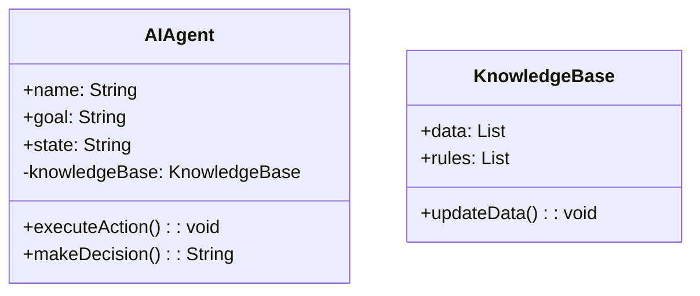
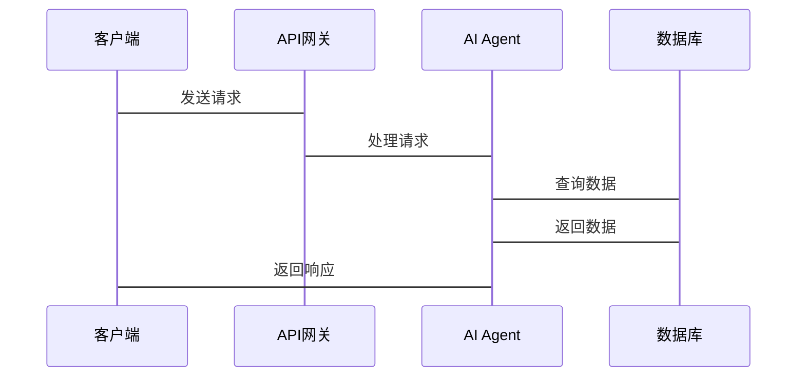

                 


# 企业级AI Agent的隐私保护与合规性考虑

## 关键词：企业级AI Agent, 隐私保护, 合规性, 数据安全, 人工智能, 隐私计算

## 摘要：  
随着人工智能技术的快速发展，企业级AI Agent在各个行业的应用日益广泛。然而，AI Agent在处理大量敏感数据时，如何确保隐私保护和合规性成为一项重要挑战。本文从企业级AI Agent的背景出发，详细探讨隐私保护与合规性的重要性，分析核心概念与联系，讲解相关算法原理，设计符合要求的系统架构，并通过实际案例展示如何在项目中实现隐私保护与合规性。最后，本文总结了最佳实践和未来发展方向。

---

## 第1章: 企业级AI Agent的背景与问题背景

### 1.1 AI Agent的基本概念
#### 1.1.1 AI Agent的定义与特点
AI Agent（人工智能代理）是一种能够感知环境、自主决策并执行任务的智能实体。它通过接收输入、分析数据、制定策略并执行操作来完成特定目标。企业级AI Agent通常用于复杂业务场景，如智能客服、供应链管理、风险评估等。

**特点：**  
- **自主性：** AI Agent能够在没有人工干预的情况下独立运作。  
- **反应性：** 能够实时感知环境变化并做出响应。  
- **目标导向：** 以预设目标为导向，优化决策以实现目标。  

#### 1.1.2 企业级AI Agent的应用场景
企业级AI Agent广泛应用于以下场景：  
1. **智能客服：** 自动处理客户咨询和问题解决。  
2. **供应链管理：** 优化库存、物流和订单处理。  
3. **风险评估：** 分析市场风险并提供决策支持。  
4. **个性化推荐：** 根据用户行为提供定制化服务。  

#### 1.1.3 企业级AI Agent的核心问题
企业在使用AI Agent时面临以下核心问题：  
1. **数据隐私：** 处理大量敏感数据时，如何确保数据不被泄露或滥用。  
2. **合规性：** 需要符合相关法律法规，如GDPR（通用数据保护条例）和CCPA（加利福尼亚消费者隐私法案）。  
3. **性能优化：** 在保证隐私和合规性的前提下，如何提升AI Agent的效率和响应速度。  

### 1.2 隐私保护与合规性的重要性
#### 1.2.1 隐私保护的基本概念
隐私保护是指在数据处理过程中，确保个人或企业的敏感信息不被未经授权的主体访问或滥用。随着数据驱动型业务的普及，隐私保护已成为企业不可忽视的责任。

#### 1.2.2 合规性要求的背景
合规性要求是指企业在数据处理过程中必须遵循相关法律法规和行业标准。例如，GDPR要求企业明确数据处理的目的和合法性，并在发生数据泄露时及时通知用户。

#### 1.2.3 企业级AI Agent中的隐私与合规性挑战
在企业级AI Agent中，隐私和合规性面临以下挑战：  
1. **数据多样性：** AI Agent处理的数据可能包括用户行为数据、交易记录、地理位置等，这些数据往往涉及个人隐私。  
2. **数据共享：** 在多部门或跨企业协作中，数据共享可能导致隐私泄露。  
3. **技术复杂性：** 隐私保护技术（如加密和差分隐私）可能增加系统的复杂性，影响性能。  

---

## 第2章: 企业级AI Agent的核心概念与联系

### 2.1 AI Agent与隐私保护的关系
#### 2.1.1 AI Agent的数据处理流程
AI Agent的数据处理流程通常包括以下步骤：  
1. **数据采集：** 从传感器、数据库或其他系统中获取数据。  
2. **数据处理：** 对数据进行清洗、转换和分析。  
3. **决策制定：** 基于分析结果生成决策建议。  
4. **执行操作：** 根据决策执行任务或触发相应操作。  

在这些步骤中，隐私保护技术需要在数据采集、处理和分析阶段进行嵌入，以确保数据在各环节的安全性。

#### 2.1.2 隐私保护在AI Agent中的作用
隐私保护在AI Agent中的作用主要体现在以下方面：  
1. **数据加密：** 在数据采集和传输过程中使用加密技术，防止数据被窃取。  
2. **匿名化处理：** 对数据进行匿名化处理，避免直接关联到个人身份。  
3. **访问控制：** 限制只有授权人员才能访问敏感数据。  

#### 2.1.3 隐私保护与AI Agent性能的平衡
隐私保护技术的引入可能会对AI Agent的性能产生影响。例如，加密计算会增加计算开销，而匿名化处理可能降低数据的可用性。因此，需要在隐私保护和性能之间找到平衡点。

### 2.2 数据安全与合规性的关联
#### 2.2.1 数据安全的基本原理
数据安全是指通过技术和管理手段，确保数据的机密性、完整性和可用性。数据安全的核心目标是防止数据被未经授权的主体访问、篡改或破坏。

#### 2.2.2 合规性要求对数据安全的影响
合规性要求直接影响数据安全的实现方式。例如，GDPR要求企业采取技术措施保护个人数据，这需要企业在数据处理过程中引入加密、访问控制等技术手段。

#### 2.2.3 数据安全与隐私保护的异同
数据安全与隐私保护虽然都关注数据的保护，但侧重点不同：  
- **数据安全** 更关注数据的完整性、可用性和机密性，而不仅仅是隐私。  
- **隐私保护** 则更关注个人数据的匿名化、最小化收集和用户同意。  

### 2.3 核心概念对比表格
以下表格对比了AI Agent、隐私保护、数据安全的核心属性：

| **核心概念** | **AI Agent** | **隐私保护** | **数据安全** |
|--------------|--------------|--------------|--------------|
| **目标**     | 执行任务     | 保护隐私     | 防止数据泄露 |
| **技术手段** | 机器学习     | 同态加密     | 访问控制     |
| **应用场景** | 智能客服     | 医疗健康     | 金融行业     |

### 2.4 ER实体关系图
以下是一个简单的ER图，展示了AI Agent、数据和隐私保护之间的关系：

```mermaid
erd
  actor: 用户
  agent: AI Agent
  data: 数据
  privacy: 隐私保护

  用户 --> 数据: 提供
  AI Agent --> 数据: 处理
  隐私保护 --> 数据: 保护
```

### 2.5 本章小结
本章介绍了企业级AI Agent的核心概念，分析了隐私保护和数据安全的重要性，并通过对比表格和ER图展示了各概念之间的关系。

---

## 第3章: 企业级AI Agent的隐私保护与合规性算法原理

### 3.1 隐私保护算法原理
#### 3.1.1 同态加密
**同态加密**是一种允许在加密数据上进行计算的技术，结果在解密后与直接在明文上计算的结果相同。以下是一个简单的同态加密实现示例：

```python
import numpy as np

def encrypt(plaintext, key):
    return plaintext + key

def decrypt(ciphertext, key):
    return ciphertext - key

# 示例
plaintext = 123
key = 45
ciphertext = encrypt(plaintext, key)
decrypted = decrypt(ciphertext, key)
print(f"明文: {plaintext}, 密文: {ciphertext}, 解密后: {decrypted}")
```

#### 3.1.2 差分隐私
**差分隐私**通过在数据中添加噪声，使得查询结果无法推断出单个数据点的存在与否。以下是一个差分隐私的实现示例：

```python
import numpy as np

def add_laplace_noise(x, b):
    noise = np.random.laplace(0, b)
    return x + noise

# 示例
x = 100
b = 0.5
noisy_x = add_laplace_noise(x, b)
print(f"原始值: {x}, 噪声值: {noisy_x}")
```

#### 3.1.3 隐私保护算法的优缺点
| **算法**      | **优点**                     | **缺点**                     |
|---------------|------------------------------|------------------------------|
| 同态加密       | 支持加密数据上的计算         | 加密计算效率较低             |
| 差分隐私       | 提供数据隐私保护             | 可能影响数据准确性             |

### 3.2 合规性评估算法原理
#### 3.2.1 合规性评估框架
合规性评估通常包括以下步骤：  
1. **数据分类：** 根据数据的重要性和敏感性进行分类。  
2. **访问控制：** 确保只有授权人员才能访问敏感数据。  
3. **日志记录：** 记录数据访问和操作日志，以便审计。  

#### 3.2.2 合规性评估的数学模型
以下是一个简单的合规性评估模型：

$$
合规性 = \sum_{i=1}^{n} (规则_i 是否被满足)
$$

其中，$规则_i$ 表示第i条合规性规则。

### 3.3 本章小结
本章详细介绍了隐私保护和合规性评估的算法原理，包括同态加密、差分隐私等技术，并分析了它们的优缺点。

---

## 第4章: 企业级AI Agent的系统分析与架构设计

### 4.1 系统功能设计
#### 4.1.1 领域模型设计
以下是一个AI Agent的领域模型：



#### 4.1.2 系统架构设计
以下是一个企业级AI Agent的系统架构图：


### 4.2 系统架构设计
#### 4.2.1 系统架构图
以下是一个系统的架构图：

```mermaid
container
    前端应用
    后端服务
    数据库
    第三方服务
```

#### 4.2.2 接口设计
以下是系统的主要接口：



### 4.3 本章小结
本章详细分析了企业级AI Agent的系统功能和架构设计，并通过Mermaid图展示了系统的整体架构。

---

## 第5章: 企业级AI Agent的项目实战

### 5.1 环境安装
#### 5.1.1 安装Python
```bash
# 安装Python
sudo apt-get install python3
```

#### 5.1.2 安装依赖
```bash
pip install numpy pandas scikit-learn
```

### 5.2 系统核心实现
#### 5.2.1 AI Agent实现
```python
class AI-Agent:
    def __init__(self, name, goal):
        self.name = name
        self.goal = goal
        self.state = "idle"

    def executeAction(self, action):
        # 执行操作的逻辑
        pass

    def makeDecision(self):
        # 制定决策的逻辑
        pass
```

#### 5.2.2 隐私保护实现
```python
def encrypt(plaintext, key):
    return plaintext + key

def decrypt(ciphertext, key):
    return ciphertext - key
```

### 5.3 代码应用解读与分析
#### 5.3.1 AI Agent的初始化
```python
agent = AI-Agent("智能客服", "解决用户问题")
```

#### 5.3.2 数据加密
```python
plaintext = "用户信息"
key = 123
encrypted = encrypt(plaintext, key)
```

### 5.4 案例分析与详细讲解
#### 5.4.1 案例背景
假设某企业使用AI Agent处理客户订单数据，需要确保数据的隐私和合规性。

#### 5.4.2 解决方案
1. **数据加密：** 使用同态加密技术对订单数据进行加密。  
2. **访问控制：** 确保只有授权员工才能访问加密数据。  
3. **日志记录：** 记录数据访问和操作日志，以便审计。  

### 5.5 本章小结
本章通过一个实际案例展示了如何在企业级AI Agent中实现隐私保护与合规性，并详细解读了核心代码。

---

## 第6章: 企业级AI Agent的总结与展望

### 6.1 最佳实践Tips
1. 在数据处理过程中，优先采用匿名化技术。  
2. 定期进行合规性审计，确保符合相关法律法规。  
3. 在性能与隐私之间找到平衡点，避免过度保护影响系统效率。  

### 6.2 本章小结
本文从企业级AI Agent的背景出发，详细探讨了隐私保护与合规性的重要性，并通过算法原理和系统架构设计展示了如何在实际项目中实现隐私保护与合规性。最后，本文总结了最佳实践和未来发展方向。

### 6.3 注意事项
- 在使用隐私保护技术时，需注意技术的复杂性和性能影响。  
- 定期更新安全策略，应对新的安全威胁和法规变化。  

### 6.4 拓展阅读
- 《数据隐私保护技术与应用》  
- 《人工智能与法律合规性》  

---

## 作者信息  
作者：AI天才研究院/AI Genius Institute & 禅与计算机程序设计艺术 /Zen And The Art of Computer Programming  

---

以上是《企业级AI Agent的隐私保护与合规性考虑》的技术博客文章的完整目录和内容概览。希望对您有所帮助！

