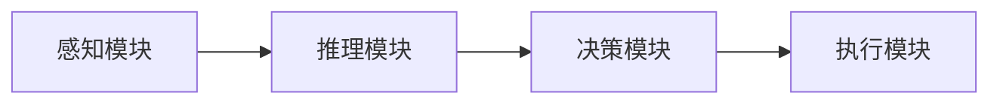
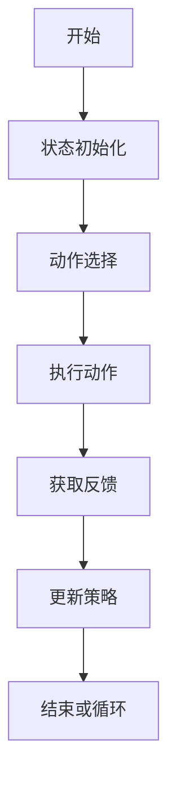
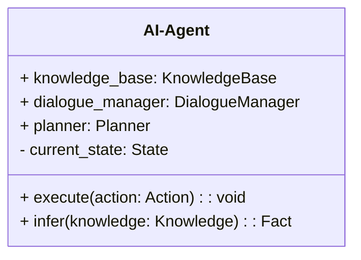
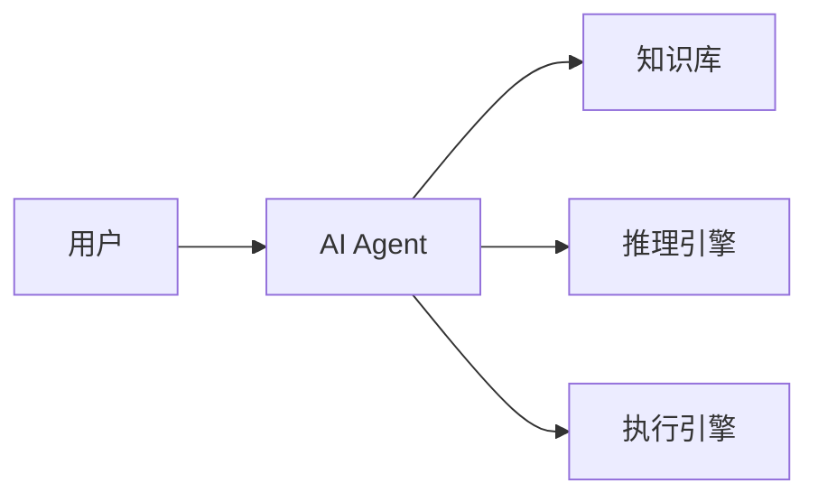
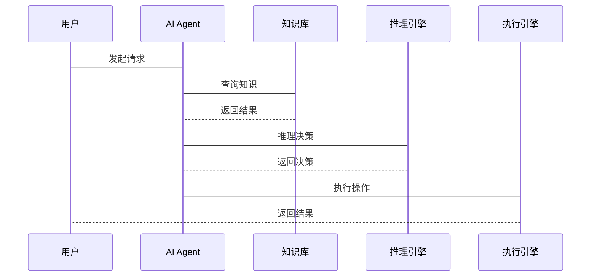

                 


# 企业级AI Agent需求分析方法

> 关键词：企业级AI Agent，需求分析，强化学习，系统架构，项目实战

> 摘要：本文深入探讨了企业级AI Agent的需求分析方法，从核心概念、算法原理到系统架构设计，结合实际案例分析，为读者提供全面的指导和实践建议。

---

# 第一部分: 企业级AI Agent需求分析背景与核心概念

## 第1章: 企业级AI Agent概述

### 1.1 问题背景与描述

#### 1.1.1 企业智能化转型的挑战

随着人工智能技术的快速发展，企业智能化转型已成为不可忽视的趋势。然而，在转型过程中，企业面临诸多挑战，例如数据孤岛、业务流程复杂化、用户需求多样化等。这些问题需要通过智能化工具来解决，而AI Agent（智能代理）正是其中的关键技术。

#### 1.1.2 AI Agent在企业中的角色与定位

AI Agent是一种能够感知环境、自主决策并执行任务的智能系统。在企业中，AI Agent可以作为决策支持工具、自动化流程执行者或用户交互界面，帮助企业在复杂环境中实现高效运作。

#### 1.1.3 当前企业级AI Agent的应用现状

目前，企业级AI Agent已在多个领域得到应用，例如智能客服、供应链管理、风险管理等。然而，这些应用仍存在技术瓶颈，例如算法复杂性、数据隐私问题等，这为需求分析提出了更高的要求。

---

### 1.2 问题解决与边界

#### 1.2.1 AI Agent的核心问题解决能力

AI Agent需要解决的核心问题包括：

1. **知识表示**：如何将业务知识转化为计算机可处理的形式。
2. **多轮对话**：如何在复杂场景下与用户进行有效交互。
3. **目标驱动**：如何根据业务目标动态调整策略。

#### 1.2.2 企业级AI Agent的边界与外延

AI Agent的边界在于其功能范围和应用环境。外延则包括与之相关的技术，例如自然语言处理（NLP）、机器学习（ML）、知识图谱等。

#### 1.2.3 与相关技术的区分与联系

以下是AI Agent与其他技术的对比：

| 技术 | 区别 | 联系 |
|------|------|------|
| NLP  | 基于规则的交互 | 提供自然语言理解能力 |
| ML   | 数据驱动的预测 | 支持AI Agent的决策过程 |
| RPA  | 机器人流程自动化 | 可与AI Agent结合实现智能自动化 |

---

### 1.3 概念结构与核心要素

#### 1.3.1 AI Agent的组成要素

AI Agent的核心要素包括：

1. **感知模块**：负责数据采集与环境理解。
2. **推理模块**：基于知识库进行逻辑推理。
3. **决策模块**：根据推理结果制定行动计划。
4. **执行模块**：将决策转化为具体操作。

#### 1.3.2 核心要素之间的关系

以下是核心要素之间的关系图：



#### 1.3.3 企业级AI Agent的特征对比表格

以下是企业级AI Agent与通用AI Agent的特征对比：

| 特征 | 企业级AI Agent | 通用AI Agent |
|------|----------------|---------------|
| 数据源 | 企业内部系统 | 公共API或数据集 |
| 目标 | 企业业务目标 | 最大化用户满意度 |
| 复杂度 | 高 | 低 |

#### 1.3.4 实体关系图（ER图）

以下是AI Agent相关的ER图：

```mermaid
erd
actor(AI Agent)
system(AI Agent系统)
role(AI Agent角色)
interface(AI Agent接口)
```

---

## 第2章: AI Agent的核心原理

### 2.1 核心概念原理

#### 2.1.1 知识表示与推理机制

知识表示是AI Agent实现智能决策的基础。常用的知识表示方法包括：

1. **谓词逻辑**：通过逻辑表达式描述事实。
2. **语义网络**：通过节点和边表示概念及其关系。
3. **知识图谱**：通过图结构表示大规模知识。

推理机制则包括：

1. **逻辑推理**：基于谓词逻辑进行演绎推理。
2. **概率推理**：基于概率模型进行不确定性推理。

#### 2.1.2 多轮对话与上下文管理

多轮对话的核心在于上下文管理。AI Agent需要通过对话历史、用户意图等信息维护对话状态。

#### 2.1.3 目标驱动与规划算法

目标驱动的规划算法包括：

1. **A*算法**：用于路径规划。
2. **贪心算法**：用于资源优化。
3. **强化学习**：用于动态环境下的策略优化。

---

### 2.2 属性特征对比

以下是AI Agent的核心属性对比：

| 属性 | 描述 |
|------|------|
| 知识表示 | 内部知识库的表示方法 |
| 推理能力 | 基于知识库的推理能力 |
| 交互能力 | 支持的交互方式（文本/语音） |

---

### 2.3 实体关系图（ER图）

以下是AI Agent的ER图：

```mermaid
erd
actor(User) -[发起请求]-> action(Request)
action(Request) --> state(DialogueState)
state(DialogueState) --> action(Response)
```

---

## 第3章: 企业级AI Agent的需求分析方法

### 3.1 需求分析的核心算法

#### 3.1.1 算法原理概述

需求分析的核心算法包括：

1. **强化学习**：通过试错优化策略。
2. **监督学习**：基于标注数据进行分类。

#### 3.1.2 算法流程图

以下是强化学习算法的流程图：



---

### 3.2 算法实现代码

以下是强化学习算法的Python实现：

```python
class Agent:
    def __init__(self, state_space, action_space):
        self.state_space = state_space
        self.action_space = action_space
        self.theta = np.random.randn(...)
    
    def act(self, state):
        action = np.argmax(self.theta.dot(state))
        return action
    
    def update(self, state, action, reward):
        # 策略更新逻辑
        pass
```

---

### 3.3 算法数学模型

以下是强化学习的数学模型：

$$ R(s, a) = \sum_{s'} P(s'|s,a) R(s', a) $$

---

## 第4章: 系统分析与架构设计

### 4.1 系统分析

#### 4.1.1 问题场景介绍

企业级AI Agent的应用场景包括智能客服、供应链管理等。

#### 4.1.2 系统功能设计

以下是系统功能设计的类图：



---

### 4.2 系统架构设计

以下是系统架构设计的架构图：



---

### 4.3 系统接口设计

以下是系统接口设计的交互图：



---

## 第5章: 项目实战

### 5.1 环境安装

以下是项目实战的环境安装步骤：

1. **安装Python**：确保Python版本为3.8以上。
2. **安装依赖库**：使用pip安装numpy、scikit-learn等库。

---

### 5.2 系统核心实现源代码

以下是系统核心实现的Python代码：

```python
class AI_Agent:
    def __init__(self, knowledge_base):
        self.knowledge_base = knowledge_base
        self.current_state = None
    
    def process_request(self, request):
        # 分析请求
        pass
```

---

### 5.3 代码应用解读与分析

代码解读：

1. **AI_Agent类**：封装了AI Agent的核心功能。
2. **process_request方法**：实现了请求处理逻辑。

---

### 5.4 实际案例分析

以下是实际案例分析的详细内容：

1. **案例背景**：某企业希望实现智能客服系统。
2. **需求分析**：识别用户意图，匹配知识库，生成回复。

---

### 5.5 项目小结

项目小结：

1. **项目目标**：实现企业级AI Agent。
2. **主要挑战**：知识表示与推理的复杂性。
3. **解决方案**：结合强化学习与监督学习。

---

## 第6章: 最佳实践与小结

### 6.1 最佳实践

以下是最佳实践的总结：

1. **数据质量**：确保知识库的准确性和完整性。
2. **算法选择**：根据场景选择合适的算法。

---

### 6.2 小结

本文详细介绍了企业级AI Agent的需求分析方法，从核心概念到系统架构，再到项目实战，为读者提供了全面的指导。

---

### 6.3 注意事项

注意事项：

1. **数据隐私**：注意数据的隐私保护。
2. **算法优化**：持续优化算法性能。

---

### 6.4 拓展阅读

拓展阅读：

1. 《强化学习入门》
2. 《系统架构设计实践》

---

# 作者：AI天才研究院/AI Genius Institute & 禅与计算机程序设计艺术 /Zen And The Art of Computer Programming

