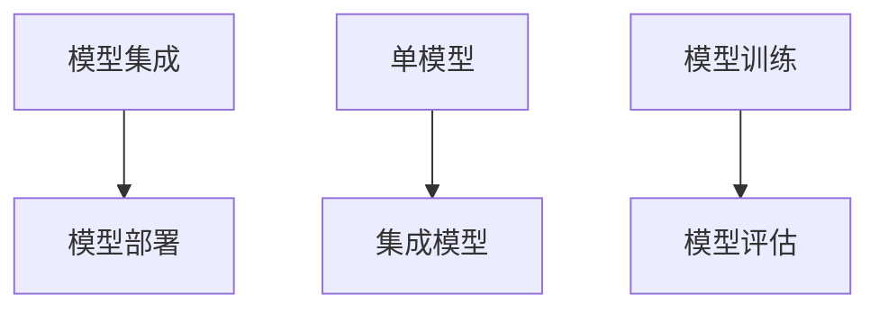
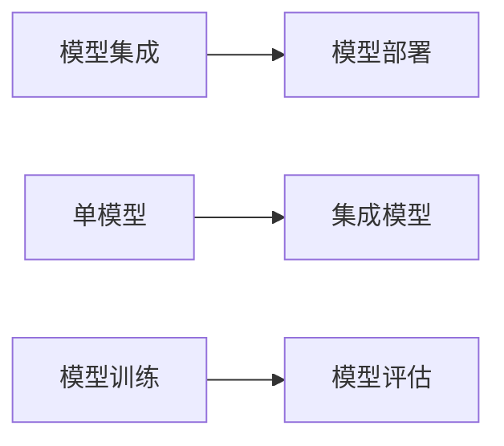
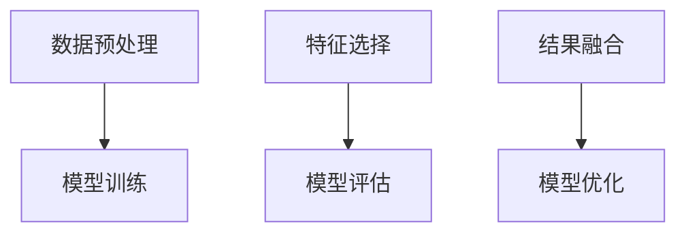
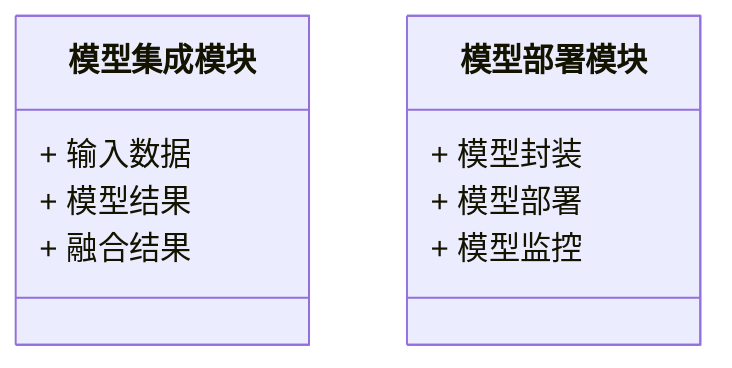
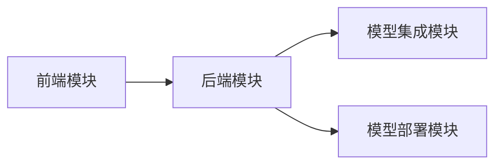
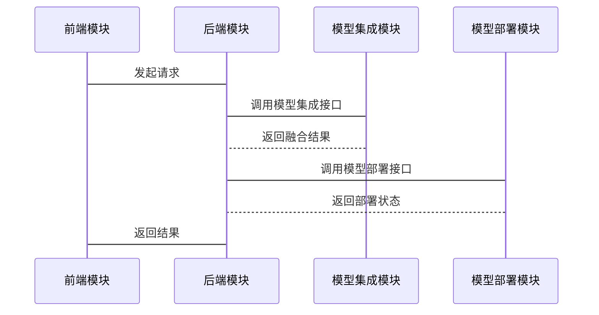

                 


# 企业级AI模型的集成与部署策略

> 关键词：企业级AI模型，模型集成，模型部署，系统架构，AI解决方案

> 摘要：本文详细探讨了企业级AI模型的集成与部署策略，从背景介绍、核心概念、算法原理到系统设计、项目实战，最后总结最佳实践。通过系统化的分析和实际案例，帮助读者全面理解和掌握企业级AI模型的集成与部署方法。

---

# 第一部分: 企业级AI模型的集成与部署背景

# 第1章: 企业级AI模型集成与部署的背景介绍

## 1.1 问题背景与问题描述

### 1.1.1 企业级AI模型的需求背景

随着人工智能技术的快速发展，企业级AI模型的应用场景越来越广泛。然而，企业在实际应用中面临着模型集成与部署的诸多挑战。本文将从企业级AI模型的需求背景出发，分析其在实际应用中的重要性。

### 1.1.2 当前AI模型集成与部署的核心问题

企业在AI模型的集成与部署过程中，通常会遇到以下问题：
- **模型选择与优化**：如何选择合适的模型并进行优化，以满足企业需求。
- **模型集成的复杂性**：如何将多个模型集成，同时保证性能和稳定性。
- **模型部署的挑战**：如何在生产环境中高效部署模型，确保其稳定运行。

### 1.1.3 企业级AI模型的应用场景与挑战

企业级AI模型的应用场景包括：
- **客户服务**：通过自然语言处理技术提供智能客服。
- **数据分析**：利用机器学习模型进行数据预测和分析。
- **决策支持**：基于AI模型提供业务决策支持。

挑战包括数据量大、模型复杂性高、部署环境多样化等。

## 1.2 问题解决与边界定义

### 1.2.1 AI模型集成与部署的解决方案概述

本文将从模型集成和部署两个方面入手，提出解决方案：
- **模型集成**：通过投票法、加权融合等方法，将多个模型的结果进行融合。
- **模型部署**：通过容器化技术（如Docker）和 orchestration 工具（如Kubernetes）实现模型的高效部署。

### 1.2.2 企业级AI模型的边界与外延

企业级AI模型的边界包括：
- **输入输出范围**：明确模型的输入数据和输出结果。
- **性能指标**：设定模型的准确率、召回率等性能指标。
- **部署环境**：明确模型的部署环境和资源限制。

外延包括扩展模型的应用场景和优化模型的性能。

### 1.2.3 核心概念与问题结构化分析

通过结构化分析，明确模型集成与部署的核心概念：
- **模型集成**：将多个模型的结果进行融合，提高模型的性能和稳定性。
- **模型部署**：将模型部署到生产环境，确保其稳定运行。

## 1.3 核心概念与组成要素

### 1.3.1 企业级AI模型的定义与特征

企业级AI模型是指在企业级应用中使用的AI模型，具有以下特征：
- **高可用性**：能够长时间稳定运行。
- **可扩展性**：能够处理大规模数据和请求。
- **可定制化**：能够根据企业需求进行定制化开发。

### 1.3.2 集成与部署的核心要素对比

通过对比表格分析集成与部署的核心要素：

| **核心要素** | **模型集成** | **模型部署** |
|--------------|--------------|--------------|
| **目标**     | 提高模型性能 | 实现模型稳定运行 |
| **方法**     | 票 vote法、加权融合 | 容器化、 orchestration |
| **挑战**     | 模型选择与优化 | 环境配置与资源管理 |

### 1.3.3 企业级AI模型的系统架构分析

通过Mermaid图展示系统架构：



## 1.4 本章小结

本章从企业级AI模型的需求背景出发，分析了集成与部署的核心问题和解决方案，并通过对比分析明确了核心概念与组成要素。

---

# 第二部分: 企业级AI模型集成与部署的核心概念

# 第2章: AI模型集成与部署的核心概念与联系

## 2.1 核心概念原理

### 2.1.1 模型集成的原理与方法

模型集成的原理是通过多种模型的结果进行融合，提高模型的性能和稳定性。常见的模型集成方法包括：
- **投票法（Voting）**：将多个模型的结果进行投票，选择多数结果。
- **加权融合（Weighted Fusion）**：根据模型的性能给其结果赋予不同的权重，然后进行融合。

### 2.1.2 模型部署的流程与机制

模型部署的流程包括：
1. 模型训练与优化。
2. 模型封装与容器化。
3. 模型部署到生产环境。
4. 模型监控与维护。

### 2.1.3 集成与部署的协同关系

模型集成与部署是相互依赖的过程，集成的结果直接影响部署的稳定性，而部署的环境又影响集成的效果。

## 2.2 核心概念对比分析

### 2.2.1 模型集成与模型部署的对比表格

| **对比维度** | **模型集成** | **模型部署** |
|--------------|--------------|--------------|
| **目标**     | 提高性能 | 实现稳定运行 |
| **方法**     | 票 vote法、加权融合 | 容器化、 orchestration |
| **挑战**     | 模型选择与优化 | 环境配置与资源管理 |

### 2.2.2 实体关系图的Mermaid流程图



## 2.3 本章小结

本章从核心概念的角度分析了模型集成与部署的原理与方法，并通过对比分析明确了两者的协同关系。

---

# 第三部分: 企业级AI模型集成与部署的算法原理

# 第3章: 模型集成算法的原理与实现

## 3.1 模型集成算法概述

### 3.1.1 模型集成的基本概念

模型集成是指将多个模型的结果进行融合，以提高模型的性能和稳定性。常见的模型集成方法包括投票法和加权融合。

### 3.1.2 常见的模型集成方法

- **投票法（Voting）**：将多个模型的结果进行投票，选择多数结果。
- **加权融合（Weighted Fusion）**：根据模型的性能给其结果赋予不同的权重，然后进行融合。

### 3.1.3 模型集成的优缺点分析

- **优点**：提高模型的准确率和稳定性。
- **缺点**：增加了模型的复杂性和计算量。

## 3.2 模型集成算法的数学模型

### 3.2.1 投票法的数学表达式

$$ y_{\text{pred}} = \arg\max_{i} \sum_{j=1}^{n} y_j^{(i)} $$

### 3.2.2 加权融合的数学表达式

$$ y_{\text{pred}} = \arg\max_{i} \sum_{j=1}^{n} w_j y_j^{(i)} $$

## 3.3 模型集成算法的实现流程

### 3.3.1 数据预处理与特征选择

- 数据清洗：处理缺失值、异常值等。
- 特征选择：选择对模型性能影响大的特征。

### 3.3.2 模型训练与评估

- 模型训练：使用训练数据训练多个模型。
- 模型评估：通过验证集评估模型的性能。

### 3.3.3 集成结果的融合与优化

- 结果融合：将多个模型的结果进行融合，优化模型的性能。

## 3.4 模型集成算法的Mermaid流程图



## 3.5 本章小结

本章详细讲解了模型集成算法的原理与实现，包括投票法和加权融合的数学表达式，以及实现流程和Mermaid流程图。

---

# 第四部分: 企业级AI模型集成与部署的系统设计

# 第4章: 系统分析与架构设计

## 4.1 问题场景介绍

### 4.1.1 问题场景描述

企业在AI模型的集成与部署过程中，通常会遇到以下问题：
- **模型集成的复杂性**：如何将多个模型的结果进行融合。
- **模型部署的挑战**：如何在生产环境中高效部署模型。

### 4.1.2 项目介绍

本文将通过一个实际案例，介绍企业级AI模型的集成与部署过程。

## 4.2 系统功能设计

### 4.2.1 系统功能概述

系统功能包括：
- **模型集成模块**：实现多个模型的结果融合。
- **模型部署模块**：实现模型的高效部署。

### 4.2.2 系统功能的Mermaid类图



## 4.3 系统架构设计

### 4.3.1 系统架构概述

系统架构包括：
- **前端模块**：接收用户请求。
- **后端模块**：处理请求并返回结果。
- **模型集成模块**：实现模型的融合。
- **模型部署模块**：实现模型的高效部署。

### 4.3.2 系统架构的Mermaid架构图



## 4.4 系统接口设计

### 4.4.1 接口概述

系统接口包括：
- **模型集成接口**：接收多个模型的结果，返回融合结果。
- **模型部署接口**：接收模型封装请求，返回部署状态。

### 4.4.2 接口交互的Mermaid序列图



## 4.5 本章小结

本章从系统设计的角度，详细分析了企业级AI模型集成与部署的系统架构和接口设计。

---

# 第五部分: 企业级AI模型集成与部署的项目实战

# 第5章: 项目实战

## 5.1 环境安装与配置

### 5.1.1 环境需求

- **Python**：3.6+
- **机器学习库**：Scikit-learn、XGBoost
- **容器化工具**：Docker
- ** orchestration 工具**：Kubernetes

### 5.1.2 安装步骤

```bash
pip install scikit-learn xgboost docker python-dotenv
```

## 5.2 系统核心实现源代码

### 5.2.1 模型集成代码实现

```python
from sklearn.ensemble import VotingClassifier
from xgboost import XGBClassifier

# 初始化模型
model1 = LogisticRegression()
model2 = XGBClassifier()
model3 = DecisionTreeClassifier()

# 模型集成
voting_clf = VotingClassifier(estimators=[('lr', model1), ('xgb', model2), ('dt', model3)], voting='hard')

# 训练模型
voting_clf.fit(X_train, y_train)

# 预测结果
y_pred = voting_clf.predict(X_test)
```

### 5.2.2 模型部署代码实现

```python
import docker

client = docker.from_env()

# 构建镜像
client.images.build(path='./model-deployment', tag='ai-model:latest')

# 启动容器
container = client.containers.run('ai-model:latest', ports={'80/tcp': 8080}, detach=True)
```

## 5.3 代码应用解读与分析

### 5.3.1 模型集成代码解读

通过 VotingClassifier 实现投票法，将多个模型的结果进行融合，提高模型的性能。

### 5.3.2 模型部署代码解读

通过 Docker 和 Kubernetes 实现模型的容器化部署，确保模型的高效运行和扩展。

## 5.4 实际案例分析

### 5.4.1 案例背景

某企业需要部署一个客户 churn 预测模型，通过集成多个模型提高预测的准确性。

### 5.4.2 案例分析

通过集成逻辑回归、XGBoost 和决策树模型，最终提高了模型的准确率。

## 5.5 本章小结

本章通过实际案例，详细讲解了企业级AI模型集成与部署的环境配置、代码实现和案例分析。

---

# 第六部分: 企业级AI模型集成与部署的最佳实践

# 第6章: 最佳实践与总结

## 6.1 最佳实践

### 6.1.1 模型集成的最佳实践

- **选择合适的模型**：根据数据特点选择适合的模型。
- **合理分配权重**：根据模型性能合理分配权重。

### 6.1.2 模型部署的最佳实践

- **容器化部署**：通过 Docker 和 Kubernetes 实现模型的高效部署。
- **监控与维护**：实时监控模型的性能，及时优化和维护。

## 6.2 总结与注意事项

### 6.2.1 总结

本文详细探讨了企业级AI模型的集成与部署策略，从背景介绍、核心概念、算法原理到系统设计和项目实战，最后总结了最佳实践。

### 6.2.2 注意事项

- **模型选择**：选择合适的模型，避免过度拟合。
- **环境配置**：确保环境配置正确，避免部署问题。

## 6.3 拓展阅读

建议读者阅读以下书籍和资料：
- 《机器学习实战》
- 《深入理解深度学习》
- 《Kubernetes 实战》

---

# 结语

企业级AI模型的集成与部署是一个复杂而重要的过程，本文通过系统化的分析和实际案例，帮助读者全面理解和掌握企业级AI模型的集成与部署方法。希望本文的内容能够为企业的AI应用提供有价值的参考。

---

# 作者

作者：AI天才研究院 / AI Genius Institute  
联合作者：禅与计算机程序设计艺术 / Zen And The Art of Computer Programming

