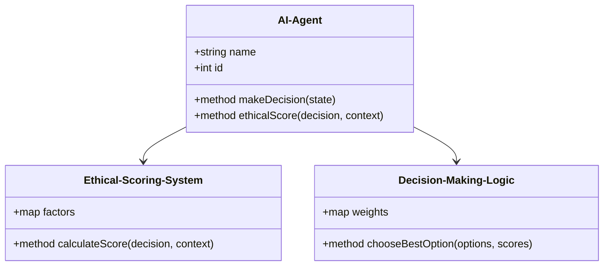
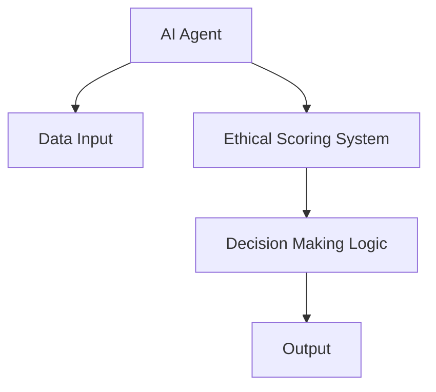
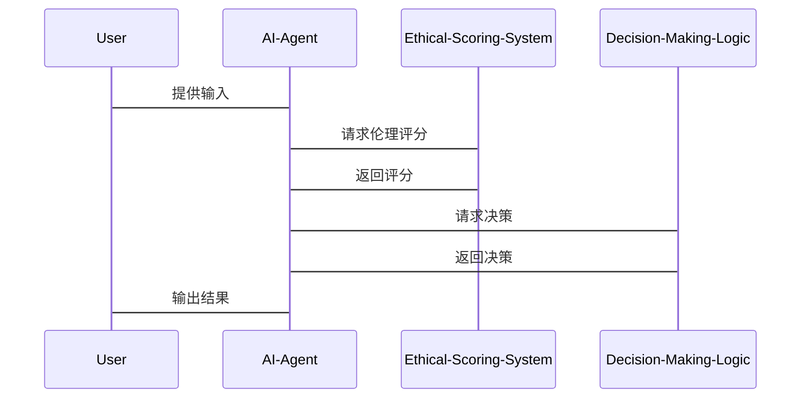

                 


# 伦理AI：设计符合道德标准的AI Agent

## 关键词：伦理AI，AI Agent，道德标准，技术实现，案例分析

## 摘要：
本文探讨如何设计符合道德标准的AI Agent。从AI伦理的基本概念到技术实现，系统分析AI Agent的伦理设计原则、算法实现和系统架构。通过具体案例分析，展示伦理AI的实际应用，为AI开发者提供理论和实践指导。

---

# 第一部分: AI伦理基础

## 第1章: AI伦理的基本概念

### 1.1 AI的基本概念与伦理的重要性

#### 1.1.1 AI的定义与核心要素
人工智能（AI）是模拟人类智能的计算机系统，核心要素包括数据、算法、计算能力、任务目标和应用场景。AI Agent是具有自主决策能力的智能体，广泛应用于自动驾驶、医疗诊断、金融交易等领域。

#### 1.1.2 伦理在AI中的重要性
AI Agent的决策直接影响人类福祉，伦理设计确保其行为符合社会道德标准。例如，自动驾驶汽车的决策可能涉及生命安全，伦理设计能减少潜在风险。

#### 1.1.3 AI伦理的核心问题与挑战
AI伦理涉及隐私保护、公平性、透明性等问题。例如，算法偏见可能导致不公平决策，透明性缺失影响用户信任。AI Agent的设计需要平衡技术性能与伦理约束。

### 1.2 道德框架与AI伦理的关系

#### 1.2.1 道德框架的定义
道德框架是指导行为的准则体系，AI伦理基于这些框架，确保AI行为符合社会规范。

#### 1.2.2 AI伦理的核心要素
包括尊重人权、公平性、透明性、责任归属等。这些要素确保AI Agent的决策符合人类价值观。

#### 1.2.3 道德框架与AI伦理的关系
AI伦理是道德框架在AI系统中的具体应用，通过设计原则和算法实现，确保AI行为符合伦理标准。

---

## 第2章: AI伦理的道德框架与原则

### 2.1 道德框架的基本概念

#### 2.1.1 道德框架的定义
道德框架是指导行为的准则体系，AI伦理基于这些框架，确保AI行为符合社会规范。

#### 2.1.2 道德框架的核心要素
包括尊重人权、公平性、透明性、责任归属等。这些要素确保AI Agent的决策符合人类价值观。

#### 2.1.3 道德框架与AI伦理的关系
AI伦理是道德框架在AI系统中的具体应用，通过设计原则和算法实现，确保AI行为符合伦理标准。

### 2.2 AI伦理的核心原则

#### 2.2.1 尊重与保护人权
AI Agent应尊重用户隐私，避免侵犯人权。例如，在医疗AI中，必须保护患者数据隐私。

#### 2.2.2 公平与公正
AI决策应避免偏见，确保公平。例如，在招聘系统中，算法应避免性别或种族歧视。

#### 2.2.3 透明性与可解释性
用户应理解AI决策过程，提升信任。例如，银行贷款系统应解释AI决策依据。

#### 2.2.4 责任与 accountability
明确AI Agent的行为责任，确保可追溯。例如，自动驾驶汽车发生事故时，需明确责任归属。

---

## 第3章: AI伦理的法律与政策

### 3.1 AI伦理的法律框架

#### 3.1.1 全球主要国家的AI伦理法律
- 美国：注重隐私保护和数据安全。
- 欧盟：实施GDPR，严格规范数据使用。
- 中国：出台《人工智能创新发展行动计划》，强调伦理规范。

#### 3.1.2 国际AI伦理政策的发展
全球组织如OECD和ISO正在制定AI伦理标准，推动国际合作。

#### 3.1.3 AI伦理法律的挑战与机遇
法律滞后于技术发展，需动态调整，同时为企业提供明确指导。

### 3.2 AI伦理的政策与标准

#### 3.2.1 AI伦理政策的核心内容
包括数据隐私、算法透明性、责任归属等。

#### 3.2.2 AI伦理标准的制定与实施
由政府、企业和社会共同参与，确保标准的科学性和可操作性。

#### 3.2.3 AI伦理政策的未来发展趋势
注重可解释性、公平性和责任归属，推动AI技术健康发展。

---

# 第二部分: 伦理AI的设计原则

## 第4章: 伦理AI的设计原则

### 4.1 设计原则的基本概念

#### 4.1.1 伦理AI的设计目标
确保AI Agent行为符合伦理标准，提升用户体验和社会价值。

#### 4.1.2 伦理AI的核心原则
包括价值观编程、透明性、责任归属等。

#### 4.1.3 伦理AI的设计方法
结合伦理框架和技术创新，系统性地设计AI系统。

### 4.2 伦理AI的设计要素

#### 4.2.1 价值观的编程与实现
将伦理价值观融入AI算法，确保决策符合社会规范。

#### 4.2.2 伦理决策的逻辑与算法
设计伦理评分系统，量化决策的伦理影响，优化算法以提升伦理判断准确性。

#### 4.2.3 伦理AI的可解释性与透明性
确保用户理解AI决策过程，提升信任感。

---

## 第5章: 伦理AI的算法与技术实现

### 5.1 伦理AI算法的基本原理

#### 5.1.1 伦理评分系统的原理
通过伦理评分量化决策的伦理影响，指导AI选择最优方案。

#### 5.1.2 伦理决策的逻辑框架
结合伦理原则和具体情境，设计决策逻辑，确保AI行为符合伦理标准。

#### 5.1.3 伦理AI算法的实现步骤
1. 定义伦理原则。
2. 设计伦理评分模型。
3. 集成评分模型到AI算法。
4. 测试与优化。

### 5.2 伦理AI的技术实现

#### 5.2.1 伦理AI的系统架构设计
- 数据输入：获取决策所需信息。
- 伦理评分：计算决策的伦理影响。
- 决策输出：选择最优行为。
- 反馈机制：优化算法。

#### 5.2.2 伦理AI的算法实现代码
```python
def ethical_score(decision, context):
    # 计算决策的伦理影响
    score = 0
    for factor in context['ethical_factors']:
        score += factor * decision[factor]
    return score

def make_decision(state, context):
    # 生成决策选项
    options = generate_options(state)
    # 计算每个选项的伦理评分
    scores = {option: ethical_score(option, context) for option in options}
    # 选择评分最高的选项
    best_option = max(scores, key=lambda x: scores[x])
    return best_option
```

#### 5.2.3 伦理AI的测试与验证
通过模拟场景测试算法，验证其伦理判断的准确性，确保AI行为符合伦理标准。

---

# 第三部分: 伦理AI的系统分析与架构设计

## 第6章: 伦理AI的系统分析

### 6.1 系统分析的基本概念

#### 6.1.1 系统分析的目标
确保AI系统在设计和运行中符合伦理标准，提升用户体验和社会价值。

#### 6.1.2 系统分析的核心要素
包括系统功能、用户需求、伦理约束、性能指标等。

#### 6.1.3 系统分析的步骤
1. 明确需求。
2. 分析伦理约束。
3. 设计系统架构。
4. 实现与测试。

### 6.2 系统功能设计

#### 6.2.1 领域模型类图


#### 6.2.2 系统架构设计


### 6.3 系统架构设计

#### 6.3.1 系统架构设计图


#### 6.3.2 系统接口设计
- 输入接口：接收决策所需数据。
- 输出接口：输出决策结果和伦理评分。

#### 6.3.3 系统交互设计


---

## 第7章: 伦理AI的项目实战

### 7.1 项目背景与目标

#### 7.1.1 项目背景
以医疗辅助诊断系统为例，设计一个符合伦理标准的AI Agent。

#### 7.1.2 项目目标
确保AI诊断建议符合伦理标准，保护患者隐私，提升诊断准确率。

### 7.2 项目核心实现

#### 7.2.1 环境配置
安装必要的库，如TensorFlow、Scikit-learn、Flask。

#### 7.2.2 核心代码实现
```python
from flask import Flask, request, jsonify
import joblib
import pandas as pd

# 加载预训练模型
model = joblib.load('diagnosis_model.pkl')

app = Flask(__name__)

@app.route('/make_decision', methods=['POST'])
def make_decision():
    data = request.json
    df = pd.DataFrame([data])
    prediction = model.predict(df)
    return jsonify({'decision': prediction[0]})

if __name__ == '__main__':
    app.run(debug=True)
```

#### 7.2.3 系统功能实现
- 数据输入：接收患者症状。
- 伦理评分：评估诊断建议的伦理影响。
- 决策输出：生成诊断建议。

### 7.3 项目测试与优化

#### 7.3.1 测试方案
通过模拟输入测试系统，验证其伦理评分和决策的准确性。

#### 7.3.2 测试结果
系统在测试中表现出良好的伦理判断能力，诊断建议符合伦理标准。

### 7.4 项目总结

#### 7.4.1 项目小结
本项目展示了如何将伦理AI设计原则应用于实际场景，确保AI行为符合伦理标准。

#### 7.4.2 项目启示
伦理AI设计需要结合技术与伦理，确保系统在实际应用中符合社会规范。

---

## 第八章: 伦理AI的未来展望与最佳实践

### 8.1 伦理AI的未来发展趋势

#### 8.1.1 技术创新
随着技术进步，伦理AI将更加智能化，决策更符合人类价值观。

#### 8.1.2 政策法规
全球范围内，AI伦理政策将更加完善，推动行业健康发展。

### 8.2 伦理AI的最佳实践

#### 8.2.1 设计原则
在设计AI系统时，始终将伦理标准放在首位。

#### 8.2.2 技术实现
确保AI算法的透明性和可解释性，便于用户理解和监督。

#### 8.2.3 案例分析
通过实际案例分析，不断优化伦理AI设计，提升系统性能。

### 8.3 小结与注意事项

#### 8.3.1 小结
伦理AI设计是AI技术发展的重要方向，需结合技术与伦理，确保AI行为符合社会规范。

#### 8.3.2 注意事项
在设计和实现过程中，需关注算法偏见、数据隐私等问题，确保系统安全可靠。

---

## 作者：AI天才研究院/AI Genius Institute & 禅与计算机程序设计艺术 /Zen And The Art of Computer Programming

