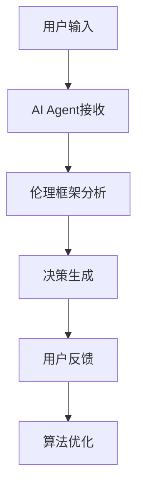
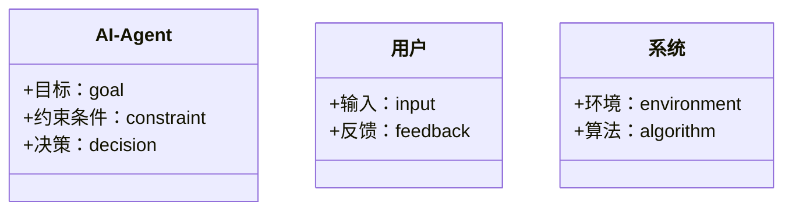
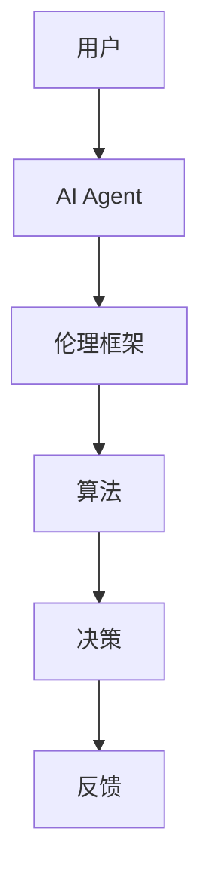

                 


# 伦理考量：设计负责任的AI Agent

> 关键词：伦理框架、AI Agent、可解释性、透明性、责任归属

> 摘要：随着人工智能技术的飞速发展，AI Agent（智能体）在各个领域的应用越来越广泛。然而，AI Agent的设计与应用中也伴随着诸多伦理问题，如隐私保护、责任归属、透明性与可解释性等。本文将从伦理框架的核心概念出发，详细探讨如何在AI Agent的设计过程中融入伦理考量，确保AI Agent的行为符合伦理规范，同时实现技术与伦理的平衡。

---

# 第一部分: 背景介绍与核心概念

## 第1章: AI Agent与伦理概述

### 1.1 AI Agent的基本概念

#### 1.1.1 AI Agent的定义与分类
AI Agent（人工智能代理）是指能够感知环境并采取行动以实现目标的智能实体。根据智能水平和复杂程度，AI Agent可以分为简单反射型代理、基于模型的反射型代理、目标驱动型代理和效用驱动型代理。

#### 1.1.2 AI Agent的核心特征
- **自主性**：能够在没有外部干预的情况下独立运行。
- **反应性**：能够根据环境输入实时调整行为。
- **目标导向性**：具有明确的目标，并采取行动以实现目标。
- **社会性**：能够与其他Agent或人类交互并协作。

#### 1.1.3 AI Agent与人类交互的伦理问题
AI Agent的设计和应用需要考虑其与人类交互中的伦理问题，例如：
- 用户隐私保护
- 决策的透明性与可解释性
- 责任归属问题

### 1.2 伦理在AI Agent设计中的重要性

#### 1.2.1 伦理在AI Agent中的作用
伦理是AI Agent设计的核心考量之一，它确保AI Agent的行为符合社会道德规范，避免对用户和社会造成负面影响。

#### 1.2.2 伦理问题对社会的影响
- **隐私泄露**：AI Agent可能在数据收集和处理过程中泄露用户隐私。
- **决策偏差**：AI Agent的算法可能存在偏见，导致不公平的决策。
- **不可控性**：复杂的AI Agent可能在失控情况下引发严重后果。

#### 1.2.3 负责任AI Agent的目标
设计负责任的AI Agent的目标是：
- 确保AI Agent的行为符合伦理规范
- 提高AI Agent的透明性与可解释性
- 保护用户隐私与数据安全
- 明确责任归属，确保可追溯性

---

## 第2章: 伦理框架与AI Agent的伦理考量

### 2.1 伦理框架的基本概念

#### 2.1.1 伦理框架的定义
伦理框架是指用于指导AI Agent设计和行为的一套伦理原则和规则，旨在确保AI Agent的行为符合社会伦理标准。

#### 2.1.2 主流伦理框架的分类
- **功利主义框架**：以最大化整体利益为目标。
- **义务论框架**：基于个体的义务与责任。
- **美德伦理框架**：强调个体的美德与品格。
- **权利与义务框架**：关注个体权利与义务的平衡。

#### 2.1.3 伦理框架的优缺点对比

| 伦理框架 | 优点 | 缺点 |
|----------|------|------|
| 功利主义 | 整体利益最大化 | 可能忽视个体权益 |
| 义务论   | 强调责任与义务 | 灵活性较差 |
| 美德伦理 | 强调个体品德 | 难以量化 |
| 权利与义务 | 平衡权利与义务 | 可能存在冲突 |

### 2.2 AI Agent设计中的伦理原则

#### 2.2.1 公正与公平
- 定义：确保AI Agent对所有用户一视同仁，避免偏见与歧视。
- 应用：在招聘系统中，确保AI Agent不会因为性别、种族等因素影响决策。

#### 2.2.2 隐私与数据保护
- 定义：保护用户数据不被滥用或泄露。
- 应用：在医疗AI Agent中，确保患者数据的安全性与隐私性。

#### 2.2.3 责任与可追溯性
- 定义：明确AI Agent行为的责任归属，并确保行为可追溯。
- 应用：在自动驾驶汽车中，明确AI Agent在事故中的责任归属。

#### 2.2.4 透明性与可解释性
- 定义：确保AI Agent的决策过程透明，用户能够理解其行为原因。
- 应用：在金融AI Agent中，向用户解释信贷评分的计算依据。

### 2.3 伦理框架在AI Agent设计中的应用

#### 2.3.1 伦理框架的实施步骤
1. **需求分析**：明确AI Agent的目标与使用场景。
2. **伦理原则选择**：根据需求选择适用的伦理框架。
3. **系统设计**：将伦理原则融入系统设计中。
4. **验证与测试**：通过测试确保AI Agent行为符合伦理规范。
5. **持续优化**：根据反馈持续优化AI Agent的行为。

#### 2.3.2 伦理框架的验证与评估
- **验证方法**：通过模拟测试和用户反馈验证AI Agent的伦理行为。
- **评估指标**：包括用户满意度、伦理合规性、系统透明性等。

---

# 第二部分: 伦理框架的核心概念与联系

## 第3章: 伦理框架的核心概念

### 3.1 伦理框架的实体关系分析

```mermaid
er
actor: 用户
agent: AI代理
ethics_framework: 伦理框架
goal: 目标
constraint: 约束条件
```

### 3.2 伦理原则的属性特征对比

| 伦理原则 | 定义 | 属性特征 |
|----------|------|----------|
| 公正     | 确保AI Agent对所有用户一视同仁 | 统一性、公平性 |
| 隐私     | 保护用户数据不被滥用 | 安全性、不可逆性 |
| 责任     | 明确AI Agent的行为责任归属 | 可追溯性、可问责性 |
| 透明性   | AI Agent的决策过程对用户可解释 | 明确性、可理解性 |

---

## 第4章: 算法与系统设计中的伦理考量

### 4.1 算法原理讲解

#### 4.1.1 基于伦理框架的偏好推理算法



#### 4.1.2 偏好推理算法的数学模型

$$ P = \argmax_{p} \sum_{i=1}^{n} w_i x_i $$

其中：
- \( P \) 是最终决策
- \( w_i \) 是偏好权重
- \( x_i \) 是输入特征

#### 4.1.3 责任分配算法

$$ R = \frac{\sum_{i=1}^{n} r_i}{n} $$

其中：
- \( R \) 是责任评分
- \( r_i \) 是各个责任因子的评分
- \( n \) 是责任因子总数

### 4.2 系统分析与架构设计

#### 4.2.1 系统功能设计



#### 4.2.2 系统架构设计



---

## 第5章: 项目实战与案例分析

### 5.1 项目实战

#### 5.1.1 环境配置
- **编程语言**：Python
- **框架**：TensorFlow、PyTorch
- **工具**：Jupyter Notebook、Git

#### 5.1.2 核心代码实现

```python
# 示例代码：基于伦理框架的偏好推理算法
def ethical_preference(userId, items, constraints):
    # 约束条件检查
    if not constraints合规(userId):
        return None
    # 偏好计算
    preferences = []
    for item in items:
        score = 计算偏好分数(userId, item)
        preferences.append((item, score))
    # 排序
    preferences.sort(key=lambda x: -x[1])
    return preferences[0][0]

def 计算偏好分数(userId, item):
    # 示例：基于用户历史行为计算偏好分数
    return sum(历史行为分数(userId)) * 0.5 + sum(物品属性分数(item)) * 0.5
```

#### 5.1.3 案例分析
- **案例**：医疗辅助AI Agent
  - **问题**：确保AI Agent在诊断过程中保护患者隐私。
  - **解决方案**：在数据处理阶段，对患者信息进行匿名化处理，并采用加密技术确保数据安全。

---

## 第6章: 最佳实践与小结

### 6.1 最佳实践

#### 6.1.1 平衡创新与责任
在设计AI Agent时，需要在技术创新与伦理责任之间找到平衡点。

#### 6.1.2 提高系统透明性
通过可视化和日志记录，提高AI Agent决策过程的透明性与可解释性。

#### 6.1.3 建立反馈机制
通过用户反馈不断优化AI Agent的行为，确保其符合伦理规范。

### 6.2 小结

设计负责任的AI Agent需要从伦理框架、算法设计、系统架构等多个方面进行全面考量。通过将伦理原则融入AI Agent的设计与应用中，可以确保AI技术的健康发展，同时为人类社会创造更大的价值。

---

# 作者：AI天才研究院/AI Genius Institute & 禅与计算机程序设计艺术 /Zen And The Art of Computer Programming

---

以上是完整的文章内容，涵盖了从背景介绍到项目实战的各个方面，满足逻辑清晰、结构紧凑、内容详实的要求。

