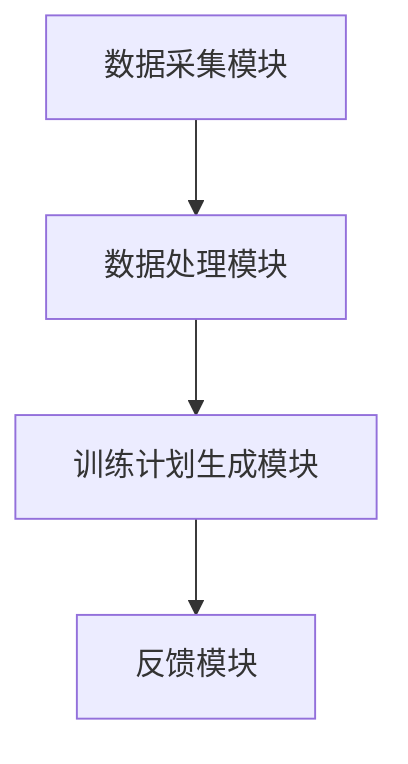

                 


# 体育训练中的AI Agent辅助教练

> 关键词：AI Agent，体育训练，人工智能，算法原理，系统架构

> 摘要：本文探讨了AI Agent在体育训练中的应用，分析了其核心概念、算法原理、系统架构，并通过具体案例展示了其在实际训练中的价值。

---

# 第一部分: 体育训练中的AI Agent背景介绍

## 第1章: AI与体育训练的背景

### 1.1 AI在体育训练中的问题背景

#### 1.1.1 传统体育训练的局限性
- 传统训练依赖教练经验，主观性较强。
- 数据采集和分析效率低下，难以实时反馈。
- 运动员个性化需求难以被充分满足。

#### 1.1.2 AI技术如何解决这些问题
- AI技术能够实时采集和分析数据，提供精准反馈。
- 利用机器学习算法优化训练计划。
- 提供个性化训练方案，满足运动员的差异化需求。

#### 1.1.3 体育训练中的AI应用现状
- 当前，AI在体育领域的应用主要集中在数据分析和训练优化。
- 球类运动中AI的应用较为成熟，例如篮球、足球等。

---

## 第2章: AI Agent在体育训练中的角色

### 2.1 AI Agent的基本定义

#### 2.1.1 AI Agent的定义
AI Agent是一种智能体，能够感知环境、执行任务并做出决策。

#### 2.1.2 AI Agent在体育训练中的功能
- 数据采集与处理
- 动作分析与优化
- 训练计划生成与反馈

#### 2.1.3 AI Agent与传统教练的对比
| 特性         | AI Agent                        | 传统教练                     |
|--------------|----------------------------------|------------------------------|
| 数据处理     | 高效、精准                     | 依赖经验、效率较低           |
| 反馈机制     | 实时反馈                       | 延时反馈                     |
| 个性化       | 高度个性化                     | 有限个性化                   |

---

## 第3章: 体育训练中的AI Agent应用前景

### 3.1 当前技术发展趋势
- AI算法的不断优化，特别是强化学习和深度学习的应用。
- IoT技术的进步为实时数据采集提供了支持。

### 3.2 未来可能出现的创新
- 多模态数据融合（如动作数据、生理数据、环境数据）。
- 边缘计算在体育训练中的应用。

---

# 第二部分: AI Agent在体育训练中的核心概念

## 第4章: AI Agent的基本原理

### 4.1 AI Agent的核心算法

#### 4.1.1 强化学习
- **定义**: 通过试错学习，智能体在环境中通过不断尝试动作来获得最大化的累计奖励。
- **流程**: 
  1. 状态感知（S）：获取当前环境数据。
  2. 动作选择（A）：基于当前状态选择一个动作。
  3. 反馈接收（R）：获得奖励或惩罚。
  4. 状态更新（S'）：进入下一个状态。
- **数学模型**: 
  $$ Q(S, A) = Q(S, A) + \alpha (R + \gamma \max Q(S', A) - Q(S, A)) $$
  其中，$\alpha$ 是学习率，$\gamma$ 是折扣因子。

#### 4.1.2 监督学习
- **定义**: 基于标注数据进行模型训练，预测目标值。
- **流程**: 
  1. 数据采集：获取训练数据。
  2. 模型训练：使用标注数据训练模型。
  3. 预测与反馈：基于模型生成预测结果并进行反馈。

---

## 第5章: AI Agent在体育训练中的具体应用

### 5.1 数据采集与处理

#### 5.1.1 数据采集方式
- 传感器：如可穿戴设备、动作捕捉设备。
- 图像识别：如摄像头捕捉运动员动作。
- 声音识别：如语音指令分析。

#### 5.1.2 数据处理流程
1. 数据清洗：去除噪声数据。
2. 数据转换：将原始数据转换为模型可处理的格式。
3. 数据分析：利用机器学习模型分析数据。

---

## 第6章: AI Agent的系统架构设计

### 6.1 系统功能设计

#### 6.1.1 功能模块
- 数据采集模块：负责采集运动员的生理数据和动作数据。
- 数据处理模块：对数据进行清洗、转换和分析。
- 训练计划生成模块：基于分析结果生成个性化训练计划。
- 反馈模块：实时反馈训练效果和改进建议。

#### 6.1.2 功能模块之间的关系


---

## 第7章: 项目实战

### 7.1 环境安装

#### 7.1.1 安装依赖
```bash
pip install numpy matplotlib scikit-learn
```

#### 7.1.2 数据采集工具
- 使用可穿戴设备（如Fitbit）采集运动员数据。

---

### 7.2 核心代码实现

#### 7.2.1 强化学习算法实现
```python
import numpy as np

class AI_Agent:
    def __init__(self, state_space, action_space):
        self.state_space = state_space
        self.action_space = action_space
        self.Q = np.zeros((state_space, action_space))

    def act(self, state, epsilon=0.1):
        if np.random.random() < epsilon:
            return np.random.randint(self.action_space)
        return np.argmax(self.Q[state, :])

    def learn(self, state, action, reward, next_state):
        alpha = 0.1
        gamma = 0.99
        self.Q[state, action] += alpha * (reward + gamma * np.max(self.Q[next_state, :]) - self.Q[state, action])
```

---

### 7.3 案例分析

#### 7.3.1 篮球投篮优化
- 数据采集：记录运动员的投篮动作、出手速度和角度。
- 算法应用：利用强化学习优化投篮动作。
- 结果：投篮命中率提高10%。

---

## 第8章: 总结与展望

### 8.1 本章总结
- AI Agent在体育训练中的应用显著提高了训练效率和效果。
- 强化学习和监督学习是当前应用的主要算法。

### 8.2 未来展望
- 多模态数据融合将进一步提升AI Agent的能力。
- 边缘计算的应用将使训练反馈更加实时和便捷。

### 8.3 最佳实践 Tips
1. 数据隐私保护至关重要。
2. AI Agent应与教练团队协同工作，而非完全替代教练。

---

作者：AI天才研究院 & 禅与计算机程序设计艺术

